# Getting started in Unreal Engine and C++

<p align="center">
  
</p>

**Are you interested in creating games with Unreal Engine using C++?**

*In this repo, we'll guide you through the basics of getting started with Unreal Engine and C++. We'll cover the fundamentals of C++ programming, such as data types and pointers, and show you how to use these concepts in the context of game development with Unreal Engine. We'll also introduce you to the Unreal Engine module system, which is an important aspect of organizing your game code into smaller, more manageable pieces.*

```Read Time ≈ 30 mins```

## Getting started with C++

Highly recommend taking a short class of native C++. Here is a video link to ~1h long video, [click here](https://www.youtube.com/watch?v=ZzaPdXTrSb8).

Using C++ with Unreal Engine allows developers to take advantage of the engine's full feature set, including advanced graphics rendering, physics simulations, networking, and AI. C++ also offers a level of control and customization that is not available through visual scripting alone.

Developing with C++ in Unreal Engine also allows for better debugging and profiling, as well as the ability to optimize performance through techniques such as multithreading and memory management. Additionally, C++ code can be integrated with third-party libraries, providing even greater flexibility and functionality.

**To use C++ effectively with Unreal Engine, it's important to have a strong foundation in programming principles and an understanding of Unreal Engine's architecture and conventions. It's also important to take advantage of the resources available, such as the Unreal Engine documentation and community forums, as well as to collaborate with other developers to share knowledge and best practices.**

*In summary, using C++ with Unreal Engine provides a powerful and flexible development environment that allows for greater control and customization of games and interactive experiences. While it can be more challenging than using visual scripting, the benefits in terms of performance and functionality make it a valuable tool for experienced developers.*

### Benefits of using C++ with Unreal Engine:

* High performance - C++ allows you to write code that can run directly on the CPU and GPU, making it possible to achieve very high performance levels in your game or application.
* Access to low-level functionality - C++ gives you access to lower-level functionality than other programming languages, which can be especially useful in game development where fine-grained control over memory, data structures, and algorithms is often necessary.
* Integration with existing codebases - If you have existing C++ code that you want to integrate with your Unreal Engine project, using C++ allows you to do so more easily.
* More control over memory management - C++ requires you to manage memory manually, which can be a challenge but also gives you more control over how your code uses memory. This can be important in situations where memory usage is a concern, such as on mobile devices or consoles.
* Flexibility - With C++, you have the flexibility to write code in a variety of styles, including object-oriented, procedural, and functional programming. This allows you to choose the approach that best suits your needs.

### Drawbacks of using C++ with Unreal Engine:

* Steep learning curve - C++ is a complex language with many features, and it can be difficult to learn for beginners. Unreal Engine's architecture can also be challenging to understand, especially if you're new to game development.
* Time-consuming - Writing C++ code can be more time-consuming than using other programming languages. C++ requires more attention to detail, and it can take longer to write and debug code.
* More prone to errors - C++ requires manual memory management and has less strict type checking than some other languages. This can make it more prone to errors like memory leaks, null pointer dereferences, and type mismatches.
* Harder to prototype - Because C++ requires more code to accomplish even simple tasks, it can be harder to quickly prototype ideas in C++ than in other programming languages.

## Quick Summary of Programming World

### Members

Members are variables or functions that are part of a class or object. They define the properties and behaviors of the class. There are two main types of members:

#### Variables

Members that store data. They can be of different types such as numbers, strings, booleans, or custom types. Variables hold values that can be accessed and manipulated within the class or object.

#### Functions (or methods)

Members that perform actions or provide functionality. They define blocks of code that can be executed by the class or object. Functions can take input parameters and may return a value.

### Functions

Functions are blocks of code that perform a specific task or set of tasks. They encapsulate a series of instructions and can be called and executed from various parts of a program. Functions can accept input parameters (arguments) and can also return a value as a result.

Functions can be defined outside of classes as standalone functions or can be defined within classes as member functions. Standalone functions are typically used for common tasks that are not specific to any particular class or object.

### Classes

Classes are the building blocks of object-oriented programming (OOP). They are a blueprint for creating objects, which are instances of a class. A class defines the structure and behavior of objects by specifying the members it contains.

A class can have variables (members) to store data and functions (methods) to perform actions. The variables defined within a class are often referred to as attributes, while the functions are referred to as methods.

Objects created from a class can access and modify the class's members. They provide a way to create multiple instances that share the same structure and behavior defined by the class. Objects can be thought of as individual entities that represent real-world objects or abstract concepts.

Classes allow for code reusability, encapsulation (hiding internal details), and the ability to model complex systems by organizing related data and behavior together.

## Unreal's Architecture

```mermaid
graph TD;
    UObjectBase-->UObjectBaseUtility;
    UObjectBaseUtility-->UObject;
    UObject-->USubsystem;
    USubsystem-->UDynamicSubsystem;
    USubsystem-->UGameInstanceSubsystem;
    USubsystem-->ULocalPlayerSubsystem;
    USubsystem-->UWorldSubsystem;
    UObject-->UBlueprintFunctionLibrary;
    UObject-->UEngine;
    UEngine-->UEditorEngine;
    UEngine-->UGameEngine;
    UObject-->UPlayer;
    UPlayer-->ULocalPlayer;
    UPlayer-->UNetConnection;
    UObject-->UScriptViewportClient;
    UScriptViewportClient-->UGameViewportClient;
    UObject-->UGameInstance;
    UGameInstance-->UPlatformGameInstance;
    UObject-->UWorld;
    UObject-->UPackage;
    UObject-->ULevel;
    UObject-->UInterface;
    UObject-->USoundBase;
    USoundBase-->USoundCue;
    USoundBase-->USoundWave;
    UObject-->UFXSystemAsset;
    UFXSystemAsset-->UParticleSystem;
    UObject-->UAnimationAsset;
    UAnimationAsset-->UAnimSequenceBase;
    UAnimSequenceBase-->UAnimSequence;
    UObject-->UTexture;
    UTexture-->UTexture2D;
    UTexture-->UMediaTexture;
    UObject-->UMaterial;
    UObject-->UVisual;
    UVisual-->UWidget;
    UWidget-->UUserWidget;
    UUserWidget-->UEditorUtilityWidget;
    UObject-->UDataAsset;
    UDataAsset-->UPrimaryDataAsset;
    UObject-->AActor;
    AActor-->AInfo;
    AInfo-->AGameSession;
    AInfo-->AGameModeBase;
    AGameModeBase-->AGameMode;
    AInfo-->AGameStateBase;
    AGameStateBase-->AGameState;
    AInfo-->AGameNetworkManager;
    AInfo-->AWorldSettings;
    AInfo-->APlayerState;
    AActor-->ALevelScriptActor;
    AActor-->AHUD;
    AActor-->APlayerCameraManager;
    AActor-->AController;
    AController-->AAIController;
    AController-->APlayerController;
    AActor-->APawn;
    APawn-->ADefaultPawn;
    APawn-->ACharacter;
    UObject-->UActorComponent;
    UActorComponent-->UMovementComponent;
    UActorComponent-->USceneComponent;
    USceneComponent-->UAudioComponnent;
    USceneComponent-->UCameraComponent;
    USceneComponent-->ULightComponentBase;
    USceneComponent-->UPrimitiveComponent;
    UPrimitiveComponent-->UMeshComponent;
    UMeshComponent-->UStaticMeshComponent;
    UMeshComponent-->USkinnedMeshComponent;
    USkinnedMeshComponent-->USkeletalMeshComponent;
    UMeshComponent-->UWidgetComponent;
    UPrimitiveComponent-->UShapeComponent;
    UShapeComponent-->UBoxComponent;
    UShapeComponent-->UCapsuleComponent;
    UShapeComponent-->USphereComponent;
```



```UObject``` is a base class for objects in the engine that require some common functionality such as garbage collection, serialization, reflection, and more. ```UObject``` also provides some additional functionality such as networking support, dynamic class creation, and object-oriented programming features like inheritance and polymorphism.

Some of the notorious classes, that inherit from ```UObject``` include:

* ```AActor```
  * A base class for the every object placed in the world. It's an ```UObject``` that usually contains other ```UObject```s specialized to be part of an actor - this what we call components.
  * This class contains a basic functionality to operate on the "object placed in the world".
  * ```AActor``` itself doesn't have a transform (i.e. position in the world), it depends on the transform of the root component.
  * *Functions*:
    * ```BeginPlay()``` - Called when the level starts ticking, only during actual gameplay.
    * ```Tick(float DeltaSeconds)``` - Update function, called every frame on Actor.
    * ```EndPlay(const EEndPlayReason::Type EndPlayReason)``` - Whenever actor is being removed from a level
    * ```SetLifeSpan(float InLifespan)``` - Set the lifespan of actor.
    * ```Destroy(bool bNetForce, bool bShouldModifyLevel)``` - Destroy actor.
 
* ```APawn```
  * Represents a pawn in the game world. A pawn is an entity that can be controlled by the player or by AI, and can move and interact with the game world.
  * ```APawn``` provides basic movement and input handling functionality, as well as collision detection and physics simulation.

* ```AHUD```
  * Represents the heads-up display (HUD) in the game. The HUD displays important information to the player, such as health and ammunition levels, as well as providing visual feedback for game events such as damage or power-up pickups.
  * ```AHUD``` can be customized to display different types of information and to use different visual styles.

* ```ACharacter```
  * Represents a playable character in the game world. ```ACharacter``` is a subclass of ```APawn``` and provides additional functionality specific to player-controlled characters, such as animation and movement controls, camera handling, and input management.
  * ```ACharacter``` can be used as a base class for player characters, enemies, and other types of characters in the game.

* ```AController```
  * Represents a controller in the game, which can be used to control a ```APawn``` or ```ACharacter```.
  * ```AController``` provides input handling and navigation functionality, allowing players or AI to move and interact with the game world. ```AController``` can be used to implement different types of control schemes, such as first-person or third-person controls, and can be customized to support different input devices and control configurations.

* ```UActorComponent```
  * A base class for every object placed inside AActor.
  * Used for components contains only the logic, i.e. ```UMovementComponent``` or ```SceneComponent```.
  * ```UActorComponent``` doesn't appear in the world.
  * *Functions*:
    * ```BeginPlay()``` - Begins Play for component.
    * ```TickComponent(float DeltaTime, enum ELevelTick TickType, FActorComponentTickFunction * ThisTickFunction)``` - Function called every frame on ActorComponent.
    * ```EndPlay(const EEndPlayReason::Type EndPlayReason)``` - Ends gameplay for component.
 
* ```UMovementComponent```
  * Provides movement functionality to an actor in the game world. ```UMovementComponent``` can be used to implement a variety of movement types, such as flying, walking, swimming, or sliding.
  * ```UMovementComponent``` handles physics simulation and collision detection for the actor, and can be customized to provide different movement behaviors.

* ```USceneComponent```
  * A base class for every component which actually appears in the world, it has a transform evaluated every frame.
  * It's used by components that need to know its place in the world to run the logic, i.e. ```UAudioComponnent```, ```UCameraComponent```.
  * Component of this class isn't rendered or doesn't collide with anything.

* ```UPrimitiveComponent```
  * And this finally the base class for all components representing any sort of geometry.
  * These components are rendered and tested for collision.

* ```USubsystem```
  * Provide services or functionality that can be used by other parts of the engine or by games built with the engine.
  * Examples of subsystems in Unreal Engine include the rendering subsystem, the physics subsystem, and the input subsystem.
  * Subsystems are responsible for initializing, updating, and shutting down their associated services, and can be used to customize or extend engine functionality as needed.
  * 4 types of subsystems
    * Engine (Engine lifetime)
    * Editor (Editor lifetime)
    * GameInstance (Game instance lifetime)
    * LocalPlayer (share lifetime of local players)

* ```UBlueprintFunctionLibrary```
  * Allows you to create custom static functions that can be used in Blueprint graphs. These functions can be called from any Blueprint and can perform complex calculations or operations that are not easily achievable with standard Blueprint nodes.

* ```UEngine```, ```UEditorEngine``` and ```UGameEngine```
  * Manages the main loop of the engine, handles rendering, input, audio, networking, and more.
  * `UEditorEngine` is used to manage the editor, which includes all of the tools and systems needed to create and edit levels, assets, and other game content.
  * `UGameEngine` is used to manage the game itself, which includes gameplay mechanics, AI, physics, rendering, and so on.

* ```UGameViewportClient```
  * Manages the viewport and input handling for the game. It is responsible for rendering the game's output to the screen, handling user input, and managing the game's display settings.

* ```ULocalPlayer```
  * Manages the player's input, screen rendering, and other local gameplay-related tasks. ULocalPlayer is often used in conjunction with other classes, such as APlayerController, to manage local player interactions with the game.

* ```UWorld```
* Represents a single instance of a level or map. It contains all the actors, components, and other objects that are present in the level, as well as information about the level's environment and physics settings.
* Functions:
  * ```SpawnActor()``` and ```SpawnActorDeferred()``` (deferred allow you to set actor properties before it's spawned into the world.)

* ```ULevel```
  * Represents a level in the game world that contains actors, geometry, lighting, and other assets.

* ```UGameInstance```
  * Represents the game instance, which is created when the game starts up and persists for the duration of the game.
  * The game instance can be used to manage persistent data and game state across levels, as well as to perform global game operations such as handling networking, input, and other system-level tasks.

* ```AGameMode```
  * Defines the rules and mechanics of a particular game mode, such as deathmatch or capture the flag.
  * Can be used to control game behavior, spawn actors, manage player input and game state, and perform other game-specific tasks.
  * Each level in a game can have its own ```AGameMode```, allowing for different game modes to be used in different levels.

* ```AGameState```
  * Represents the state of the game during play. ```AGameState``` can be used to store and manage data that is specific to a particular game, such as player scores, game timers, and other game state information.
  * ```AGameState``` can also be used to synchronize game state across multiple clients in a networked game, ensuring that all players have an accurate view of the game world.

* ```UUserWidget```
  * Represents a user interface (UI) widget in the game. ```UUserWidget``` provides a flexible framework for creating UI elements such as buttons, text fields, and images, and can be customized to implement complex UI behaviors such as animations, transitions, and data binding.
  * ```UUserWidget``` can be used to create menus, health bars, inventory screens, and other UI elements in the game.

* ```UPrimaryDataAsset```
  * Represents a primary data asset in the engine. A primary data asset is a piece of game content that is created in the Unreal Editor, such as a mesh, texture, sound, or level. ```UPrimaryDataAsset``` provides a base class for creating custom data assets that can be loaded and used by the game at runtime.
  * ```UPrimaryDataAsset``` can be used to manage and organize game content, and can be customized to provide additional functionality such as data validation and metadata management.

* ```USoundBase```
  * Represents a sound or audio asset in the engine. ASoundBase can be used to play sound effects, music, and other audio in the game world. ```ASoundBase``` provides a number of features for controlling the playback of audio, including volume, pitch, and spatialization effects such as 3D sound and reverb.

* ```UMaterial```
  * Represents a material which defines the visual appearance of objects in the game world.

* ```UTexture```
  * Represents an image or texture that can be used in the engine for various purposes such as materials or user interface elements.

You can watch this video, which explain in small details about main classes in Unreal Engine. <a href="https://www.youtube.com/watch?v=QcXHEsR0xHI" target="_blank">Link here</a>!

You can also watch a video discussion about Multiplayer Framework of Unreal Engine from *Kekdot*. <a href="https://www.youtube.com/watch?v=Hsr6mbNKBLU" target="_blank">Link here</a>!

**NOTE**: This architecture is based on a multiplayer game setup. However, if you are making a singleplayer game, then you can ignore some of the main classes.

You can also watch "*The Unreal Engine Game Framework: From int main() to BeginPlay*" by Alex Forsythe, which talks about Unreal Engine's architecture.
<a href="https://www.youtube.com/watch?v=IaU2Hue-ApI" target="_blank">Link here</a>

### Constructors and Destructors

With ```AActor``` and ```UActorComponent``` you can control how the classes should be instantiated.

**NOTE**: Only use constructors for initializing variables. The constructor will also be called in the editor. Meaning, it should not use for runtime execution. Instead, use ```BeginPlay()``` function.

**NOTE**: Don't use destructors for deleting memory with Unreal ```UObject```.

## Naming Convention 

Here is a github repo about Unreal Engine's style guide by Michael Allar, <a href="https://github.com/Allar/ue5-style-guide" target="_blank">link here</a>.

Unreal Engine has a convention for naming boolean variables, which is to use a prefix of b followed by a descriptive name in camel case. For example, a boolean variable that controls whether a character is running might be named `bIsRunning`.  

### Prefixes

| Prefix | Class        | Subclasses                                                                |
| ------ | ------------ | ------------------------------------------------------------------------- |
| U      | `UObject`    | `UActorComponent`, `UPrimaryDataAsset`, `UEngine`, `UGameplayStatics`     |
| A      | `AActor`     | `APawn`, `ACharaacter`, `AController`, `AHUD`, `AGameMode`                |
| F      | Struct       | `FHitResult`, `FVector`, `FRotator`, `FTableRowBase`                      |
| E      | Enum         | `EEnvQueryStatus`, `EConstraintType`, `EEndPlayReason`                    |
| I      | Inteface     | `IInputDevice`, `IHapticDevice`, `ITargetPlatform`                        |
| T      | Template     | `TSubclassOf<T>`, `TArray<T>`, `TSet<T>`, `TMap<T>`, `TMultiMap<T>`       |
| G      | Global Class | `GEngine`, `GConfig`, `GWorld`, `GEngineLoop`, `GIsEditor`                |

### Synonyms

* PC - Indicates that a variable is a **PlayerController**
* LP - Indicates that a variable is a **LocalPlayer**
* Char = Indicates that a variable is a **Character** (not to be confused about `char` data type)
* Comp - Indicates that a variable is a **component**
* Ptr - Indicates that a variable is a **pointer** to an object.
* Ref - Indicates that a variable is a **reference** to an object.

## Data Types

All types:

* ```bool``` - Represents a logical value, either `true` or `false`
* ```char``` - Represents a single character in the ASCII character set
* ```int8``` - Represents a signed 8-bit integer
* ```int``` or ```int32``` - Represents a signed 32-bit integer
* ```int16``` - Represents a signed 16-bit integer
* ```int64``` - Represents a signed 64-bit integer
* ```uint8``` - Represents an unsigned 8-bit integer
* ```uint16``` - Represents an unsigned 16-bit integer
* ```uint32``` - Represents an unsigned 32-bit integer
* ```uint64```- Represents an unsigned 64-bit integer
* ```float``` - Represents a floating-point number, which is a real number with a fractional component
* ```double``` - Represents a double-precision floating-point number, which has twice the precision of a float
* ```FString``` - Represents a string of characters
* ```FText``` - Represents a localized string of characters
* ```FName``` - Represents a unique name (case-insensitive, and are stored as a combination of an index into a table of unique strings and an instance number.)
* ```TArray``` - Dynamic array data structure that can hold any type of data
* ```TSet``` - Dynamic set data structure that can hold any type of data
* ```TMap``` - Dynamic map data structure that can hold key-value pairs of any type of data (similar to Dictionary)
* ```FVector``` - Represents a 3D vector, which consists of three float values (X, Y, and Z). It is often used to represent positions, directions, and velocities in 3D space.
* ```FRotator``` - Represents a rotation in 3D space, which consists of three float values (Pitch, Yaw, and Roll) that correspond to rotations around the X, Y, and Z axes, respectively
* ```FTransform``` - Represents a transformation in 3D space, which consists of a location, rotation, and scale

We start off with simple variables types, such as `char`, ```bool```, ```int```, ```float```, ```string``` and pointers.

### Char

```cpp
// Declaring and initializing a char variable
char myChar = 'a';

// Printing the value of the char to the console
UE_LOG(LogTemp, Display, TEXT("The value of myChar is: %c"), myChar);
```

### Booleans

```cpp
bool bIsDead = true; // Unreal has prefixed of a 'b' (always lowercase) 

if (bIsDead)
{
  // Do some logic
}
```

### Integers

```cpp
int Health = 10; // Unreal always uses PascalCase naming convention.

if (Health <= 0)
{
  bIsDead = true;
  return;
}
```

**NOTE**: It is generally recommended to use ```int32``` instead of ```int``` for representing 32-bit signed integers. This is because the exact size of ```int``` is not defined by the C++ standard and can vary across different platforms and compilers. By using ```int32```, you can ensure that the size of the integer is consistent regardless of the platform.

So, here is the updated code:

```cpp
int32 Health = 10; // Unreal always uses PascalCase naming convention.

if (Health <= 0)
{
  bIsDead = true;
  return;
}
```

### Floating points (floats and doubles)

```cpp
float SpeedInMetersPerSecond = 5.5f; // C++ always uses 'f' or 'F' literal for defining a float variable.

float SpeedInKph = SpeedInMetersPerSecond * 3.6f;
```

```cpp
double SpeedInMetersPerSecond = 5.5; // C++ never uses a literal for defining a double variable.

double SpeedInKph = SpeedInMetersPerSecond * 3.6;
```

### Modifiers/Typedefs

In C++, a modifier is used to alter the meaning of the base type so that it more precisely fits the needs of various situations. The most common modifiers in C++ are ```signed```, ```unsigned```, ```long``` and ```short```, which are used to modify the size of integer types.

The default behavior for all integer types is ```signed```.

In Unreal Engine, instead of writing ```signed long long``` for an 64-bit integer, you can now write ```int64``` instead. These alias are called **typedefs**, which you can read more about <a href="https://en.cppreference.com/w/cpp/language/typedef" target="_blank">here</a>!

Here is a list of *Unreal Engine's* typedefs:

```cpp
//~ Unsigned base types

// 8-bit unsigned integer
typedef unsigned char 		uint8;

// 16-bit unsigned integer
typedef unsigned short int	uint16;

// 32-bit unsigned integer
typedef unsigned int		uint32;

// 64-bit unsigned integer
typedef unsigned long long	uint64;

//~ Signed base types.

// 8-bit signed integer
typedef	signed char			int8;

// 16-bit signed integer
typedef signed short int	int16;

// 32-bit signed integer
typedef signed int	 		int32;

// 64-bit signed integer
typedef signed long long	int64;
```

And here is how you can use these typedefs for specifying a size for an integer:

```cpp
// Can only store 8 bits (also known as a signed byte)
// Can store postive and negative numbers
// Range                          -128                          to    127
int8 a = 15;

// Can only store 16 bits (2x bytes)
// Can store postive and negative numbers
// Range                          -32,768                       to    32,767
int16 b = 15;

// Can only store 32 bits (4x bytes)
// Can store postive and negative numbers
// Range                          -2,147,483,648                to    2,147,483,647
int32 c = -10;

// Can only store 64 bits (8x bytes)
// Can store postive and negative numbers
// Range                          -9,223,372,036,854,775,808    to    9,223,372,036,854,775,807
int64 d = 10;

// Can only store 8 bits (also know as a byte)
// Can only store postive numbers
// Range                          0                             to    255
uint8 e = 15;

// Can only store 16 bits (2x bytes)
// Can only store postive numbers
// Range                          0                             to    65,535
uint16 f = 15;

// Can only store 32 bits (4x bytes)
// Can only store postive numbers
// Range                          0                             to    4,294,967,295
uint32 g = 15;

// Can only store 64 bits (8x bytes)
// Can only store postive numbers
// Range                          0                             to    18,446,744,073,709,551,615
uint64 h = 10;
```

```cpp
//~ Unsigned base types.
/// An 8-bit unsigned integer.
typedef FPlatformTypes::uint8		uint8;
/// A 16-bit unsigned integer.
typedef FPlatformTypes::uint16		uint16;
/// A 32-bit unsigned integer.
typedef FPlatformTypes::uint32		uint32;
/// A 64-bit unsigned integer.
typedef FPlatformTypes::uint64		uint64;

//~ Signed base types.
/// An 8-bit signed integer.
typedef	FPlatformTypes::int8		int8;
/// A 16-bit signed integer.
typedef FPlatformTypes::int16		int16;
/// A 32-bit signed integer.
typedef FPlatformTypes::int32		int32;
/// A 64-bit signed integer.
typedef FPlatformTypes::int64		int64;

//~ Character types.
/// An ANSI character. Normally a signed type.
typedef FPlatformTypes::ANSICHAR	ANSICHAR;
/// A wide character. Normally a signed type.
typedef FPlatformTypes::WIDECHAR	WIDECHAR;
/// Either ANSICHAR or WIDECHAR, depending on whether the platform supports wide characters or the requirements of the licensee.
typedef FPlatformTypes::TCHAR		TCHAR;
/// An 8-bit character containing a UTF8 (Unicode, 8-bit, variable-width) code unit.
typedef FPlatformTypes::UTF8CHAR	UTF8CHAR;
/// A 16-bit character containing a UCS2 (Unicode, 16-bit, fixed-width) code unit, used for compatibility with 'Windows TCHAR' across multiple platforms.
typedef FPlatformTypes::CHAR16		UCS2CHAR;
/// A 16-bit character containing a UTF16 (Unicode, 16-bit, variable-width) code unit.
typedef FPlatformTypes::CHAR16		UTF16CHAR;
/// A 32-bit character containing a UTF32 (Unicode, 32-bit, fixed-width) code unit.
typedef FPlatformTypes::CHAR32		UTF32CHAR;

/// An unsigned integer the same size as a pointer
typedef FPlatformTypes::UPTRINT UPTRINT;
/// A signed integer the same size as a pointer
typedef FPlatformTypes::PTRINT PTRINT;
/// An unsigned integer the same size as a pointer, the same as UPTRINT
typedef FPlatformTypes::SIZE_T SIZE_T;
/// An integer the same size as a pointer, the same as PTRINT
typedef FPlatformTypes::SSIZE_T SSIZE_T;

/// The type of the NULL constant.
typedef FPlatformTypes::TYPE_OF_NULL	TYPE_OF_NULL;
/// The type of the C++ nullptr keyword.
typedef FPlatformTypes::TYPE_OF_NULLPTR	TYPE_OF_NULLPTR;
```

**NOTE**: Unreal Engine only supports int32 and int64 for Blueprint editor. The other types are not supported, but can be still be used by Unreal reflection system (UPROPERTY and UFUNCTION).

### Strings

Strings differs in Unreal Engine and native C++.

You can read more about string handling <a href="https://docs.unrealengine.com/4.26/en-US/ProgrammingAndScripting/ProgrammingWithCPP/UnrealArchitecture/StringHandling/" target="_blank">here</a>!

This is how you would define it in native C++:

```cpp
std::string Message("Hello, World!"); // This is string in C++ standard library
```

And this is how you define it in Unreal Engine's C++:

```cpp
FString Message = TEXT("Hello, World!"); // Unreal always uses a macro called 'TEXT' to ensure the string is in Unicode characters.
```

You also have other data types for storing string/text. Here is other examples:

```cpp
// Helpful in the editor to localize the text into another language.
FText NewGameText = FText::FromString(TEXT("New Game"));

// Helpful for storing short name string.
// Also, FNames are case-insensitive, and are stored as a combination of an index into a table of unique strings and an instance number.
FName Username = FName(TEXT("mRrObIN"));
```

Also, here is an example how to add on-screen debug message.

```cpp
GEngine->AddOnScreenDebugMessage(-1, 5.f, FColor::Red, TEXT("This is an on screen message!"));
GEngine->AddOnScreenDebugMessage(-1, 5.f, FColor::Red, FString::Printf(TEXT("Some variable values: x: %f, y: %f"), x, y));
```

And here is the function parameters:

```cpp
void AddOnScreenDebugMessage
(
    uint64 Key, // A unique key to prevent the same message from being added multiple times.
    float TimeToDisplay, // How long to display the message, in seconds.
    FColor DisplayColor, // The color to display the text in.
    const FString & DebugMessage, // The message to display.
    bool bNewerOnTop,
    const FVector2D & TextScale
)

// Add a FString to the On-screen debug message system. bNewerOnTop only works with Key == INDEX_NONE
// This function will add a debug message to the onscreen message list. It will be displayed for FrameCount frames.
```

### Vector, Rotator, Quat and Transform

* ```FVector``` - A struct representing a 3D vector, consisting of three float values for the X, Y, and Z components. It is often used to represent position or direction in 3D space, and provides many useful functions such as vector addition, subtraction, normalization, and dot and cross products.
* ```FRotator``` - A struct representing a rotation in 3D space, consisting of three float values for the pitch, yaw, and roll angles. It is often used to represent the orientation of an object, and provides many useful functions such as conversion to and from quaternions, and rotation of other vectors and rotators.
* `FQuat` (Quaternion) - A struct representing a quaternion, which is a mathematical concept used to represent 3D rotations. It is commonly used in conjunction with FVector to represent orientations and rotations in 3D space.
* ```FTransform``` - A struct representing a 3D transformation, consisting of a FVector for translation, a FRotator for rotation, and a FVector for scale. It is often used to represent the position, orientation, and size of an object in 3D space, and provides many useful functions for transforming other vectors and transforms.
  
```cpp
FVector Location = FVector::ZeroVector; // X, Y and Z
FRotator Rotation = FRotator::Identify; // X, Y and Z
FTransform Transform = FTransform::Identify;
```

Here is a short example:

```cpp
// Declare and initialize a FVector
FVector MyVector(1.0f, 2.0f, 3.0f);

// Declare and initialize a FRotator
FRotator MyRotator(0.0f, 90.0f, 0.0f);

// Create a new FQuat representing a rotation of 90 degrees around the X axis
FQuat MyQuat = FQuat(FRotator(90.0f, 0.0f, 0.0f));

// Apply the rotation to a vector
MyVector = MyQuat.RotateVector(MyVector);

// Combine the FVector and FRotator to create a FTransform
FTransform MyTransform(MyRotator, MyVector);

// Access the position and rotation components of the FTransform
FVector MyTransformPosition = MyTransform.GetLocation();
FRotator MyTransformRotation = MyTransform.Rotator();

// Output the values to the log
UE_LOG(LogTemp, Display, TEXT("MyVector: %s"), *MyVector.ToString());
UE_LOG(LogTemp, Display, TEXT("MyRotator: %s"), *MyRotator.ToString());
UE_LOG(LogTemp, Display, TEXT("MyTransform: %s"), *MyTransform.ToHumanReadableString());
UE_LOG(LogTemp, Display, TEXT("MyTransformPosition: %s"), *MyTransformPosition.ToString());
UE_LOG(LogTemp, Display, TEXT("MyTransformRotation: %s"), *MyTransformRotation.ToString());
```

### Collections

* ```TArray``` - A dynamic array that can store a variable number of elements of the same type. It provides many useful functions, such as adding, removing, sorting, and searching for elements, as well as iterating over them.
* ```TSet``` - A set of unique elements of a single type, implemented as a hash table. It provides many of the same functions as ```TArray```, but with faster lookup times for large collections of elements.
* ```TMap``` - A map of key-value pairs, implemented as a hash table. It allows fast lookup of a value given a key, and supports adding, removing, and iterating over key-value pairs.
* ```TMultiMap``` - Similar to ```TMap```, but allows multiple values to be associated with the same key. It also provides functions for iterating over all the values associated with a particular key.

**NOTE**: TMultiMap is not supported by blueprint editor!

Here is a example for using these:

#### TArray

```cpp
// Declare a TArray of integers
TArray<int32> MyIntArray;

// Add an element to the array
MyIntArray.Add(5);

// Add multiple elements to the array
MyIntArray.Append({10, 15, 20});

// Loop through the array and print each element
for (int32 Element : MyIntArray)
{
    UE_LOG(LogTemp, Warning, TEXT("Element: %d"), Element);
}
```

#### TSet

```cpp
// Declare a TSet of strings
TSet<FString> MyStringSet;

// Add an element to the set
MyStringSet.Add(TEXT("Hello"));

// Add multiple elements to the set
MyStringSet.Append({TEXT("World"), TEXT("Unreal"), TEXT("Engine")});

// Check if an element exists in the set
if (MyStringSet.Contains(TEXT("Unreal")))
{
    UE_LOG(LogTemp, Warning, TEXT("Unreal is in the set"));
}

// Remove an element from the set
MyStringSet.Remove(TEXT("Engine"));
```

#### TMap

```cpp
// Declare a TMap of integers to strings
TMap<int32, FString> MyIntStringMap;

// Add elements to the map
MyIntStringMap.Add(1, TEXT("One"));
MyIntStringMap.Add(2, TEXT("Two"));
MyIntStringMap.Add(3, TEXT("Three"));

// Access an element in the map
FString Value;
if (MyIntStringMap.TryGetValue(2, Value))
{
    UE_LOG(LogTemp, Warning, TEXT("Value for key 2: %s"), *Value);
}

// Modify an element in the map
MyIntStringMap[2] = TEXT("NewTwo");

// Remove an element from the map
MyIntStringMap.Remove(3);
```

#### TMultiMap

```cpp
// Declare a TMultiMap of integers to strings
TMultiMap<int32, FString> MyIntStringMultiMap;

// Add elements to the map
MyIntStringMultiMap.Add(1, TEXT("One"));
MyIntStringMultiMap.Add(2, TEXT("Two"));
MyIntStringMultiMap.Add(2, TEXT("AnotherTwo"));
MyIntStringMultiMap.Add(3, TEXT("Three"));

// Get all values for a key in the map
TArray<FString> Values;
MyIntStringMultiMap.MultiFind(2, Values);

// Loop through the values and print each one
for (const FString& Value : Values)
{
    UE_LOG(LogTemp, Warning, TEXT("Value: %s"), *Value);
}

// Remove all values for a key in the map
MyIntStringMultiMap.Remove(2);
```

### Pointers

And lastly, we have pointers. This section, will go over about raw pointers and smart pointers. If you have no clue about pointers, highly recommend watching Cherno video about [pointers](https://www.youtube.com/watch?v=DTxHyVn0ODg).

In a short summary, a pointer is like writing down the address of a building on a piece of paper. The address on the paper tells you where the building is located, just as the memory address stored in the pointer variable tells you where a variable is located in memory. Similarly, you can also pass the address on the paper to someone else, allowing them to find the building too, just as you can pass a pointer variable to a function or another part of your code, allowing it to access the variable in memory.

#### Raw pointers

A raw pointer can be sometime dangerous, because there is no validation when accessing this pointer. And when the pointer is pointing to nothing (meaning, the pointer is a 'nullptr'). The program will throw a null pointer exception, also known as a segmentation fault (segfault).

A segmentation fault occurs when a program tries to access a memory location that it does not have permission to access, which can happen when the program tries to dereference a null pointer. When this happens, the operating system will usually terminate the program and generate an error message.

To avoid this, you must check before if the pointer is valid, before using it.

To do this in Unreal Engine's C++, you would use the function called ```IsValid()``` for raw pointers. Here is an example:

```cpp
UPROPERTY()
AActor* ActorPtr = nullptr;

// Use UPROPERTY() macro, in order to tell the compiler, this pointer must be release into GC (garbage collector).
// If not, then this will cause a memory leak. Meaning, the pointer is still alive, even tough we are not using this memory block.

void KillActor()
{
  // IsValid() function also check if the pointer is not already destroyed by the GC (garbage collector).

  if (!IsValid(ActorPtr)) // The pointer has value of 'nullptr', therfore is NOT valid! 
      return;

  ActorPtr->Destroy();
}
```

After Unreal Engine (5.0) version, is now recommending to use ```TObjectPtr``` instead of ```*``` to mark raw pointers. ```TObjectPtr``` contains some optimization for the editor.

Here is the updated code:

```cpp
UPROPERTY()
TObjectPtr<AActor> ActorPtr = nullptr;
```

#### Smart pointers

In Unreal Engine, a raw pointer is a basic C++ pointer that holds the memory address of an object or resource. It provides direct access and control over memory but requires manual memory management, including allocation and deallocation. Raw pointers do not provide built-in memory safety features.

In contrast, smart pointers in Unreal Engine are specialized classes, such as `TSharedPtr` and `TWeakPtr`, that handle memory management automatically. Smart pointers offer benefits like automatic deallocation, reference counting, and improved memory safety. They help prevent memory leaks and simplify memory management tasks within the game engine.

By using smart pointers in Unreal Engine, developers can reduce the risk of memory-related issues, such as accessing invalid memory or leaking resources. Smart pointers handle the lifetime of objects, making it easier to manage dynamically loaded or created objects during gameplay. They provide a more robust and efficient approach to memory management compared to raw pointers in the context of Unreal Engine.

##### TWeakObjectPtr

This smart pointer is used to hold a weak reference to an `UObject` subclass. It allows you to safely reference an object without affecting its lifespan. It is commonly used to prevent strong references that could potentially create circular dependencies.

Example usage:

```cpp
TWeakObjectPtr<UObject> WeakPtr;

if (SomeObject.IsValid())
{
    WeakPtr = SomeObject;  // Assign weak reference to an object
}

if (WeakPtr.IsValid())
{
    // Access the object if it still exists
    WeakPtr->DoSomething();
}

```

##### TWeakInterfacePtr

This smart pointer is used to hold a weak reference to an interface implemented by an `UObject`. It allows you to safely reference the interface without affecting its lifespan.

Example usage:

```cpp
TWeakInterfacePtr<IMyInterface> WeakPtr;

if (SomeObject->Implements<IMyInterface>())
{
    WeakPtr = SomeObject;  // Assign weak reference to the interface
}

if (WeakPtr.IsValid())
{
    // Access the interface if the object still implements it
    WeakPtr->InterfaceFunction();
}

```

##### TSoftObjectPtr

This smart pointer is used to hold a soft reference to an `UObject` subclass. It is used for referencing assets that can be loaded and unloaded during runtime. Soft references do not prevent the asset from being garbage collected.

Example usage:

```cpp
TSoftObjectPtr<UTexture2D> SoftPtr; // Assign soft reference to a texture asset

if (SoftPtr.IsValid())
{
    UTexture2D* Texture = SoftPtr.LoadSynchronous();
    
    if (Texture)
    {
        // Use the loaded texture
    }
}
```

##### TSoftClassPtr

This smart pointer is used to hold a soft reference to a `UClass` subclass. It is used for referencing blueprint classes or other classes that can be loaded and unloaded during runtime.

Example usage:

```cpp
TSoftClassPtr<AMyBlueprintClass> SoftPtr; // Assign soft reference to a blueprint class

if (SoftPtr.IsValid())
{
    UClass* Class = SoftPtr.LoadSynchronous();
    if (Class)
    {
        // Use the loaded class
    }
}

```

##### TSharedPtr

This smart pointer is a general-purpose shared pointer that can hold a reference to any class or struct. It uses reference counting to automatically manage the memory. It is used when multiple references need to share ownership of an object.

Example usage:

```cpp
TSharedPtr<MyClass> SharedPtr = MakeShared<MyClass>();  // Create a shared pointer to an instance of MyClass

if (SharedPtr.IsValid())
{
    SharedPtr->DoSomething();  // Access the object via the shared pointer
}

TSharedPtr<MyClass> OtherSharedPtr = SharedPtr;  // Share ownership with another shared pointer
```

##### TWeakPtr

This smart pointer is another smart pointer provided by the engine. It is used to hold a weak reference to an object derived from `TSharedFromThis`.

`TWeakPtr` is used specifically for weak references to objects derived from `TSharedFromThis`, while `TWeakObjectPtr` is a more general-purpose weak pointer for any `UObject` subclass. `TWeakPtr` requires the object to inherit from `TSharedFromThis` to enable weak referencing, whereas `TWeakObjectPtr` can be used without such a requirement.

Example usage:

```cpp
TSharedPtr<MyClass> SharedPtr = MakeShared<MyClass>(); // Create a shared pointer
TWeakPtr<MyClass> WeakPtr(SharedPtr); // Create a weak pointer from the shared pointer

if (TSharedPtr<MyClass> StrongPtr = WeakPtr.Pin()) // Convert weak pointer to shared pointer
{
    // Access the object through the shared pointer
    StrongPtr->DoSomething();
}
```

##### UniquePtr

`UniquePtr` is a smart pointer class that provides automatic memory management for dynamically allocated objects. It is part of the Unreal Smart Pointer Library and serves as a unique ownership container.

The purpose of `UniquePtr` is to ensure that only a single `UniquePtr` instance owns a particular object at any given time. This ownership means that when the `UniquePtr` is destroyed or reassigned, it automatically deletes the associated object, freeing up the memory.

Example usage:

```cpp
#include "Containers/UniquePtr.h"

// Custom class for demonstration
class MyCustomObject
{
public:
    MyCustomObject()
    {
        // Constructor
    }

    ~MyCustomObject()
    {
        // Destructor
    }

    void DoSomething()
    {
        // Perform some action
    }
};

void MyFunction()
{
    // Creating a UniquePtr to manage a dynamically allocated MyCustomObject
    TUniquePtr<MyCustomObject> MyObjectPtr = MakeUnique<MyCustomObject>();

    // Accessing member functions of the managed object
    MyObjectPtr->DoSomething();

    // No need to manually delete the object, it will be automatically cleaned up
}
```

## Soft vs hard references

### Renting a Car (Soft Reference)

Imagine you want to rent a car from a rental agency. When you rent a car, you have temporary access to it, and you can use it for a specific period of time. However, you don't have ownership rights over the car. You can drive the car, but you cannot sell it to someone else or trade it with the rental agency. In this analogy, the rental agreement represents a soft reference. It allows you to use the car, but you don't have full control or ownership over it.
In programming terms, a soft reference is similar. It allows you to access an object or data temporarily, but you don't have full control over its lifetime. The object can be garbage collected (released from memory) if there is not enough memory available or if it's no longer needed, even if you still hold a soft reference to it. Soft references are useful for caching or holding onto expendable objects that can be recreated if necessary.

###  Owning a Car (Hard Reference)

Now, let's consider the scenario of owning a car. When you own a car, you have full control over it. You can drive it, sell it to a dealership, trade it with someone else, or dispose of it as you wish. You have a direct and strong relationship with the car as its owner. In this analogy, owning a car represents a hard reference. It provides you with complete control over the car and its fate.
In programming terms, a hard reference is similar. When you have a hard reference to an object, you have a direct and strong relationship with it. The object will not be garbage collected as long as the hard reference is in scope or being used. Hard references ensure that the referenced object remains available for use and that you have full control over its lifetime.

## Global Functions

* ```IsValid()``` - Is used to check if a pointer or object reference is valid. This is important to avoid accessing or modifying null pointers, which can cause crashes or other unexpected behavior.
* ```IsValidChecked()``` - Checks if an object is valid, which means that it is not a nullptr and is not pending kill. It is intended for use in low-level code and is faster than ```IsValid()```.
* ```IsValidLowLevel()``` - Similar to ```IsValidChecked()```, but it also performs a runtime check in debug builds to ensure that the object is valid. If the check fails, it will trigger an assertion.
* ```Cast()``` - Is used to attempt to cast an object from one type to another. If the object is not of the specified type, it will return a nullptr. If the object is of the specified type or a subclass of it, the function will return a pointer to the object cast to the specified type.
* ```CastChecked()``` - Is similar to ```Cast()```, but it also performs a runtime check in debug builds to ensure that the object is of the specified type. If the check fails, it will trigger an assertion. This function is useful when you are certain that an object should be of a particular type and want to catch errors early in development.

## Libraries

* ```UGameplayStatics``` (kismet library) - Static class with useful ```gameplay``` utility functions that can be called from both Blueprint and C++
* ```UKismetMathLibrary``` (kismet library) - Static class with useful ```math``` utility functions that can be called from both Blueprint and C++
* ```UKismetStringLibrary``` (kismet library) - Static class with useful ```string``` utility functions that can be called from both Blueprint and C++
* ```UKismetTextLibrary``` (kismet library) - Static class with useful ```text``` utility functions that can be called from both Blueprint and C++
* ```UKismetSystemLibrary``` (kismet library) - Static class with useful ```system``` utility functions that can be called from both Blueprint and C++
* ```UKismetMaterialLibrary``` (kismet library) - Static class with useful ```material``` utility functions that can be called from both Blueprint and C++
* ```UKismetInputLibrary``` (kismet library) - Static class with useful ```input``` utility functions that can be called from both Blueprint and C++
* ```UKismetGuidLibrary``` (kismet library) - Static class with useful ```guid``` utility functions that can be called from both Blueprint and C++
* ```UKismetArrayLibrary``` (kismet library) - Static class with useful ```array``` utility functions that can be called from both Blueprint and C++
* ```FMath``` - Math helper functions (Check ```GenericPlatformMath.h``` for additional math functions).
* ```DrawDebugHelpers.h``` - Header file containg debug draw functions. Read more about <a href="https://unrealcpp.com/draw-debug-helpers/" target="_blank">here</a>!

## Macros

* `GENERATED_BODY()` - Is used by Unreal to add boilerplate code required by the engine.
* ```TEXT()``` - Is used to convert a string literal to a wide-character string literal.
* `INVTEXT()` - Lorem Ipsum
* `LOCTEXT()` - Lorem Ipsum
* `IN` - Lorem Ipsum
* `OUT` - Lorem Ipsum
* `LINE_TERMINATOR` - Lorem Ipsum
* `CONSTEXPR` - Lorem Ipsum
* `ABSTRACT` - Lorem Ipsum
* ```UPROPERTY()``` - Defines the type and behavior of the property, as well as its metadata and display names.
* ```UFUNCTION()``` - Defines the parameters and return type of the function, as well as its behavior and metadata.
* ```UCLASS()``` - Defines the properties and behavior of the class, including its inheritance hierarchy, default properties, and editor metadata.
* ```USTRUCT()``` - Defines the properties and behavior of the struct, including its fields, default values, and editor metadata.
* ```UINTERFACE()``` - Defines the values of the enumeration, as well as its metadata and display names.
* ```UPARAM()``` - Is used to specify additional metadata for function parameters in Unreal Engine. This metadata can be used for a variety of purposes, such as specifying the category or tooltip for the parameter in the editor.
* ```UENUM()``` - Is used to define an enumeration that can be used in Unreal Engine classes. This allows developers to define a set of named constants that can be used in a type-safe way.
* ```UMETA()``` - Is used to specify additional metadata for enumeration values in Unreal Engine. This metadata can be used for a variety of purposes, such as specifying the display name or tooltip for the value in the editor.
* ```INLINE``` - Is a suggestion to the compiler that a function should be inlined, but the compiler is not required to honor it. (Replacement for ```inline``` keyword)
* ```FORCEINLINE``` - Is a stronger suggestion that the compiler should inline the function if possible, and it may even produce an error if the function cannot be inlined. (Replacement for ```force_inline``` keyword)'
* `UE_LOG` - Unreal logging system

What are inlined functions?
> When a function is inlined, the compiler replaces the function call with the actual code of the function, as if the code had been written directly in place of the call. This can improve performance by eliminating the overhead of a function call, but it can also increase the size of the executable.

Difference between a macro and function then?
> While both macros and `FORCEINLINE` functions can be used to improve performance and reduce code repetition,
> `FORCEINLINE` functions are generally preferred over macros in Unreal Engine, as they offer type safety, scoping and visibility rules, and better debugging support.

## Assertions

Assertions are a programming technique used to detect and report errors or unexpected behavior in code. In Unreal Engine, assert macros are provided to make it easier to add assertions to code and to customize the behavior of the engine when an assertion fails.
  
* ```check()```
  * Used to test a condition at runtime and to report an error if the condition fails. If the condition is false, the ```check()``` macro will print an error message to the console and either halt the game or break into the debugger, depending on the configuration of the engine.
  * The ```check()``` macro is typically used to detect programming errors or unexpected runtime conditions.

* ```ensure()```
  * Is similar to the ```check()``` macro, but is used to test conditions that are not necessarily fatal to the program. If the condition is false, the ```ensure()``` macro will print a warning message to the console and either halt the game or break into the debugger, depending on the configuration of the engine.
  * The ```ensure()``` macro is typically used to detect non-fatal errors or unexpected conditions that can be recovered from.

* ```verify()```
  * Is similar to the ```check()``` macro, but is only enabled in debug builds of the engine. If the condition is false, the ```verify()``` macro will break into the debugger but will not halt the game.
  * The ```verify()``` macro is typically used to detect errors during development or testing, but does not impact the performance of the final release build.

There is also alternatives macros that displays text.
  
* ```checkf()```
* ```verifyf()```
* ```ensureMsgf()```
* ```ensureAlwaysMsgf()```
  
You can read more about <a href="https://docs.unrealengine.com/5.1/en-US/asserts-in-unreal-engine/" target="_blank">here</a>!

## Delegates

Delegates are a powerful feature of the Unreal Engine that allows developers to create and manage events in a flexible and modular way. A delegate is essentially a type-safe function pointer that can be used to bind one or more functions to an event, and then trigger those functions when the event occurs.

### Define a delegate type

The first step in using delegates is to define a delegate type. This is done using the ```DECLARE_DYNAMIC_MULTICAST_DELEGATE()``` macro, which takes the name of the delegate as an argument.  

```cpp
DECLARE_DYNAMIC_MULTICAST_DELEGATE(FMyDelegate);
```

### Declare a delegate variable

Once you have defined a delegate type, you can declare a delegate variable of that type. This is done using the UPROPERTY() macro to ensure that the delegate variable is properly managed by the Unreal Engine.
  
```cpp
UPROPERTY(BlueprintAssignable)
FMyDelegate MyEvent;
```

### Bind functions to the delegate

With the delegate variable declared, you can now bind one or more functions to it using the BindDynamic() method. This method takes a reference to the object that owns the function, the name of the function, and an optional user data parameter.

```cpp
MyEvent.BindDynamic(this, &AMyActor::MyFunction);
```

### Trigger the delegate

Finally, you can trigger the delegate by calling the broadcast() method. This will cause all bound functions to be called with the specified parameters.  

```cpp
MyEvent.Broadcast();
```

By using delegates, developers can create modular and flexible event systems that can be easily extended and customized. Delegates can be used to trigger events in response to user input, game state changes, or other types of events, and can be used to implement a wide variety of gameplay features and mechanics.

**TIP**: Here is an online tool (by BenUI) for helping you to create a delegate macro. <a href="https://benui.ca/unreal/delegates-advanced/#delegate-signature-tool" target="_blank">Click here</a>.

**TIP**: Try to use delegates where ticking is not necessary. This help save on performance.

| Type                                         | Binds C++ Function | Binds `UFUNCTION` |
| -------------------------------------------- | ------------------ | ----------------- |
| Singlecast                                   | Yes                | Yes               |
| Multicast                                    | Yes                | No                |
| Event                                        | Yes                | ?                 |
| Dynamic Singlecast                           | No                 | Yes               |
| Dynamic Multicast                            | No                 | Yes               |
| `FTimerDelegate` (Singlecast)                | Yes                | Yes               |
| `FTimerDynamicDelegate` (Dynamic Singlecast) | No                 | Yes               |

## Creating UI

UI Tweening Libary for UE4/UMG by *BenUI*, <a href="https://github.com/benui-dev/UE-BUITween" target="_blank">link here</a>!

```cpp
UPROPERTY(meta=(BindWidget)) // To bind via UMG editor
UTextBlock* PlayerDisplayNameText;
```

## Creating a module

You can read more about Unreal Engine's modules [here](https://docs.unrealengine.com/5.1/en-US/unreal-engine-modules/)!

In Unreal Engine, a module is a way to organize game code into smaller pieces, similar to Unity's Assembly Definitions. By separating code into modules, you can reduce compile times and keep your code more organized. For example, you could create a module called 'Vehicle' to contain all the code related to the vehicle system. This would allow you to isolate the vehicle code from other parts of the game, such as the inventory system, and make it easier to maintain and update.

Here is a list of Unreal Engine's modules:

* Core
* CoreUObject
* InputCore
* Engine
* UnrealEd
* SlateCore
* Slate
* UMG
* UMGEditor

**NOTE**: Unreal Engine modules are not related to C++ 20 modules.

Working with modules can also help you stay focused on the specific functionality you're implementing, as you only need to work with the code relevant to that module.

### Module structure

All modules should be placed in the Source directory for either a plugin or project. The module's root folder should have the same name as the corresponding module.

There should also be a [ModuleName].Build.csfile for each module in its root folder, and its C++ code should be contained in Private and Public folders.


## Circular Dependency

It's possible to encounter circular dependencies when multiple modules access the same module. This occurs when module A depends on module B, and module B also depends on module A. To resolve circular dependencies, you can take several approaches.

* One option is to use the ```CircularlyReferencedDependentModules``` statement in the [ModuleName].Build.cs file. You can read more about [here](https://forums.unrealengine.com/t/workaround-for-circular-dependencies/264945)!

* Another option is to create another module to further separate the code into smaller pieces.

* Finally, you can also refactor your code to avoid circular dependencies altogether.

**The best solution will depend on your specific situation and the complexity of your code.**

## Creating a plugin

Plugins are a powerful feature of the Unreal Engine that allows developers to easily extend and customize the engine's functionality to fit their specific needs. A plugin is essentially a module that can be added to a Unreal Engine project to provide additional features, tools, and content. Unlike modules, plugins are designed to be self-contained and can be shared across multiple projects.

When you create a plugin, you can define your own modules, content, and assets that can be loaded and used in your project. Plugins can include any number of modules, each with their own classes, assets, and functionality. This allows you to keep your code organized and separated, making it easier to manage and maintain.

**One of the biggest advantages of using plugins is that they can be shared with other developers, making it easy to create and distribute custom functionality to the Unreal Engine community. You can even sell your plugins on the Unreal Marketplace and earn revenue from your work.**

Plugins can also be used to add support for third-party libraries and tools, such as physics engines or audio systems. This makes it easy to integrate these tools into your game and take advantage of their features without having to write custom code from scratch.

*You can read more about plugins, <a href="https://docs.unrealengine.com/5.1/en-US/plugins-in-unreal-engine/" target="_blank">over here</a>!*

## Pre-processor

You can read more about it <a href="https://en.cppreference.com/w/cpp/preprocessor" target="_blank">here</a>.
Or you can watch a video about it <a href="https://www.youtube.com/watch?v=voGGB5TGsV4" target="_blank">here</a>.

### Pragma once

`#pragma` once is a preprocessor directive used in C++ header files to ensure that the header is included only once during the compilation of a source file, regardless of how many times it is referenced. It is an alternative to traditional header guards, which involve using #ifndef and #define statements to prevent multiple inclusions. `#pragma` once is a simpler and more efficient way to achieve the same effect, and is supported by most modern compilers.

### Editor code

Only use component for editor version. Meaning, the component and code will be stripped out, if editor version is not used.

```cpp
#if WITH_EDITORONLY_DATA
    UPROPERTY(VisibleAnywhere)
    UArrowComponent* ArrowComponent;
#endif

#if WITH_EDITOR
void SetupArrow()
{
  ArrowComponent->SetArrowColor(FLinearColor::Yellow);
}
#endif
```

## Keywords

| Keyword	    | Access ability | Description                                                                                          |
| ----------- | -------------- | ---------------------------------------------------------------------------------------------------- |
| `public`    | All	           | Members and functions are accessible from anywhere, including outside the class.                     |
| `protected` |	Subclasses     | Members and functions are accessible from within the class and any subclasses, but not from outside. |
| `private`   |	Class	         | Members and functions are only accessible from within the class itself.                              |
| `mutable`   |	Class	         | Specifies that a member variable can be modified even if the owning object is const.                 |
| `friend`    | Class          | Allows a non-member function or class to access the private and protected members of a class.        |

* ```const``` - Indicates that a variable's value cannot be changed after initialization.
* ```auto``` - Allows the compiler to deduce the type of a variable based on its initializer.
* ```static``` - Specifies that a variable or function is associated with a class rather than with a specific instance of the class.
* ```virtual``` - Specifies that a function should be polymorphic, meaning that it can be overridden by a derived class.
* ```override``` - Indicates that a function in a derived class is intended to override a function in the base class.
* ```break``` - Causes the program to exit a loop or switch statement.
* ```continue``` - Causes the program to skip to the next iteration of a loop.
* ```class``` and ```struct``` - Are used to define user-defined types that encapsulate data and functions.
* ```inline``` - Specifies that a function should be inlined (i.e., its code should be inserted directly into the calling code rather than calling the function).
* ```force_inline``` - Instructs the compiler to inline a function, regardless of whether it would normally do so.
* ```new``` - Allocates memory for an object and calls its constructor.
* ```delete``` - Deallocates memory that was allocated with new.
* ```dynamic_cast``` - Performs a runtime check to determine whether an object can be cast to a different type.
* ```static_cast``` - Performs a static cast, which allows an expression to be converted to a different data type at compile time.
* ```explicit``` - Specifies that a constructor or conversion operator cannot be used for implicit type conversions.
* ```namespace``` - Defines a scope for identifiers to avoid naming conflicts.
* ```operator``` - Declares a function as an overloaded operator.
* ```template``` - Allows generic programming by defining a type or function with parameters that are specified at compile time.
* ```try``` and ```catch``` - Implements exception handling by trying a block of code that may throw an exception and catching the exception if it is thrown.

Difference between a class and struct then?
> In native C++, the main difference between a struct and a class is that struct members are public by default, whereas class members are private by default. However, this difference is largely syntactic, and struct and class can be used interchangeably to define custom types.

> However, Unreal Engine structs are used to represent data types that are typically used for data storage and manipulation, whereas classes are used to represent objects that have behavior and state.

In Unreal Engine, it's recommended to use the built-in memory management functions like ```NewObject()``` and ```MakeShared()``` to allocate memory for objects, rather than using ```new``` and ```delete```. Using ```new``` and ```delete``` can interfere with the garbage collector and cause memory leaks or crashes in your game. It's always best to follow Unreal Engine's recommended memory management practices to ensure the stability and performance of your game.

## Reflection System

Unreal Engine's reflection system is a powerful feature that allows objects and their properties to be accessed and modified at runtime. The reflection system works by storing information about each class and its members, such as properties and functions, in metadata that can be accessed at runtime. This metadata is generated automatically by the Unreal Header Tool (UHT) during compilation. With the help of `GENERATED_BODY()` macro and "[FileName].generated.h" header.

The generated header file is typically included in the source file that defines the corresponding class or struct, and it is also included in any other source files that use that class or struct. This ensures that the metadata is available to the engine at compile-time and runtime.

The reflection system is also used in many other areas of the engine, such as serialization and networking. When objects are saved to disk or sent over the network, their properties are serialized into a binary format. The reflection system is used to determine which properties to serialize, and how to convert them to and from their binary representation.

The Unreal Header Tool (UHT) is a powerful tool for managing dependencies between C++ files in an Unreal Engine project. The header tool is designed to work with the Unreal Build System (UBS), which is responsible for compiling the engine and all its modules.

One of the key benefits of the header system is that it allows for very efficient compilation times. Because each C++ file has its own header file, changes to one file do not require recompilation of other files that depend on it. Instead, only the files that include the modified header file need to be recompiled.

You can read more about <a href="https://docs.unrealengine.com/5.0/en-US/reflection-system-in-unreal-engine/" target="_blank">here</a>!

## Tips and best practices

Here is a video explaining some of the best practices with Unreal Engine and C++. <a href="https://www.youtube.com/watch?v=g7WVBZZTRDk" target="_blank">Link here</a>!

Also, here is a Google Docs (if video is not enough), <a href="https://docs.google.com/document/d/1kIgOM7VONlPtx3WPiKdNVRYquX-GTduqSw0mU7on5h8/" target="_blank">link here</a>!

### Ticking

#### For actors

```cpp
PrimaryActorTick.bCanEverTick = false;
PrimaryActorTick.bStartWithTickEnabled = false;
```

#### For components

```cpp
PrimaryComponentTick.bCanEverTick =  false;
PrimaryComponentTick.bStartWithTickEnabled = false;
```

#### If you have to use tick

* Set the tick interval to the maximum value you can get away with. Unfortunately this is often per frame for smoothly moving things

```cpp
PrimaryActorTick.TickInterval = 0.2f;
PrimaryComponentTick.TickInterval = 0.2f;
```

* Enable/disable tick to only tick when required.

```cpp
SetActorTickEnabled()
SetComponentTickEnabled()
```

### ```FTickFunction```

Lorem Ipsum

### Direct references

```cpp
int a = 5;
int b = a; // Gets a copy

b = b * 2; // B = 10 and A = 5

int& c = 10;
int& d = c;

d = 20; // C = 20 and D = C, which is 20

const int& e = 10; // Direct reference (use const for stopping ability to modify the variable)
const int& f = e;

f = 11; // COMPILER ERROR!!! Cannot modify const variable!!
```

### Math Expression Node

The Math Expression node acts like a collapsed graph. It is a single node that you can Double-click to open the sub-graph that makes up its functionality. Initially, the name/expression is blank. Whenever you rename the node, then the new expression is parsed and a new sub-graph is generated.


Read more <a href="https://docs.unrealengine.com/5.2/en-US/math-expression-node-in-unreal-engine/" target="_blank">here</a>!

### Call In Editor and `CallInEditor`

Expose a function to call inside the Blueprint editor. With C++, you can mark UFUNCTION specifier `CallInEditor`.

Here is an example:

```cpp
UFUNCTION(CallInEditor, BlueprintCallable)
void DebugMessage()
{
  // Display message
}
```

## Console Commands

* `stat fps` - Display FPS.
* `stat unit` - Display frame time.
* `stat game` - Display a general idea on how long the various gameplay ticks are taking.
* `dumpticks` - Display a list of current actors, which currently ticks in the level.
* `slomo` - To speed up or slow down the game time.
* `obj list` - Display a list of current loaded objects.
* `obj list class=BP_PlayerCharacter_C` - Same as `obj list` but with a filter.
* `obj gc` - Collect all objects with GC (Garbage Collector).
* `au.Debug.AudioSoloSoundWave` - Text.

## Shortcuts

* `Ctrl + Shift + Comma` - GPU Visualizer
* `Ctrl + P` - Asset Picker
* 

## Helpful links

| Type | Author | Title | Length | Link |
| ------------- | ------------- | ------------- | ------------- | ------------- |
| Video | Mosh Hamedani | C++ Tutorial for Beginners - Learn C++ in 1 Hour | 01:22:55 | https://www.youtube.com/watch?v=ZzaPdXTrSb8 |
| VS Tool | Naotsun | UnrealMacroGenerator | | https://marketplace.visualstudio.com/items?itemName=Naotsun.Naotsun-UE-UMG |
| Article | Ben | benui | | https://benui.ca/unreal/ |
| Article | Unreal Engine | Dev Community | | https://dev.epicgames.com/community/ |
| Article | Community-driven | Unreal Engine Community Wiki | | https://unrealcommunity.wiki/ |
| Video | Alex Forsythe | Blueprints vs. C++: How They Fit Together and Why You Should Use Both | 47:13 | https://www.youtube.com/watch?v=VMZftEVDuCE |
| Video | Alex Forsythe | The Unreal Engine Game Framework: From int main() to BeginPlay | 27:22 | https://www.youtube.com/watch?v=IaU2Hue-ApI |
| Video | Alex Forsythe | Multiplayer in Unreal Engine: How to Understand Network Replication | 22:07 | https://www.youtube.com/watch?v=JOJP0CvpB8w |
| Video | Alex Forsythe | What do you do when Unreal Editor crashes? | 13:04 | https://www.youtube.com/watch?v=TXZGIvpEhW8 |
| Video | Unreal Engine | Blockout and Asset Production in UE5 | 34:07 | https://www.youtube.com/watch?v=R5TsbnW4fk8 |
| Video | Unreal Engine | Building Open Worlds in Unreal Engine 5 | 49:41 | https://www.youtube.com/watch?v=EEf07ggFWRw |
| Video | Unreal Engine | 35 UE5 Features You Probably Don't Know About | 49:55 | https://www.youtube.com/watch?v=k2IP5DYQ0-0 |
| Video | Amir Ansari | Unreal Overloaded - Soft and Hard References | 01:13:35 | https://www.youtube.com/watch?v=giDf4G6Ndk8 |
| Video | UNF Games | Unreal Engine 5 Beginner Modeling Tutorial - Learn to Model Inside Unreal! | 02:12:34 | https://www.youtube.com/watch?v=9InU0xbX7l0 |
| Article | Jonas Reich | OpenUnrealConventions | | https://jonasreich.github.io/OpenUnrealConventions/C++/ |
