# Getting started in Unreal Engine and C++

<p align="center">
  
</p>

**Are you interested in creating games with Unreal Engine using C++?**

*In this repo, we'll guide you through the basics of getting started with Unreal Engine and C++. We'll cover the fundamentals of C++ programming, such as data types and pointers, and show you how to use these concepts in the context of game development with Unreal Engine. We'll also introduce you to the Unreal Engine module system, which is an important aspect of organizing your game code into smaller, more manageable pieces.*

## Getting started with C++

Highly recommend taking a short class of C++. Here is a video link to ~1h long video, [click here](https://www.youtube.com/watch?v=ZzaPdXTrSb8).

Lorem ipsum dolor sit amet, consectetur adipiscing elit. Suspendisse dictum turpis a nisl vestibulum, ac malesuada enim pellentesque. In bibendum suscipit sem, in pulvinar tellus vestibulum vel. Class aptent taciti sociosqu ad litora torquent per conubia nostra, per inceptos himenaeos. In at suscipit diam. Sed nec enim luctus, condimentum eros quis, porta felis. Vestibulum dignissim turpis in justo pulvinar dapibus. Phasellus sodales, sem vitae blandit dictum, magna risus viverra sapien, ut malesuada purus arcu ut tellus.

Integer nunc metus, faucibus a luctus a, porta at turpis. Praesent sem felis, cursus vitae nulla nec, tincidunt interdum sem. Lorem ipsum dolor sit amet, consectetur adipiscing elit. Quisque semper auctor ex, quis mollis sapien aliquam sit amet. Interdum et malesuada fames ac ante ipsum primis in faucibus. Sed suscipit dapibus aliquet. Nulla id vestibulum enim. Aenean dui nisi, mollis vitae porttitor at, gravida ac nisl. In sit amet velit lacus. Vivamus feugiat purus faucibus tincidunt pulvinar. Suspendisse fringilla eleifend risus vitae vestibulum. Etiam condimentum maximus ipsum.

## Architecture

```mermaid
graph TD;
    UObjectBase-->UObjectBaseUtility;
    UObjectBaseUtility-->UObject;
    UObject-->ULevel;
    UObject-->UGameInstance;
    UGameInstance-->UPlatformGameInstance;
    UObject-->USubsystem;
    USubsystem-->UDynamicSubsystem;
    USubsystem-->UGameInstanceSubsystem;
    USubsystem-->ULocalPlayerSubsystem;
    USubsystem-->UWorldSubsystem;
    UObject-->UInterface;
    UObject-->USoundBase;
    USoundBase-->USoundCue;
    USoundBase-->USoundWave;
    UObject-->UFXSystemAsset;
    UFXSystemAsset-->UParticleSystem;
    UObject-->UAnimationAsset;
    UAnimationAsset-->UAnimSequenceBase;
    UAnimSequenceBase-->UAnimSequence;
    UObject-->UTexture;
    UTexture-->UTexture2D;
    UTexture-->UMediaTexture;
    UObject-->UMaterial;
    UObject-->UVisual;
    UVisual-->UWidget;
    UWidget-->UUserWidget;
    UUserWidget-->UEditorUtilityWidget;
    UObject-->UDataAsset;
    UDataAsset-->UPrimaryDataAsset;
    UObject-->AActor;
    AActor-->AInfo;
    AInfo-->AGameSession;
    AInfo-->AGameModeBase;
    AGameModeBase-->AGameMode;
    AInfo-->AGameStateBase;
    AGameStateBase-->AGameState;
    AInfo-->AWorldSettings;
    AInfo-->APlayerState;
    AActor-->ALevelScriptActor;
    AActor-->AHUD;
    AActor-->APlayerCameraManager;
    AActor-->AController;
    AController-->AAIController;
    AController-->APlayerController;
    AActor-->APawn;
    APawn-->ADefaultPawn;
    APawn-->ACharacter;
    UObject-->UActorComponent;
    UActorComponent-->UMovementComponent;
    UActorComponent-->USceneComponent;
    USceneComponent-->UAudioComponnent;
    USceneComponent-->UCameraComponent;
    USceneComponent-->ULightComponentBase;
    USceneComponent-->UPrimitiveComponent;
    UPrimitiveComponent-->UMeshComponent;
    UMeshComponent-->UStaticMeshComponent;
    UMeshComponent-->USkinnedMeshComponent;
    USkinnedMeshComponent-->USkeletalMeshComponent;
    UMeshComponent-->UWidgetComponent;
    UPrimitiveComponent-->UShapeComponent;
    UShapeComponent-->UBoxComponent;
    UShapeComponent-->UCapsuleComponent;
    UShapeComponent-->USphereComponent;
```



UObject is a base class for objects in the engine that require some common functionality such as garbage collection, serialization, reflection, and more. UObject also provides some additional functionality such as networking support, dynamic class creation, and object-oriented programming features like inheritance and polymorphism.

<figure>
   
  <figcaption>Basic Class Structure, <a href="https://dev.epicgames.com/community/learning/tutorials/7xWm/unreal-engine-basic-class-structure" target="_blank">click here</a> to read more about it.</figcaption>
</figure>

<br>
<br>

You can also watch "*The Unreal Engine Game Framework: From int main() to BeginPlay*" by Alex Forsythe, which talks about Unreal Engine's architecture.
<a href="https://www.youtube.com/watch?v=IaU2Hue-ApI" target="_blank">Link here</a>

Some of the notorious classes, that inherit from ```UObject``` include:

* ```UObject```
  * A base class for the every object in the game. Engines takes care of managing its lifetime and cleans up it from memory after it's no longer used (garbage collection).

* ```AActor ```
  * A base class for the every object placed in the world. It's an ```UObject``` that usually contains other ```UObject```s specialized to be part of an actor - this what we call components.
  * This class contains a basic functionality to operate on the "object placed in the word".
  * ```AActor``` itself doesn't have a transform (i.e. position in the world), it depends on the transform of the root component.
 
* ```APawn```
  * Represents a pawn in the game world. A pawn is an entity that can be controlled by the player or by AI, and can move and interact with the game world.
  * ```APawn``` provides basic movement and input handling functionality, as well as collision detection and physics simulation.

* ```AHUD```
  * Represents the heads-up display (HUD) in the game. The HUD displays important information to the player, such as health and ammunition levels, as well as providing visual feedback for game events such as damage or power-up pickups.
  * ```AHUD``` can be customized to display different types of information and to use different visual styles.

* ```ACharacter```
  * Represents a playable character in the game world. ```ACharacter``` is a subclass of ```APawn``` and provides additional functionality specific to player-controlled characters, such as animation and movement controls, camera handling, and input management.
  * ```ACharacter``` can be used as a base class for player characters, enemies, and other types of characters in the game.

* ```AController```
  * Represents a controller in the game, which can be used to control a pawn or character.
  * ```AController``` provides input handling and navigation functionality, allowing players or AI to move and interact with the game world. ```AController``` can be used to implement different types of control schemes, such as first-person or third-person controls, and can be customized to support different input devices and control configurations.

* ```UActorComponent```
  * A base class for every object placed inside AActor.
  * Used for components contains only the logic, i.e. ```UMovementComponent``` or ```SceneComponent```.
  * ```UActorComponent``` doesn't appear in the world.

* ```UMovementComponent```
  * Provides movement functionality to an actor in the game world. ```UMovementComponent``` can be used to implement a variety of movement types, such as flying, walking, swimming, or sliding.
  * ```UMovementComponent``` handles physics simulation and collision detection for the actor, and can be customized to provide different movement behaviors.

* ```USceneComponent```
  * A base class for every component which actually appears in the world, it has a transform evaluated every frame.
  * It's used by components that need to know its place in the world to run the logic, i.e. ```UAudioComponnent```, ```UCameraComponent```.
  * Component of this class isn't rendered or doesn't collide with anything.

* ```UPrimitiveComponent```
  * And this finally the base class for all components representing any sort of geometry.
  * These components are rendered and tested for collision.

* ```USubsystem```
  * Provide services or functionality that can be used by other parts of the engine or by games built with the engine.
  * Examples of subsystems in Unreal Engine include the rendering subsystem, the physics subsystem, and the input subsystem.
  * Subsystems are responsible for initializing, updating, and shutting down their associated services, and can be used to customize or extend engine functionality as needed.

* ```UGameInstance```
  * Represents the game instance, which is created when the game starts up and persists for the duration of the game.
  * The game instance can be used to manage persistent data and game state across levels, as well as to perform global game operations such as handling networking, input, and other system-level tasks.

* ```AGameMode```
  * Defines the rules and mechanics of a particular game mode, such as deathmatch or capture the flag.
  * Can be used to control game behavior, spawn actors, manage player input and game state, and perform other game-specific tasks.
  * Each level in a game can have its own ```AGameMode```, allowing for different game modes to be used in different levels.

* ```AGameState```
  * Represents the state of the game during play. ```AGameState``` can be used to store and manage data that is specific to a particular game, such as player scores, game timers, and other game state information.
  * ```AGameState``` can also be used to synchronize game state across multiple clients in a networked game, ensuring that all players have an accurate view of the game world.

* ```USoundBase```
  * Represents a sound or audio asset in the engine. ASoundBase can be used to play sound effects, music, and other audio in the game world. ```ASoundBase``` provides a number of features for controlling the playback of audio, including volume, pitch, and spatialization effects such as 3D sound and reverb.

* ```ULevel```
  * Represents a level in the game world that contains actors, geometry, lighting, and other assets.

* ```UMaterial```
  * Represents a material which defines the visual appearance of objects in the game world.

* ```UTexture```
  * Represents an image or texture that can be used in the engine for various purposes such as materials or user interface elements.

* ```UUserWidget```
  * Represents a user interface (UI) widget in the game. ```UUserWidget``` provides a flexible framework for creating UI elements such as buttons, text fields, and images, and can be customized to implement complex UI behaviors such as animations, transitions, and data binding.
  * ```UUserWidget``` can be used to create menus, health bars, inventory screens, and other UI elements in the game.

* ```UPrimaryDataAsset```
  * Represents a primary data asset in the engine. A primary data asset is a piece of game content that is created in the Unreal Editor, such as a mesh, texture, sound, or level. ```UPrimaryDataAsset``` provides a base class for creating custom data assets that can be loaded and used by the game at runtime.
  * ```UPrimaryDataAsset``` can be used to manage and organize game content, and can be customized to provide additional functionality such as data validation and metadata management.

This architecture is based on a multiplayer game setup. However, if you are making a singleplayer game, then you can avoid these classes:

* ```Temp```
* ```Temp```

## Naming Convention 

Here is a github repo about Unreal Engine's style guide by Michael Allar, <a href="https://github.com/Allar/ue5-style-guide" target="_blank">link here</a>.

Unreal Engine uses a variety of prefixes to indicate the type and purpose of a class or variable. Some common prefixes include:
  
* U - Indicates that a class is a **UObject** subclass.
  
* A - Indicates that a class is an **AActor** subclass.
  
* F - Indicates that a class is a struct.

* I - Indicates that a class is an interface.
  
* T - Indicates that a class is a template.

Unreal Engine also uses a variety of suffixes to indicate the type and purpose of a variable. Some common suffixes include:
  
* Ptr - Indicates that a variable is a **pointer** to an object.
  
* Ref - Indicates that a variable is a **reference** to an object.
  
Unreal Engine has a convention for naming boolean variables, which is to use a prefix of b followed by a descriptive name in camel case. For example, a boolean variable that controls whether a character is running might be named bIsRunning.  

## Data Types

We start off with simply variables types, such as boolean, int, float, string and pointers.

### Booleans

```cpp
bool bIsDead = true; // Unreal has prefixed of a 'b' (always lowercase) 

if (bIsDead)
{
  // Do some logic
}
```

### Integers

```cpp
int Health = 10; // Unreal always uses PascalCase naming convention.

if (Health <= 0)
{
  bIsDead = true;
  return;
}
```

**NOTE**: It is generally recommended to use ```int32``` instead of ```int``` for representing 32-bit signed integers. This is because the exact size of ```int``` is not defined by the C++ standard and can vary across different platforms and compilers. By using ```int32```, you can ensure that the size of the integer is consistent regardless of the platform.

So, here is the updated code:

```cpp
int32 Health = 10; // Unreal always uses PascalCase naming convention.

if (Health <= 0)
{
  bIsDead = true;
  return;
}
```

### Floating points (floats and doubles)

```cpp
float SpeedInMetersPerSecond = 5.5f; // C++ always uses 'f' or 'F' literal for defining a float variable.

float SpeedInKph = SpeedInMetersPerSecond * 3.6f;
```

```cpp
double SpeedInMetersPerSecond = 5.5; // C++ never uses a literal for defining a double variable.

double SpeedInKph = SpeedInMetersPerSecond * 3.6;
```

### Modifiers

In C++, a modifier is a keyword that is used to modify the behavior of a variable or function. The two most common modifiers in C++ are "long" and "short", which are used to modify the size of integer types. Here is an example:

```cpp
// Can store postive and negative numbers
signed int32 a = -10;

// Can only store postive numbers
unsigned int32 b = 20;

// Can store 32 bits ()
int32 c = 50;

// Can only store 16 bits ()
short int32 d = 15;

// Can store up to 64 bits ()
long int32 e = 10;
```
  
However, in Unreal Engine, short/long modifiers can't be exposed to blueprint.

### Strings

Strings differs in Unreal Engine and C++.

This is how you would define it in standard C++:

```cpp
std::string Message("Hello, World!"); // This is string in C++ standard library
```

And this is how you define it in Unreal Engine's C++:

```cpp
FString Message = TEXT("Hello, World!"); // Unreal always uses a macro called 'TEXT' to ensure the string is in Unicode characters.
```

You also have other data types for storing string/text. Here is other examples:

```cpp
// Helpful in the editor to localize the text into another language.
FText NewGameText = FText::FromString(TEXT("New Game"));

// Helpful for storing short name string.
// Also, FNames are case-insensitive, and are stored as a combination of an index into a table of unique strings and an instance number.
FName Username = FName(TEXT("mRrObIN"));
```

### Vectors and Quaternions

* ```FVector``` - 
* ```FRotator``` -
  
```cpp
FVector Location = FVector::ZeroVector; // X, Y and Z
FRotator Rotation = FRotator::Identify; // X, Y, Z and W
```

### Collections

* ```TArray```
* ```TSet```
* ```TMap```
* ```TMultiMap```

### Pointers

And lastly, we have pointers. This section, will go over about raw pointers and smart pointers. If you have no clue about pointers, highly recommend watching Cherno video about [pointers](https://www.youtube.com/watch?v=DTxHyVn0ODg).

In a short summary, a pointer is like writing down the address of a building on a piece of paper. The address on the paper tells you where the building is located, just as the memory address stored in the pointer variable tells you where a variable is located in memory. Similarly, you can also pass the address on the paper to someone else, allowing them to find the building too, just as you can pass a pointer variable to a function or another part of your code, allowing it to access the variable in memory.

#### Raw pointers

A raw pointer can be sometime dangerous, because there is no validation when accessing this pointer. And when the pointer is pointing to nothing (meaning, the pointer is a 'nullptr'). The program will throw a null pointer exception, also known as a segmentation fault (segfault).

A segmentation fault occurs when a program tries to access a memory location that it does not have permission to access, which can happen when the program tries to dereference a null pointer. When this happens, the operating system will usually terminate the program and generate an error message.

To avoid this, you must check before if the pointer is valid, before using it.

To do this in Unreal Engine's C++, you would use the function called ```IsValid()``` for raw pointers. Here is an example:

```cpp
UPROPERTY()
AActor* ActorPtr = nullptr;

// Use UPROPERTY() macro, in order to the Unreal compiler, this pointer must be release into GC (garbage collector).
// If not, then this will cause a memory leak. Meaning, the pointer is still alive, even tough we are not using this memory block.

void KillActor()
{
  // IsValid() function also check if the pointer is not already destroyed by the GC (garbage collector).

  if (!IsValid(ActorPtr)) // The pointer has value of 'nullptr', therfore is NOT valid! 
      return;

  ActorPtr->Destroy();
}
```

After Unreal Engine (5.0) version, is now recommend to use ```TObjectPtr``` instead of ```*``` to mark raw pointers. ```TObjectPtr``` contains some optimization for the editor.

Here is the updated code:

```cpp
UPROPERTY()
TObjectPtr<AActor> ActorPtr = nullptr;
```

#### Smart pointers

Smart pointer is used for handling scenario, which a raw pointer does not entirely fit. For most cases, you probably want to go with smart pointers instead.

You can read more about at, [Unreal Smart Pointer Library](https://docs.unrealengine.com/5.1/en-US/smart-pointers-in-unreal-engine/)

You have:

* Weak pointer (```TWeakObjectPtr```)
* Soft pointer (```TSoftObjectPtr```)
* Soft class pointer (```TSoftClassPtr```)
* Shared pointer (```TSharedPtr```)

Lorem ipsum dolor sit amet, consectetur adipiscing elit. Suspendisse dictum turpis a nisl vestibulum, ac malesuada enim pellentesque. In bibendum suscipit sem, in pulvinar tellus vestibulum vel. Class aptent taciti sociosqu ad litora torquent per conubia nostra, per inceptos himenaeos. In at suscipit diam. Sed nec enim luctus, condimentum eros quis, porta felis. Vestibulum dignissim turpis in justo pulvinar dapibus. Phasellus sodales, sem vitae blandit dictum, magna risus viverra sapien, ut malesuada purus arcu ut tellus.

### Macros

* ```TEXT()``` - Is used to convert a string literal to a wide-character string literal.
* ```IsValid()``` - Is used to check if a pointer or object reference is valid. This is important to avoid accessing or modifying null pointers, which can cause crashes or other unexpected behavior.
* ```UPROPERTY()``` - Defines the type and behavior of the property, as well as its metadata and display names.
* ```UFUNCTION()``` - Defines the parameters and return type of the function, as well as its behavior and metadata.
* ```UCLASS()``` - Defines the properties and behavior of the class, including its inheritance hierarchy, default properties, and editor metadata.
* ```USTRUCT()``` - Defines the properties and behavior of the struct, including its fields, default values, and editor metadata.
* ```UINTERFACE()``` - Defines the values of the enumeration, as well as its metadata and display names.
* ```UPARAM()``` - Is used to specify additional metadata for function parameters in Unreal Engine. This metadata can be used for a variety of purposes, such as specifying the category or tooltip for the parameter in the editor.
* ```UENUM()``` - Is used to define an enumeration that can be used in Unreal Engine classes. This allows developers to define a set of named constants that can be used in a type-safe way.
* ```UMETA()``` - Is used to specify additional metadata for enumeration values in Unreal Engine. This metadata can be used for a variety of purposes, such as specifying the display name or tooltip for the value in the editor.

### Delegates

Delegates are a powerful feature of the Unreal Engine that allows developers to create and manage events in a flexible and modular way. A delegate is essentially a type-safe function pointer that can be used to bind one or more functions to an event, and then trigger those functions when the event occurs.

Define a delegate type: The first step in using delegates is to define a delegate type. This is done using the ```DECLARE_DYNAMIC_MULTICAST_DELEGATE()``` macro, which takes the name of the delegate as an argument.  

```cpp
DECLARE_DYNAMIC_MULTICAST_DELEGATE(FMyDelegate);
```
  
Declare a delegate variable: Once you have defined a delegate type, you can declare a delegate variable of that type. This is done using the UPROPERTY() macro to ensure that the delegate variable is properly managed by the Unreal Engine.
  
```cpp
UPROPERTY(BlueprintAssignable)
FMyDelegate MyEvent;
```
  
Bind functions to the delegate: With the delegate variable declared, you can now bind one or more functions to it using the BindDynamic() method. This method takes a reference to the object that owns the function, the name of the function, and an optional user data parameter.

```cpp
MyEvent.BindDynamic(this, &AMyActor::MyFunction);
```

Trigger the delegate: Finally, you can trigger the delegate by calling the broadcast() method. This will cause all bound functions to be called with the specified parameters.  

```cpp
MyEvent.Broadcast();
```
  
By using delegates, developers can create modular and flexible event systems that can be easily extended and customized. Delegates can be used to trigger events in response to user input, game state changes, or other types of events, and can be used to implement a wide variety of gameplay features and mechanics.
  
**TIP**: Try to use delegates where ticking is not necessary. This help save on performance.

### Asserts

Asserts are a programming technique used to detect and report errors or unexpected behavior in code. In Unreal Engine, assert macros are provided to make it easier to add assertions to code and to customize the behavior of the engine when an assertion fails.
  
* ```check()```
  * Used to test a condition at runtime and to report an error if the condition fails. If the condition is false, the ```check()``` macro will print an error message to the console and either halt the game or break into the debugger, depending on the configuration of the engine.
  * The ```check()``` macro is typically used to detect programming errors or unexpected runtime conditions.

* ```ensure()```
  * Is similar to the ```check()``` macro, but is used to test conditions that are not necessarily fatal to the program. If the condition is false, the ```ensure()``` macro will print a warning message to the console and either halt the game or break into the debugger, depending on the configuration of the engine.
  * The ```ensure()``` macro is typically used to detect non-fatal errors or unexpected conditions that can be recovered from.

* ```verify()```
  * Is similar to the ```check()``` macro, but is only enabled in debug builds of the engine. If the condition is false, the ```verify()``` macro will break into the debugger but will not halt the game.
  * The ```verify()``` macro is typically used to detect errors during development or testing, but does not impact the performance of the final release build.

There is also alternatives macros that displays text.
  
* ```checkf()```
* ```verifyf()```
* ```ensureMsgf()```
* ```ensureAlwaysMsgf()```
  
You can read more about <a href="https://docs.unrealengine.com/5.1/en-US/asserts-in-unreal-engine/" target="_blank">here</a>!
  
## Create a module

You can read more about Unreal Engine's modules [here](https://docs.unrealengine.com/5.1/en-US/unreal-engine-modules/)!

In Unreal Engine, a module is a way to organize game code into smaller pieces, similar to Unity's Assembly Definitions. By separating code into modules, you can reduce compile times and keep your code more organized. For example, you could create a module called 'Vehicle' to contain all the code related to the vehicle system. This would allow you to isolate the vehicle code from other parts of the game, such as the inventory system, and make it easier to maintain and update.

**NOTE**: Unreal Engine modules are not related to C++ 20 modules.

Working with modules can also help you stay focused on the specific functionality you're implementing, as you only need to work with the code relevant to that module.

### Module structure

All modules should be placed in the Source directory for either a plugin or project. The module's root folder should have the same name as the corresponding module.

There should also be a [ModuleName].Build.csfile for each module in its root folder, and its C++ code should be contained in Private and Public folders.


## Circular Dependency

It's possible to encounter circular dependencies when multiple modules access the same module. This occurs when module A depends on module B, and module B also depends on module A. To resolve circular dependencies, you can take several approaches.

* One option is to use the ```CircularlyReferencedDependentModules``` statement in the [ModuleName].Build.cs file. You can read more about [here](https://forums.unrealengine.com/t/workaround-for-circular-dependencies/264945)!

* Another option is to create another module to further separate the code into smaller pieces.

* Finally, you can also refactor your code to avoid circular dependencies altogether.

**The best solution will depend on your specific situation and the complexity of your code.**

## Create a plugin

Lorem ipsum dolor sit amet, consectetur adipiscing elit. Suspendisse dictum turpis a nisl vestibulum, ac malesuada enim pellentesque. In bibendum suscipit sem, in pulvinar tellus vestibulum vel. Class aptent taciti sociosqu ad litora torquent per conubia nostra, per inceptos himenaeos. In at suscipit diam. Sed nec enim luctus, condimentum eros quis, porta felis. Vestibulum dignissim turpis in justo pulvinar dapibus. Phasellus sodales, sem vitae blandit dictum, magna risus viverra sapien, ut malesuada purus arcu ut tellus.

Integer nunc metus, faucibus a luctus a, porta at turpis. Praesent sem felis, cursus vitae nulla nec, tincidunt interdum sem. Lorem ipsum dolor sit amet, consectetur adipiscing elit. Quisque semper auctor ex, quis mollis sapien aliquam sit amet. Interdum et malesuada fames ac ante ipsum primis in faucibus. Sed suscipit dapibus aliquet. Nulla id vestibulum enim. Aenean dui nisi, mollis vitae porttitor at, gravida ac nisl. In sit amet velit lacus. Vivamus feugiat purus faucibus tincidunt pulvinar. Suspendisse fringilla eleifend risus vitae vestibulum. Etiam condimentum maximus ipsum.

## Helpful links

| Type | Author | Title | Length | Link |
| ------------- | ------------- | ------------- | ------------- | ------------- |
| Video | Mosh Hamedani | C++ Tutorial for Beginners - Learn C++ in 1 Hour | 01:22:55 | https://www.youtube.com/watch?v=ZzaPdXTrSb8 |
| VS Tool | Naotsun | UnrealMacroGenerator | | https://marketplace.visualstudio.com/items?itemName=Naotsun.Naotsun-UE-UMG |
| Article | Ben | benui | | https://benui.ca/unreal/ |
| Article | Unreal Engine | Dev Community | | https://dev.epicgames.com/community/ |
| Article | Community-driven | Unreal Engine Community Wiki | | https://unrealcommunity.wiki/ |
| Video | Alex Forsythe | Blueprints vs. C++: How They Fit Together and Why You Should Use Both | 47:13 | https://www.youtube.com/watch?v=VMZftEVDuCE |
| Video | Alex Forsythe | The Unreal Engine Game Framework: From int main() to BeginPlay | 27:22 | https://www.youtube.com/watch?v=IaU2Hue-ApI |
| Video | Alex Forsythe | Multiplayer in Unreal Engine: How to Understand Network Replication | 22:07 | https://www.youtube.com/watch?v=JOJP0CvpB8w |
| Video | Alex Forsythe | What do you do when Unreal Editor crashes? | 13:04 | https://www.youtube.com/watch?v=TXZGIvpEhW8 |
| Video | Unreal Engine | Blockout and Asset Production in UE5 | 34:07 | https://www.youtube.com/watch?v=R5TsbnW4fk8 |
| Video | Unreal Engine | Building Open Worlds in Unreal Engine 5 | 49:41 | https://www.youtube.com/watch?v=EEf07ggFWRw |
| Video | Unreal Engine | 35 UE5 Features You Probably Don't Know About | 49:55 | https://www.youtube.com/watch?v=k2IP5DYQ0-0 |
| Video | Amir Ansari | Unreal Overloaded - Soft and Hard References | 01:13:35 | https://www.youtube.com/watch?v=giDf4G6Ndk8 |
| Video | UNF Games | Unreal Engine 5 Beginner Modeling Tutorial - Learn to Model Inside Unreal! | 02:12:34 | https://www.youtube.com/watch?v=9InU0xbX7l0 |
