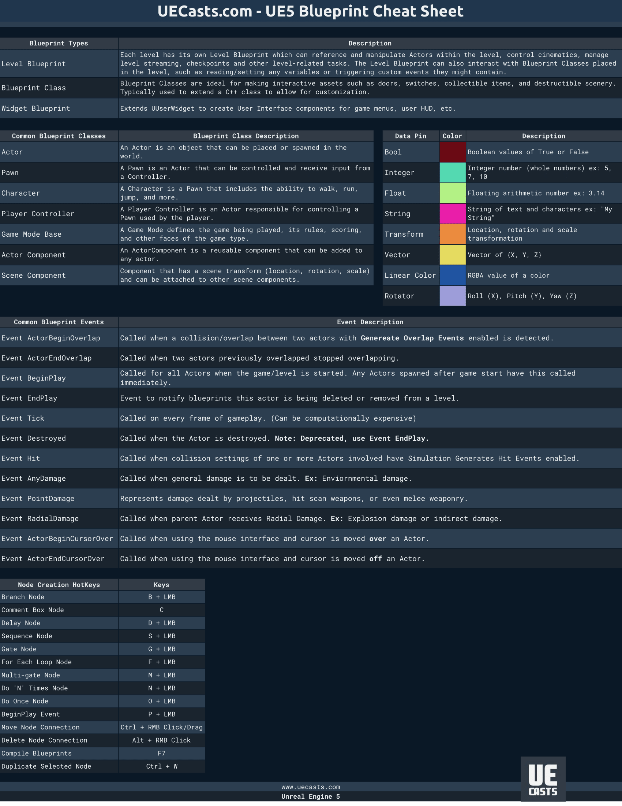
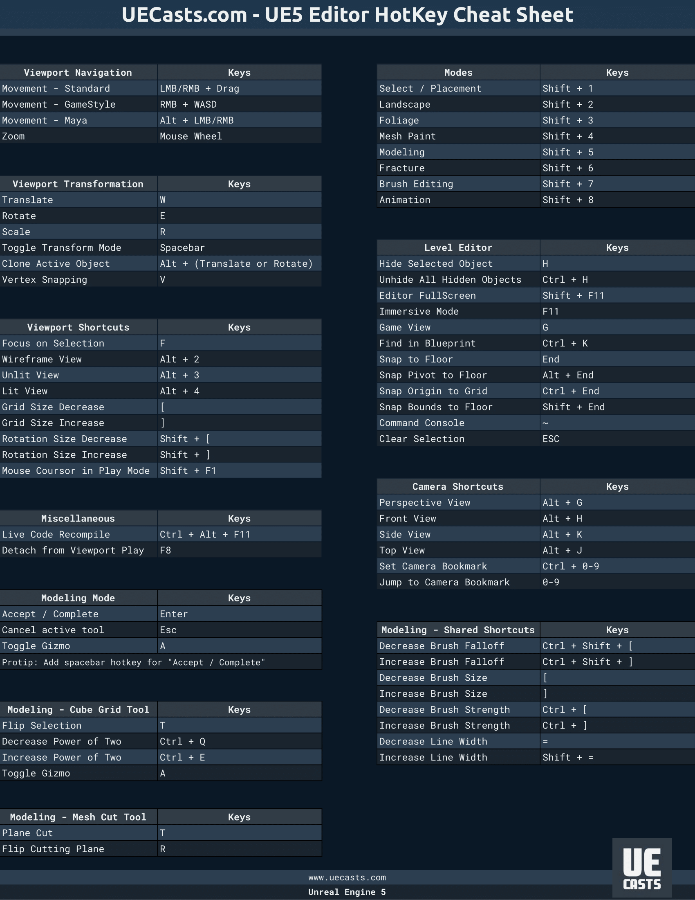
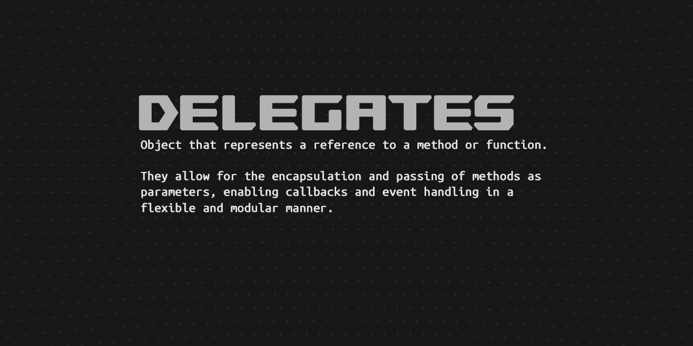

<div align="center">
  
[](https://github.com/mrrobinofficial/guide-unitysteamnetcodegameobjects/blob/HEAD/LICENSE.txt)


</div>

#

**Are you interested in creating games with Unreal Engine using C++?**

*In this repo, we'll guide you through the basics of getting started with Unreal Engine and C++. We'll cover the fundamentals of C++ programming, such as data types and pointers, and show you how to use these concepts in the context of game development with Unreal Engine. We'll also introduce you to the Unreal Engine module system, which is an important aspect of organizing your game code into smaller, more manageable pieces.*

> **Note**
> This repository was created in conjunction with [ChatGPT](https://en.wikipedia.org/wiki/ChatGPT) to assist in writing and formulating each sentence. While it provides valuable information, it may not be entirely accurate. If you detect any errors or false statements, please feel free to create a new [issue](https://github.com/MrRobinOfficial/Guide-UnrealEngine/issues/) to report them for further improvement and clarification.
>
> You can also send a new [pull request](https://github.com/MrRobinOfficial/Guide-UnrealEngine/pulls) to make correct changes to codebase.
>
> **Your contributions and feedback are appreciated!**

## Table of contents

<table><tr><td>

* 0\. [👑 Cheatsheets](#-cheatsheets)
* 1\. [⌛ Getting started with C++](#-getting-started-with-c)
    * 1.1\. [🌈 Integrated Development Environment](#-benefits-of-using-c-with-unreal-engine) 
    * 1.2\. [🟢 Benefits of using C++ with Unreal Engine](#-benefits-of-using-c-with-unreal-engine)
    * 1.3\. [🔴 Drawbacks of using C++ with Unreal Engine](#-drawbacks-of-using-c-with-unreal-engine)
* 2\. [🗺️ Summary of C++ and Programming World](#%EF%B8%8F-summary-of-c-and-programming-world)
  * 2.1\. [✨ Object-Oriented Programming](#-object-oriented-programming)
  	* 2.1.1\. [Encapsulation](#encapsulation)
   	* 2.1.2\. [Data Hiding](#data-hiding)
   	* 2.1.3\. [Inheritance](#inheritance)
	* 2.1.4\. [Polymorphism](#polymorphism)
  * 2.2\. [⌨️ Syntax and Structure](#-syntax-and-structure)
    * 2.2.1\. [Weak vs Strong typing](#weak-vs-strong-typing)
    * 2.2.2\. [Semicolons in C++](#semicolons-in-c)
    * 2.2.3\. [Curly Braces in C++](#curly-braces-in-c)
    * 2.2.4\. [Comments in C++](#comments-in-c)
      * 2.2.4.1\. [Single-line comments](#single-line-comments)
      * 2.2.4.2\. [Multi-line comments](#multi-line-comments)
    * 2.2.5\. [Headers vs source files](#headers-vs-source-files)
    * 2.2.6\. [Includes](#includes)
  * 2.3\. [🔥 Standard Library](#-standard-library)
  * 2.4\. [🔢 Data types](#-data-types)
    * 2.4.1\. [Char](#char)
    * 2.4.2\. [Booleans](#booleans)
    * 2.4.3\. [Integers](#integers)
      * 2.4.3.1\. [Modifiers](#modifiers)
    * 2.4.4\. [Floating points (floats and doubles)](#floating-points-floats-and-doubles)
  * 2.5\. [🙋‍♂️ Typedefs](#%EF%B8%8F-typedefs)
  * 2.6\. [🍂 Members](#-members)
    * 2.6.1\. [Variables](#variables)
    * 2.6.2\. [Assignments](#assignments)
    * 2.6.3\. [Functions](#functions)
  * 2.7\. [🧬 Classes](#-classes)
    * 2.7.1\. [Structs](#structs)
  * 2.8\. [💔 Accessibility](#-accessibility)
  * 2.9\. [🤔 If-statements](#-if-statements)
  * 2.10\. [🔣 Comparisons and Boolean Operators](#-comparisons-and-boolean-operators)
    * 2.10.1\. [❓ Conditional Expressions](#-conditional-expressions-ternary-operator)
  * 2.11\. [🔀 Switches](#-switches)
  * 2.12\. [🔄️ Loops](#%EF%B8%8F-loops)
    * 2.12.1\. [♾️ While Loop](#%EF%B8%8F-while-loop)
    * 2.12.2\. [🔃 Do-While Loop](#-do-while-loop)
    * 2.12.3\. [🔂 For Loop](#-for-loop)
    * 2.12.4\. [🗂️ Foreach Loop](#%EF%B8%8F-foreach-loop)
  * 2.13\. [🦋 Immutable vs Mutable](#-immutable-vs-mutable)
    * 2.13.1\. [Mutable](#mutable)
    * 2.13.2\. [Immutable](#immutable)
  * 2.14\. [🪝 Try Catch](#-try-catch)
  * 2.15\. [🪞 Casting](#-casting)
    * 2.15.1\. [Static casting](#static-casting)
    * 2.15.2\. [Const casting](#const-casting)
    * 2.15.3\. [Dynamic casting](#dynamic-casting)
    * 2.15.4\. [Reinterpret Casting](#reinterpret-casting)
  * 2.16\. [🛼 Inlining](#-inlining)
  * 2.17\. [📇 Namespace](#-namespace)
  * 2.18\. [🌐 Static members](#-static-members)
  * 2.19\. [`auto` keyword](#auto-keyword)
  * 2.20\. [🌱 Polymorphism (In Depth)](#polymorphism-in-depth)
    * 2.20.1\. [Operator Overloading](#operator-overloading)
    * 2.20.2\. [Function Overloading](#function-overloading)
    * 2.20.3\. [Virtual functions](#virtual-functions)
  * 2.21\. [🧙‍♂️ Generic Programming](#%EF%B8%8F-generic-programming)
  * 2.22\. [😵 Recursion](#-recursion)
  * 2.23\. [🫀 Lambda](#-lambda)
  * 2.24\. [🦾 Bitwise Operators](#-bitwise-operators)
  * 2.25\. [💥 Stack vs Heap](#-stack-vs-heap)
  * 2.26\. [⚓ Design Patterns And Principles](#design-patterns-and-principles)
  	* 2.26.1\. [SOLID Principle](#solid-principle)
   	* 2.26.2\. [KISS (Keep It Simple, Stupid)](#kiss-keep-it-simple-stupid)
    * 2.26.3\. [Singleton](#singleton)
    * 2.26.4\. [Observer](#observer)
    * 2.26.5\. [Factory](#factory)
    * 2.26.6\. [Strategy](#strategy)
    * 2.26.7\. [MVC (Model-View-Controller)](#mvc-model-view-controller)
  * 2.27\. [💯 Structures](#-structures)
    * 2.27.1\. [Array](#array)
    * 2.27.2\. [List](#list)
    * 2.27.2\. [Queue](#queue)
    * 2.27.2\. [Hash Set (Lookup table)](#hash-set-lookup-table)
    * 2.27.2\. [Dictionary (Map)](#dictionary-map)
    * 2.27.2\. [Linked List](#linked-list)
  * 2.28\. [⏰ Time Complexity](#-time-complexity)
    * 2.28.1\. [Constant - O(1)](#constant---o1)
    * 2.28.2\. [Logarithmic - O(log n)](#logarithmic---olog-n)
    * 2.28.3\. [Linear - O(n)](#linear---on)
    * 2.28.4\. [Quadratic - O(n^2)](#quadratic---on2)
    * 2.28.5\. [Exponential - O(2^n)](#exponential---o2n)
    * 2.28.6\. [Factorial - O(n!)](#factorial---on)
* 3\. [🚧 Blueprint vs C++](#-blueprint-vs-c)
* 4\. [🪧 Unreal's Architecture](#-unreals-architecture)
* 5\. [✍️ Naming Convention](#%EF%B8%8F-naming-convention)
	* 5.1\. [Prefixes](#prefixes)
	* 5.2\. [🎨 Abbreviations, Acronyms and Synonyms](#-abbreviations-acronyms-and-synonyms)
* 7\. [🧱 Data Types](#-data-types-1)
	* 7.1\. [Char](#char-1)
    * 7.2\. [Booleans](#booleans-1)
    * 7.3\. [Integers](#integers-1)
    * 7.4\. [Floating points (floats and doubles)](#floating-points-floats-and-doubles-1)
    * 7.5\. [🦺 Unreal Engine Typedefs](#-unreal-engine-typedefs)
    * 7.6\. [📖 Strings](#-strings)
      * 7.6.1\. [Text Macros](#text-macros)
      * 7.6.2\. [FName](#fname)
      * 7.6.3\. [FString](#fstring)
      * 7.6.4\. [FText](#ftext)
      * 7.6.5\. [Examples of usages](#examples-of-usages)
    * 7.7\. [🚀 Vector, Rotator, Quat and Transform](#-vector-rotator-quat-and-transform)
    * 7.7\. [💐 Collections](#-collections)
      * 7.7.1\. [TArray](#tarray)
      * 7.7.2\. [TSet](#tset)
      * 7.7.3\. [TMap](#tmap)
      * 7.7.4\. [TMultiMap](#tmultimap)
      * 7.7.5\. [TStaticArray](#tstaticarray)
      * 7.7.6\. [FHashTable](#fhashtable)
      * 7.7.7\. [TStaticHashTable](#tstatichashtable)
      * 7.7.8\. [TSortedMap](#tsortedmap)
      * 7.7.9\. [TList](#tlist)
      * 7.7.10\. [TLinkedList](#tlinkedlist)
      * 7.7.11\. [TQueue](#tqueue)
      * 7.7.12\. [TArrayView](#tarrayView)
      * 7.7.13\. [FStringView](#fstringview)
      * 7.7.14\. [TStringBuilder](#tstringbuilder)
      * 7.7.15\. [TEnumAsByte](#tenumasbyte)
    * 7.8\. [🧨 Value type vs Reference type](#-value-type-vs-reference-type)
    * 7.9\. [👈 Pointers](#-pointers)
      * 7.9.1\. [🦴 Raw pointers](#-raw-pointers)
      * 7.9.2\. [🤖 Smart pointers library](#smart-pointers)
        * 7.9.2.1\. [TSharedPtr](#tsharedptr)
        * 7.9.2.1\. [TWeakPtr](#tweakptr)
        * 7.9.2.1\. [TUniquePtr](#tuniqueptr)
      * 7.9.3\. [🤖 Smart `UObject` pointers](#-smart-uobject-pointers)
        * 7.9.3.1\. [TWeakObjectPtr](#tweakobjectptr)
        * 7.9.3.2\. [TWeakInterfacePtr](#tweakinterfaceptr)
        * 7.9.3.3\. [TSoftObjectPtr](#tsoftobjectptr)
        * 7.9.3.4\. [TSoftClassPtr](#tsoftclassptr)
* 8\. [🛸 Reflection System](#-reflection-system)
* 9\. [🗑️ Garbage Collection](#%EF%B8%8F-garbage-collection)
* 10\. [💎 Unreal Header Tool](#-unreal-header-tool)
  * 10.1\. [UPROPERTY](#uproperty)
  * 10.2\. [UFUNCTION](#ufunction)
  * 10.3\. [UCLASS](#uclass)
  * 10.4\. [USTRUCT](#ustruct)
  * 10.5\. [UENUM](#uenum)
  * 10.6\. [UPARAM](#uparam)
  * 10.7\. [UMETA](#umeta)
* 11\. [👷 Constructors and Destructors](#-constructors-and-destructors)
  * 11.1\. [Constructors](#constructors)
  * 11.2\. [Destructors](#destructors)
  * 11.3\. [Usage in Unreal Engine](#usage-in-unreal-engine)
* 12\. [💾 Soft vs hard references](#-soft-vs-hard-references)
  * 12.1\. [Soft References](#soft-references)
  * 12.2\. [Hard References](#hard-references)
* 13\. [🌍 Global Functions](#-global-functions)
* 14\. [🏛️ Libraries](#%EF%B8%8F-libraries)
  * 14.1\. [Kismet Library](#kismet-library)
* 15\. [📃 Macros](#-macros4)
* 16\. [☑️ Assertions](#%EF%B8%8F-assertions)
  * 16.1\. [Check](#check)
  * 16.2\. [Verify](#verify)
  * 16.3\. [Ensure](#ensure)
* 17\. [🔔 Delegates](#-delegates)
  * 17.1\. [Define a delegate type](#define-a-delegate-type)
  * 17.2\. [Declare a delegate variable](#declare-a-delegate-variable)
  * 17.3\. [Bind functions to the delegate](#bind-functions-to-the-delegate)
  * 17.4\. [Trigger the delegate](#trigger-the-delegate)
* 18\. [🪪 Unreal Motion Graphics (UMG)](#-unreal-motion-graphics-umg)
  * 18.1\. [UMG Blueprints with C++](#umg-blueprints-with-c)
  * 18.2\. [UI Tweening Library](#ui-tweening-library)
* 19\. [📚 Creating modules](#-creating-modules)
  * 19.1\. [Module structure](#module-structure)
  * 19.2\. [♻️ Circular Dependency](#%EF%B8%8F-circular-dependency)
* 20\. [💡 Creating a plugin](#-creating-a-plugin)
* 21\. [📝 preprocessor](#-preprocessor)
    * 21.1\. [Pragma once](#pragma-once)
    * 21.2\. [Strip out editor functionality](#strip-out-editor-functionality)
* 22\. [🧠 Deep dive](#-deep-dive)
    * 22.1\. [🔖 Keywords](#-keywords)
    * 22.2\. [🪄 Tips and best practices](#-tips-and-best-practices)
        * 22.2.1\. [📦 Refactoring](#-refactoring)
            * 22.2.1.1\. [Renaming](#renaming)
            * 22.2.1.2\. [Extract Method](#extract-method)
            * 22.2.1.3\. [Introduce/Inline typedefs](#introduceinline-typedefs)
            * 22.2.1.4\. [Introduce Variable](#introduce-variable)
            * 22.2.1.5\. [Invert 'if' statement to reduce nesting](#invert-if-statement-to-reduce-nesting)
        * 22.2.2\. [⏱ Ticking](#-ticking)
        * 22.2.3\. [`FTickFunction`](#ftickfunction)
        * 22.2.4\. [🔌 Direct references](#-direct-references)
        * 22.2.5\. [➗ Math Expression Node](#-math-expression-node)
        * 22.2.6\. [Call function in editor](#call-function-in-editor)
* 23\. [📛 Console Commands](#-console-commands)
* 24\. [📌 Shortcuts](#-shortcuts)
* 25\. [⚠️ Common Problems/Issues](#%EF%B8%8F-common-problemsissues)
    * 25.1\. [⛔ Compiler Error C2628](#-compiler-error-c2628)
    * 25.2\. [⛔ Compiler Error C2065](#-compiler-error-c2065)
* 26\. [🔗 Helpful links](#-helpful-links)
* 27\. [🆘 Support](#-support)
* 28\. [📍 Footnotes](#-footnotes)

</td></tr></table>

## 👑 Cheatsheets

<details open>
  <summary>Click to expand</summary>

[jbtronics - CheatSheet Poster](https://github.com/jbtronics/UE4-CheatSheet/blob/master/CheatSheet_Poster.pdf)

[Winslow - Unreal Engine 5 Blueprint CheatSheet Dark Theme](https://uecasts.com/resources/unreal-engine-5-blueprint-cheat-sheet-dark-theme?utm_source=epicgames&utm_campaign=cheat_sheet_ue5&utm_content=blueprint_dark)

[Winslow - Unreal Engine 5 C++ CheatSheet Dark Theme](https://uecasts.com/resources/unreal-engine-5-c-plus-plus-cheat-sheet-dark-theme?utm_source=epicgames&utm_campaign=cheat_sheet_ue5&utm_content=c_plus_plus_dark)

[Winslow - Unreal Engine 5 Editor CheatSheet Dark Theme](https://uecasts.com/resources/unreal-engine-5-editor-hotkeys-cheat-sheet-dark-theme?utm_source=epicgames&utm_campaign=cheat_sheet_ue5&utm_content=hotkeys_dark)

[VictoriaLyons - ProfilingCheatSheet](https://www.reddit.com/r/unrealengine/comments/gqi2xu/quick_performance_cheat_sheet/)

</details>

## ⌛ Getting started with C++

Highly recommend taking a short class of native C++. Here is a video link to ~1h long [video tutorial from Mosh](https://www.youtube.com/watch?v=ZzaPdXTrSb8).

C++ is a statically typed, compiled, general-purpose programming language that offers a combination of high-level and low-level features. It was developed by [Bjarne Stroustrup](https://en.wikipedia.org/wiki/Bjarne_Stroustrup) at Bell Labs in 1979 as an enhancement to the [C language](https://en.wikipedia.org/wiki/C_(programming_language)), originally named C[^10] with Classes and later renamed [C++](https://en.wikipedia.org/wiki/C%2B%2B) in 1983.

You can read more about [C++ Language Reference from Microsoft Learn](https://learn.microsoft.com/en-us/cpp/cpp/cpp-language-reference?view=msvc-170).

Using C++ with Unreal Engine unlocks the engine's full feature set, allowing developers to harness advanced graphics rendering, physics simulations, networking, and AI capabilities. C++ provides a level of control, customization, and performance optimization that complements visual scripting.

Developing with C++ in Unreal Engine enables better debugging, profiling, and performance optimization through techniques such as multithreading and memory management. It also facilitates integration with third-party libraries, expanding the range of functionality and flexibility available to developers.

You can read more about it on [their docs](https://docs.unrealengine.com/5.2/en-US/unreal-engine-programming-and-scripting/).

To use C++ effectively in Unreal Engine, it is crucial to have a strong foundation in programming principles and understanding of Unreal Engine's architecture and conventions. Leveraging resources like the Unreal Engine documentation, community forums, and collaboration with other developers helps to gain knowledge and best practices.

*By combining the power of C++ and Unreal Engine, developers can create immersive experiences and unlock the full potential of the engine's capabilities.*

### 🌈 Integrated Development Environment

An Integrated Development Environment (IDE) is a software application that provides comprehensive tools for writing, debugging, and managing code. IDEs offer a streamlined and feature-rich environment for software development, making it easier for developers to work on their projects efficiently.

Popular IDEs used in Unreal Engine and C++ development include:

* [Visual Studio](https://visualstudio.microsoft.com/): The Visual Studio IDE with the Visual Studio Unreal Engine Extension (VAX) is a widely used choice for Unreal Engine development. It offers a powerful set of C++ tools and seamless integration with Unreal Engine, providing a robust development environment. `Free`.

* [Visual Studio Code (VSCode)](https://code.visualstudio.com/): Visual Studio Code is a lightweight, cross-platform code editor with a rich ecosystem of extensions, including ones for Unreal Engine development. `Free`.

* [Rider](https://www.jetbrains.com/rider/): Rider is a popular IDE developed by JetBrains, designed for game development, and it offers solid integration with Unreal Engine projects. `Cost`.

* [Clion](https://www.jetbrains.com/clion/): Clion is another popular IDE developed by JetBrains, designed specifically for C++ development. NOTE, it doesn't offer integration with Unreal Engine projects. `Cost`.

### 🟢 Benefits of using C++ with Unreal Engine

* High performance: C++ allows you to write code that can run directly on the CPU and GPU, making it possible to achieve very high performance levels in your game or application.
* Access to low-level functionality: C++ gives you access to lower-level functionality than other programming languages, which can be especially useful in game development where fine-grained control over memory, data structures, and algorithms is often necessary.
* Integration with existing codebases: If you have existing C++ code that you want to integrate with your Unreal Engine project, using C++ allows you to do so more easily.
* More control over memory management: C++ requires you to manage memory manually, which can be a challenge but also gives you more control over how your code uses memory. This can be important in situations where memory usage is a concern, such as on mobile devices or consoles.
* Flexibility: With C++, you have the flexibility to write code in a variety of styles, including object-oriented, procedural, and functional programming. This allows you to choose the approach that best suits your needs.

### 🔴 Drawbacks of using C++ with Unreal Engine

* Steep learning curve: C++ is a complex language with many features, and it can be difficult to learn for beginners. Unreal Engine's architecture can also be challenging to understand, especially if you're new to game development.
* Time-consuming: Writing C++ code can be more time-consuming than using other programming languages. C++ requires more attention to detail, and it can take longer to write and debug code.
* More prone to errors: C++ requires manual memory management and has less strict type checking than some other languages. This can make it more prone to errors like memory leaks, null pointer dereferences, and type mismatches.
* Harder to prototype: Because C++ requires more code to accomplish even simple tasks, it can be harder to quickly prototype ideas in C++ than in other programming languages.

## 🗺️ Summary of C++ and Programming World

<details open>
  <summary>Click to expand</summary>

### ✨ Object-Oriented Programming

<details open>
  <summary>Click to expand</summary>

Object-Oriented Programming (**OOP**) is a programming paradigm that organizes code around objects, which are instances of classes. It focuses on the concept of objects, their properties (attributes), and behaviors (methods), allowing for modular, reusable, and structured code design.

#### Encapsulation

Encapsulation is the practice of bundling data and the methods that operate on that data within a single unit, which is typically a class. It promotes data hiding and information hiding, ensuring that the internal state and implementation details of an object are not directly accessible from outside the object. Encapsulation helps achieve data integrity, security, and abstraction by controlling access through well-defined interfaces.

#### Data Hiding

Data hiding is a principle closely related to encapsulation. It involves concealing the internal implementation details of an object and exposing only the necessary information through well-defined interfaces. By hiding implementation details, the object's data is protected and can only be accessed or modified through controlled methods. This enhances data security, code maintainability, and reduces the risk of unintended modifications or access to critical data.

#### Inheritance


Inheritance is a mechanism in OOP that allows new classes (derived classes or subclasses) to inherit properties and behaviors from existing classes (base classes or superclasses). Inheritance promotes code reuse, as derived classes can inherit and extend the functionality of their base classes. The derived classes can add new attributes and behaviors or override existing ones to customize the behavior of inherited members. Inheritance facilitates code organization, modularity, and the creation of hierarchical relationships between classes.

#### Polymorphism


Polymorphism is a fundamental concept in object-oriented programming (OOP) that allows objects of different classes to be treated as objects of a common base class. It enables you to write code that can work with objects of multiple types in a uniform manner.

Polymorphism is often illustrated through inheritance, where you have a base class and multiple derived classes that inherit from it. The derived classes can override or extend the behavior of the base class's methods, while still adhering to the common interface.

</details>

### ⌨️ Syntax and Structure

Syntax refers to the set of rules that define the structure, format and grammar of a programming language. It dictates how statements and expressions should be written to form valid code.

C++ follows a structured syntax that includes elements such as keywords[^1], identifiers, operators and control structures. The syntax is designed to provide precise instructions to the compiler on how to interpret and execute the code.

#### Weak vs Strong typing

Weak and strong typing refer to different approaches in how programming languages handle data types and type safety.

In C++, the language is considered strongly typed, as it requires explicit type conversions and does not perform implicit type coercion without the programmer's explicit instruction (except number data types). C++ enforces strong typing to ensure type safety and minimize potential errors.

Weak Typing (Python[^11] code):

```python3
a = 5 # Compiled! Because Python is a weak typing language.
```

Strong Typing (C++ code):

```cpp
a = 5; // Error!
int a = 5; // Compiled!
```

#### Semicolons in C++

In C++, a semicolon (<kbd>;</kbd>) is used to mark the end of a statement. It serves as a delimiter, indicating to the compiler that one statement has finished and another begins. The presence of semicolons allows the compiler to separate statements and interpret code correctly.

The requirement for semicolons in C++ is a design choice that provides explicit statement termination. This approach allows for more fine-grained control over program execution and eliminates ambiguity.

In contrast, languages like Python[^11] use indentation to define blocks of code, eliminating the need for explicit statement termination with semicolons.

```cpp
int a = 5; // Compiled!
int b = 5 // Error! Semicolon missing.
```

#### Curly Braces in C++

C++ uses curly braces (<kbd>{}</kbd>) as block delimiters to enclose multiple statements or define the body of control structures, functions, and classes. The use of curly braces provides a clear and explicit way to define the boundaries of code blocks (also know as a **scope**).

Curly braces help define the scope of variables and maintain code readability. They ensure that statements within the braces are treated as a single unit, making it easier to understand the flow and logic of the program.

```cpp
class Car
{

};
```

```cpp
namespace MyNamespace
{

}
```

```cpp
void MyFunction()
{
    {
        // Scope inside a function
    }
}
```

#### Comments in C++

Both single-line and multi-line comments are helpful for adding explanatory notes, documenting code, or temporarily disabling sections of code during debugging or development. They enhance code readability, facilitate collaboration, and provide valuable information to developers maintaining the codebase.

##### Single-line comments

Single-line comments start with two forward slashes `//` and continue until the end of the line.

They are typically used for brief comments or explanations on a single line.

```cpp
// This is a single-line comment in C++
```

##### Multi-line comments

Multi-line comments, also known as block comments, start with a forward slash (`/`) followed by an asterisk (`*`) and end with an asterisk (`*`) followed by a forward slash (`/`).

Multi-line comments can span multiple lines and are used for more extensive comments or documentation.

```cpp
/*
    This is a multi-line comment
    It can span multiple lines
*/
```

#### Headers vs source files

In C++, header files and source files are two types of files used to organize and manage code in a C++ program.

<table><tr><td>

## Header Files (.h)

* Header files contain declarations of classes, functions, variables, and other elements that are used in the program.
* They provide interfaces to the functionality implemented in the corresponding source files.
* Header files are included in source files using `#include` directives to make the declarations visible to the compiler during the compilation process.

## Source Files (.cpp)

* Source files contain the actual implementations of the functions and classes declared in the header files.
* They define how the functions and classes behave and provide the logic for the program's functionality.
* Source files are compiled to object files and then linked together to create the final executable.

## Reason for Separate Header and Source Files
The separation of header and source files is a design choice that promotes modularity and improves build efficiency in C++. By keeping declarations in header files and implementations in source files, the compiler can easily check for correctness and compile only the necessary code, reducing build times and preventing redundant compilation.

## History of Single File Extensions
In the early days of computing, languages like [Fortran](https://en.wikipedia.org/wiki/Fortran) and [COBOL](https://en.wikipedia.org/wiki/COBOL) used single file extensions because of the limitations of the operating systems and compilers at the time. Each file had to adhere to a specific format defined by the language and its compiler, and the extension represented that format.

</td></tr></table>

Other languages, like C#[^12], Java[^13], and Python[^11], continued to use single file extensions because they adopted a more integrated approach to handling both declarations and implementations within a single file.

In modern programming, the choice of using single file extensions or separate header and source files depends on the language's design philosophy and the needs of the development community. Both approaches have their strengths and weaknesses, and different languages adopt the one that best aligns with their goals and use cases.

#### Includes

In C++, the `include` directive is used to bring external code (headers or libraries) into your source code. It allows you to access the declarations and definitions present in those files.

The `include` directive is typically written as:

```cpp
#include "filename.h"   // Using double quotes for user-defined headers
#include <filename.h>   // Using angular brackets for standard library headers
```

Here's the difference between using double quotes and angular brackets:

1. **Double Quotes (`"filename.h")**: When you use double quotes, the preprocessor searches for the header file in the current directory first. If it doesn't find the file there, it will look in the additional include directories specified in the project settings.

   Example: `#include "MyHeader.h"`

2. **Angular Brackets (`<filename.h>`)**: When you use angular brackets, the preprocessor only searches for the header file in the standard library directories specified for the compiler.

   Example: `#include <iostream>`

In general, you use double quotes for your own header files (which may be part of your project) and angular brackets for standard library headers (like `iostream`, `vector`, etc.) or headers from external libraries.

### 🔥 Standard Library

The standard library in C++ is a collection of pre-defined classes and functions that provide a wide range of functionality for common tasks. It is a part of the [C++ Standard Template Library (STL)](https://en.wikipedia.org/wiki/Standard_Template_Library) and is officially known as the [C++ Standard Library](https://en.wikipedia.org/wiki/C%2B%2B_Standard_Library). The library is designed to be platform-independent and provides a standardized set of features that are supported across different C++ compilers and environments.

The C++ Standard Library is organized into several header files, each of which contains declarations for specific classes and functions. Some of the key components of the standard library include containers (like vectors, lists, maps, etc.), algorithms (sorting, searching, etc.), iterators, input/output operations, strings, and more.

To use the standard library in C++, you include the appropriate header files in your code, and then you can directly use the classes and functions provided by the library. For example, to use the `std::vector` class, you include the `<vector>` header file and then create instances of the vector and use its methods.

The name "std" comes from the fact that all the classes, functions, and other elements of the standard library are part of the `std` namespace. The namespace `std` is used to avoid naming conflicts with other libraries and user-defined code. By using the `std::` prefix before any element from the standard library, you explicitly specify that you are referring to the elements in the `std` namespace.

Here's a simple example of how to use the standard library in C++:

```cpp
#include <iostream>
#include <vector>
#include <algorithm>

std::vector<int> numbers = {5, 2, 9, 1, 7};

// Use standard library algorithm to sort the vector
std::sort(numbers.begin(), numbers.end());

// Use standard library to print the sorted vector
for (int num : numbers)
{
    std::cout << num << " ";
}
```

### 🔢 Data types

<table><tr><td>

## Native Types

* `bool` - Represents a logical value, either `true` or `false`
* `char` - Represents a single character in the ASCII[^3] character set
* `int` - Represents a integer (whole number)
* `float` - Represents a floating-point number, which is a real number with a fractional component
* `double` - Represents a double-precision floating-point number, which has twice the precision of a float

<br>

</td></tr></table>

| Type Name           | Bytes | Other Names                          | Range of Values                                       |
|---------------------|-------|--------------------------------------|-------------------------------------------------------|
| `int`                 | 4     | `signed`                               | -2,147,483,648 to 2,147,483,647                       |
| `unsigned int`        | 4     | `unsigned`                             | 0 to 4,294,967,295                                   |
| `__int8`              | 1     | `char`                                 | -128 to 127                                          |
| `unsigned __int8`     | 1     | `unsigned char`                        | 0 to 255                                             |
| `__int16`             | 2     | `short`, `short int`, `signed short int`   | -32,768 to 32,767                                    |
| `unsigned __int16`    | 2     | `unsigned short`, `unsigned short int`   | 0 to 65,535                                          |
| `__int32`             | 4     | `signed`, `signed int`, `int`              | -2,147,483,648 to 2,147,483,647                      |
| `unsigned __int32`    | 4     | `unsigned`, `unsigned int`               | 0 to 4,294,967,295                                  |
| `__int64`             | 8     | `long long`, `signed long long`          | -9,223,372,036,854,775,808 to 9,223,372,036,854,775,807 |
| `unsigned __int64`    | 8     | `unsigned long long`                   | 0 to 18,446,744,073,709,551,615                      |
| `bool`                | 1     | none                                 | `false` or `true`                                        |
| `char`                | 1     | none                                 | -128 to 127 by default; 0 to 255 when compiled by using /J |
| `signed char`         | 1     | none                                 | -128 to 127                                          |
| `unsigned char`       | 1     | none                                 | 0 to 255                                             |
| `short`               | 2     | `short int`, `signed short int`          | -32,768 to 32,767                                    |
| `unsigned short`      | 2     | `unsigned short int`                   | 0 to 65,535                                          |
| `long`                | 4     | `long int`, `signed long int`            | -2,147,483,648 to 2,147,483,647                      |
| `unsigned long`       | 4     | `unsigned long int`                    | 0 to 4,294,967,295                                  |
| `long long`           | 8     | none (but equivalent to `__int64`)     | -9,223,372,036,854,775,808 to 9,223,372,036,854,775,807 |
| `unsigned long long`  | 8     | none (but equivalent to `unsigned __int64`) | 0 to 18,446,744,073,709,551,615                      |
| `enum`                | varies| none                                 |                                                       |
| `float`               | 4     | none                                 | 3.4E +/- 38 (7 digits)                               |
| `double`              | 8     | none                                 | 1.7E +/- 308 (15 digits)                             |
| `long double`         | same as `double` | none                        | Same as `double`                                       |
| `wchar_t`             | 2     | `__wchar_t`                            | 0 to 65,535                                          |

If its name begins with two underscores (`__`), a data type is non-standard.

#### Char

```cpp
char myChar = 'a';
```

#### Booleans

```cpp
bool isDead = true; 
```

#### Integers

```cpp
int health = 10;
```

##### Modifiers

C++ allows the char, int, and double data types to have modifiers preceding them. A modifier is used to alter the meaning of the base type so that it more precisely fits the needs of various situations.

<table><tr><td>

## List of modifiers

* `signed`
* `unsigned`
* `long`
* `short`

<br>

</td></tr></table>

The modifiers `signed`, `unsigned`, `long` and `short` can be applied to integer base types. In addition, `signed` and `unsigned` can be applied to `char`, and `long` can be applied to `double`.

The modifiers `signed` and `unsigned` can also be used as prefix to `long` or `short` modifiers.

For example:

```cpp
unsigned long int // Same as unsigned 32-bit integer (unsigned int)
```

> **Note**
> The default behavior for all integer types is `signed`.

Here is a list of modifiers for **integer** data type:

| Declare            | Size (bits) | Size (bytes) | Min Value                   | Max Value                     |
|--------------------|-------------|--------------|-----------------------------|------------------------------|
| `unsigned char`    | 8           | 1            | 0                           | 255                          |
| `unsigned short int` | 16          | 2            | 0                           | 65,535                       |
| `unsigned int`     | 32          | 4            | 0                           | 4,294,967,295                |
| `unsigned long long` | 64          | 8            | 0                           | 18,446,744,073,709,551,615   |
| `signed char`      | 8           | 1            | -128                        | 127                          |
| `signed short int` | 16          | 2            | -32,768                     | 32,767                       |
| `signed int`       | 32          | 4            | -2,147,483,648              | 2,147,483,647                |
| `signed long long` | 64          | 8            | -9,223,372,036,854,775,808  | 9,223,372,036,854,775,807    |

#### Floating points (floats and doubles)

```cpp
float speedInMetersPerSecond = 5.5f; // C++ always uses 'f' or 'F' literal for defining a float variable.
```

```cpp
double speedInMetersPerSecond = 5.5; // C++ never uses a literal for defining a double variable.
```

### 🙋‍♂️ Typedefs

In C++, the `typedef` keyword[^1] is used to create an **alias** or **alternative name** for existing data types. It provides a way to define a new name that can be used as a shorthand for the original type, improving code readability and maintainability.

Here's an example:

```cpp
typedef int myInt; // Declare our alias for custom type

myInt x = 5;  // Equivalent to: int x = 5;
```

> **Warning**
> Unreal Engine doesn't support typedefs with UHT[^2]. Meaning, you can't expose to Blueprint.

### 🍂 Members

Members are variables or functions that are part of a class or object. They define the properties and behaviors of the class.

There are two main types of members: `variables` and `functions`.

#### Variables

Members that store data. They can be of different types such as numbers, strings, booleans, or custom data types. Variables hold values that can be accessed and manipulated within the class or object.

##### Assignments

There are abbreviations for frequently done kinds of assignments. Here are a few:

| Abbreviation  | Meaning | Note |
| ------------- | ------------- | ------------- |
| `n += k`  | `n = n + k`  | |
| `n -= k`  | `n = n - k`  | |
| `++n`  | `n = n + 1`  | Where the value of expression `++n` is the value of `n` after the assignment |
| `n++`  | `n = n + 1`  | But the value of expression `n++` is the value of `n` before the assignment |
| `--n`  | `n = n - 1`  | Where the value of expression `--n` is the value of `n` after the assignment |
| `n--`  | `n = n - 1`  | But the value of expression `n--` is the value of `n` before the assignment |

#### Functions

Functions are blocks of code that perform a specific task or set of tasks. They encapsulate a series of instructions and can be called and executed from various parts of a program. Functions can accept input parameters (arguments) and can also return a value as a result.

Functions can be defined outside of classes as standalone functions or can be defined within classes as member functions. Standalone functions are typically used for common tasks that are not specific to any particular class or object.

Here's an example:

```cpp
/// @brief Calculates the factorial of a number using recursion.
/// @param n Number of times.
/// @result A number.
int Factorial(int n)
{
    if (n == 0 || n == 1)
        return 1;
    else
        return n * Factorial(n - 1);
}
```

### 🧬 Classes

Classes are the building blocks of object-oriented programming (OOP). They are a blueprint for creating objects, which are instances of a class. A class defines the structure and behavior of objects by specifying the members it contains.

A class can have variables (members) to store data and functions (methods) to perform actions. The variables defined within a class are often referred to as attributes, while the functions are referred to as methods.

Objects created from a class can access and modify the class's members. They provide a way to create multiple instances that share the same structure and behavior defined by the class. Objects can be thought of as individual entities that represent real-world objects or abstract concepts.

Classes allow for code reusability, encapsulation (hiding internal details), and the ability to model complex systems by organizing related data and behavior together.

Here's an example:

```cpp
class Person
{
public:
    Person(std::string name, int age)
        : name(name)
        , age(age)
    { }

    void DisplayInfo()
    {
        // ...
    }

private:
    std::string name;
    int age;
};
```

#### Structs

In C++, a `struct` is a user-defined data type that allows you to group multiple variables of different data types under a single name.
It is similar to a `class`, but with some key differences.

**Usage of `struct` in C++**
- Structs are used to create lightweight data structures to hold related data elements.
- They are commonly used to represent simple data objects or records that do not require complex behavior or methods.

**Difference between `class` and `struct`**
In C++, the main difference between a `class` and a `struct` is the default access level. In a `class`, the default access level for its members is private, while in a `struct`, the default access level is public. This means that members of a `struct` are accessible outside the struct without the need for access specifiers.

For example:

```cpp
struct Vector3
{
    float x;
    float y;
    float z;

    Vector3(float _x = 0.0f, float _y = 0.0f, float _z = 0.0f)
        : x(_x)
        , y(_y)
        , z(_z)
    { }
};

Vector3 v1(1.0f, 2.0f, 3.0f);
Vector3 v2(4.0f, 5.0f, 6.0f);

float dx = v1.x - v2.x;
float dy = v1.y - v2.y;
float dz = v1.z - v2.z;

float dist = std::sqrt(dx * dx + dy * dy + dz * dz);
```

**Historical difference with C language**
In C, there was no concept of classes, and `struct` was the primary way to define user-defined data types. In C++, the `struct` keyword was retained to maintain compatibility with C, but it gained additional features and behavior, such as the ability to have member functions and access specifiers.

In modern C++, the distinction between `class` and `struct` has become more a matter of convention and coding style rather than a strict rule. Many developers prefer to use `struct` for simple data containers with public data members and `class` for more complex objects with private data members and member functions. However, you can use either `class` or `struct` based on your design preferences.

### 💔 Accessibility

| Keyword	    | Access ability | Description                                                                                          |
| ----------- | -------------- | ---------------------------------------------------------------------------------------------------- |
| `public`    | All	           | Members and functions are accessible from anywhere, including outside the class.                     |
| `protected` |	Subclasses     | Members and functions are accessible from within the class and any subclasses, but not from outside. |
| `private`   |	Class	         | Members and functions are only accessible from within the class itself.                              |
| `mutable`   |	Class	         | Specifies that a member variable can be modified even if the owning object is const.                 |
| `friend`    | Class          | Allows a non-member function or class to access the private and protected members of a class.        |

```cpp
class MyClass
{
public:
    int publicVar; // Public member variable

    // Public member function
    void publicFunction()
    {  
        // ...
    }

protected:
    int protectedVar; // Protected member variable

    // Protected member function
    void protectedFunction()
    {  
        // ...
    }

private:
    int privateVar; // Private member variable

    // Private member function
    void privateFunction()
    {
        // ...
    }

    mutable int mutableVar; // Mutable member variable

    friend void friendFunction(MyClass& obj); // Friend function declaration
};

void friendFunction(MyClass& obj)
{
    obj.privateVar = 42; // Friend function can access private member variable
}

MyClass obj;

// Accessing public members
obj.publicVar = 10; // Compiled!
obj.publicFunction(); // Compiled!

// Accessing private members via friend function
friendFunction(obj); // Compiled!

// Accessing private members directly (only possible within the class)
obj.privateVar = 20; // Error!
obj.privateFunction(); // Error!
```

### 🤔 If-statements

If-statement is a fundamental control structure that allows you to conditionally execute a block of code based on a specified condition.
It provides a way to control the flow of execution in your program.

```cpp
if (condition)
{
    // Code to be executed if the condition is true
}
else if (secondCondition)
{
    // Code to be executed if the secondCondition is true, but condition was false
}
else
{
    // Code to be executed if the condition and secondCondition is both false
}
```

### 🔣 Comparisons and Boolean Operators

Here are some operations for creating conditions:

* `==` 	- Equality check
* `!=` 	- Inequality check
* `>` 	- Check for greater
* `<` 	- Check for less
* `>=`	- Check for greater or equal
* `<=`	- Check for less or equal
* `&&` 	- Expression A && B is evaluated by first evaluating A. A has value 0, then A && B also has value 0, and B is not evaluated. Otherwise, B is evaluated; if B has value 0, then A && B has the same value 0, and otherwise has value 1. Also called `AND` operator.
* `||`	- Expression A || B is evaluated by first evaluating A. If A has a nonzero value, then A || B has value 1, and B is not evaluated. Otherwise, A || B has value 1 if B is nonzero and value 0 if B is zero. Also called `OR` operator.
* `!` 	- Expression !A is 0 if A is nonzero, and is 1 if A is 0. Also called `NOT` operator.

#### ❓ Conditional Expressions (Ternary operator)

Conditional expressions in C++ are statements that evaluate a condition and return a value based on the result of the condition. They provide a concise way to express simple conditions and perform different actions or assignments based on the outcome.

The basic syntax of a conditional expression in C++ is as follows:

```cpp
int value = isDead ? 100 : -100; // condition ? value_if_true : value_if_false;
```

* 1\. The condition within the parentheses is evaluated.

* 2\. If the condition is true, the value or expression before the colon (<kbd>:</kbd>) is returned as the result of the conditional expression.

* 3\. If the condition is false, the value or expression after the colon is returned as the result.

### 🔀 Switches

In C++, a switch statement is a control flow construct used to select one of many possible execution paths based on the value of a given expression. It provides an alternative to using multiple if-else statements when checking a variable against different values.

The basic syntax of a switch statement in C++ is as follows:

```cpp
switch (expression)
{
    case value1:
        // Code to be executed if expression matches value1
        break;
    case value2:
        // Code to be executed if expression matches value2
        break;
    // Add more case statements as needed
    default:
        // Code to be executed if none of the cases match
        break;
}
```

* 1\. The expression is evaluated, and its value is compared against the cases specified in the switch statement.

* 2\. If a case matches the value of the expression, the code block associated with that case is executed. The execution then continues until a break statement is encountered, which exits the switch statement.

* 3\. If none of the cases match the expression's value, the code block associated with the default case (optional) is executed. The default case serves as a fallback option when no matching cases are found.

### 🔄️ Loops

Loops are essential constructs in programming languages that allow repetitive execution of a block of code based on a specified condition. They provide a way to automate tasks, process collections of data, and iterate over a sequence of elements.

#### ♾️ While Loop

While loop are used when the number of iterations is uncertain but depends on a condition. The loop continues as long as the specified condition remains true. It evaluates the condition before each iteration, and if it becomes false, the loop terminates.

Here's an example of finding the first power of 2 greater than 100:

```cpp
int num = 1;

while (num <= 100)
{
    num *= 2;
}

std::cout << "First power of 2 greater than 100: " << num << std::endl;

// Output: First power of 2 greater than 100: 128
```

#### 🔃 Do-While Loop

A do-while loop is a control flow structure in programming that executes a block of code at least once, and then repeats the execution as long as a specified condition remains true. It is similar to the while loop, but with the condition checked at the end of each iteration.

Here's an example of printing numbers from 1 to 5 using a do-while loop:

```cpp
int i = 1;

do
{
    std::cout << i << " ";
    i++;
} while (i <= 5);

// Output: 1 2 3 4 5
```

#### 🔂 For Loop

For loop are used when you know the number of iterations in advance. They consist of an initialization, a condition for continuation, and an iteration statement. The loop iterates over a range of values or a collection, incrementing or decrementing a counter variable with each iteration.

Here's an example of printing numbers from 1 to 5:

```cpp
for (int i = 1; i <= 5; i++)
{
    std::cout << i << " ";
}

// Output: 1 2 3 4 5
```

#### 🗂️ Foreach Loop

Foreach loop are designed to iterate over collections or sequences of elements. They automatically handle the iteration logic, allowing you to process each element without managing an explicit index or counter. The loop iterates over each element in the collection until all elements have been processed.

Here's an example of printing each character of a string:

```cpp
std::string message = "Hello";

for (char c : message)
{
    std::cout << c << " ";
}

// Output: H e l l o
```

---

In summary:

| Loop Type    | Purpose                                        |
|--------------|------------------------------------------------|
| while loop   | Executes the block of code while the condition is true. |
| do-while loop| Executes the block of code first, then checks the condition. It guarantees that the loop will execute at least once. |
| for loop     | Executes the block of code based on the initialization, condition, and update expressions. |
| foreach loop | Iterates over the elements of a container (e.g., arrays, vectors) and executes the block of code for each item. |

### 🦋 Immutable vs Mutable

The terms `immutable` and `mutable` refer to the state of an object or variable and whether it can be changed after its creation. Understanding the difference between `immutable` and `mutable` objects is essential in programming as it affects how data is manipulated and shared within the code.

#### Mutable

In C++, the `mutable` keyword is used to modify the behavior of a class member when the class itself is declared as `const`. When a class member is marked as mutable, it can be modified even when the object is considered constant.

When you declare a class member as `const`, it means that the member cannot be modified once the object is created. However, there are scenarios where you may want to allow certain members to be modified even in a `const` object. This is where the `mutable` keyword comes into play. By using `mutable` keyword, you can change a `const` class member and alter the value.

Usage of `mutable` for variables:

```cpp
class MyClass
{
public:
    MyClass(int value) : constantValue(value) {}

    void IncrementValue() const
    {
        mutableValue++; // Modifying the mutable member inside a const member function
    }

    // This function is const and cannot modify constantValue
    int GetConstantValue() const { return constantValue; } 

    // This function is const, but mutableValue can still be modified.
    int GetMutableValue() const { return mutableValue; }

private:
    const int constantValue; // Regular constant member
    mutable int mutableValue; // Mutable member
};
```

When to use `mutable` keyword:

The mutable keyword is used in situations where a class member maintains a state that should be allowed to change even in a const object. Common use cases for mutable include caching and lazily initializing data. By making certain members mutable, you can improve performance in specific scenarios without sacrificing the const-correctness of your class.

> **Warning**
> While `mutable` can be useful, it should be used judiciously. Modifying mutable members inside `const` functions can lead to unexpected behavior and make the code harder to reason about. Ensure that the state being modified using `mutable` doesn't affect the logical constness of the class or lead to thread-safety issues.

#### Immutable

When a member variable is declared as `const`, it means that its value cannot be changed after it is initialized. This makes the member immutable, and any attempt to modify its value will result in a compilation error.

The `const` keyword is used in C++ to declare a constant variable, which means its value cannot be changed once it is assigned. When applied to member functions, it indicates that the function will not modify the state of the object it is called on (i.e., it won't modify member variables unless they are explicitly marked as `mutable`). This allows the compiler to enforce immutability and provides additional safety guarantees in the code.

Usage of `const` for variables:

```cpp
const int immutableValue = 10; // Immutable variable
// immutableValue = 20; // Error: Cannot modify an immutable variable
```

---

| Property                   | Immutable                   | Mutable                      |
|----------------------------|-----------------------------|------------------------------|
| State                      | Cannot be changed           | Can be changed               |
| Modification               | Creates a new object        | Modifies the original object |
| Data Sharing               | Thread-safe (no synchronization needed) | Requires synchronization for thread-safety |
| Memory Overhead            | Additional memory allocation for each update | Direct modification, no additional memory overhead |
| Performance Characteristics | Generally more memory-efficient but slower for frequent updates | May be less memory-efficient but faster for frequent updates |

### 🪝 Try Catch

In programming, `try-catch` is a mechanism used for error handling and exception handling. It allows you to write code that can handle potential errors or exceptions that may occur during the program's execution, preventing crashes or data corruption.

In C++, the try and catch blocks are used for implementing this mechanism. Here's how it works:

1\. `try`: You place the code that might throw an exception inside a `try` block. If an exception occurs within this block, the program will immediately jump to the nearest matching `catch` block.

2\. `catch`: The `catch` block is used to catch and handle the exceptions thrown in the `try` block. It specifies the type of exception it can catch. If an exception of that type is thrown, the code within the `catch` block will be executed.

Here's a simple example in C++:

```cpp
try
{
    int numA = 5;
    int numB = 0;
    int result = numA / numB;
}
catch (const char* errorMessage)
{
    // Caught "Floating point exception"
}
```

Using `try-catch` blocks allows you to handle exceptional situations gracefully, providing error messages to users or logging errors for debugging, instead of crashing or corrupting the program's data. It helps in making your programs more robust and user-friendly.

### 🪞 Casting

Casting, in the context of programming languages, refers to the conversion of one data type into another. It allows you to change the interpretation or representation of a variable or object, which can be useful in various situations.

#### Static casting

This is the most basic and straightforward form of casting. It is performed using the (type) syntax and works for converting between related types, like integer to float or vice versa. However, it may not be safe in some situations, so you need to be cautious when using it.

Example:

```cpp
int num1 = 10;
double num2 = static_cast<double>(num1); // Static cast from int to double
```

#### Const casting

This is used to add or remove the const qualifier from a variable. It allows you to modify the constness of a variable.

Example:

```cpp
const int x = 5;
const_cast<int&>(x) = 10; // Const cast to remove const and modify the value of x
```

#### Dynamic casting

This is primarily used for casting pointers or references to objects in a class hierarchy. It is particularly useful when working with polymorphic classes. Dynamic casting checks the validity of the cast at runtime and returns a null pointer if the cast is not valid.

Example:

```cpp
class BaseClass { /* ... */ };
class DerivedClass : public BaseClass { /* ... */ };

BaseClass* basePtr = new DerivedClass;
DerivedClass* derivedPtr = dynamic_cast<DerivedClass*>(basePtr); // Dynamic cast from BaseClass to DerivedClass
```

#### Reinterpret Casting

This is primarily used to convert one pointer or reference type to another, regardless of their unrelated types. It is a low-level and potentially unsafe casting operation that allows developers to treat the underlying binary representation of a pointer as a different type. Unlike `static_cast`, `reinterpret_cast` doesn't perform any type checking or conversions, and it's up to the programmer to ensure the correctness of the cast.

Example:

```cpp
result_type = reinterpret_cast<result_type>(expression);
```

### 🛼 Inlining

Inlining is a compiler optimization technique used to improve the performance of code by inserting the body of a function directly at the call site, eliminating the overhead of function calls. It reduces the execution time by avoiding the function call stack setup and cleanup.

In C++, you can use the inline keyword to suggest to the compiler that a function should be inlined. For example:

```cpp
inline int Add(int a, int b) { return a + b; }
```

The `inline` keyword is a hint to the compiler, and the actual decision of whether to inline a function is made by the compiler. It might choose not to inline a function if it is too large or too complex.

The `__forceinline` keyword is used to force the compiler to inline a function, regardless of its size or complexity. It overrides the compiler's normal inlining heuristics and ensures that the function is always inlined wherever it is called.

Here's an example of how `__forceinline` can be used:

```cpp
__forceinline int Multiply(int a, int b) { return a * b; }
```

---

When choosing between using a macro or a function for inlining, it is generally recommended to use functions with the `inline` keyword. Functions are more type-safe and have better debugging support compared to macros. Macros are simple textual replacements and can lead to unexpected behavior or issues if not used carefully.

Using inline functions offers a good balance between performance and maintainability. They provide the benefits of inlining without sacrificing the advantages of type-checking and debugging support that functions offer. However, keep in mind that the inline keyword is just a hint to the compiler, and it may or may not `inline` the function depending on the specific context and compiler optimizations.

### 📇 Namespace

In programming languages, a namespace is a feature that allows you to organize code elements (such as variables, functions, classes) into distinct named scopes to avoid name collisions and improve code organization.

In C++, you can use namespaces to group related code together and avoid naming conflicts. Here's how you can define and use a namespace in C++:

```cpp
// Defining a namespace
namespace MyNamespace
{
    int add(int a, int b) { return a + b; }
}

int result = MyNamespace::add(3, 5);
```

Namespaces are particularly helpful when you are working with multiple libraries or modules, each with its own set of classes and functions. By placing them in separate namespaces, you can avoid naming conflicts when using elements from different libraries.

For example, consider two libraries that both define a class called Vector. Without namespaces, including both libraries in the same project could lead to naming conflicts. However, by placing each Vector class in its own namespace, such as `Library1::Vector` and `Library2::Vector`, you can use them without conflicts.

```cpp
#include <Library1/Vector.h>
#include <Library2/Vector.h>

Library1::Vector vec1;
Library2::Vector vec2;
// Use vec1 and vec2 without conflicts
```

> **Warning**
> Unreal Engine doesn't support namespaces with UHT[^3].

### 🌐 Static members

In programming languages, static members are class members (variables or functions) that belong to the class itself rather than individual objects of the class. They are shared among all instances (objects) of the class and are independent of any specific object's state.

In C++, you can use the static keyword to define static members in a class. Here's how you can use static members in C++ code:

```cpp
class MyClass
{
public:
    static int staticVariable; // Declaration of a static variable
    static void staticFunction(); // Declaration of a static function
};

// Definition of the static variable
int MyClass::staticVariable = 0;

// Definition of the static function
void MyClass::staticFunction()
{
    // Function implementation
}
```

Static variables and functions are accessed using the class name followed by the scope resolution operator `::`. Since static members are shared across all instances of the class, they do not require an object to be accessed.

Here's how you can use static members in your code:

```cpp
MyClass::staticVariable = 10; // Accessing static variable
MyClass::staticFunction(); // Calling static function
```

Static members are commonly used for class-level data and utility functions that do not rely on object-specific state. They are particularly useful when you want to maintain a single instance of a variable shared among all objects of the class, or when you need a common function that does not depend on the specific object's data.

### `auto` keyword

In C++, the `auto` keyword is used for type inference, allowing the compiler to deduce the data type of a variable automatically based on its initialization value (similar to `var` keyword in C#[^12]). It was introduced in [C++11](https://en.wikipedia.org/wiki/C%2B%2B11) as part of the modern C++ features.

Here's how you can use the `auto` keyword:

```cpp
auto variable = 42; // Compiler will deduce the type of 'variable' as int
auto name = "John"; // Compiler will deduce the type of 'name' as const char*
auto pi = 3.14; // Compiler will deduce the type of 'pi' as double
```

The `auto` keyword is especially useful when dealing with complex data types or when the type is long and cumbersome to write explicitly. It can also simplify code maintenance since you don't need to update the type declaration if the initialization value changes.

Using the `auto` keyword for return function values can be a double-edged sword. While it can make the code more concise and reduce the need to explicitly specify return types, it can also make the code less readable and harder to understand, especially when the function's logic is complex.

```cpp
auto player = GetPlayer(); // Bad

Player* player = GetPlayer(); // Good
```

| Pros of Using 'auto' for Return Values         | Cons of Using 'auto' for Return Values                                              |
|-----------------------------------------------|-----------------------------------------------------------------------------------|
| Concise code with reduced type annotations    | Lack of clarity: Return type might not be immediately apparent from the code     |
| Easier to write and understand simple cases   | Debugging and error handling might be more challenging                            |
| Can simplify code in certain situations       | Reduced code readability in complex scenarios                                    |
| Reduces the need to explicitly specify types  | Potential impact on code maintainability as the codebase grows larger and complex |
| Improves code readability in some cases       | Team coding standards and practices may not always favor using 'auto'             |

### 🌱 Polymorphism (In Depth)

The power of polymorphism lies in the ability to use a base class pointer or reference to refer to objects of derived classes. This allows you to write code that operates on the base class, without needing to know the specific derived class. During runtime, the appropriate version of the overridden method in the derived class will be invoked, based on the actual type of the object being referred to.

Polymorphism allows you to write more flexible and reusable code by treating objects based on their common behavior, rather than their specific type. It promotes code extensibility and enhances the ability to work with a variety of objects in a unified way.

##### Operator Overloading

In C++, operators are symbols or keywords[^1] used to perform various operations on data, such as arithmetic operations, logical operations, assignment, comparison, and more. They enable concise and expressive manipulation of variables and values.

Operator Overloading is a feature in C++ that allows you to redefine the behavior of an operator for user-defined types. It enables you to provide a specific implementation for an operator based on the operands' types, allowing custom operations to be performed.

Here's an example of overloading the greater-than-or-equal-to `>=` operator in C++:

```cpp
class MyClass
{
public:
    int value;

    MyClass(int val) : value(val) {}

    bool operator>=(const MyClass& other) const
    {
        return value >= other.value;
    }
};
```

By overloading operators, you can define custom behavior for how objects of a class interact with the corresponding operator. This provides flexibility and allows you to use familiar syntax and semantics for user-defined types, making the code more intuitive and expressive.

Operator overloading is not limited to comparison operators; you can also overload arithmetic operators `+`, `-`, `*` and `/` assignment operators `=`, logical operators `&&`, `||`, and more. Overloading operators helps create more natural and concise code, improves code readability, and enhances the usability of user-defined types.

##### Function Overloading

Function overloading is a feature in C++ that allows you to define multiple functions with the same name but different parameters.

It enables you to create functions that perform similar operations but on **different data types** or with **different parameter sets**.

```cpp
void TakeDamage(int DamageAmount)
{
    // Logic...
}

void TakeDamage(float DamageAmount)
{
    // Logic...
}

void TakeDamage(double DamageAmount)
{
    // Logic...
}
```

When you call an overloaded function, the compiler determines the appropriate function to invoke based on the arguments passed.

```cpp
TakeDamage(10); // Calling function with integer parameter
TakeDamage(11.1f); // Calling function with float parameter
TakeDamage(12.25052651); // Calling function with double parameter
```

With function overloading, it provides several benefits, including:

<table><tr><td>

* Code Reusability: Overloading allows you to reuse a function name and provide multiple implementations for different scenarios, reducing code duplication.

* Readability and Intuitive API: By using the same function name for similar operations, code becomes more readable and intuitive to understand.

* Compile-Time Dispatch: The appropriate overloaded function is determined at compile-time based on the arguments, resulting in efficient and optimized code execution.

</td></tr></table>

> **Warning**
> Unreal Engine doesn't support function overloading with UHT[^2]. Meaning, you can't expose to Blueprint.

##### Virtual functions

In object-oriented programming (OOP), a virtual function is a function declared in a base class that can be overridden in derived classes. It allows you to provide a common interface in the base class while allowing different implementations in the derived classes.

When a function is declared as `virtual` in the base class, it indicates that the function can be overridden by derived classes. This means that the derived class can provide its own implementation of the function, tailored to its specific needs.

Here's an example in C++ to illustrate the concept of virtual functions:

```cpp
class Shape
{
public:
    virtual void Draw()
    {
        // Common implementation for all shapes
    }
};

class Circle : public Shape
{
public:
    void Draw() override
    {
        // Override implementation
    }
};

class Rectangle : public Shape
{
public:
    void Draw() override
    {
        // Override implementation
    }
};
```

The key aspect of the virtual function is that the appropriate implementation to be executed is determined at runtime, based on the actual type of the object being referred to. This is called dynamic dispatch or late binding.

Virtual functions are useful when you want to define a common interface in a base class but allow derived classes to provide their own implementations based on their specific behaviors. It enables polymorphism, allowing objects of different derived classes to be treated uniformly through a base class pointer or reference.

Using virtual functions, you can write code that works with objects based on their common interface, without needing to know their specific types. This promotes code extensibility and flexibility, as new derived classes can be added without modifying the existing code that uses the base class interface.

| Keyword used | Matching virtual function in base class | Result                   |
|--------------|-----------------------------------------|--------------------------|
| Neither      | No                                      | New non-virtual function |
| Neither      | Yes                                     | Override                 |
| `virtual`      | No                                      | New virtual function     |
| `virtual`      | Yes                                     | Override                 |
| `override`     | No                                      | Compile error            |
| `override`     | Yes                                     | Override                 |
| Both         | No                                      | Compile error            |
| Both         | Yes                                     | Override                 |

### 🧙‍♂️ Generic Programming

Generic Programming is a programming paradigm that focuses on writing reusable code by abstracting away specific types and working with generic types that can be instantiated with various concrete types. It allows programmers to create functions, classes, and algorithms that can operate on different data types without requiring code duplication.

In C++, the `template` keyword[^1] is used to implement generic programming through templates. Templates allow you to define functions or classes that can be instantiated with different types. They provide a powerful mechanism for code reuse and flexibility.

Here is a video about [templates in C++ by Cazz](https://www.youtube.com/watch?v=p3OQDb4nWfg)

Here is an example:

```cpp
template <typename T>
T add(T a, T b)
{
    return a + b;
}

int result1 = add(5, 10);        // Instantiated as add<int>(5, 10)
double result2 = add(3.5, 2.7);  // Instantiated as add<double>(3.5, 2.7)
```

### 😵 Recursion

Recursion is a programming technique where a function calls itself to solve a problem. In simpler terms, it's a process of solving a larger problem by breaking it down into smaller, more manageable subproblems.

Here's an example:

```cpp
int factorial(int n)
{
    if (n == 0 || n == 1)
        return 1;
    else
        return n * factorial(n - 1); // Calling the function again (recursion)
}
```

<table><tr><td>

## Benefits of Recursion

* Simplicity: Recursive solutions can often be more straightforward and easier to understand for certain problems, especially those that have a recursive nature.

* Elegant Code: Recursive code can lead to more elegant and concise solutions for problems that have repetitive or nested structures.

* Divide and Conquer: Recursive algorithms often break a complex problem into smaller, more manageable subproblems, making it easier to solve.

</td></tr></table>

> **Warning**
> While recursion can be powerful, it's essential to use it judiciously. Recursive solutions may consume more memory and time compared to iterative solutions for certain problems. Additionally, recursive functions can lead to stack overflow errors if not implemented correctly or when dealing with very large inputs.

### 🫀 Lambda

In C++, a lambda expression, often referred to as a lambda function or lambda, is an anonymous function that you can define inline. It provides a convenient way to create small, inline functions without the need for explicitly declaring a separate function.

Here is a video by [The Cherno about Lambdas in C++](https://www.youtube.com/watch?v=mWgmBBz0y8c).

The basic syntax of a lambda expression in C++ is as follows:

```cpp
[capture_list](parameters) -> return_type
{
    // Function body
    // Statements
    // Return statement
};
```

Here's how a lambda expression works:

* 1\. Capture List: The capture list, denoted by [ ], specifies variables from the enclosing scope that the lambda function can access. It can capture variables by value ([=]) or by reference ([&]). You can also specify individual variables to capture explicitly.

* 2\. Parameters: The parameters represent the input arguments to the lambda function, similar to regular function parameters.

* 3\. Return Type: The return type, denoted by ->, specifies the type of the value returned by the lambda function. If the return type is omitted, it is deduced by the compiler.

* 4\. Function Body: The function body contains the statements and logic of the lambda function. It can include any valid C++ code, such as variable declarations, control flow statements, and computations.

Here's an example of how to use lambda in action:

```cpp
// Lambda function that takes two integers as parameters and returns their sum.
auto sum = [](int a, int b) { return a + b; };

int num1 = 5;
int num2 = 10;

// Using the lambda to calculate the sum of num1 and num2.
int result = sum(num1, num2);
```

### 🦾 Bitwise Operators

Bitwise Operators in C++ are used to perform bitwise operations on individual bits of integer data types. These operators directly manipulate the binary representation of integers at the bit level.

Bitwise operations can bring performance benefits in certain situations because they operate at a low level, dealing directly with binary representations. This can make certain operations faster and more memory-efficient compared to other higher-level approaches.

[](https://youtu.be/igIjGxF2J-w)

[](https://youtu.be/g8ACeN9QMdY)

**Bitwise Operators** in C++ are used to perform bitwise operations on individual bits of integer data types. These operators directly manipulate the binary representation of integers at the bit level.

Bitwise operations can bring performance benefits in certain situations because they operate at a low level, dealing directly with binary representations. This can make certain operations faster and more memory-efficient compared to other higher-level approaches.

Here's a table listing all the bitwise operators in C++ and their functionality:

| Operator  | Description                                                                                     | Example                   |
|-----------|-------------------------------------------------------------------------------------------------|---------------------------|
| &         | Bitwise AND: Sets each bit to 1 if both corresponding bits are 1.                             | `int result = a & b;`     |
| \|        | Bitwise OR: Sets each bit to 1 if either of the corresponding bits is 1.                       | `int result = a \| b;`    |
| ^         | Bitwise XOR (Exclusive OR): Sets each bit to 1 if only one of the corresponding bits is 1.     | `int result = a ^ b;`     |
| ~         | Bitwise NOT (Complement): Inverts all the bits, changing 0 to 1 and 1 to 0.                     | `int result = ~a;`        |
| <<        | Left Shift: Shifts the bits to the left by the specified number of positions.                  | `int result = a << 3;`    |
| >>        | Right Shift: Shifts the bits to the right by the specified number of positions.                | `int result = a >> 2;`    |

Here's an example:

```cpp
int a = 5;    // Binary representation: 0000 0101
int b = 3;    // Binary representation: 0000 0011

int bitwiseAnd = a & b;     // Binary representation: 0000 0001 (1 in decimal)
int bitwiseOr = a | b;      // Binary representation: 0000 0111 (7 in decimal)
int bitwiseXor = a ^ b;     // Binary representation: 0000 0110 (6 in decimal)
int bitwiseNotA = ~a;       // Binary representation: 1111 1010 (-6 in decimal)
int leftShift = a << 2;     // Binary representation: 0001 0100 (20 in decimal)
int rightShift = a >> 1;    // Binary representation: 0000 0010 (2 in decimal)
```

### 💥 Stack vs Heap

In programming languages, stack and heap are two different areas of memory used for [memory allocation](https://en.wikipedia.org/wiki/Memory_management). They serve distinct purposes and have different characteristics.

[](https://youtu.be/5OJRqkYbK-4)

In C++, you have the flexibility to choose between stack and heap memory allocation based on your program's requirements. Stack memory is typically used for most local variables and function calls, providing automatic memory management and efficient access. On the other hand, heap memory is used when dynamic memory allocation is needed, allowing you to control the lifetime of objects and manage more extensive data structures.

C++ provides features like dynamic memory allocation with `new` and `delete` operators, allowing you to allocate memory on the heap explicitly. However, it is important to manage heap memory carefully to avoid memory leaks and unnecessary memory consumption.

#### Stack Memory Allocation

* Stack memory is a region of memory used for automatic memory allocation.
* It is managed by the compiler and follows a "last-in, first-out" (LIFO) data structure.
* Stack memory is typically used for storing local variables, function call frames, and other short-lived data.
* Memory allocation and deallocation in the stack are handled implicitly by the compiler.
* Stack memory is fast and efficient but limited in size.
* Variables allocated on the stack have automatic storage duration and are deallocated automatically when they go out of scope.

#### Heap Memory Allocation

* Heap memory is a region of memory used for dynamic memory allocation.
* It allows for manual control over memory allocation and deallocation.
* Memory on the heap can be allocated and deallocated at runtime using functions like `new` and `delete` in C++.
* Heap memory is typically used for storing objects with longer lifetimes or for data structures that need dynamic resizing.
* Memory allocated on the heap needs to be explicitly deallocated to avoid memory leaks.
* Heap memory is slower than stack memory due to dynamic allocation and deallocation operations.
* The size of heap memory is typically much larger than the stack, but its allocation and deallocation require manual management.

---

> **Warning**
> Don't use `new` and `delete` operators `UObject` classes, as this would interfere with Unreal's garbage collection system.

| Aspect           | Stack                                    | Heap                                        |
|------------------|------------------------------------------|---------------------------------------------|
| Memory Location  | Located in the system's RAM, typically in a contiguous block. | Located in a different part of memory, often called the "free store." |
| Memory Management| Automatically managed by the compiler or runtime system using Last-In-First-Out (LIFO) order. | Requires manual management, using dynamic memory allocation and deallocation (e.g., `new` and `delete` in C++). |
| Memory Size      | Fixed size, limited by the stack's size. | Dynamic size, limited by the available memory of the system. |
| Allocation Speed | Faster, as memory allocation and deallocation is done by adjusting the stack pointer. | Slower, as memory allocation requires searching for a suitable free block in the heap. |
| Deallocation     | Automatically deallocated when the function or scope it belongs to exits. | Must be explicitly deallocated to avoid memory leaks. |
| Use Cases        | Best suited for managing local variables and function call frames. | Used for data structures that need to exist beyond the scope of a function or when the memory size is not known at compile time. |
| Risk of Overflow | May cause a stack overflow if too much memory is used, leading to program termination. | Generally less prone to overflow as it can grow dynamically, but can still cause out-of-memory errors if not managed properly. |

### Design Patterns And Principles

Design patterns are reusable solutions to common programming problems that have been proven effective over time. They provide guidelines and templates for structuring code, promoting best practices, and improving software design.

[](https://youtu.be/tv-_1er1mWI)

Here are a few notable design patterns:

#### SOLID Principle

`SOLID` or Single responsibility principle, Open-closed principle, Liskov substitution principle, Interface segregation principle, and Dependency inversion principle. SOLID is a mnemonic acronym for five design principles designed to make software designs more flexible, understandable, and maintainable.

[](https://youtu.be/kF7rQmSRlq0)

#### KISS (Keep It Simple, Stupid)

The [KISS principle](https://en.wikipedia.org/wiki/KISS_principle) emphasizes simplicity and avoiding unnecessary complexity in software design. It encourages keeping code, algorithms, and systems as simple as possible to enhance readability, maintainability, and reduce the likelihood of errors.

[](https://youtu.be/bEG94zyZlX0)

#### Singleton

The [Singleton pattern](https://en.wikipedia.org/wiki/Singleton_pattern) ensures that only one instance of a class is created and provides a global point of access to that instance. It is useful in scenarios where you need to control access to a shared resource or want to limit the instantiation of a class to a single object.

[](https://youtu.be/sJ-c3BA-Ypo)

#### Observer

The [Observer](https://en.wikipedia.org/wiki/Observer_pattern) pattern establishes a one-to-many dependency between objects. It allows multiple observer objects (listeners) to be notified and updated automatically when the observed object (subject) undergoes a change in state. This pattern is widely used in event-driven systems or scenarios requiring loose coupling between objects.

[](https://youtu.be/wiQdrH2YpT4)

#### Factory

The [Factory pattern](https://en.wikipedia.org/wiki/Factory_(object-oriented_programming)) provides an interface for creating objects without exposing the creation logic to the client. It centralizes object creation, allowing clients to use the factory interface to create objects based on specific criteria or conditions. This pattern promotes flexibility, decoupling, and abstraction in object creation.

[](https://youtu.be/XyNWEWUSa5E)

#### Strategy

The [Strategy pattern](https://en.wikipedia.org/wiki/Strategy_pattern) defines a family of algorithms and encapsulates each algorithm as a separate class. It allows clients to dynamically choose and switch between different algorithms at runtime. This pattern enables code reuse, promotes separation of concerns, and facilitates the "Open-Closed Principle" by allowing new algorithms to be added without modifying existing code.

[](https://youtu.be/-NCgRD9-C6o)

#### MVC (Model-View-Controller)

[MVC is an architectural design pattern](https://en.wikipedia.org/wiki/Model%E2%80%93view%E2%80%93controller) commonly used in user interface development. It separates an application into three interconnected components: the Model (data and business logic), the View (presentation and user interface), and the Controller (handles user input and updates the model). MVC promotes code organization, maintainability, and modularity.

[](https://youtu.be/DUg2SWWK18I)

---

| Pattern/Principle | Description                                                                           | Use Case                                                 |
|-------------------|---------------------------------------------------------------------------------------|----------------------------------------------------------|
| SOLID Principles  | A set of five principles: Single Responsibility, Open/Closed, Liskov Substitution, Interface Segregation, and Dependency Inversion. | Designing maintainable, scalable, and flexible code.    |
| KISS Principle    | "Keep It Simple, Stupid" - Encourages simplicity and avoiding unnecessary complexity in code. | Writing code that is easy to understand and maintain.   |
| Singleton Pattern | Ensures a class has only one instance and provides a global point of access to that instance. | Managing shared resources or configurations.             |
| Observer Pattern  | Defines a one-to-many dependency between objects, so that when one object changes state, all its dependents are notified and updated automatically. | Implementing event handling and decoupling components.   |
| Factory Pattern   | A creational pattern that provides an interface for creating objects, but allows subclasses to alter the type of objects that will be created. | Creating objects without specifying the exact class.     |
| Strategy Pattern  | Allows selecting an algorithm or behavior during runtime by encapsulating each behavior in separate classes and making them interchangeable. | Implementing different algorithms for the same task.     |
| MVC Pattern       | Model-View-Controller: Separates an application into three components - the model (data and business logic), the view (user interface), and the controller (manages user input and updates the model and view). | Structuring applications for better maintainability and scalability. |

### 💯 Structures

[](https://youtu.be/SCkbQSPH--A)

#### Array

An array is a collection of elements stored in contiguous memory locations. It allows accessing elements using an index, making it efficient for random access. However, its size is fixed during initialization.

Here's an example:

```cpp
#include <array>

// Defining an array
std::array<int, 5> myArray = {1, 2, 3, 4, 5};
```

#### List

A list is a linear data structure that supports fast insertion and deletion at any position. It does not provide random access but is efficient for frequent insertions and removals.

Here's an example:

```cpp
#include <list>

// Defining an list
std::list<int> myList = {1, 2, 3, 4, 5};

myList.push_back(6);
myList.push_front(0);
```

#### Queue

A queue is a linear data structure that follows the First-In-First-Out (FIFO) principle. Elements are added to the back (enqueue) and removed from the front (dequeue).

Here's an example:

```cpp
#include <queue>

// Defining an list
std::queue<int> myQueue;

myQueue.push(1);
myQueue.push(2);
myQueue.push(3);
```

#### Hash Set (Lookup table)

A hash set is a collection of unique elements, and it uses hashing to achieve fast insertion, deletion, and lookup operations.

Here's an example:

```cpp
#include <unordered_set>

// Defining an list
std::unordered_set<int> myHashSet = {1, 2, 3, 4, 5};

myHashSet.insert(6);
```

#### Dictionary (Map)

A dictionary, also known as a map, is a collection of key-value pairs, where each key is unique. It provides fast access to values based on their keys.

Here's an example:

```cpp
#include <map>

// Defining an list
std::map<std::string, int> myDictionary;

myDictionary["apple"] = 5;
myDictionary["banana"] = 3;
myDictionary["orange"] = 8;
```

#### Linked List

A linked list is a linear data structure where elements (nodes) are connected via pointers. It supports efficient insertion and deletion but requires more memory compared to arrays.

> **Note**
> Linked list structure doesn't exist in C++ standard library.

Here's an example:

```cpp
struct Node
{
    int data;
    Node* next;
};

int main()
{
    Node* head = nullptr;
    Node* second = nullptr;
    Node* third = nullptr;
    
    head = new Node();
    second = new Node();
    third = new Node();
    
    head->data = 1;
    head->next = second;
    
    second->data = 2;
    second->next = third;
    
    third->data = 3;
    third->next = nullptr;
    
    Node* current = head;

    while (current != nullptr)
    {
        std::cout << current->data << " ";
        current = current->next;
    }

    std::cout << std::endl;
    
    delete head;
    delete second;
    delete third;
    
    return 0;
}
```

---

| Data Structure   | Description                                                                                              | Use Case                                                             |
|------------------|----------------------------------------------------------------------------------------------------------|----------------------------------------------------------------------|
| Array            | A fixed-size collection of elements of the same data type stored in contiguous memory locations.        | Used when the size is known at compile time and constant-time access is required.  |
| List             | A dynamic collection of elements, usually implemented as a doubly-linked list or dynamic array.         | Suitable when the size is unknown or frequently changes, offering efficient insertion and deletion. |
| Hash Set         | A collection of unique elements, stored in a hash table based on their hash codes.                      | Ideal for maintaining a set of distinct items and performing fast membership checks.   |
| Dictionary       | Also known as a hash map, it stores key-value pairs and allows fast lookup of values based on keys.     | Used when quick access to data based on keys is required, e.g., in associative arrays. |
| Linked List      | A linear data structure where elements are stored in nodes, each containing a value and a reference to the next node. | Suitable when frequent insertion and deletion at any position are required.  |

### ⏰ Time Complexity

Time complexity is a measure of how the runtime of an algorithm grows with the size of the input data. It helps us understand how efficient an algorithm is and how it will scale when dealing with larger datasets.

[](https://youtu.be/aIG48ldbpRI)

Here is a graph of Time Complexity:


#### Constant - O(1)

An algorithm has constant time complexity if its runtime does not depend on the size of the input data. It performs the same number of operations regardless of the input size.

Here's an example:

```cpp
#include <iostream>

void constantTimeExample(int num)
{
    std::cout << "This is a constant time example: " << num << std::endl;
}

int main()
{
    int num = 42;

    constantTimeExample(num);

    return 0;
}
```

#### Logarithmic - O(log n)

An algorithm has logarithmic time complexity if its runtime grows logarithmically with the size of the input. It divides the input data into smaller portions and discards a significant portion at each step.

Here's an example:

```cpp
#include <iostream>

int binarySearch(int arr[], int size, int target)
{
    int left = 0;
    int right = size - 1;

    while (left <= right)
    {
        int mid = left + (right - left) / 2;

        if (arr[mid] == target)
            return mid;
        else if (arr[mid] < target)
            left = mid + 1;
        else
            right = mid - 1;
    }

    return -1;
}

int main()
{
    int arr[] = {1, 2, 3, 4, 5, 6, 7, 8, 9, 10};
    int target = 7;
    int size = sizeof(arr) / sizeof(arr[0]);

    int result = binarySearch(arr, size, target);
    std::cout << "Element found at index: " << result << std::endl;

    return 0;
}
```

#### Linear - O(n)

An algorithm has linear time complexity if its runtime grows linearly with the size of the input data. It performs an operation for each element in the input.

Here's an example:

```cpp
#include <iostream>

void linearTimeExample(int arr[], int size)
{
    for (int i = 0; i < size; i++)
    {
        std::cout << arr[i] << " ";
    }

    std::cout << std::endl;
}

int main()
{
    int arr[] = {1, 2, 3, 4, 5};
    int size = sizeof(arr) / sizeof(arr[0]);

    linearTimeExample(arr, size);

    return 0;
}
```

#### Quadratic - O(n^2)

An algorithm has quadratic time complexity if its runtime grows with the square of the input size. It often involves nested loops, leading to multiple iterations over the input data.

Here's an example:

```cpp
#include <iostream>

void quadraticTimeExample(int arr[], int size)
{
    for (int i = 0; i < size; i++)
    {
        for (int j = 0; j < size; j++)
        {
            std::cout << arr[i] * arr[j] << " ";
        }
    }

    std::cout << std::endl;
}

int main()
{
    int arr[] = {1, 2, 3, 4, 5};
    int size = sizeof(arr) / sizeof(arr[0]);

    quadraticTimeExample(arr, size);

    return 0;
}
```

#### Exponential - O(2^n)

An algorithm has exponential time complexity if its runtime grows exponentially with the size of the input data. It performs repeated operations that double with each increase in input size.

Here's an example:

```cpp
#include <iostream>

int fibonacci(int n)
{
    if (n <= 1)
        return n;

    return fibonacci(n - 1) + fibonacci(n - 2);
}

int main()
{
    int n = 5;

    std::cout << "Fibonacci of " << n << " is: " << fibonacci(n) << std::endl;

    return 0;
}

```

#### Factorial - O(n!)

An algorithm has factorial time complexity if its runtime grows with the factorial of the input size. It is one of the slowest-growing time complexities and should be avoided for larger datasets.

Here's an example:

```cpp
#include <iostream>

int factorial(int n)
{
    if (n == 0)
        return 1;

    return n * factorial(n - 1);
}

int main()
{
    int n = 5;

    std::cout << "Factorial of " << n << " is: " << factorial(n) << std::endl;

    return 0;
}

```

---

| Time Complexity  | Description                                                       | Example                 | Characteristics                                           |
|------------------|-------------------------------------------------------------------|-------------------------|----------------------------------------------------------|
| Constant (O(1)) | The time taken is constant, irrespective of the input size.     | Accessing an element in an array with an index. | Fast and efficient, doesn't depend on input size.      |
| Logarithmic (O(log n)) | The time grows logarithmically with the input size.       | Binary search algorithm. | Efficient for large datasets, grows slowly with input.  |
| Linear (O(n))   | The time grows linearly with the input size.                    | Linear search in an unsorted array. | Time increases linearly with input size.              |
| Quadratic (O(n^2)) | The time grows quadratically with the input size.         | Nested loops.            | Becomes inefficient for large input, grows rapidly.    |
| Exponential (O(2^n)) | The time grows exponentially with the input size.         | Recursive Fibonacci.     | Very slow, becomes impractical for even small inputs.  |
| Factorial (O(n!))   | The time grows factorially with the input size.          | Recursive permutation algorithm. | Extremely slow, highly impractical for most cases.   |

</details>

## 🚧 Blueprint vs C++

[](https://youtu.be/VMZftEVDuCE)

|             | Pros of Blueprint                          | Cons of Blueprint                              | Pros of C++                                   | Cons of C++                                       |
|-------------|--------------------------------------------|------------------------------------------------|-----------------------------------------------|--------------------------------------------------|
| Ease of Use | Visual scripting with a node-based interface | Limited control over low-level optimizations   | Greater control over memory management         | Steeper learning curve                           |
| Rapid       | Quick iteration and prototyping             | Performance may be slower compared to C++      | Efficient execution and runtime performance    | More verbose syntax and code complexity          |
| Development | No compilation required                     | Limited support for complex algorithms         | Extensive standard library and third-party libraries for various functionalities     | Error-prone manual Potential for crashes and undefined behavior memory management             |
| Flexibility | Easy to modify and maintain                 | Limited access to low-level engine features     | Full access to Unreal Engine internals         | Requires understanding of engine architecture   |
| Collaboration| Visual representation of logic             | More challenging for team collaboration        | Easier integration with external libraries     | Collaboration may require code comprehension    |

**Choose C++** when you anticipate the need for interaction with other C++ code or require extensive control over low-level optimizations and memory management. C++ is well-suited for classes that require direct access to engine internals and efficient execution.

**Use Blueprint** as an inherited class when you want to benefit from the visual scripting capabilities and quick prototyping offered by Blueprint, while still having the option to incorporate C++ code in the future. This allows for a flexible approach where you can leverage the power of Blueprint while having the ability to extend functionality with C++ when needed.

## 🪧 Unreal's Architecture


`UObject` is a base class for objects in the engine that require some common functionality such as garbage collection, serialization, reflection, and more. `UObject` also provides some additional functionality such as networking support, dynamic class creation, and object-oriented programming features like inheritance and polymorphism.

You can read more about [Unreal Architecture at their docs](https://docs.unrealengine.com/4.27/en-US/ProgrammingAndScripting/ProgrammingWithCPP/UnrealArchitecture/).

Some of the notorious classes, that inherit from `UObject` include:

<details>
  <summary>Click to expand</summary>

* `AActor`
  * A base class for the every object placed in the world. It's an `UObject` that usually contains other `UObject`s specialized to be part of an actor - this what we call components.
  * This class contains a basic functionality to operate on the "object placed in the world".
  * `AActor` itself doesn't have a transform (i.e. position in the world), it depends on the transform of the root component.
  * *Functions*:
    * `BeginPlay()` - Called when the level starts ticking, only during actual gameplay.
    * `Tick(float DeltaSeconds)` - Update function, called every frame on Actor.
    * `EndPlay(const EEndPlayReason::Type EndPlayReason)` - Whenever actor is being removed from a level
    * `SetLifeSpan(float InLifespan)` - Set the lifespan of actor.
    * `Destroy(bool bNetForce, bool bShouldModifyLevel)` - Destroy actor.
 
* `APawn`
  * Represents a pawn in the game world. A pawn is an entity that can be controlled by the player or by AI, and can move and interact with the game world.
  * `APawn` provides basic movement and input handling functionality, as well as collision detection and physics simulation.

* `AHUD`
  * Represents the heads-up display (HUD) in the game. The HUD displays important information to the player, such as health and ammunition levels, as well as providing visual feedback for game events such as damage or power-up pickups.
  * `AHUD` can be customized to display different types of information and to use different visual styles.

* `ACharacter`
  * Represents a playable character in the game world. `ACharacter` is a subclass of `APawn` and provides additional functionality specific to player-controlled characters, such as animation and movement controls, camera handling, and input management.
  * `ACharacter` can be used as a base class for player characters, enemies, and other types of characters in the game.

* `AController`
  * Represents a controller in the game, which can be used to control a `APawn` or `ACharacter`.
  * `AController` provides input handling and navigation functionality, allowing players or AI to move and interact with the game world. `AController` can be used to implement different types of control schemes, such as first-person or third-person controls, and can be customized to support different input devices and control configurations.

* `UActorComponent`
  * A base class for every object placed inside AActor.
  * Used for components contains only the logic, i.e. `UMovementComponent` or `USceneComponent`.
  * `UActorComponent` doesn't appear in the world.
  * *Functions*:
    * `BeginPlay()` - Begins Play for component.
    * `TickComponent(float DeltaTime, enum ELevelTick TickType, FActorComponentTickFunction * ThisTickFunction)` - Function called every frame on ActorComponent.
    * `EndPlay(const EEndPlayReason::Type EndPlayReason)` - Ends gameplay for component.
 
* `UMovementComponent`
  * Provides movement functionality to an actor in the game world. `UMovementComponent` can be used to implement a variety of movement types, such as flying, walking, swimming, or sliding.
  * `UMovementComponent` handles physics simulation and collision detection for the actor, and can be customized to provide different movement behaviors.

* `USceneComponent`
  * A base class for every component which actually appears in the world, it has a transform evaluated every frame.
  * It's used by components that need to know its place in the world to run the logic, i.e. ```UAudioComponnent```, ```UCameraComponent```.
  * Component of this class isn't rendered or doesn't collide with anything.

* `UPrimitiveComponent`
  * And this finally the base class for all components representing any sort of geometry.
  * These components are rendered and tested for collision.

* `USubsystem`
  * Provide services or functionality that can be used by other parts of the engine or by games built with the engine.
  * Examples of subsystems in Unreal Engine include the rendering subsystem, the physics subsystem, and the input subsystem.
  * Subsystems are responsible for initializing, updating, and shutting down their associated services, and can be used to customize or extend engine functionality as needed.
  * 4 types of subsystems
    * Engine (Engine lifetime)
    * Editor (Editor lifetime)
    * GameInstance (Game instance lifetime)
    * LocalPlayer (share lifetime of local players)

* `UBlueprintFunctionLibrary`
  * Allows you to create custom static functions that can be used in Blueprint graphs. These functions can be called from any Blueprint and can perform complex calculations or operations that are not easily achievable with standard Blueprint nodes.

* `UEngine`, `UEditorEngine` and `UGameEngine`
  * Manages the main loop of the engine, handles rendering, input, audio, networking, and more.
  * `UEditorEngine` is used to manage the editor, which includes all of the tools and systems needed to create and edit levels, assets, and other game content.
  * `UGameEngine` is used to manage the game itself, which includes gameplay mechanics, AI, physics, rendering, and so on.

* `UGameViewportClient`
  * Manages the viewport and input handling for the game. It is responsible for rendering the game's output to the screen, handling user input, and managing the game's display settings.

* `ULocalPlayer`
  * Manages the player's input, screen rendering, and other local gameplay-related tasks. ULocalPlayer is often used in conjunction with other classes, such as APlayerController, to manage local player interactions with the game.

* `UWorld`
* Represents a single instance of a level or map. It contains all the actors, components, and other objects that are present in the level, as well as information about the level's environment and physics settings.
* Functions:
  * `SpawnActor()` and `SpawnActorDeferred()` (deferred allow you to set actor properties before it's spawned into the world.)

* `ULevel`
  * Represents a level in the game world that contains actors, geometry, lighting, and other assets.

* `UGameInstance`
  * Represents the game instance, which is created when the game starts up and persists for the duration of the game.
  * The game instance can be used to manage persistent data and game state across levels, as well as to perform global game operations such as handling networking, input, and other system-level tasks.

* `AGameMode`
  * Defines the rules and mechanics of a particular game mode, such as deathmatch or capture the flag.
  * Can be used to control game behavior, spawn actors, manage player input and game state, and perform other game-specific tasks.
  * Each level in a game can have its own ```AGameMode```, allowing for different game modes to be used in different levels.

* `AGameState`
  * Represents the state of the game during play. ```AGameState``` can be used to store and manage data that is specific to a particular game, such as player scores, game timers, and other game state information.
  * `AGameState` can also be used to synchronize game state across multiple clients in a networked game, ensuring that all players have an accurate view of the game world.

* `UUserWidget`
  * Represents a user interface (UI) widget in the game. ```UUserWidget``` provides a flexible framework for creating UI elements such as buttons, text fields, and images, and can be customized to implement complex UI behaviors such as animations, transitions, and data binding.
  * `UUserWidget` can be used to create menus, health bars, inventory screens, and other UI elements in the game.

* `UPrimaryDataAsset`
  * Represents a primary data asset in the engine. A primary data asset is a piece of game content that is created in the Unreal Editor, such as a mesh, texture, sound, or level. ```UPrimaryDataAsset``` provides a base class for creating custom data assets that can be loaded and used by the game at runtime.
  * `UPrimaryDataAsset` can be used to manage and organize game content, and can be customized to provide additional functionality such as data validation and metadata management.

* `USoundBase`
  * Represents a sound or audio asset in the engine. ASoundBase can be used to play sound effects, music, and other audio in the game world. `ASoundBase` provides a number of features for controlling the playback of audio, including volume, pitch, and spatialization effects such as 3D sound and reverb.

* `UMaterial`
  * Represents a material which defines the visual appearance of objects in the game world.

* `UTexture`
  * Represents an image or texture that can be used in the engine for various purposes such as materials or user interface elements.
 
</details>

You can watch a video from [underscore about Unreal Engine Architecture](https://www.youtube.com/watch?v=QcXHEsR0xHI).

You can also watch a video discussion about [Multiplayer Framework of Unreal Engine from Kekdot](https://www.youtube.com/watch?v=Hsr6mbNKBLU).

> **Note**
> This architecture is based on a multiplayer game setup. However, if you are making a singleplayer game, then you can ignore some of the main classes.

You can also watch [The Unreal Engine Game Framework: From int main() to BeginPlay by Alex Forsythe](https://www.youtube.com/watch?v=IaU2Hue-ApI), which he talks about Unreal Engine's architecture and how Unreal starts your game/editor.

## ✍️ Naming Convention


There is a github repo, which talks about Unreal's naming convention. The repo is very detail and explain how you should name your assets, as well as your code. Repo is called [Unreal Engine's style guide by Michael Allar](https://github.com/Allar/ue5-style-guide).

You can read more about [Epic C++ Coding Standard on their docs](https://docs.unrealengine.com/5.2/en-US/epic-cplusplus-coding-standard-for-unreal-engine/).

Unreal Engine follows a specific naming convention that helps maintain consistency and readability in the codebase. When using Naming Conventions, all code and comments should use U.S. English spelling and grammar.

Pascal case is a naming convention used in programming and other contexts where compound words or phrases are created by capitalizing the first letter of each word and joining them without spaces. In Unreal Engine, pascal case is commonly used for naming classes, member variables, functions, and other constructs.

In Unreal Engine, the use of pascal case for classes is part of the naming convention for user-defined classes. When you create a new class in Unreal Engine, it is recommended to use pascal case for the class name. For example:

```cpp
class MyPlayerCharacter : public ACharacter
{
    // Class definition here
};
```

Similarly, pascal case is used for member variables and functions in Unreal Engine to maintain consistency and improve code readability. For example:

```cpp
class MyPlayerCharacter : public ACharacter
{
public:
    UPROPERTY()
    float MovementSpeed;

    UFUNCTION()
    void Jump();
};
```

Boolean variables, which uses a prefix of `b` followed by a descriptive name in pascal case.
For example, a boolean variable that controls whether a character is running might be named: `bIsRunning`.

Constants are sometimes written in all capital letters (also known as SCREAMING_SNAKE_CASE) to differentiate them from regular variables and to indicate that their values are meant to be treated as fixed and unchangeable throughout the program's execution.

The convention of using all capital letters for constants is a common practice in various programming languages, not just in Unreal Engine C++. It helps developers easily identify constants in the code and makes the code more readable.

Here's an example of a constant defined in Unreal Engine C++ using all capital letters:

```cpp
const int MAX_HEALTH = 100;
```

Variable, method, and class names should be:

* Clear
* Unambiguous
* Descriptive

The greater the scope of the name, the greater the importance of a good, descriptive name. Avoid over-abbreviation.

```cpp
// what does true mean?
bool CheckTea(FTea Tea);

// name makes it clear true means tea is fresh
bool IsTeaFresh(FTea Tea);
```

Enumerated (Enum) classes are a replacement for old-style namespaced enums, both for regular enums and `UENUMs`. For example:

```cpp
// Old enum
UENUM()
namespace EThing
{
    enum Type
    {
        Thing1,
        Thing2
    };
}

// New enum
UENUM()
enum class EThing : uint8
{
    Thing1,
    Thing2
}
```

Enums are supported as `UPROPERTYs`, and replace the old `TEnumAsByte<>` workaround. Enum properties can also be any size, not just bytes:

```cpp
// Old property
UPROPERTY()
TEnumAsByte<EThing::Type> MyProperty;

// New property
UPROPERTY()
EThing MyProperty;
```

### Prefixes

| Prefix | Class        | Subclasses                                                                |
| ------ | ------------ | ------------------------------------------------------------------------- |
| U      | `UObject`    | `UActorComponent`, `UPrimaryDataAsset`, `UEngine`, `UGameplayStatics`     |
| A      | `AActor`     | `APawn`, `ACharaacter`, `AController`, `AHUD`, `AGameMode`                |
| F      | Struct       | `FHitResult`, `FVector`, `FRotator`, `FTableRowBase`                      |
| E      | Enum         | `EEnvQueryStatus`, `EConstraintType`, `EEndPlayReason`                    |
| I      | Inteface     | `IInputDevice`, `IHapticDevice`, `ITargetPlatform`                        |
| T      | Template     | `TSubclassOf<T>`, `TArray<T>`, `TSet<T>`, `TMap<T>`, `TMultiMap<T>`       |
| G      | Global Class | `GEngine`, `GConfig`, `GWorld`, `GEngineLoop`, `GIsEditor`                |

### 🎨 Abbreviations, Acronyms and Synonyms

<table><tr><td>

## Common Language features

* `arg` = Argument
* `arr` = Array
* `async` = Asynchronous
* `attr` = Attribute
* `auth` = Authentication

* `btn` = Button
* `buff` = Buffer

* `ctx` = Context
* `const` = Constant

* `db` = Database
* `dest` = Destination
* `desc` = Description
* `doc` or `docs` = Documentation
* `dir` = Direction or Directory (depending on the context)

* `elem` = Element
* `elem` = Element
* `err` = Error
* `e` or `evt` = Event
* `exe` = Execution
* `expr` = Expression
* `ext` = Extension

* `func` = Function
* `fmt` = Format

* `gen` = Generation

* `hex` = Hexadecimal

* `impl` = Implementation
* `imp` = Import
* `i` or `idx` = Index
* `info` = Information
* `init` = initialization
* `it` or `iter` = Iterator
* `ident` = Identifier

* `lang` = Language
* `len` = Length
* `lvl` = Level
* `lib` = Library
* `loc` = Location

* `msg` = Message

* `num` = Number

* `obj` = Object
* `opt` = Option
* `out` = Output

* `pkg` = Package
* `param` = Parameter
* `px` = Pixel
* `pos` = Position
* `prev` = Previous
* `priv` = Private
* `pub` = Public

* `q` = Query

* `rand` = Random
* `rng` = Range
* `ref` = Reference
* `rm` or `rmv` = Remove
* `req` = Request
* `res` = Result or Response (depending on the context)
* `ret` = Return

* `sel` = Selection
* `sep` = Separator
* `sec` = Sequence
* `sol` = Solver
* `src` = Source
* `spec` = Specifier or Specification (depending on the context)
* `std` = Standard
* `stdio` = Standard Input Output
* `stmt` = Statement
* `stat` = Statistic
* `str` = String
* `sync` = Synchronization

* `tmp` = Temperature
* `temp` = Temporary

* `util` = Utility

* `val` = Value
* `var` = Variable

* `ws` = White space
* `win` = Windows
* `wiz` = Wizard

## Unreal Engine features

* `PC` - Indicates that a variable is a **PlayerController**
* `LP` - Indicates that a variable is a **LocalPlayer**
* `Char` = Indicates that a variable is a **Character** (not to be confused about `char` data type)
* `Comp` - Indicates that a variable is a **component**
* `Ptr` - Indicates that a variable is a **pointer** to an object.
* `Ref` - Indicates that a variable is a **reference** to an object.
* `dt` = Delta Time

## Networking
* `OAuth` or Open Authentication – An open standard for authenticating applications or websites to access the content.
* `TCP` or Transmission Control Protocol – A standard defining how to exchange messages between systems.
* `UDP` or User Datagram Protocol – A standard defining how to exchange messages between systems.
* `UDP` or User Datagram Protocol – A standard defining how to exchange messages between systems.

## Tools/Frameworks

* `IDE` or Integrated Development Environment - A software application that provides facilities to programmers for software development.
* `JSON` or Javascript Object Notation – A file format, written with JavaScript[^14] notation, used widely for transferring data over the network.
* `XML` or Extensible Markup Language – A markup language used mainly for storing and transporting data.
* `SQL` or Structured Query Language – A query language for storage, retrieval, and modification of data.
* `CSV` or Comma-separated values - A CSV file is a delimited text file that uses a comma to separate values.

## Math

* `add` = Addition 
* `sub` = Subtraction
* `mul` = Multiplication
* `div` = Division

* `abs` = Absolute
* `sin` = Sinus 
* `cos` = Cosinus
* `tan` = Tangens
* `rad` = Radian
* `r` = Radius

* `frac` = Fraction
* `freq` = Frequency
* `long` = Longitude or Longitudinal (depending on the context)
* `lat` = Latitude or Lateral (depending on the context)

* `sqrt` = Square Root
* `mod` = Modulo
* `min` = Minimum
* `max` = Maximum
* `lerp` = Linear Interpolation

## Misc

* `API` or Application Programming Interface – An interface for connecting multiple isolated components.
* `SDK` or Software Development Kit – A collection of software often needed for development in a specific platform.
* `TDD` or Test-driven development - TDD is a software development process that is based on the repetition of a short development cycle: requirements are turned into specific test cases, and then the code is fixed so that the tests pass.
* `UUID` or Universally unique identifier - A UUID is a 128-bit number used to identify information in computer systems.
* `GUI` or Graphic User Interface - A GUI or graphical user interface is a form of user interface that allows users to interact with electronic devices through a graphical interface.
* `misc` = Miscellaneous
* `os` = Operating System
* `org` = Organization
* `pwr` = Power
* `pref` = Preference
* `repo` = Repository

</td></tr></table>

## 🧱 Data Types


<details open>
  <summary>Click to expand</summary>

<table><tr><td>

## All Types

* `bool` - Represents a logical value, either `true` or `false`
* `char` - Represents a single character in the ASCII[^3] character set
* `int8` - Represents a signed 8-bit integer
* `int` or `int32` - Represents a signed 32-bit integer
* `int16` - Represents a signed 16-bit integer
* `int64` - Represents a signed 64-bit integer
* `uint8` - Represents an unsigned 8-bit integer
* `uint16` - Represents an unsigned 16-bit integer
* `uint32` - Represents an unsigned 32-bit integer
* `uint64`- Represents an unsigned 64-bit integer
* `float` - Represents a floating-point number, which is a real number with a fractional component
* `double` - Represents a double-precision floating-point number, which has twice the precision of a float
* `FName` - Represents a unique [immutable](#immutable) name (case-insensitive, and are stored as a combination of an index into a table of unique strings and an instance number).
* `FText` - Represents a localized [immutable](#immutable) string of characters. Primarily used for UMG and other kind of user interface.
* `FString` - Represents a [mutable](#mutable) string of characters. Most expensive than `FName` and `FText`, but allow you to split, append, create substrings and manipulate the string.
* `FVector` - Represents a 3D vector, which consists of three float values (X, Y, and Z). It is often used to represent positions, directions, and velocities in 3D space.
* `FRotator` - Represents a rotation in 3D space, which consists of three float values (Pitch, Yaw, and Roll) that correspond to rotations around the X, Y, and Z axes, respectively
* `FQuat` - Represents a quaternion that describes rotations in 3D space using four components (x, y, z, w).
* `FTransform` - Represents a transformation in 3D space, which consists of a location, rotation, and scale
* `TArray` - Dynamic array data structure that can hold any type of data
* `TSet` - Dynamic set data structure that can hold any type of data
* `TMap` - Dynamic map data structure that can hold key-value pairs of any type of data (similar to Dictionary)
* `TMultiMap` - Dynamic map data structure that allows storing multiple values for the same key, facilitating efficient storage and retrieval of data based on keys.
* `TStaticArray` - Static array data structure that provides compile-time array size validation and is suitable for cases where the size of the array is known at compile time and doesn't change during runtime.

</td></tr></table>

We start off with simple variables types, such as `char`, `bool`, `int` and `float`:

### Char

```cpp
char myChar = 'a';
```

### Booleans

```cpp
bool bIsDead = true; // Unreal has prefixed of a 'b' (always lowercase) 
```

### Integers

```cpp
int Health = 10; // Unreal always uses PascalCase naming convention.
```

> **Note**
> It is generally recommended to use `int32` instead of `int` for representing 32-bit signed integers. This is because the exact size of `int` is not defined by the C++ standard and can vary across different platforms and compilers. By using `int32`, you can ensure that the size of the integer is consistent regardless of the platform.

So, here is the updated code:

```cpp
int32 Health = 10; // Unreal always uses PascalCase naming convention.
```

### Floating points (floats and doubles)

```cpp
float SpeedInMetersPerSecond = 5.5f; // C++ always uses 'f' or 'F' literal for defining a float variable.
```

```cpp
double SpeedInMetersPerSecond = 5.5; // C++ never uses a literal for defining a double variable.
```

### 🦺 Unreal Engine Typedefs

In Unreal Engine, instead of writing `signed long long` for an 64-bit integer, you can now write `int64` instead. These alias are called **typedefs**, which you can read more about [typedef keyword in C++ docs](https://en.cppreference.com/w/cpp/language/typedef).

You can read more about C++ typedefs in [this section](#typedefs).

Here is s full list of Unreal Engine's typedefs:

```cpp
//~ Unsigned base types.
/// An 8-bit unsigned integer.
typedef FPlatformTypes::uint8		uint8;
/// A 16-bit unsigned integer.
typedef FPlatformTypes::uint16		uint16;
/// A 32-bit unsigned integer.
typedef FPlatformTypes::uint32		uint32;
/// A 64-bit unsigned integer.
typedef FPlatformTypes::uint64		uint64;

//~ Signed base types.
/// An 8-bit signed integer.
typedef	FPlatformTypes::int8		int8;
/// A 16-bit signed integer.
typedef FPlatformTypes::int16		int16;
/// A 32-bit signed integer.
typedef FPlatformTypes::int32		int32;
/// A 64-bit signed integer.
typedef FPlatformTypes::int64		int64;

//~ Character types.
/// An ANSI character. Normally a signed type.
typedef FPlatformTypes::ANSICHAR	ANSICHAR;
/// A wide character. Normally a signed type.
typedef FPlatformTypes::WIDECHAR	WIDECHAR;
/// Either ANSICHAR or WIDECHAR, depending on whether the platform supports wide characters or the requirements of the licensee.
typedef FPlatformTypes::TCHAR		TCHAR;
/// An 8-bit character containing a UTF8 (Unicode, 8-bit, variable-width) code unit.
typedef FPlatformTypes::UTF8CHAR	UTF8CHAR;
/// A 16-bit character containing a UCS2 (Unicode, 16-bit, fixed-width) code unit, used for compatibility with 'Windows TCHAR' across multiple platforms.
typedef FPlatformTypes::CHAR16		UCS2CHAR;
/// A 16-bit character containing a UTF16 (Unicode, 16-bit, variable-width) code unit.
typedef FPlatformTypes::CHAR16		UTF16CHAR;
/// A 32-bit character containing a UTF32 (Unicode, 32-bit, fixed-width) code unit.
typedef FPlatformTypes::CHAR32		UTF32CHAR;

/// An unsigned integer the same size as a pointer
typedef FPlatformTypes::UPTRINT UPTRINT;
/// A signed integer the same size as a pointer
typedef FPlatformTypes::PTRINT PTRINT;
/// An unsigned integer the same size as a pointer, the same as UPTRINT
typedef FPlatformTypes::SIZE_T SIZE_T;
/// An integer the same size as a pointer, the same as PTRINT
typedef FPlatformTypes::SSIZE_T SSIZE_T;

/// The type of the NULL constant.
typedef FPlatformTypes::TYPE_OF_NULL	TYPE_OF_NULL;
/// The type of the C++ nullptr keyword.
typedef FPlatformTypes::TYPE_OF_NULLPTR	TYPE_OF_NULLPTR;
```

> **Warning**
> `uint16`, `uint32`, `uint64`, `int8`, `int16` and `double` are not supported with UHT[^3]. Meaning, can't expose to Blueprint.

### 📖 Strings

Strings in programming languages are fundamental data types used to represent and manipulate sequences of characters, such as words, sentences, or even binary data. They are extensively used in various programming tasks, including input/output operations, text processing, data serialization, and more.

In Unreal Engine, strings play a crucial role in handling text-based information within the game or application. Unreal Engine provides several string-related classes to cater to different use cases and requirements.

You can read more about [string handling from the docs](https://docs.unrealengine.com/4.26/en-US/ProgrammingAndScripting/ProgrammingWithCPP/UnrealArchitecture/StringHandling/).

### Text Macros

<table><tr><td>

* TEXT(): The `TEXT` macro is used to create an `FString` from a string literal. It marks the string for localization, allowing Unreal Engine's localization system to replace the text with the appropriate translation for the user's language.

* INVTEXT(): The `INVTEXT` macro is used to mark a string as non-localizable. It indicates that the text should not be translated and should remain constant across different languages.

* LOCTEXT(): The `LOCTEXT` macro is used to create `FText` literals specifically for localization. It takes a namespace and a key to identify the localized string.

</td></tr></table>

#### FName

In Unreal Engine, `FName` (Fast Name) is a specialized type used for identifying objects within the Unreal Engine object system. It is optimized for fast comparison and storage and is commonly used for referencing actors, components, or assets in a performance-efficient manner.

The `FName` class stores strings as hashed indices, making it a lightweight and fast alternative to regular strings.

For example:

```cpp
FName MyName = FName("PlayerName");
```

#### FString

`FString` is a dynamic, **mutable** string type in Unreal Engine, which provides a more flexible approach to string manipulation. Unlike `FName`, `FString` allows for modifications, such as appending, inserting, or removing characters, making it suitable for general string operations. It is widely used for various tasks, such as displaying messages, concatenating text, or formatting output strings.

Example usage:

```cpp
FString MyString = FString("Hello, World!");
```

#### FText

`FText` is a specialized string class designed for localization support in Unreal Engine. Unlike `FString`, `FText` is **immutable**, ensuring consistency and avoiding accidental modifications. FText provides the ability to represent text in different languages and cultures, making it a crucial component for building multi-language games or applications.

Example usage:

```cpp
// Helpful in the editor to localize the text into another language.
FText NewGameText = FText::FromString(TEXT("New Game"));

FText TooltipText = INVTEXT("Tooltip Text");
```

#### Examples of usages

How to add on-screen debug message:

```cpp
/*

    void AddOnScreenDebugMessage
    (
        uint64 Key, // A unique key to prevent the same message from being added multiple times.
        float TimeToDisplay, // How long to display the message, in seconds.
        FColor DisplayColor, // The color to display the text in.
        const FString & DebugMessage, // The message to display.
        bool bNewerOnTop,
        const FVector2D & TextScale
    )
    
    Add a FString to the On-screen debug message system. bNewerOnTop only works with Key == INDEX_NONE
    This function will add a debug message to the onscreen message list. It will be displayed for FrameCount frames.

*/

GEngine->AddOnScreenDebugMessage(-1, 5.f, FColor::Red, TEXT("This is an on screen message!"));
GEngine->AddOnScreenDebugMessage(-1, 5.f, FColor::Red, FString::Printf(TEXT("Some variable values: x: %f, y: %f"), x, y));
```

Replace a substring with another in a `FString`:

```cpp
FString OriginalString = FString("Hello, my friend.");
OriginalString.ReplaceInline(TEXT("friend"), TEXT("buddy")); // Output: "Hello, my buddy."
```

Split a `FString` into an array of substrings using a delimiter:

```cpp
FString Sentence = FString("This is a sentence.");
TArray<FString> Words;
Sentence.ParseIntoArray(Words, TEXT(" "), true); // Output: ["This", "is", "a", "sentence."]
```

Reverse a `FString`:

```cpp
FString Text = FString("abcde");
Text.ReverseString(); // Output: "edcba"
```

---

| Data Type | Description | Use Case |
|-----------|-------------|----------|
| `FName` | A fast and lightweight name identifier for objects in Unreal Engine. | Best used for identifying assets and objects within the engine to save memory and improve performance. |
| `FText` | A localized string that supports text localization and provides text display features. | Ideal for displaying text to users in the game, supporting multiple languages and localization. |
| `FString` | A dynamic string that can be modified and used for general-purpose string manipulation. | Suitable for general text handling and string operations within the game code. |

### 🚀 Vector, Rotator, Quat and Transform

* `FVector`: A struct representing a 3D vector, consisting of three float values for the `X`, `Y`, and `Z` components. It is often used to represent position or direction in 3D space, and provides many useful functions such as vector addition, subtraction, normalization, and dot and cross products.

* `FRotator`: A struct representing a rotation in 3D space, consisting of three float values for the `Pitch`, `Yaw`, and `Roll` angles. It is often used to represent the orientation of an object, and provides many useful functions such as conversion to and from quaternions, and rotation of other vectors and rotators.

* `FQuat` (Quaternion): A struct representing a quaternion, which is a mathematical concept used to represent 3D rotations. It is commonly used in conjunction with `FVector` to represent orientations and rotations in 3D space.

* `FTransform`: A struct representing a 3D transformation, consisting of a `FVector` for translation, a `FRotator` for rotation, and a `FVector` for scale. It is often used to represent the position, orientation, and size of an object in 3D space, and provides many useful functions for transforming other vectors and transforms.
  
```cpp
FVector Location = FVector::ZeroVector; // X, Y and Z
FRotator Rotation = FRotator::Identify; // Pitch, Yaw and Roll
FTransform Transform = FTransform::Identify;
```

Here's an example:

```cpp
// Declare and initialize a FVector
FVector MyVector(1.0f, 2.0f, 3.0f);

// Declare and initialize a FRotator
FRotator MyRotator(0.0f, 90.0f, 0.0f);

// Create a new FQuat representing a rotation of 90 degrees around the X axis
FQuat MyQuat = FQuat(FRotator(90.0f, 0.0f, 0.0f));

// Apply the rotation to a vector
MyVector = MyQuat.RotateVector(MyVector);

// Combine the FVector and FRotator to create a FTransform
FTransform MyTransform(MyRotator, MyVector);

// Access the position and rotation components of the FTransform
FVector MyTransformPosition = MyTransform.GetLocation();
FRotator MyTransformRotation = MyTransform.Rotator();

// Output the values to the log
UE_LOG(LogTemp, Display, TEXT("MyVector: %s"), *MyVector.ToString());
UE_LOG(LogTemp, Display, TEXT("MyRotator: %s"), *MyRotator.ToString());
UE_LOG(LogTemp, Display, TEXT("MyTransform: %s"), *MyTransform.ToHumanReadableString());
UE_LOG(LogTemp, Display, TEXT("MyTransformPosition: %s"), *MyTransformPosition.ToString());
UE_LOG(LogTemp, Display, TEXT("MyTransformRotation: %s"), *MyTransformRotation.ToString());
```

### 💐 Collections


#### TArray

A dynamic array that can store a variable number of elements of the same type. It provides many useful functions, such as adding, removing, sorting, and searching for elements, as well as iterating over them.

Here's an example:

```cpp
// Declare a TArray of integers
TArray<int32> MyIntArray;

// Add an element to the array
MyIntArray.Add(5);

// Add multiple elements to the array
MyIntArray.Append({10, 15, 20});

// Loop through the array and print each element
for (int32 Element : MyIntArray)
{
    UE_LOG(LogTemp, Warning, TEXT("Element: %d"), Element);
}
```

#### TSet

A set of unique elements of a single type, implemented as a hash table. It provides many of the same functions as ```TArray```, but with faster lookup times for large collections of elements.

Here's an example:

```cpp
// Declare a TSet of strings
TSet<FString> MyStringSet;

// Add an element to the set
MyStringSet.Add(TEXT("Hello"));

// Add multiple elements to the set
MyStringSet.Append({TEXT("World"), TEXT("Unreal"), TEXT("Engine")});

// Check if an element exists in the set
if (MyStringSet.Contains(TEXT("Unreal")))
{
    UE_LOG(LogTemp, Warning, TEXT("Unreal is in the set"));
}

// Remove an element from the set
MyStringSet.Remove(TEXT("Engine"));
```

#### TMap

A map of key-value pairs, implemented as a hash table. It allows fast lookup of a value given a key, and supports adding, removing, and iterating over key-value pairs.

Here's an example:

```cpp
// Declare a TMap of integers to strings
TMap<int32, FString> MyIntStringMap;

// Add elements to the map
MyIntStringMap.Add(1, TEXT("One"));
MyIntStringMap.Add(2, TEXT("Two"));
MyIntStringMap.Add(3, TEXT("Three"));

// Access an element in the map
FString Value;
if (MyIntStringMap.TryGetValue(2, Value))
{
    UE_LOG(LogTemp, Warning, TEXT("Value for key 2: %s"), *Value);
}

// Modify an element in the map
MyIntStringMap[2] = TEXT("NewTwo");

// Remove an element from the map
MyIntStringMap.Remove(3);
```

#### TMultiMap

Similar to ```TMap```, but allows multiple values to be associated with the same key. It also provides functions for iterating over all the values associated with a particular key.

Here's an example:

```cpp
// Declare a TMultiMap of integers to strings
TMultiMap<int32, FString> MyIntStringMultiMap;

// Add elements to the map
MyIntStringMultiMap.Add(1, TEXT("One"));
MyIntStringMultiMap.Add(2, TEXT("Two"));
MyIntStringMultiMap.Add(2, TEXT("AnotherTwo"));
MyIntStringMultiMap.Add(3, TEXT("Three"));

// Get all values for a key in the map
TArray<FString> Values;
MyIntStringMultiMap.MultiFind(2, Values);

// Loop through the values and print each one
for (const FString& Value : Values)
{
    UE_LOG(LogTemp, Warning, TEXT("Value: %s"), *Value);
}

// Remove all values for a key in the map
MyIntStringMultiMap.Remove(2);
```

Here's an example:

> **Warning**
> Unreal Engine doesn't support `TMultiMap` with UHT[^3]. Meaning, you can't expose to Blueprint.

#### TStaticArray

Here's an example:

```cpp
const uint32 Size = 4u + 4u; // 16u
TStaticArray<FVector, Size> Positions;

for (FVector& Pos : Positions)
{
    Pos = FVector(0.0f, 10.0f, 5.0f); // Alter the data of each element
}
```

> **Warning**
> Unreal Engine doesn't support `TStaticArray` with UHT[^3]. Meaning, you can't expose to Blueprint.

#### FHashTable

Dynamically sized hash table, used to index another data structure.
Vastly simpler and faster than `TMap`.

Here's an example:

```cpp
#include "Containers/HashTable.h"

FHashTable HashTable;

const uint16 Hash = 50u;
const uint16 Index = 10u;

HashTable.Add(Hash, Index);
```

#### TStaticHashTable

Statically sized hash table, used to index another data structure.
Vastly simpler and faster than `TMap`.

Here's an example:

```cpp
#include "Containers/HashTable.h"

static const uint32 Capacity = 16u;
TStaticHashTable<1024u, Capacity> HashTable;

const uint16 Hash = 50u;
const uint16 Index = 10u;

HashTable.Add(Hash, Index);
```

#### TSortedMap

A Map of keys to value, implemented as a sorted `TArray` of TPairs.

It has a mostly identical interface to `TMap` and is designed as a drop in replacement. Keys must be unique, there is no equivalent sorted version of `TMultiMap`. It uses half as much memory as `TMap`, but adding and removing elements is O(n), and finding is O(Log n). In practice it is faster than `TMap` for low element counts, and slower as n increases, This map is always kept sorted by the key type so cannot be sorted manually.

Here's an example:

```cpp
#include "Containers/SortedMap.h"

// Create a TSortedMap of strings to integers.
TSortedMap<FString, int32> MyMap;

// Add some elements to the map.
MyMap.Add("One", 1);
MyMap.Add("Two", 2);
MyMap.Add("Three", 3);

// Get the value associated with a key.
int32 Value = MyMap["One"];

// Check if a key exists in the map.
bool Exists = MyMap.Contains("One");

// Iterate over the map.
for (const auto& Element : MyMap)
{
    UE_LOG(LogTemp, Warning, TEXT("Key: %s, Value: %d"), *Element.Key, Element.Value);
}
```

#### TList

Simple single-linked list template.

Here's an example:

```cpp
#include "Containers/List.h"

// Create a TList of integers.
TList<int32> MyList;

// Add some elements to the list.
MyList.Add(1);
MyList.Add(2);
MyList.Add(3);

// Get the first element in the list.
int32 FirstElement = MyList[0];

// Get the last element in the list.
int32 LastElement = MyList[MyList.Num() - 1];

// Iterate over the list.
for (int32 Element : MyList)
{
    UE_LOG(LogTemp, Warning, TEXT("Element: %d"), Element);
}
```

#### TLinkedList

Encapsulates a link in a single linked list with constant access time.

This linked list is non-intrusive, i.e. it stores a copy of the element passed to it (typically a pointer)

Here's an example:

```cpp
#include "Containers/List.h"

// Create a TLinkedList of strings.
TLinkedList<FString> MyList;

// Add some elements to the list.
MyList.Add("One");
MyList.Add("Two");
MyList.Add("Three");

// Get the first element in the list.
FString FirstElement = MyList.GetFirst();

// Get the last element in the list.
FString LastElement = MyList.GetLast();

// Iterate over the list.
for (const auto& Element : MyList)
{
    UE_LOG(LogTemp, Warning, TEXT("Element: %s"), *Element);
}
```

#### TQueue

Template for queues.

This template implements an unbounded non-intrusive queue using a lock-free linked list that stores copies of the queued items. The template can operate in two modes: Multiple-producers single-consumer (MPSC) and Single-producer single-consumer (SPSC).

The queue is thread-safe in both modes. The `Dequeue()` method ensures thread-safety by writing it in a way that does not depend on possible instruction reordering on the CPU. The `Enqueue()` method uses an atomic compare-and-swap in multiple-producers scenarios.

Here's an example:

```cpp
#include "Containers/Queue.h"

// Create a TQueue of strings.
TQueue<FString> MyQueue;

// Add some elements to the queue.
MyQueue.Enqueue("One");
MyQueue.Enqueue("Two");
MyQueue.Enqueue("Three");

// Dequeue the first element in the queue.
FString DequeuedElement = MyQueue.Dequeue();

// Check if the queue is empty.
bool IsEmpty = MyQueue.IsEmpty();

// Iterate over the queue.
while (!MyQueue.IsEmpty())
{
    FString Element = MyQueue.Dequeue();
    UE_LOG(LogTemp, Warning, TEXT("Element: %s"), *Element);
}
```

#### TArrayView

Templated fixed-size view of another array

A statically sized view of an array of typed elements. Designed to allow functions to take either a fixed C array or a `TArray` with an arbitrary allocator as an argument when the function neither adds nor removes elements

Here's an example:

```cpp
#include "Containers/ArrayView.h"

int32 SumAll(TArrayView<const int32> array)
{
    return Algo::Accumulate(array);
}

SumAll(MyTArray);
SumAll(MyCArray);
SumAll(MakeArrayView(Ptr, Num));

auto Values = { 1, 2, 3 };
SumAll(Values);
```

View classes are not const-propagating! If you want a view where the elements are const, you need `TArrayView<const T>` not `const TArrayView<T>`! Caution: Treat a view like a reference to the elements in the array. **DO NOT** free or reallocate the array while the view exists! For this reason, be mindful of lifetime when constructing TArrayViews from rvalue initializer lists:

```cpp
TArrayView<int> View = { 1, 2, 3 }; // construction of array view from rvalue initializer list
int n = View[0]; // undefined behavior, as the initializer list was destroyed at the end of the previous line
```

#### FStringView

`FStringView` is a lightweight, non-owning view of the string data, and copying the view itself is efficient and does not affect the underlying data. However, when you copy the `FStringView`, the new instance of the view still refers to the same original string data.

Here's an example:

```cpp
#include "Containers/UnrealString.h"

void ProcessString(FStringView StringView)
{
    // Use FStringView to read the string data without copying it.
    UE_LOG(LogTemp, Warning, TEXT("String: %s"), *StringView);
}

FString MyString = TEXT("Hello, FStringView!");

// Pass FString as FStringView to the function without copying the data.
ProcessString(MyString);

// Copy FStringView to another variable.
FStringView CopiedStringView = MyString;

// Modifying the original FString does not affect the copied FStringView.
MyString = TEXT("Modified String");

// Print the contents of the copied FStringView.
UE_LOG(LogTemp, Warning, TEXT("Copied StringView: %s"), *CopiedStringView);
```

#### TStringBuilder

Here's an example:

```cpp
TStringBuilder<256> MessageBuilder;

float PlayerHealth = 110.5285f;
MessageBuilder << TEXTVIEW("Player's health: ") << FString::SanitizeFloat(PlayerHealth);

return FString { MessageBuilder };
```

#### TEnumAsByte

Template to store enumeration values as bytes in a type-safe way.

Here's an example:

```cpp
#include "Containers/EnumAsByte.h"

// Create a TEnumAsByte of the EMyEnum type.
TEnumAsByte<EMyEnum> MyEnum(EMyEnum::One);

// Set the value of the enum.
MyEnum = EMyEnum::Two;

// Get the value of the enum.
EMyEnum Value = MyEnum.GetValue();

// Check if the enum is equal to a value.
bool Equals = MyEnum == EMyEnum::Two;
```

---

| Data Container | Description                                                                                                                                                                                                                                                     | Use Case                                                                                                                                                                                   |
|----------------|-----------------------------------------------------------------------------------------------------------------------------------------------------------------------------------------------------------------------------------------------------------------|--------------------------------------------------------------------------------------------------------------------------------------------------------------------------------------------|
| TArray         | A dynamic array that can grow or shrink in size at runtime, supporting random access and iteration.                                                                                                                                                            | Suitable for storing and managing a collection of elements where the size may change frequently and quick access to elements is required.                                                  |
| TSet           | A set data structure that stores unique elements in no particular order, efficiently supporting element insertion, deletion, and membership checks.                                                                                                              | Ideal for maintaining a collection of distinct elements and performing fast membership checks without duplicates.                                                                          |
| TMap           | An associative container that stores key-value pairs, allowing efficient lookup and retrieval based on keys.                                                                                                                                                  | Used for creating dictionaries or associative arrays, where data is organized based on unique keys for quick and efficient access.                                                          |
| TMultiMap      | Similar to TMap, but allows multiple values to be associated with the same key, making it possible to have duplicate keys in the container.                                                                                                                    | Useful when you need to associate multiple values with a single key, allowing efficient access and retrieval of related data.                                                            |
| TStaticArray   | A fixed-size array with compile-time constant size, providing fast access to elements and suitable for a known number of elements at compile time.                                                                                                           | Used when you know the exact number of elements needed at compile time and want to avoid dynamic memory allocation.                                                                       |

### 🧨 Value type vs Reference type

Let's talk about what value type and reference types.

In various programming languages like Python[^11], Java[^13], and C#[^12], you may have encountered both value types and reference types.

A value type creates a copy when initialized from another variable. For instance, let's consider variable A, and when we initialize variable B with the value of A, a separate copy of the value is created in B. Essentially, B is an independent entity that holds its own value.

```cpp
int A = 69;
int B = A; // A copy
```

On the other hand, a reference type directly references the memory location of the variable. In this case, when variable B is initialized by variable A, B becomes a reference to the same memory location as A. Consequently, any changes made to B will also affect A since B essentially points to the same underlying value as A.

```cpp
int A = 69;
int& B = A; // A reference
```

Everything in C++ is value type by default. Even classes, which differ from C#[^12].

You can watch this video about [references in C++ from Low Level Learning](https://www.youtube.com/watch?v=wro8Bb6JnwU).

Here's an example:

```cpp
#include <iostream>
#include <string>

struct Coords // Test struct and class
{
public:
    Coords(int x, int y)
        : X(x)
        , Y(y) {}

public:
    int X;
    int Y;

public:
    std::string toString() const
    {
        return "(" + std::to_string(X) +  ", " + std::to_string(Y) + ")"; 
    }
};

int main()
{
    Coords A(1, 2);
    Coords& B = A; // Test value type and reference type
    Coords* C = &B;
    Coords* D = new Coords(5, 10);
    Coords* E = &(*C); // Or &*C;

    B.X = 69;
    C->Y = 1337;
    D->Y = D->Y * 2;

    E = &*D;
    E->X = 10;

    std::cout << A.toString() << std::endl;
    std::cout << B.toString() << std::endl;
    std::cout << C->toString() << std::endl;
    std::cout << D->toString() << std::endl;
    std::cout << E->toString() << std::endl;

    delete D; // Remember: Delete raw pointers

    return 0;
}
```

With references, you can only assign them once, and they cannot be changed throughout the code. For example, you can have a direct reference to an argument passed into a function. This argument can then be modified within the function, similar to how an [out](https://learn.microsoft.com/en-us/dotnet/csharp/language-reference/keywords/out-parameter-modifier) parameter works in C#[^12].

Here's an example:

```cpp
bool DamageHealth(int& Health)
{
   Health -= 100; // Modifying the value through the reference
   return Health <= 0;
}

int PlayerHealth = 100;

if (DamageHealth(PlayerHealth)) // Passing the `PlayerHealth` as a direct reference
{
   // Player just died!
}
```

### 👈 Pointers


And lastly, we have pointers. This section, will go over about raw pointers and smart pointers. If you have no clue about pointers, highly recommend watching [Cherno about pointers](https://www.youtube.com/watch?v=DTxHyVn0ODg).

Pointers and references are similar in that they both refer to variables, but there's one key difference. Pointers are **indirect references**, meaning they can change throughout the code, pointing to different variables. On the other hand, regular references are **direct** and can only **refer to the specific variable** they were initialized with.

_In a short summary, a pointer is like writing down the address of a building on a piece of paper. The address on the paper tells you where the building is located, just as the memory address stored in the pointer variable tells you where a variable is located in memory. Similarly, you can also pass the address on the paper to someone else, allowing them to find the building too, just as you can pass a pointer variable to a function or another part of your code, allowing it to access the variable in memory._

Pointers are valuable tools in programming as they allow us to store memory addresses, enabling dynamic memory allocation and manipulation of data structures. By using pointers, we can create more flexible and efficient code that can adapt to changing data requirements during program execution.

Additionally, pointers are essential in scenarios like data structures, linked lists, and passing data to functions by reference, providing a level of control and precision that enhances the capabilities of the program. However, **it's important to handle pointers with care**, as incorrect usage can lead to **memory leaks** or **segmentation faults**.

#### 🦴 Raw pointers

A raw pointer can be sometime dangerous, because there is no validation when accessing this pointer. And when the pointer is pointing to nothing (meaning, the pointer is a `nullptr`). The program will throw a null pointer exception, also known as a segmentation fault (segfault).

A segmentation fault occurs when a program tries to access a memory location that it does not have permission to access, which can happen when the program tries to dereference a null pointer. When this happens, the operating system will usually terminate the program and generate an error message.

You can read more about [raw pointers from Microsoft Learn](https://learn.microsoft.com/en-us/cpp/cpp/raw-pointers?view=msvc-170).

To avoid this, you must check before if the pointer is valid, before using it.
> Use the function called `IsValid()` for raw pointers.

Here's an example:

```cpp
UPROPERTY()
AActor* ActorPtr = nullptr;

// Use UPROPERTY() macro, in order to tell the UHT (Unreal Header Tool), this pointer must be release into GC (garbage collector).
// If not, then this will cause a memory leak. Meaning, the pointer is still alive, even tough we are not using this memory block.

void KillActor()
{
  // IsValid() function also check if the pointer is not already destroyed by the GC (garbage collector).

  if (!IsValid(ActorPtr)) // The pointer has value of 'nullptr', therfore is NOT valid! 
      return;

  ActorPtr->Destroy();
}
```

> **Note**
`ActorPtr` is marked with `UPROPERTY()`in order to tell UHT[^3], that this pointer exists. When the pointer is unused, the garbage collector then marks it and deletes its memory. Also note, that this process can take a couple frames and is not instantaneously. Therefore, always use `IsValid()` function, which also checks if the pointer is not marked for the garbage collector. Avoid using manual checking, like this: `PlayerCharacter != nullptr` (since it will not work with GC system).

> **Warning**
> If something else is referencing `ActorPtr`, the pointer will not be destroyed via garbage collection (unless if it's a weak pointer).

After Unreal Engine (5.0) version, is now recommending to use `TObjectPtr` instead of `*` to mark raw pointers. `TObjectPtr` class contains some optimization for the editor.

Here is the updated code:

```cpp
UPROPERTY()
TObjectPtr<AActor> ActorPtr = nullptr;
```

#### 🤖 Smart pointers library

In Unreal Engine, the Smart Pointer's library provides a set of template classes to manage memory and object ownership more efficiently and safely. These smart pointers automatically handle memory management, such as allocating and deallocating memory, and help prevent memory leaks and null pointer dereferences.

The key smart pointers in Unreal Engine's library include `TSharedPtr`, `TWeakPtr`, and `TUniquePtr`. They are designed to handle various ownership scenarios and provide a safer alternative to raw pointers.

You can read more about [Unreal Smart Pointer Library on their docs](https://docs.unrealengine.com/5.2/en-US/smart-pointers-in-unreal-engine/).

##### TSharedPtr

`TSharedPtr` is a smart pointer that manages shared ownership of a dynamically allocated object. It uses reference counting to keep track of the number of shared references to the object and automatically releases the memory when the last reference goes out of scope.

Example:

```cpp
TSharedPtr<int32> sharedPtr = MakeShared<int32>(42);
```

##### TWeakPtr

`TWeakPtr` is a smart pointer that represents a weak reference to a dynamically allocated object. It allows accessing the object as long as it exists but does not affect the object's reference count. It is commonly used to avoid circular reference issues.

Example:

```cpp
TSharedPtr<int32> sharedPtr = MakeShared<int32>(42);
TWeakPtr<int32> weakPtr = sharedPtr;
```

##### TUniquePtr

`TUniquePtr` is a smart pointer that represents sole ownership of a dynamically allocated object. It ensures that only one pointer can own the object, and when the owning `TUniquePtr` goes out of scope, the memory is automatically deallocated.

Example:

```cpp
TUniquePtr<int32> uniquePtr = MakeUnique<int32>(42);
```

#### 🤖 Smart `UObject` pointers

Unreal Engine's Smart Pointers, such as `TSharedPtr`, `TWeakPtr`, and `TUniquePtr`, are generic smart pointers that can be used with any C++ classes or types, not limited to Unreal Engine's UObject-derived classes.

On the other hand, UObject Smart Pointers are specific to Unreal Engine's UObject-derived classes. These smart pointers, such as `TWeakObjectPtr`, `TWeakInterfacePtr`, `TSoftObjectPtr` and `TSoftClassPtr`, are designed to handle `UObject` ownership and management within the Unreal Engine ecosystem.

##### TWeakObjectPtr

This smart pointer is used to hold a weak reference to an `UObject` subclass. It allows you to safely reference an object without affecting its lifespan. It is commonly used to prevent strong references that could potentially create circular dependencies.

Example usage:

```cpp
TWeakObjectPtr<UObject> WeakPtr;

if (SomeObject.IsValid())
{
    WeakPtr = SomeObject;  // Assign weak reference to an object
}

if (WeakPtr.IsValid())
{
    // Access the object if it still exists
    WeakPtr->DoSomething();
}
```

##### TWeakInterfacePtr

This smart pointer is used to hold a weak reference to an interface implemented by an `UObject`. It allows you to safely reference the interface without affecting its lifespan.

Example usage:

```cpp
TWeakInterfacePtr<IMyInterface> WeakPtr;

if (SomeObject->Implements<IMyInterface>())
{
    WeakPtr = SomeObject;  // Assign weak reference to the interface
}

if (WeakPtr.IsValid())
{
    // Access the interface if the object still implements it
    WeakPtr->InterfaceFunction();
}
```

##### TSoftObjectPtr

This smart pointer is used to hold a soft reference to an `UObject` subclass. It is used for referencing assets that can be loaded and unloaded during runtime. Soft references do not prevent the asset from being garbage collected.


Example usage:

```cpp
TSoftObjectPtr<UTexture2D> SoftPtr; // Assign soft reference to a texture asset

if (SoftPtr.IsValid())
{
    UTexture2D* Texture = SoftPtr.LoadSynchronous(); // This will cause a lag spike (if the asset is heavily chained or large in size)
    
    if (Texture)
    {
        // Use the loaded texture
    }
}
```

Asynchronous Solution:

```cpp
TSoftObjectPtr<UTexture2D> SoftPtr; // Assign soft reference to a texture asset

if (SoftPtr.IsValid())
{
    OnTextureLoadedDelegate.BindLambda([]()
    {
        // Called when the texture is loaded and ready to use
        UTexture2D* Texture = SoftPtr.Get();

        if (Texture)
        {
            // Use the loaded texture as needed
        }
    });

    StreamableManager.RequestAsyncLoad(SoftPtr.ToSoftObjectPath(), OnTextureLoadedDelegate);
}
```

> **Warning**
> Don't use `FSoftObjectPath` or `FSoftObjectPtr`. Used for internal purpose.

##### TSoftClassPtr

This smart pointer is used to hold a soft reference to a `UClass` subclass. It is used for referencing blueprint classes or other classes that can be loaded and unloaded during runtime.


Example usage:

```cpp
TSoftClassPtr<AMyBlueprintClass> SoftPtr; // Assign soft reference to a blueprint class

if (SoftPtr.IsValid())
{
    UClass* Class = SoftPtr.LoadSynchronous(); // This will cause a lag spike (if the asset is heavily chained or large in size)

    if (Class)
    {
        // Use the loaded class
    }
}
```

Asynchronous Solution:

```cpp
TSoftClassPtr<AMyBlueprintClass> SoftPtr; // Assign soft reference to a blueprint class

if (SoftPtr.IsValid())
{
    OnBlueprintLoadedDelegate.BindLambda([]()
    {
        // Called when the blueprint class is loaded and ready to use
        UClass* BlueprintClass = SoftPtr.Get();

        if (BlueprintClass)
        {
            // Use the loaded blueprint class as needed
            AMyBlueprintClass* NewActor = GetWorld()->SpawnActor<AMyBlueprintClass>(BlueprintClass);

            if (NewActor)
            {
                // Successfully spawned the actor based on the loaded blueprint class
            }
        }
    });

    StreamableManager.RequestAsyncLoad(SoftPtr.ToSoftObjectPath(), OnBlueprintLoadedDelegate);
}
```

> **Warning**
> Don't use `FSoftClassPath`. Legacy code.

---

| Smart Pointer      | Type Based On      | Description                                                |
|--------------------|--------------------|------------------------------------------------------------|
| TSharedPtr         | Regular C++ Classes | Shared pointer for managing ownership of dynamically allocated objects. Allows multiple pointers to share ownership. |
| TWeakPtr           | Regular C++ Classes | Weak pointer for non-owning references to dynamically allocated objects. |
| TUniquePtr         | Regular C++ Classes | Unique pointer for exclusive ownership of dynamically allocated objects. Ensures only one pointer owns the object. |
| TWeakObjectPtr     | UObject Classes    | Weak pointer for non-owning references to UObject-derived objects. |
| TWeakInterfacePtr  | UObject Classes    | Weak pointer for non-owning references to objects implementing a specific interface. |
| TSoftObjectPtr     | UObject Classes    | Soft pointer for non-owning references to UObject-derived objects. Allows loading the object when needed, but won't prevent it from being garbage collected. |
| TSoftClassPtr      | UObject Classes    | Soft pointer for non-owning references to UClass-derived objects. Allows loading the class when needed, but won't prevent it from being garbage collected. |

</details>

### 🛸 Reflection System

Unreal Engine's reflection system is a powerful feature that allows objects and their properties to be accessed and modified at runtime. The reflection system works by storing information about each class and its members, such as properties and functions, in metadata that can be accessed at runtime. This metadata is generated automatically by the Unreal Header Tool (UHT[^2]) during compilation. With the help of `GENERATED_BODY()` macro and `[FileName].generated.h` header.

The generated header file is typically included in the source file that defines the corresponding class or struct, and it is also included in any other source files that use that class or struct. This ensures that the metadata is available to the engine at compile-time and runtime.

The reflection system is also used in many other areas of the engine, such as serialization and networking. When objects are saved to disk or sent over the network, their properties are serialized into a binary format. The reflection system is used to determine which properties to serialize, and how to convert them to and from their binary representation.

One of the key benefits of the header system is that it allows for very efficient compilation times. Because each C++ file has its own header file, changes to one file do not require recompilation of other files that depend on it. Instead, only the files that include the modified header file need to be recompiled.

You can read more about [reflection system from their docs](https://docs.unrealengine.com/5.0/en-US/reflection-system-in-unreal-engine/).

## 🗑️ Garbage Collection

Garbage Collection is an automatic memory management feature used in modern languages like C#[^12], Python[^11], and Javascript[^14], which automatically removes objects from memory when they are no longer in use.

In a garbage-collected environment, you can create objects, use them, and then set the variable pointing to them as null when done, and the garbage collector takes care of freeing up the memory. Unlike lower-level languages like C[^10] and C++, which require manual memory management, Unreal Engine has its own Garbage Collection system to simplify memory management for developers.

You can read more about [Stack vs Heap](#-stack-vs-heap) section. Which tells more about how the memory is management in programming languages.

You can also read more about [Unreal Object Handling on their docs](https://docs.unrealengine.com/5.2/en-US/unreal-object-handling-in-unreal-engine/).

### How does it work

When you create a UObject-derived object in Unreal Engine, it becomes part of the garbage collection system, which automatically identifies and removes unused objects every 30-60 seconds or as needed based on system memory. The garbage collection system maintains a "Root Set" of objects that should always be kept alive, and it uses reflection to trace object references and ensure objects are reachable. Objects outside the Root Set and not reachable are marked for garbage collection, and their memory is freed.

By properly using UE's decorators, you can avoid issues with dangling pointers and crashes caused by accessing garbage-collected objects.

#### Rules

Every member of a class should be declared as a `UPROPERTY`
> If an member is left “naked,” unreal will not know about it. So, an object you are pointing at could get deleted out from under you! It is safe to leave value types such as an `int` or a `bool` “naked” although they could not be saved, replicated, or appear in the editor.

Member pointers should only point at `UObject` or UObject-derived objects
> The garbage collector is only smart enough to recognize relationships to an object, so the object could get deleted out from under your pointer.

Any non-UObject pointer must be pointing to something “global” in the engine, or something within its own `UObject`
> The garbage collector could delete the object that owns what you are pointing at.

> **Warning**
> For the garbage collector to do its work of determining what is safe to delete (for a container), it must traverse every field of every object. While Unreal provides several types of containers (`TArray`, `TMap`, …) the garbage collector only considers pointers in `TArray`.

#### Examples

```cpp
UPROPERTY()
TArray<UWidget*> LotsOfWidgets;

TMap<int, TWeakObjectPtr<UWidget>> LotsOfWeakWidgets;
```

### Manual memory management

UObjects should never be created with `new`, but only with the default creation methods (`NewObject()`, `SpawnActor()`, `CreateDefaultSubobject()`).

### Collection and Mark as garbage

<table><tr><td>

## Conditions

* By having a strong reference (`UPROPERTY`) to them (from objects that are also referenced)

* By calling `UObject::AddReferencedObjects()` (from objects that are also referenced)

* By adding them to the root set with `UObject::AddToRoot()` (typically unnecessary)

</td></tr></table>

When objects do not fulfill any of the above conditions, on the next GC cycle they will be marked as unreachable and garbage collected (destroyed).

To force the destruction of objects that are still reachable, you can call `UObjectBaseUtility::MarkAsGarbage()` on them, and it will force their destruction on the next GC cycle (you generally want to avoid doing this, as that is what garbage collection is for, and some classes, like `AActor` and `UActorComponent` do not directly support it).

The destruction of an object doesn't necessarily all happen in the same frame, when garbage collection starts on it, it will first call `BeginDestroy()` (do not call this yourself), then, when ready `FinishDestroy()`.

> **Note**
> Raw pointers declared with `UPROPERTY`, will be set to `nullptr`

### Validation

Whenever code references an `AActor` or a `UActorComponent`, it has to deal with the possibility that `AActor::Destroy()` could be called on the actor or `UActorComponent::DestroyComponent()` could be called on the component. These functions will mark them for pending kill, thus triggering their garbage collection at the first opportunity (note that destroying an actor also destroys all its components).

Since the garbage collector automatically nulls out `UPROPERTY` pointers when it actually gets to destroy them, null-checking an actor or component pointer is sufficient to know it's safe to use, though you might also want to check `IsPendingKill()` on them (through `IsValid()`) to avoid accessing them after they have been marked for destruction (`TWeakObjectPtr` already checks for this when retrieving the raw pointer).

```cpp
bool IsValid(const UObject* Test);
```

Global function that automatically checks if an object pointer is non-null and not pending kill.

```cpp
UObjectBase::IsValidLowLevel();
UObjectBase::IsValidLowLevelFast();
```

Should not be used for Garbage Collection checks, as on `UPROPERTY` pointers it will always return true, while on raw pointer it will return true or false depending on whether the object had already been destroyed, but in the latter case it's also likely to also crash the application as the pointed memory could have been overwritten.

## 💎 Unreal Header Tool

Unreal Header Tool (UHT[^3]) is a code generator and reflection system in Unreal Engine. It processes special macros and meta tags in C++ header files and generates additional code to support Unreal Engine's reflection system, which enables various engine features like Blueprint integration, serialization, networking, and more.

Layout:

```cpp
UPROPERTY([specifier1=setting1, specifier2, ...], [meta=(key1="value1", key2="value2", ...))])
UFUNCTION([specifier1=setting1, specifier2, ...], [meta=(key1="value1", key2="value2", ...))])
UCLASS([specifier1=setting1, specifier2, ...], [meta=(key1="value1", key2="value2", ...))])
USTRUCT([specifier1=setting1, specifier2, ...], [meta=(key1="value1", key2="value2", ...))])
UENUM([specifier1=setting1, specifier2, ...])
UPARAM([specifier1=setting1, specifier2, ...])
UMETA([specifier1=setting1, specifier2, ...])
```

### UPROPERTY

`UPROPERTY` is a macro used to declare a property within a class that needs to be exposed to the Unreal Engine's reflection system. It allows the property to be accessed and modified by the engine and Blueprint scripts.

#### Specifiers

* `EditAnywhere`: Allows the property to be edited in the editor and during runtime for all instances of the class.
* `EditDefaultsOnly`: Permits editing the property only for the class's default object in the editor.
* `EditInstanceOnly`: Enables editing the property only for instances of the class during runtime.
* `VisibleAnywhere`: Displays the property value in the editor for all instances of the class.
* `VisibleDefaultsOnly`: Shows the property value in the editor for the class's default object.
* `VisibleInstanceOnly`: Displays the property value in the editor only for instances of the class.
* `BlueprintReadOnly`: Exposes the property to Blueprint scripts, but only for reading, not writing.
* `BlueprintReadWrite`: Exposes the property to Blueprint scripts for both reading and writing.
* `Category`: Organizes properties into named categories in the editor for better organization and readability.
* `EditFixedSize`: Specifies that an `TArray` or `TMap` property should be editable in the Details Panel of the Unreal Editor with a fixed number of elements, preventing addition or removal.
* `Transient`: Indicates that a property should not be serialized, making it non-persistent and not saved when saving the state of the object.
* `Replicated`: Automatically replicates the property's value to clients in a multiplayer environment when the property changes on the server.
* `ReplicatedUsing`: Specifies a custom function that should be called on both the server and clients to handle replication of the property's value.
* `SimpleDisplay`: Indicates that the property's value should be displayed in a simple and concise manner in editor UI.
* `AdvancedDisplay`: Indicates that the property's value should be displayed with advanced options in editor UI.
* `Config`: Marks the property to be serialized to the project configuration file for external customization.
* `GlobalConfig`: Marks the property to be serialized to the global configuration file for external customization across all projects.

#### Meta tags

* `DisplayName`: Sets a custom display name for the property in the Unreal Editor.
* `Tooltip`: Provides a tooltip description for the property in the Unreal Editor.
* `ClampMin`: Sets the minimum allowed value for the property in the Unreal Editor.
* `ClampMax`: Sets the maximum allowed value for the property in the Unreal Editor.
* `AllowPrivateAccess`: Allows access to private members within the class it belongs to.
* `Units`: Provides a human-readable unit label for the property in the Unreal Editor.

#### Examples

```cpp
UPROPERTY(EditAnywhere, Category="Hello|Cruel|World")
int32 EditAnywhereNumber;
```

```cpp
UPROPERTY(Transient, Replicated)
int32 CurrentHealth;

UPROPERTY(Transient, ReplicatedUsing=OnArmorChanged)
int32 CurrentArmor;

UFUNCTION()
void OnArmorChanged();
```

```cpp
UPROPERTY(EditAnywhere, SimpleDisplay)
int32 MaxHealth = 100;

UPROPERTY(EditAnywhere, AdvancedDisplay)
float HealthRegenerationTime = 5.0f;
```

```cpp
// Must mark UCLASS with Config specifier

// Config can be overriden from the base class.
UPROPERTY(Config, BlueprintReadOnly)
bool bRegenerateHealth;

// GlobalConfig CANNOT be overridden from the base class.
UPROPERTY(GlobalConfig, BlueprintReadOnly)
bool bEnableHealthSimulation;
```

```cpp
UPROPERTY(EditAnywhere, EditFixedSize)
TArray<FName> Usernames = { TEXT("JohnDoe"), TEXT("MrRobin"), TEXT("JaneDoe") };
```

```cpp
UPROPERTY(EditAnywhere, meta=(Units="Celsius"))
float CookingTemperature;

UPROPERTY(EditAnywhere, meta=(Units="Kilograms"))
float TigerWeight;

UPROPERTY(EditAnywhere, meta=(Units="GB"))
float DiskSpace;

UPROPERTY(EditAnywhere, meta=(Units="Percent"))
float Happiness;

UPROPERTY(EditAnywhere, meta=(Units="times"))
float Deliciousness;
```

You can read more about [UPROPERTY by BenUi](https://benui.ca/unreal/uproperty/).

### UFUNCTION

`UFUNCTION` is a macro used to declare a function within a class that needs to be exposed to the Unreal Engine's reflection system. It allows the function to be used in Blueprint scripts and network replication.

#### Common Specifiers

* `BlueprintCallable`: Exposes the function to Blueprint scripts, allowing it to be called from within Blueprint graphs.
* `BlueprintPure`: Indicates that the function is a pure computation and does not modify any state, making it safe to use in Blueprint graphs without side effects.
* `BlueprintImplementableEvent`: Serves as a placeholder function in C++ that can be overridden and implemented in Blueprint.
* `BlueprintNativeEvent`: Similar to `BlueprintImplementableEvent`, but it also provides a C++ implementation that can be optionally overridden in Blueprint.
* `Category`: Organizes properties into named categories in the editor for better organization and readability.

#### Common Meta tags

* `DisplayName`: Sets a custom display name for the function in the Unreal Editor.
* `Tooltip`: Provides a tooltip description for the function in the Unreal Editor.
* `ShortToolTip`: Provides a short tooltip description for the function in the Unreal Editor.
* `AllowPrivateAccess`: Allows access to private members within the class it belongs to.
* `HideSelfPin`: Hides the "self" pin, which indicates the object on which the function is being called. The "self" pin is automatically hidden on `BlueprintPure` functions that are compatible with the calling Blueprint's Class. Functions that use the `HideSelfPin` Meta Tag frequently also use the `DefaultToSelf` Specifier.
* `BlueprintInternalUseOnly`: This function is an internal implementation detail, used to implement another function or node. It is never directly exposed in a Blueprint graph.
* `BlueprintProtected`: This function can only be called on the owning Object in a Blueprint. It cannot be called on another instance.
* `DeprecatedFunction`: Any Blueprint references to this function will cause compilation warnings telling the user that the function is deprecated. You can add to the deprecation warning message (for example, to provide instructions on replacing the deprecated function) using the `DeprecationMessage` metadata specifier.

#### Examples

```cpp
UFUNCTION(BlueprintPure)
int32 BlueprintPureFunction();

UFUNCTION(BlueprintCallable)
int32 BlueprintCallableFunction();

UFUNCTION(BlueprintCallable)
int32 BlueprintCallableConstFunction() const;

UFUNCTION(BlueprintPure=false)
int32 BlueprintPureFalseFunction() const;
```

```cpp
UFUNCTION(BlueprintCallable, Category = "Doggy Daycare", meta=(ReturnDisplayName = "Success"))
bool TryPetDog(const FName Name);
```

You can read more about [UPROPERTY by BenUi](https://benui.ca/unreal/ufunction/).

### UCLASS

`UCLASS` is a macro used to declare a class that is intended to be used in Unreal Engine's reflection system. It allows the class to be instantiated, exposed to Blueprint, and used in various engine systems.

#### Common Specifiers

- `Blueprintable`: Allows the class to be used as a blueprint in the Unreal Editor.
- `BlueprintType`: Specifies that the class can be instantiated and manipulated in Blueprint scripts.
- `Abstract`: Indicates that the class is an abstract class and cannot be instantiated directly.
- `Transient`: Excludes the class from being serialized and saved in the game's persistent data.
- `MinimalAPI`: Restricts the class's visibility for export, making it more suitable for engine internal use.
- `NotBlueprintType`: Prevents the class from being used as a blueprint.

#### Common Meta tags

- `DisplayName`: Sets a custom display name for the class in the Unreal Editor.
- `ToolTip`: Provides a tooltip description for the class in the Unreal Editor.
- `HideCategories`: Hides specific property categories from being displayed in the Unreal Editor.
- `ClassGroup`: Assigns the class to a specific group in the Unreal Editor's class picker.
- `IncludePath`: Specifies the include path for the generated code of the class.
- `BlueprintSpawnableComponent`: Marks a class derived from `USceneComponent` as spawnable in Blueprint.

#### Examples

```cpp
UCLASS(Blueprintable)
class MyActor : public AActor
{
    GENERATED_BODY()

public:
    UPROPERTY(EditAnywhere, BlueprintReadWrite, Category = "MyActor")
    int32 MyIntProperty;

    UPROPERTY(EditAnywhere, BlueprintReadWrite, Category = "MyActor")
    float MyFloatProperty;

    UPROPERTY(EditAnywhere, BlueprintReadWrite, Category = "MyActor")
    FString MyStringProperty;

    UPROPERTY(EditAnywhere, BlueprintReadWrite, Category = "MyActor")
    FMyStruct MyStructProperty;
};
```

</td></tr></table>

You can read more about [UCLASS by BenUi](https://benui.ca/unreal/uclass/).

### USTRUCT

`USTRUCT` is a macro used to declare a C++ struct that is intended to be used in Unreal Engine's reflection system. It enables the struct to be used as a property within UCLASSes and exposed to Blueprint.

#### Common Specifiers

- `BlueprintType`: Specifies that the structure can be used in Blueprint scripts.
- `Atomic`: Ensures that the structure is treated as an atomic type for replication in multiplayer games.
- `NotReplicated`: Excludes the structure from being replicated across the network.

#### Common Meta tags

- `DisplayName`: Sets a custom display name for the structure in the Unreal Editor.
- `ToolTip`: Provides a tooltip description for the structure in the Unreal Editor.
- `Category`: Specifies the category in which the structure will appear in the Unreal Editor.

#### Examples

```cpp
USTRUCT(BlueprintType)
struct FMyStruct
{
    GENERATED_BODY()

    UPROPERTY(BlueprintReadWrite, Category = "MyStruct")
    int32 Value1;

    UPROPERTY(BlueprintReadWrite, Category = "MyStruct")
    FString Value2;
};
```

</td></tr></table>

You can read more about [USTRUCT by BenUi](https://benui.ca/unreal/ustruct/).

### UENUM

`UENUM` is a macro used to declare an enumeration that is intended to be used in Unreal Engine's reflection system. It allows the enumeration to be exposed to Blueprint and used within `UCLASS`es.

#### Common Specifiers

- `BlueprintType`: Specifies that the enumeration can be used in Blueprint scripts.
- `DisplayNames`: Specifies a list of custom display names for each enumeration value in the Unreal Editor.

#### Common Meta tags

- `DisplayName`: Sets a custom display name for the enumeration in the Unreal Editor.
- `ToolTip`: Provides a tooltip description for the enumeration in the Unreal Editor.
- `Hidden`: Hides the enumeration from being displayed in the Unreal Editor.
- `Bitflags`: Indicates that the enumeration represents a set of bit flags.
- `EnumRange`: Specifies the minimum and maximum values for the enumeration.

#### Examples

```cpp
UENUM(BlueprintType)
enum class EWeaponType
{
    Sword         UMETA(DisplayName = "Sword Weapon"),
    Axe           UMETA(DisplayName = "Axe Weapon"),
    Bow           UMETA(DisplayName = "Bow Weapon"),
    Wand          UMETA(DisplayName = "Magic Wand"),
};
```

You can read more about [UENUM by BenUi](https://benui.ca/unreal/uenum/).

### UPARAM

`UPARAM` is a macro used to provide additional information to the Unreal Header Tool. It is used with parameters of UFUNCTION and UPROPERTY to specify how the engine should handle the data.

- `UPARAM(Ref)`: Used to mark a parameter that is passed by reference. It ensures that the parameter is treated as a reference during code generation, which may affect how the engine handles the parameter.

- `UPARAM(DisplayName)`: Used to set a custom display name for a function parameter when it appears in the Unreal Editor's Blueprint node graph.

- `UPARAM(BlueprintCallable, BlueprintPure)`: Used to apply multiple specifiers to a function parameter. For example, to mark a parameter as both BlueprintCallable and BlueprintPure.

- `UPARAM(meta = (CustomMetaTag))`: Allows developers to create custom meta tags and use them in function parameters to provide additional information to the Unreal Header Tool.

#### Examples

```cpp
UCLASS()
class MyActor : public AActor
{
    GENERATED_BODY()

public:
    // A function that takes a parameter passed by reference
    UFUNCTION(BlueprintCallable, Category = "MyActor")
    void ModifyValue(UPARAM(Ref) int32& ValueToModify)
    {
        // Modify the value passed by reference
        ValueToModify *= 2;
    }
};
```

You can read more about [UPARAM by BenUi](https://benui.ca/unreal/uparam/).

### UMETA

`UMETA` is a macro used to specify additional metadata for an UENUM entry. It allows adding custom information to enum values for use in Blueprint, UI, and other engine systems.

#### Common Specifiers

- `DisplayName`: Sets a custom display name for the enumeration value in the Unreal Editor.
- `ToolTip`: Provides a tooltip description for the enumeration value in the Unreal Editor.
- `Hidden`: Hides the enumeration value from being displayed in the Unreal Editor.
- `DisplayPriority`: Specifies the display priority for the enumeration value in the Unreal Editor.
- `DisplayThumbnail`: Allows attaching a custom thumbnail image to the enumeration value in the Unreal Editor.
- `CustomMetaData`: Specifies custom metadata that developers can define and use as needed.

#### Examples

```cpp
UENUM(BlueprintType)
enum class EMyEnum
{
    Value1 UMETA(DisplayName = "First Value", ToolTip = "This is the first value"),
    Value2 UMETA(DisplayName = "Second Value", ToolTip = "This is the second value"),
    Value3 UMETA(Hidden),
};
```

You can read more about [UMETA by BenUi](https://benui.ca/unreal/umeta/).

---

| Macro          | Description                                                                                                                                                                                  | Use Case                                                                                                        |
|----------------|----------------------------------------------------------------------------------------------------------------------------------------------------------------------------------------------|-----------------------------------------------------------------------------------------------------------------|
| UPROPERTY     | Specifies properties of a class member, such as replication, serialization, editability, and blueprint visibility.                                                                      | Used to define properties of variables within a class to control how they are handled by Unreal Engine systems.   |
| UFUNCTION     | Identifies a C++ function that can be accessed and called from Blueprint visual scripting or other systems in Unreal Engine.                                                            | Used to expose C++ functions to Blueprint for easy use in visual scripting and integration with Unreal Engine.     |
| UCLASS        | Defines a C++ class that is exposed to Unreal Engine's reflection system, allowing it to be used in Blueprint and other engine features.                                                 | Used to define classes that can be used in Blueprint and integrated into Unreal Engine systems like the Editor.    |
| USTRUCT       | Specifies a C++ struct that can be used with Unreal Engine's reflection system, making it usable in Blueprint and other engine features.                                                  | Used to define structs that can be used in Blueprint and integrated into Unreal Engine systems like the Editor.     |
| UENUM         | Defines a C++ enumeration that can be used with Unreal Engine's reflection system, making it usable in Blueprint and other engine features.                                               | Used to define enumerations that can be used in Blueprint and integrated into Unreal Engine systems like the Editor. |
| UPARAM        | Specifies how a function parameter should be treated when used in Blueprint or other Unreal Engine systems.                                                                             | Used to define parameter properties, such as Blueprint read/write access, in C++ functions exposed to Blueprint.    |
| UMETA         | Provides additional metadata for UPROPERTY, UFUNCTION, UCLASS, USTRUCT, and UENUM, allowing customization of their behavior in Unreal Engine's reflection system.                     | Used to attach additional information or customizations to C++ entities exposed to Unreal Engine reflection.       |

### 👷 Constructors and Destructors

#### Constructors

Constructors are special member functions in C++ that are automatically called when an object is created. They are used to initialize the object's data members and set up its initial state. Constructors have the same name as the class and can be overloaded to take different sets of parameters, allowing for object initialization in various ways.

Here's an example:

```cpp
class RegularClass
{
    RegularClass()
    {
        // Constructor called
    }
};
```

#### Destructors

Destructors are another type of special member function in C++ that is automatically called when an object is destroyed or goes out of scope. They are used to perform cleanup tasks, release resources, and deallocate memory allocated during the object's lifetime. Like constructors, destructors have the same name as the class, preceded by a tilde (<kbd>~</kbd>).

Here's an example:

```cpp
class RegularClass
{
    ~RegularClass()
    {
        // Destructor called
    }
};
```

#### Usage in Unreal Engine

In Unreal Engine, you can define constructors and destructors in C++ classes just like in standard C++. Constructors are useful for initializing properties and setting up components when an object is created, while destructors can be used for cleanup tasks like releasing resources or stopping background processes when an object is destroyed.

However, Unreal Engine has its own garbage collection system that automatically manages memory and deallocation of objects. This means that using destructors for memory deallocation or resource cleanup may interfere with the garbage collection process and lead to unexpected behavior or crashes.

Due to the automatic garbage collection in Unreal Engine, it is generally advised not to use destructors explicitly for memory cleanup. Instead, Unreal Engine provides other mechanisms, such as `BeginDestroy` and `EndPlay`, to handle object cleanup and resource release when an object is destroyed or removed from the game world.

Here's an example:

```cpp
#include "MyActor.h"

AMyActor::AMyActor()
{
    // This is the default constructor for an Actor class in Unreal Engine.
    // You can initialize properties and set up components here.

    RootComponent = CreateDefaultSubobject<USceneComponent>("SceneComponent");
}

void AMyActor::BeginPlay()
{
    Super::BeginPlay();

    // This function is automatically called when the actor is spawned or added to the world.
    // You can perform any necessary setup or initialization here.
}

void AMyActor::EndPlay(const EEndPlayReason::Type EndPlayReason)
{
    // This function is automatically called when the actor is removed from the world or destroyed.
    // You can perform cleanup and resource release here.
    
    Super::EndPlay(EndPlayReason);
}
```

## 💾 Soft vs hard references


### Soft References

A soft reference is a weak reference to an asset that does not create a strong dependency. It allows assets to be loaded or unloaded dynamically at runtime based on usage or other conditions. Soft references are used when you want to indicate a loose dependency on an asset without forcing its loading.

An analogy for a soft reference could be a bookmark in a book. It points to a specific page but doesn't physically hold the content. You can easily remove or change the bookmark without affecting the book's content.

### Hard References

A hard reference is a strong reference to an asset that creates a firm dependency. It ensures that the referenced asset is loaded and remains loaded as long as the referencing asset is in use. Hard references are used when you require a guaranteed presence of an asset during runtime.

An analogy for a hard reference could be a puzzle piece that needs to fit into a specific spot. The puzzle piece is integral to the puzzle, and removing or changing it would break the intended structure.

---

When an asset with hard references is loaded, it triggers a chain of dependencies, causing all assets that have hard references to be loaded as well. This ensures that all required assets are available for proper functionality. This loading behavior is known as "chain loading" or "load-on-demand."

For example, if a level blueprint references a specific sound cue with a hard reference, when the level is loaded, the sound cue and any other assets directly or indirectly referenced by it will also be loaded to maintain the integrity of the referenced sound cue's functionality.

In contrast, if a soft reference is used, the referenced asset may or may not be loaded initially, and it can be loaded or unloaded dynamically based on the specific requirements of the game or application.

Using the appropriate combination of soft and hard references allows for efficient management of asset dependencies, optimizing memory usage, and providing flexibility in loading and unloading assets during runtime.

[Reference Viewer](https://docs.unrealengine.com/5.2/en-US/finding-asset-references-in-unreal-engine/) is a tool inside the editor, which allows you to look at the reference chain with a particular asset. Both hard and soft references. This tool helps you to figure it out which is loading which and what chain dependencies it has.

[Size Map](https://dev.epicgames.com/community/learning/tutorials/r4y7/unreal-engine-size-map) is another tool inside the editor, which allows you to look at the total and independent size of different assets, which has been loaded by the main asset. For example, you can see how big the character [memory footprint](https://en.wikipedia.org/wiki/Memory_footprint) is (with all the textures and skeletal mesh).

You can read more about soft and hard references in article called [Hard References & Reasons to Avoid Them by raharuu](https://raharuu.github.io/unreal/hard-references-reasons-avoid/).

You can also read more about Unreal Engine docs about [Referencing Assets](https://docs.unrealengine.com/5.2/en-US/referencing-assets-in-unreal-engine/).

## 🌍 Global Functions

Global functions are functions that are defined outside of any class and are not tied to any specific object instance. They are accessible from any part of the codebase and can be used to perform tasks or calculations that do not require access to specific object properties or methods. 

Global functions in Unreal Engine are commonly used for utility functions, helper functions, or functions that operate on data independently of any particular object instance.

* `IsValid()`: Check if a pointer or object reference is valid. This is important to avoid accessing or modifying null pointers, which can cause crashes or other unexpected behavior.
* `Swap()`: Swaps the contents of two `TObjectPtr` objects.
* `Exchange()`: Exchanges the contents of a `TObjectPtr` with a new object, returning the previous object.
* `MakeWeakObjectPtr()`: Creates a weak pointer (`TWeakObjectPtr`) from a `TObjectPtr`, allowing for non-owning references to the object.
* `Cast()`: Is used to attempt to cast an object from one type to another. If the object is not of the specified type, it will return a nullptr. If the object is of the specified type or a subclass of it, the function will return a pointer to the object cast to the specified type.
* `CastChecked()`: Is similar to `Cast()`, but it also performs a runtime check in debug builds to ensure that the object is of the specified type. If the check fails, it will trigger an assertion. This function is useful when you are certain that an object should be of a particular type and want to catch errors early in development.

## 🏛️ Libraries

Blueprint Function Libraries (`UBlueprintFunctionLibrary`) are a collection of static functions that provide utility functionality not tied to a particular gameplay object. These libraries can be grouped into logical function sets, e.g. AI Blueprint Library, or contain utility functions that provide access to many different functional areas, e.g. System Blueprint Library.

```cpp
UCLASS()
class UAnalyticsBlueprintLibrary : public UBlueprintFunctionLibrary
{
    GENERATED_UCLASS_BODY()

public:
    /** Starts an analytics session without any custom attributes specified */
    UFUNCTION(BlueprintCallable, Category = "Analytics")
    static bool StartSession();
}
```

As you can see in the example above, a Blueprint Function Library is indirectly a `UObject` derived and therefore requires the standard `UCLASS()` and `GENERATED_UCLASS_BODY()` macros[^4]. It decorates the functions that are to be callable from Blueprints with the `UFUNCTION()` macro[^4]. Functions in a Blueprint Function Library can be designated as BlueprintCallable or BlueprintPure depending on whether the calls have side effects or not.

Below is the implementation of the `StartSession()` function:

```cpp
bool UAnalyticsBlueprintLibrary::StartSession()
{
    TSharedPtr<IAnalyticsProvider> Provider = FAnalytics::Get().GetDefaultConfiguredProvider();

    if (Provider.IsValid())
        return Provider->StartSession();
    else
    {
        UE_LOG(
            LogAnalyticsBPLib,
            Warning,
            TEXT("StartSession: Failed to get the default analytics provider. Double check your [Analytics] configuration in your INI")
        );
    }

    return false;
}
```

You can read more about [Blueprint Function Libraries here](https://docs.unrealengine.com/5.2/en-US/blueprint-function-libraries-in-unreal-engine/)!

### Kismet Library

* `UGameplayStatics` - `gameplay` utility functions that can be called from both Blueprint and C++
* `UKismetMathLibrary` - `math` utility functions that can be called from both Blueprint and C++
* `UKismetStringLibrary` - `string` utility functions that can be called from both Blueprint and C++
* `UKismetTextLibrary` - `text` utility functions that can be called from both Blueprint and C++
* `UKismetSystemLibrary` - `system` utility functions that can be called from both Blueprint and C++
* `UKismetMaterialLibrary` - `material` utility functions that can be called from both Blueprint and C++
* `UKismetInputLibrary` - `input` utility functions that can be called from both Blueprint and C++
* `UKismetGuidLibrary` - `guid` utility functions that can be called from both Blueprint and C++
* `UKismetArrayLibrary` - `array` utility functions that can be called from both Blueprint and C++
* `FMath` - Math helper functions (Check ```GenericPlatformMath.h``` for additional math functions).
* `DrawDebugHelpers.h` - Header file containg debug draw functions. Read more about <a href="https://unrealcpp.com/draw-debug-helpers/" target="_blank">here</a>!

## 📃 Macros[^4]

Macros are preprocessor directives that perform text replacements before the compilation process. They are denoted by the <kbd>#</kbd> symbol and are used to define reusable code snippets, conditionally include or exclude code, and perform other preprocessing operations.

Creating a macro in C++ with Unreal Engine is straightforward. You can use the #define preprocessor directive to define a macro. Here's the basic syntax:

```cpp
#define MACRO_NAME(value) // Macro definition
```

Here's an example of PI macro:

```cpp
#define PI 3.14
#define PI_MULTIPLY(x) 3.14 * x
```

Here is a list of common macros in Unreal Engine:

* `GENERATED_BODY()` - Boilerplate code required by the engine.
* `TEXT()` - Convert a string literal to a platform independent string literal. Without this macro, you are using ANSI encoding (which can cause issue on other machines).
* `TEXTVIEW()` - Calculates the length of a string from a string literal at compile time.
* `INVTEXT()` - Mark text strings for localization. It stands for "Invariant Text" and is used to specify text that should remain unchanged during the localization process.
* `LOCTEXT()` - Creating localized text. It stands for "Localized Text" and allows you to define text literals that can be localized for different languages.
* `IN` and `OUT` - Function parameter decorators. They provide a hint about the intention and direction of data flow. `IN` indicates that the parameter is an input parameter, meaning it provides data to the function. `OUT` indicates that the parameter is an output parameter, meaning the function will modify or provide data through that parameter.
* `LINE_TERMINATOR` - Represent the line terminator character sequence in Unreal Engine. It provides a platform-independent way of specifying line breaks in text files or strings.
* `CONSTEXPR` - Declare a constant expression. It is used in conjunction with the `constexpr` keyword[^1] to specify that a function or variable can be evaluated at compile-time and treated as a constant expression.
* `ABSTRACT` - Declare an abstract class. It indicates that a class cannot be instantiated directly and must be subclassed. An abstract class serves as a base class for other classes and provides a blueprint for their common functionality.
* `UPROPERTY()` - Defines the type and behavior of the property, as well as its metadata and display names.
* `UFUNCTION()` - Defines the parameters and return type of the function, as well as its behavior and metadata.
* `UCLASS()` - Defines the properties and behavior of the class, including its inheritance hierarchy, default properties, and editor metadata.
* `USTRUCT()` - Defines the properties and behavior of the struct, including its fields, default values, and editor metadata.
* `UINTERFACE()` - Defines the values of the enumeration, as well as its metadata and display names.
* `UPARAM()` - Specify additional metadata for function parameters in Unreal Engine. This metadata can be used for a variety of purposes, such as specifying the category or tooltip for the parameter in the editor.
* `UENUM()` - Define an enumeration that can be used in Unreal Engine classes. This allows developers to define a set of named constants that can be used in a type-safe way.
* `UMETA()` - Specify additional metadata for enumeration values in Unreal Engine. This metadata can be used for a variety of purposes, such as specifying the display name or tooltip for the value in the editor.
* `INLINE` - Suggestion to the compiler that a function should be inlined, but the compiler is not required to honor it. (Replacement for `inline` keyword[^1])
* `FORCEINLINE` - A stronger suggestion that the compiler should inline the function if possible, and it may even produce an error if the function cannot be inlined. (Replacement for `force_inline` keyword[^1])'
* `UE_LOG` - Outputs the log message into the log file. The first input parameter it takes is the name of the logging category.

What are inlined functions?
> When a function is inlined, the compiler replaces the function call with the actual code of the function, as if the code had been written directly in place of the call.
>
> This can improve performance by eliminating the overhead of a function call, but it can also increase the size of the executable.

Difference between a macro and function then?
> While both macros[^4] and `FORCEINLINE` functions can be used to improve performance and reduce code repetition, `FORCEINLINE` functions are generally preferred over macros[^4] in Unreal Engine, as they offer type safety, scoping and visibility rules, and better debugging support.

## ☑️ Assertions


Assertions are a programming technique used to detect and report errors or unexpected behavior in code. In Unreal Engine, assert macros are provided to make it easier to add assertions to code and to customize the behavior of the engine when an assertion fails.

### Check

Used to test a condition at runtime and to report an error if the condition fails. If the condition is false, the `check(Expression)` macro will print an error message to the console and either halt the game or break into the debugger, depending on the configuration of the engine.

The `check(Expression)` macro is typically used to detect programming errors or unexpected runtime conditions.

```cpp
void MyFunction()
{
    APlayerCharacter* PC = Cast<APlayerController>(GetController());
    check(PC); // Critical check, program will terminate if PC is a `nullptr`
}
```

### Verify

Similar to the `check(Expression)` macro, but is only enabled in debug builds of the engine. If the condition is false, the `verify(Expression)` macro will break into the debugger but will not halt the game.

The `verify(Expression)` macro is typically used to detect errors during development or testing, but does not impact the performance of the final release build.

```cpp
void MyFunction()
{
    APlayerCharacter* PC = Cast<APlayerController>(GetController());
    verify(PC); // Assertion in all builds, including shipping builds
}
```

### Ensure

Similar to the `check(Expression)` macro, but is used to test conditions that are not necessarily fatal to the program. If the condition is false, the `ensure(Expression)` macro will print a warning message to the console and either halt the game or break into the debugger, depending on the configuration of the engine.

The `ensure(Expression)` macro is typically used to detect non-fatal errors or unexpected conditions that can be recovered from.

```cpp
void MyFunction()
{
    APlayerCharacter* PC = Cast<APlayerController>(GetController());
    ensure(PC); // Non-critical check, assertion only during development and editor builds
}
```

### Alternatives Assertions

There is also alternatives macros[^4] that displays text.

<table><tr><td>
  
* `checkf(Expression, FormattedText, ...)` or `checkfSlow(Expression, FormattedText, ...)` - Halts execution if `Expression` is false and outputs `FormattedText` to the log
* `verifyf(Expression, FormattedText, ...)` or `verifySlow(Expression, FormattedText, ...)` - Halts execution if `Expression` is false and outputs `FormattedText` to the log.
* `ensureMsgf(Expression, FormattedText, ...)` - Notifies the crash reporter and outputs `FormattedText` to the log on the first time `Expression` is false.
* `ensureAlwaysMsgf(Expression, FormattedText, ...)` - Notifies the crash reporter and outputs `FormattedText` to the log if `Expression` is false.

```cpp
void MyFunction()
{
    APlayerCharacter* PC = Cast<APlayerController>(GetController());
    checkf(PC, TEXT("Player character cannot be null!"));

    ULocalPlayer LP = PC->GetLocalPlayer();
    verifyf(LP, TEXT("Local player cannot be null!"));

    bool bIsDead = false;
    ensureMsgf(bIsDead, TEXT("Player shouldn't be dead!"));
}
```

</td></tr></table>
  
You can read more about [Assertions from the docs](https://docs.unrealengine.com/5.1/en-US/asserts-in-unreal-engine/).

You can also watch a video about it from [Sneaky Kitty Game Dev](https://www.youtube.com/watch?v=zGeJgI2xiT4).

---

| Assertion   | Description                                                                                                                                                                                          | Use Cases                                                                                                                                                     |
|-------------|------------------------------------------------------------------------------------------------------------------------------------------------------------------------------------------------------|--------------------------------------------------------------------------------------------------------------------------------------------------------------|
| `check`      | A macro used for runtime checks in Unreal Engine, which is enabled only in Debug builds.                                                                                                              | - Validating preconditions or assumptions in the code.<br>- Ensuring that critical conditions are met during development and debugging.                         |
|             | If the condition specified in the `check` macro evaluates to false, it triggers an assertion failure, halting the program's execution in Debug mode, allowing developers to identify and fix the issue.  | - Detecting potential bugs or logic errors during development.<br>- Identifying unexpected conditions that should not occur during testing or debugging.       |
|             | The `check` macro is compiled out in non-Debug builds, so it has no impact on the performance of the release version of the game.                                                                    |                                                                                                                                                              |
|             |                                                                                                                                                                                                      |                                                                                                                                                              |
| `verify`    | A macro similar to `check`, used for runtime checks in Unreal Engine, but it is enabled in both Debug and Release builds.                                                                             | - Similar use cases as `check`, but with the intention of detecting issues in both Debug and Release builds.<br>- Useful for crucial runtime checks in production. |
|             | If the condition specified in the `verify` macro evaluates to false, it triggers an assertion failure in both Debug and Release builds, halting the program's execution.                           |                                                                                                                                                              |
|             | This can help identify and fix critical issues even in the final release version of the game or application.                                                                                        |                                                                                                                                                              |
|             |                                                                                                                                                                                                      |                                                                                                                                                              |
| `ensure`    | A macro specifically designed for Unreal Engine, used for runtime checks with a focus on improving the robustness of code in shipping games.                                                         | - Verifying and enforcing assumptions, preconditions, and invariants in the code to avoid crashes and unexpected behavior in production environments.           |
|             | The `ensure` macro remains active in both Debug and Release builds, and its behavior can be configured in the Unreal Editor project settings.                                                      | - In a shipping build, `ensure` can be set to log a message or perform a fail-safe action instead of halting the program's execution.                          |
|             | If the condition specified in the `ensure` macro evaluates to false, it may trigger an assertion or perform an alternative action based on project settings.                                        |                                                                                                                                                              |

## 🔔 Delegates



Delegates are a powerful feature of the Unreal Engine that allows developers to create and manage events in a flexible and modular way. A delegate is essentially a type-safe function pointer that can be used to bind one or more functions to an event, and then trigger those functions when the event occurs.

### Define a delegate type

The first step in using delegates is to define a delegate type. This is done using the ```DECLARE_DYNAMIC_MULTICAST_DELEGATE()``` macro, which takes the name of the delegate as an argument.  

```cpp
DECLARE_DYNAMIC_MULTICAST_DELEGATE(FMyDelegate);
```

### Declare a delegate variable

Once you have defined a delegate type, you can declare a delegate variable of that type. This is done using the UPROPERTY() macro to ensure that the delegate variable is properly managed by the Unreal Engine.
  
```cpp
UPROPERTY(BlueprintAssignable)
FMyDelegate MyEvent;
```

### Bind functions to the delegate

With the delegate variable declared, you can now bind one or more functions to it using the BindDynamic() method. This method takes a reference to the object that owns the function, the name of the function, and an optional user data parameter.

```cpp
MyEvent.BindDynamic(this, &AMyActor::MyFunction);
```

### Trigger the delegate

Finally, you can trigger the delegate by calling the broadcast() method. This will cause all bound functions to be called with the specified parameters.  

```cpp
MyEvent.Broadcast();
```

By using delegates, developers can create modular and flexible event systems that can be easily extended and customized. Delegates can be used to trigger events in response to user input, game state changes, or other types of events, and can be used to implement a wide variety of gameplay features and mechanics.

**TIP**: Here is an online tool (by BenUI) for helping you to create a delegate macro. <a href="https://benui.ca/unreal/delegates-advanced/#delegate-signature-tool" target="_blank">Click here</a>.

**TIP**: Try to use delegates where ticking is not necessary. This help save on performance.

| Type                                         | Binds C++ Function | Binds `UFUNCTION` |
| -------------------------------------------- | ------------------ | ----------------- |
| Singlecast                                   | Yes                | Yes               |
| Multicast                                    | Yes                | No                |
| Event                                        | Yes                | ?                 |
| Dynamic Singlecast                           | No                 | Yes               |
| Dynamic Multicast                            | No                 | Yes               |
| `FTimerDelegate` (Singlecast)                | Yes                | Yes               |
| `FTimerDynamicDelegate` (Dynamic Singlecast) | No                 | Yes               |

## 🪪 Unreal Motion Graphics (UMG)

UMG (Unreal Motion Graphics) is a visual interface authoring tool in Unreal Engine that enables the creation of user interfaces (UI) and interactive elements for games and applications. It provides a user-friendly, node-based system for designing UI elements and connecting them to C++ code for functionality and interactivity.

You can read more about from the [docs](https://docs.unrealengine.com/5.2/en-US/umg-ui-designer-for-unreal-engine/).

There is also a video about [UMG Widgets with C++ by Lively Geek](https://www.youtube.com/watch?v=T7v3UnL6PNU).

### UMG Blueprints with C++

To control Blueprint-created widgets from C++ in Unreal Engine, you can use the `BindWidget` meta property. This powerful feature allows you to establish a connection between widgets created in the Unreal Motion Graphics (UMG) editor and corresponding C++ variables.

By applying the `BindWidget` meta property to a C++ variable, you can establish the link between the widget and the variable, giving you direct access to the widget's properties and functionalities within your C++ code.

Here's an example that demonstrates how to use `BindWidget`:

```cpp
UPROPERTY(meta=(BindWidget)) // Binding via UMG editor
UTextBlock* PlayerDisplayNameText;
```

In this example, the `PlayerDisplayNameText` variable is declared as a `UTextBlock*` type, representing a text widget. The `meta=(BindWidget)` property indicates that this variable is bound to a widget created in the UMG editor.

With this binding in place, you can now access and control all the properties and functions of the `PlayerDisplayNameText` widget directly from your C++ code. This allows you to manipulate the widget's appearance, handle user interactions, and update its content dynamically based on game logic or user input.

Here's an example showcasing the usage of the widget:

```cpp
#include "MainMenu.h"

void UMainMenu::NativeConstruct()
{
    if (PlayerDisplayNameText == nullptr)
        return;

    PlayerDisplayNameText->OnClicked.AddDyanmic(this, &UMainMenu::UpdatePlayerDisplayName);
}

void UMainMenu::UpdatePlayerDisplayName()
{
    if (PlayerDisplayNameText == nullptr)
        return;

    const FString& NewDisplayName = TEXT("John Doe");
    PlayerDisplayNameText->SetText(FText::FromString(NewDisplayName));
}
```

In this example, assume we have a custom player character class called `AMyPlayerCharacter`. The `UpdatePlayerDisplayName()` function receives a `NewDisplayName` as a parameter, which represents the updated display name for the player.

Inside the function, we check if the `PlayerDisplayNameText` widget is valid. If it is, we use the `SetText()` function to update the text displayed by the widget. In this case, we convert the `NewDisplayName` string to an FText object using `FText::FromString` before assigning it to the `PlayerDisplayNameText` widget.

You can read more about binding widgets with C++ from the [article by BenUI](https://benui.ca/unreal/ui-bindwidget/).

### UI Tweening Library

[BenUI](https://benui.ca/) has also created a free helpful plugin, which helps you animate UMG in C++. Plugin can be install from github[^5]. [Link to repository](https://github.com/benui-dev/UE-BUITween).

Here's an example from UI Tweening Library:

```cpp
UBUITween::Create( SomeWidget, 0.2f )
	.FromTranslation( FVector2D( -100, 0 ) )
	.FromOpacity( 0.2f )
	.ToTranslation( FVector2D( 20, 10 ) )
	.ToOpacity( 1.0f )
	.Begin();
```

## 📚 Creating modules

You can read more about Unreal Engine's modules [here](https://docs.unrealengine.com/5.1/en-US/unreal-engine-modules/)!

In Unreal Engine, a module is a way to organize game code into smaller pieces, similar to Unity's Assembly Definitions. By separating code into modules, you can reduce compile times and keep your code more organized.

For example, you could create a module called `Vehicle` to contain all the code related to the vehicle system. This would allow you to isolate the vehicle code from other parts of the game, such as the inventory system, and make it easier to maintain and update.

> **Note**
> Unreal Engine modules are not related to C++ 20 modules.

Here is a list of Unreal Engine's modules:

<table><tr><td>

* Core
* CoreUObject
* InputCore
* Engine
* UnrealEd
* SlateCore
* Slate
* UMG
* UMGEditor

</td></tr></table>

Working with modules can also help you stay focused on the specific functionality you're implementing, as you only need to work with the code relevant to that module.

### Module structure

All modules should be placed in the Source directory for either a plugin or project. The module's root folder should have the same name as the corresponding module.

There should also be a [ModuleName].Build.csfile for each module in its root folder, and its C++ code should be contained in Private and Public folders.


### ♻️ Circular Dependency

It's possible to encounter circular dependencies when multiple modules access the same module. This occurs when module A depends on module B, and module B also depends on module A.

To resolve circular dependencies, you can take several approaches:

<table><tr><td>

* One option is to use the `CircularlyReferencedDependentModules` statement in the [ModuleName].Build.cs file. You can read more about [here](https://forums.unrealengine.com/t/workaround-for-circular-dependencies/264945)!

Here's an example:

```cpp
using UnrealBuildTool;

public class ModuleB : ModuleRules
{
    public ModuleB(ReadOnlyTargetRules Target) : base(Target)
    {		
        PrivateDependencyModuleNames.AddRange(new string[]
        {
            "ModuleA"
        });		
    
        CircularlyReferencedDependentModules.Add("ModuleA");  // Avoid circular dependencies errors!
    }
}
```

* Another option is to create another module to further separate the code into smaller pieces.

* Finally, you can also refactor your modules to avoid circular dependencies altogether.

</td></tr></table>

*The best solution will depend on your specific situation and the complexity of your code.*

## 💡 Creating a plugin

Plugins are a powerful feature of the Unreal Engine that allows developers to easily extend and customize the engine's functionality to fit their specific needs. A plugin is essentially a module that can be added to a Unreal Engine project to provide additional features, tools, and content. Unlike modules, plugins are designed to be self-contained and can be shared across multiple projects.

When you create a plugin, you can define your own modules, content, and assets that can be loaded and used in your project. Plugins can include any number of modules, each with their own classes, assets, and functionality. This allows you to keep your code organized and separated, making it easier to manage and maintain.

**One of the biggest advantages of using plugins is that they can be shared with other developers, making it easy to create and distribute custom functionality to the Unreal Engine community. You can even sell your plugins on the Unreal Marketplace and earn revenue from your work.**

Plugins can also be used to add support for third-party libraries and tools, such as physics engines or audio systems. This makes it easy to integrate these tools into your game and take advantage of their features without having to write custom code from scratch.

*You can read more about plugins, <a href="https://docs.unrealengine.com/5.1/en-US/plugins-in-unreal-engine/" target="_blank">over here</a>!*

## 📝 Preprocessor

In programming languages, including C++, the preprocessor is a component of the compiler that performs text manipulation before the actual compilation process. It operates on the source code and handles directives starting with a hash symbol <kbd>#</kbd>.

In C++, the preprocessor handles tasks such as macro expansion, file inclusion, and conditional compilation. It modifies the source code based on these directives before the code is compiled into machine-readable instructions.

The preprocessor can be used to define macros, which are text replacements performed by the preprocessor before the compilation stage. Macros[^4] allow for code reuse, conditional compilation, and other preprocessing operations. Directives like `#include` are used to include header files, and conditional directives like `#ifdef`, `#ifndef`, `#if`, and `#endif` are used for conditional compilation based on certain conditions.

You can read more about [Preprocessor from cppreference.com](https://en.cppreference.com/w/cpp/preprocessor).

You can also watch a video called [Preprocessor Directives" by NeuralNine](https://www.youtube.com/watch?v=voGGB5TGsV4).

### Pragma once

`#pragma once` is a preprocessor directive used in C++ header files to ensure that the header is included only once during the compilation of a source file, regardless of how many times it is referenced.

It is an alternative to traditional header guards, which involve using #ifndef and #define statements to prevent multiple inclusions.
`#pragma once` is a simpler and more efficient way to achieve the same effect, and is supported by most modern compilers.

Here is an example:

```cpp
#pragma once

#include "Vehicle.generated.h"

UINTERFACE(BlueprintType)
class COMMONVEHICLE_API UVehicle : public UInterface
{
	GENERATED_UINTERFACE_BODY()
};

class COMMONVEHICLE_API IVehicle
{
	GENERATED_IINTERFACE_BODY()

    // ...
};
```

### Strip out editor functionality

Using preprocessor directives to strip out editor functionality in Unreal Engine with C++ is a good habit, because it allows for efficient compilation and reduces the size of the final executable by excluding code that is specific to the editor but not needed in the final game build.

For an example, in this scenaro.

Here's an example:

```cpp
#if WITH_EDITORONLY_DATA
    UPROPERTY(VisibleAnywhere)
    UArrowComponent* ArrowComponent;
#endif

#if WITH_EDITOR
void SetupArrow()
{
  ArrowComponent->SetArrowColor(FLinearColor::Yellow);
}
#endif
```

In this scenario, `ArrowComponent` is not needed for the final build. Only inside the editor version. Therefore, with the use of preprocessor, we can mark it for stripping. Once Unreal Engine is building/packing the game, the piece of code will be removed.

You can also use `#elif` as `else if` or `#else` as `else`, in order to branch off the stripping processes.

Here is an updated example of this:

```cpp
#if WITH_EDITORONLY_DATA
    UPROPERTY(VisibleAnywhere)
    UArrowComponent* ArrowComponent;
#endif

void SetupArrow()
{
#if WITH_EDITOR
  ArrowComponent->SetArrowColor(FLinearColor::Yellow);
#else
    GEngine->AddOnScreenDebugMessage(-1, 15.0f, FColor::Yellow, TEXT("Some debug message!"));
#endif
}

```

You can also used `UE_BUILD_SHIPPING` for negation to isolate debug code, so it wont be compiled in shipping build.

Example:

```cpp
 void APlayerCharacter::Kill()
 {
 #if !UE_BUILD_SHIPPING
    GEngine->AddOnScreenDebugMessage(-1, 5.0f, FColor::Yellow, TEXT("Hello, World!"));
 #endif
 }
```

## 🧠 Deep dive

### 🔖 Keywords

Here is a video about [constants keywords in C++ by Cazz](https://www.youtube.com/watch?v=KBny6MZJR64)

* `const` - Specifies that an object or variable is read-only and cannot be modified.
* `constexpr` - Specifies that a function or variable can be evaluated at compile-time. `constexpr` can be used for inlining variables, without using macros[^4]. **Note**, the compiler does not guarantee compile-time evaluation (only it **CAN** be evaluated at compile-time).
* `consteval` - Specifies that a function must be evaluated at compile-time. **Note**, the compiler has to evaluated at compile-time.
* `constinit` - Specifies that an object with static or thread storage duration should be initialized only with constant expressions.
* `auto` - Allows the compiler to deduce the type of a variable based on its initializer.
* `static` - Specifies that a variable or function is associated with a class rather than with a specific instance of the class.
* `virtual` - Specifies that a function should be polymorphic, meaning that it can be overridden by a derived class.
* `override` - Indicates that a function in a derived class is intended to override a function in the base class.
* `break` - Causes the program to exit a loop or switch statement.
* `continue` - Causes the program to skip to the next iteration of a loop.
* `class` and `struct` - Are used to define user-defined types that encapsulate data and functions.
* `inline` - Specifies that a function should be inlined (i.e., its code should be inserted directly into the calling code rather than calling the function).
* `force_inline` - Instructs the compiler to inline a function, regardless of whether it would normally do so.
* `new` - Allocates memory for an object and calls its constructor.
* `delete` - Deallocates memory that was allocated with new.
* `dynamic_cast` - Performs a runtime check to determine whether an object can be cast to a different type.
* `static_cast` - Performs a static cast, which allows an expression to be converted to a different data type at compile time.
* `const_cast` - - Performs a const cast.
* `explicit` - Specifies that a constructor or conversion operator cannot be used for implicit type conversions.
* `namespace` - Defines a scope for identifiers to avoid naming conflicts.
* `operator` - Declares a function as an overloaded operator.
* `template` - Allows generic programming by defining a type or function with parameters that are specified at compile time.
* `try` and `catch` - Implements exception handling by trying a block of code that may throw an exception and catching the exception if it is thrown.

Difference between a class and struct then?
> In native C++, the main difference between a struct and a class is that struct members are public by default, whereas class members are private by default. However, this difference is largely syntactic, and struct and class can be used interchangeably to define custom types.

> However, Unreal Engine structs are used to represent data types that are typically used for data storage and manipulation, whereas classes are used to represent objects that have behavior and state.

In Unreal Engine, it's recommended to use the built-in memory management functions like `NewObject()` and `MakeShared()` to allocate memory for objects, rather than using `new` and `delete`. Using `new` and `delete` can interfere with the garbage collector and cause memory leaks or crashes in your game. It's always best to follow Unreal Engine's recommended memory management practices to ensure the stability and performance of your game.

### 🪄 Tips and best practices

#### 📦 Refactoring

Refactoring is the process of making changes to the codebase to improve its structure, readability, and maintainability without changing its external behavior.

Refactoring is an essential practice in software development that helps keep the codebase clean, maintainable, and scalable. It involves making incremental improvements to the code without changing its external behavior, which is crucial for maintaining a healthy and sustainable codebase throughout the software development lifecycle.

##### Renaming

Renaming members, such as variables, functions, or classes, is a common refactoring technique used to give them more meaningful and descriptive names, making the code easier to understand and maintain.

Example:

```cpp
// Before refactoring
class Rectangle
{
private:
    int w; // Width
    int h; // Height

public:
    Rectangle(int width, int height) : w(width), h(height) {}

    int area() { return w * h; }
};

// After refactoring
class Rectangle
{
private:
    int width; // Descriptive name for width
    int height; // Descriptive name for height

public:
    Rectangle(int width, int height) : width(width), height(height) {}

    int area() { return width * height; }
};
```

##### Extract Method

Extract Method is a refactoring technique where you take a portion of code within a method and move it into a separate method. This helps improve code readability, encourages code reuse, and simplifies complex methods.

Example:

```cpp
// Before refactoring
void printFullName(std::string firstName, std::string lastName)
{
    std::cout << "Full Name: " << firstName << " " << lastName << std::endl;
    // Some other logic related to printing the full name
}

// After refactoring
void printFullName(std::string firstName, std::string lastName)
{
    print("Full Name: " + firstName + " " + lastName);
}

void print(const std::string& message)
{
    std::cout << message << std::endl;
}
```

##### Introduce/Inline typedefs

Introducing a typedef can make complex type names more concise and easier to understand. On the other hand, inline typedefs are useful for reducing the complexity of code and improving code readability by avoiding unnecessary type aliases.

Example:

```cpp
// Before refactoring
typedef std::map<std::string, std::vector<int>> NameToNumbersMap;

NameToNumbersMap numbers;

// After refactoring (Introduce typedef)
using NumbersVector = std::vector<int>;
using NameToNumbersMap = std::map<std::string, NumbersVector>;

NameToNumbersMap numbers;

// After refactoring (Inline typedef)
std::map<std::string, std::vector<int>> numbers;
```

##### Introduce Variable

Introducing a variable can simplify complex expressions or improve code readability by giving meaningful names to intermediate results.

Example:

```cpp
// Before refactoring
int total = (price + tax) * quantity - discount + shippingCost;

// After refactoring
int netPrice = price + tax;
int totalPrice = netPrice * quantity - discount + shippingCost;
```

##### Invert 'if' statement to reduce nesting

Consider the following code snippet:

```cpp
void MyCharacter::DoSomething()
{
    if (bIsReadyToMove)
    {
        if (!bIsMoving)
        {
            MoveCharacter();
        }
        else
        {
            // Handle already moving
        }
    }
    else
    {
        // Handle not ready to move
    }
}
```

As you can see, the `if` blocks encompass the whole body of the method. This presents an opportunity to make code more readable by getting rid of the nested scope and adding `return` keyword[^1] as follows:

```cpp
void MyCharacter::DoSomething()
{
    if (!bIsReadyToMove)
    {
        // Handle not ready to move
        return;
    }

    if (!bIsMoving)
    {
        MoveCharacter();
    }
    else
    {
        // Handle already moving
    }
}
```

Here is a video explaining some of the best practices with Unreal Engine and C++.

There is a video about some of these best practices called [Best Practices (2019-2021) from Stephen Maloney](https://www.youtube.com/watch?v=g7WVBZZTRDk)

In the video, there is also a [Google documentation](https://docs.google.com/document/d/1kIgOM7VONlPtx3WPiKdNVRYquX-GTduqSw0mU7on5h8) (if video wasn't enough) for more details about some of his tips and tricks.

#### ⏱ Ticking

##### For actors

```cpp
PrimaryActorTick.bCanEverTick = false;
PrimaryActorTick.bStartWithTickEnabled = false;
```

##### For components

```cpp
PrimaryComponentTick.bCanEverTick =  false;
PrimaryComponentTick.bStartWithTickEnabled = false;
```

##### If you have to use tick

* Set the tick interval to the maximum value you can get away with. Unfortunately this is often per frame for smoothly moving things

```cpp
PrimaryActorTick.TickInterval = 0.2f;
PrimaryComponentTick.TickInterval = 0.2f;
```

* Enable/disable tick to only tick when required.

```cpp
SetActorTickEnabled()
SetComponentTickEnabled()
```

#### `FTickFunction`

Abstract base class for all tick functions.

Sample code to get started:

##### MyTickableThing.h

```cpp
#pragma once

#include "CoreMinimal.h"
#include "Tickable.h"

class FMyTickableThing : public FTickableGameObject
{
public:
	// FTickableGameObject Begin
	virtual void Tick( float DeltaTime ) override;
	virtual ETickableTickType GetTickableTickType() const override
	{
		return ETickableTickType::Always;
	}
	virtual TStatId GetStatId() const override
	{
		RETURN_QUICK_DECLARE_CYCLE_STAT( FMyTickableThing, STATGROUP_Tickables );
	}
	virtual bool IsTickableWhenPaused() const
	{
		return true;
	}
	virtual bool IsTickableInEditor() const
	{
		return false;
	}
	// FTickableGameObject End


private:
	// The last frame number we were ticked.
	// We don't want to tick multiple times per frame 
	uint32 LastFrameNumberWeTicked = INDEX_NONE;
};
```

##### MyTickableThing.cpp

```cpp
#include "MyTickableThing.h"

void FMyTickableThing::Tick( float DeltaTime )
{
	if ( LastFrameNumberWeTicked == GFrameCounter )
		return;

	// Do our tick
	// ...

	LastFrameNumberWeTicked = GFrameCounter;
}
```

> **Note**
> Tick any object you want, UObject or not!

> **Warning**
> `USTRUCT` don't support expose functions with UHT[^2].

#### 🔌 Direct references

In C++, a direct reference is a reference variable that directly refers to the memory location of another variable. When you use a direct reference, you are essentially creating an alias or an alternative name for the original variable. This means any changes made to the reference will be reflected in the original variable, and vice versa.

Using direct references can be beneficial for performance in certain situations because it avoids creating unnecessary copies of data. When you pass large objects or structures as function arguments, using direct references instead of passing by value (copy) can save memory and processing time, especially for complex objects.

Using the `const` qualifier in a direct reference serves as a safety mechanism to prevent accidental modifications to the referenced variable. When you declare a variable as const, it means that its value cannot be changed after initialization.

In some cases, using `const` in direct references can also enable certain compiler optimizations, as it provides additional information to the compiler about the immutability of the referenced value.

```cpp
int a = 5;
int b = a; // Gets a copy

b = b * 2; // B = 10 and A = 5

int& c = 10;
int& d = c;

d = 20; // C = 20 and D = C, which is 20

const int& e = 10; // Direct reference (use const for stopping ability to modify the variable)
const int& f = e;

f = 11; // COMPILER ERROR!!! Cannot modify const variable!!
```

#### ➗ Math Expression Node

The Math Expression node acts like a collapsed graph. It is a single node that you can Double-click to open the sub-graph that makes up its functionality. Initially, the name/expression is blank. Whenever you rename the node, then the new expression is parsed and a new sub-graph is generated.


Read more <a href="https://docs.unrealengine.com/5.2/en-US/math-expression-node-in-unreal-engine/" target="_blank">here</a>!

#### Call function in editor

Expose a function to call inside the Blueprint editor. With C++, you can mark `UFUNCTION` specifier `CallInEditor`.

Here is an example:

```cpp
UFUNCTION(CallInEditor, BlueprintCallable)
void DebugMessage();
```

## 📛 Console Commands

* `stat fps`: Display FPS.
* `stat unit`: Display frame time.
* `stat game`: Display a general idea on how long the various gameplay ticks are taking.
* `dumpticks`: Display a list of current actors, which currently ticks in the level.
* `slomo`: To speed up or slow down the game time.
* `obj list`: Display a list of current loaded objects.
* `obj list class=BP_PlayerCharacter_C`: Same as `obj list` but with a filter.
* `obj gc`: Collect all objects with GC (Garbage Collector).
* `au.Debug.AudioSoloSoundWave`: Takes a sound wave name as an additional input, and toggles whether that sound wave is solo (the only audible sound).

Here is also a [website](https://pongrit.github.io/) by Pongrit, which showcase all of Unreal Engine's console commands.

## 📌 Shortcuts

To change any of the shortcuts, you can access the keyboard shortcut settings via **Editor Preferences**, then under **General** select **Keyboard Shortcuts**.

### Basic
* <kbd>Ctrl + C</kbd>: Copy
* <kbd>Ctrl + X</kbd>: Cut
* <kbd>Ctrl + V</kbd>: Paste

* <kbd>Del</kbd> - Delete
* <kbd>Ctrl + Y</kbd>: Undo
* <kbd>Ctrl + Z</kbd>: Redo
* <kbd>Ctrl + A</kbd>: Select All

* <kbd>Esc</kbd>: Clear Selection
* <kbd>Up/Down/Left/Right Arrow Keys</kbd>: Move Selection

* <kbd>Ctrl + Spacebar</kbd>: Open Content Browser
* <kbd>Ctrl + B</kbd>: Find in Content Browser
* <kbd>Ctrl + Tab</kbd>: Browse Tabs
* <kbd>Ctrl + O</kbd>: Open Level
* <kbd>Ctrl + P</kbd>: Asset Picker

* <kbd>Alt + P</kbd> or <kbd>Alt + S</kbd>: Play/Simulate
* <kbd>P</kbd>: Show Nav Mesh
* <kbd>Mouse Wheel Up/Down</kbd>: Zoom

### Outliner
* <kbd>Ctrl + G</kbd> or `Shift + G`: Group/Ungroup
* <kbd>Right-Click</kbd> on Group: Pin/Unpin

### Blueprint editor
* <kbd>Ctrl + S</kbd>: Save Blueprint
* <kbd>Ctrl + F</kbd>: Find within Blueprint
* <kbd>Ctrl + Shift + F</kbd>: Find in all Blueprints

### Level editing
* <kbd>Ctrl + S</kbd>: Save All

* <kbd>End</kbd>: Snap to Floor
* <kbd>Alt + End</kbd>: Snap Pivot to Floor
* <kbd>Shift + End</kbd>: Snap Bounds to Floor
* <kbd>Ctrl + End</kbd>: Snap Origin to Grid

* <kbd>Alt + Transform</kbd>: Duplicate and Transform

### Camera/transformation
* <kbd>Alt + G</kbd>: Perspective View
* <kbd>Alt + H</kbd>: Front View
* <kbd>Alt + J</kbd>: Top View
* <kbd>Alt + K</kbd>: Side View

* <kbd>F</kbd>: Focus
* <kbd>G</kbd>: View

* <kbd>R</kbd>: Scale
* <kbd>W</kbd>: Translate
* <kbd>E</kbd>: Rotate
* <kbd>Spacebar</kbd>: Toggle Move/Rotate/Scale

### Tools
* <kbd>Ctrl + Shift + Comma</kbd>: GPU Visualizer

## ⚠️ Common Problems/Issues


### ⛔ Compiler Error C2628

Description
> A semicolon may be missing.

The following sample generates C2628:
```cpp
// C2628.cpp
class CMyClass {} // C2628 error

int main()
{

}
```

Possible resolution:

```cpp 
// C2628b.cpp
class CMyClass {};

int main()
{

}
```

[Link](https://learn.microsoft.com/en-us/cpp/error-messages/compiler-errors-2/compiler-error-c2628?view=msvc-170) to error message.

### ⛔ Compiler Error C2065

Description
> The compiler doesn't recognize the identifier and, therefore, considers it undeclared. The compiler needs to be aware of the existence of identifiers before they can be used. By declaring an identifier, you provide the compiler with the necessary information about its name and type, allowing it to properly allocate memory or resolve references.

The following sample generates C2065:

```cpp
// C2065.cpp
#include <iostream>

int main()
{
    std::cout << x; // C2065 error
    return 0;
}
```

Possible resolution:

```cpp
// C2065.cpp
#include <iostream>

int main()
{
    int x = 5; // Declare and initialize the variable x
    std::cout << x;
    return 0;
}
```

[Link](https://learn.microsoft.com/en-us/cpp/error-messages/compiler-errors-1/compiler-error-c2065?view=msvc-170) to error message.

## 🔗 Helpful links

| Type | Author | Title | Length | Description | Link |
| ------------- | ------------- | ------------- | ------------- | ------------- | ------------- |
| Video | Mosh Hamedani | C++ Tutorial for Beginners - Learn C++ in 1 Hour | 01:22:55 | | https://www.youtube.com/watch?v=ZzaPdXTrSb8 |
| VS Tool | Naotsun | UnrealMacroGenerator | | | https://marketplace.visualstudio.com/items?itemName=Naotsun.Naotsun-UE-UMG |
| Article | Ben | benui | | | https://benui.ca/unreal/ |
| Article | Unreal Engine | Dev Community | | | https://dev.epicgames.com/community/ |
| Article | Community-driven | Unreal Engine Community Wiki | | | https://unrealcommunity.wiki/ |
| Video | Alex Forsythe | Blueprints vs. C++: How They Fit Together and Why You Should Use Both | 47:13 | | https://www.youtube.com/watch?v=VMZftEVDuCE |
| Video | Alex Forsythe | The Unreal Engine Game Framework: From int main() to BeginPlay | 27:22 | | https://www.youtube.com/watch?v=IaU2Hue-ApI |
| Video | Alex Forsythe | Multiplayer in Unreal Engine: How to Understand Network Replication | 22:07 | | https://www.youtube.com/watch?v=JOJP0CvpB8w |
| Video | Alex Forsythe | What do you do when Unreal Editor crashes? | 13:04 | | https://www.youtube.com/watch?v=TXZGIvpEhW8 |
| Video | Unreal Engine | Blockout and Asset Production in UE5 | 34:07 | | https://www.youtube.com/watch?v=R5TsbnW4fk8 |
| Video | Unreal Engine | Building Open Worlds in Unreal Engine 5 | 49:41 | | https://www.youtube.com/watch?v=EEf07ggFWRw |
| Video | Unreal Engine | 35 UE5 Features You Probably Don't Know About | 49:55 | | https://www.youtube.com/watch?v=k2IP5DYQ0-0 |
| Video | Amir Ansari | Unreal Overloaded - Soft and Hard References | 01:13:35 | | https://www.youtube.com/watch?v=giDf4G6Ndk8 |
| Video | UNF Games | Unreal Engine 5 Beginner Modeling Tutorial - Learn to Model Inside Unreal! | 02:12:34 | | https://www.youtube.com/watch?v=9InU0xbX7l0 |
| Article | Jonas Reich | OpenUnrealConventions | | | https://jonasreich.github.io/OpenUnrealConventions/C++/ |
| Online Tool | Sébastien Rancoud | blueprintUE | | Uunofficial tool with the intent of helping Unreal Engine developers | https://blueprintue.com/ |
| Online Tool | Matt Godbolt | Compiler Explorer | | Run compilers interactively from your web browser and interact with the assembly | https://godbolt.org/ |
| Online Tool | | Unreal Engine 4 Console Variables and Commands | | List of all UE commands | https://digilander.libero.it/ZioYuri78/ |
| Article | Oskar Świerad | UNREAL ART OPTIMIZATION | | Help you achieve smooth graphics performance in Unreal Engine-based projects | https://unrealartoptimization.github.io/book/ |
| Extension | Thomas Ingram | Developer Notes | | See and post notes on developer documentation. | https://chrome.google.com/webstore/detail/developer-notes/fchdfdnnpkphopmdaochdfnmcahndmnb |

## 🆘 Support
If you have any questions or issue, just write either to my [YouTube channel](https://www.youtube.com/@mrrobinofficial), [Email](mailto:mrrobin123mail@gmail.com) or [Twitter DM](https://twitter.com/MrRobinOfficial).

<table><tr><td>

<sub><sup><sup>IS 14 PAGES LONG!</sup></sup></sub>

</td></tr></table>

## 📍 Footnotes

[^1]: Keyword, also known as a [Reserved word](https://en.wikipedia.org/wiki/Reserved_word).
[^2]: The [Unreal Header Tool](https://docs.unrealengine.com/5.2/en-US/unreal-header-tool-for-unreal-engine/) (UHT) is a powerful tool for managing dependencies between C++ files in an Unreal Engine project. The header tool is designed to work with the [Unreal Build Tool](https://docs.unrealengine.com/5.2/en-US/unreal-build-tool-in-unreal-engine/) (UBT), which is responsible for compiling the engine and all its modules.
[^3]: `ASCII` or American Standard Code for Information Interchange. A character encoding standard for representing English (Latin) characters and symbols.
[^4]: Macros in C++ are preprocessor directives that enable the definition of reusable code snippets through text replacement before compilation. Here is a [video about it](https://www.youtube.com/watch?v=j3mYki1SrKE).
[^5]: GitHub is a web-based platform and version control repository that allows individuals and teams to collaborate on software development projects by providing a centralized location for code storage, version tracking, issue tracking, and collaboration features such as pull requests and code reviews. [Link to there site](https://github.com/).
[^10]: [C](https://en.wikipedia.org/wiki/C_(programming_language)) is a procedural programming language known for its efficiency and portability, commonly used for system-level programming and embedded systems development.
[^11]: [Python](https://en.wikipedia.org/wiki/Python_(programming_language)) is a user-friendly, high-level language often used for scripting, data analysis, web development, and artificial intelligence applications.
[^12]: [C#](https://en.wikipedia.org/wiki/C_Sharp_(programming_language)) is a high-level, object-oriented programming language developed by Microsoft, widely used for building Windows applications and games using the .NET framework.
[^13]: [Java](https://en.wikipedia.org/wiki/Java_(programming_language)) is a versatile, platform-independent language known for its "write once, run anywhere" capability, commonly used in web development and enterprise applications.
[^14]: [JavaScript](https://en.wikipedia.org/wiki/JavaScript) is a versatile, dynamic scripting language commonly used for web development to add interactivity and functionality to websites.
