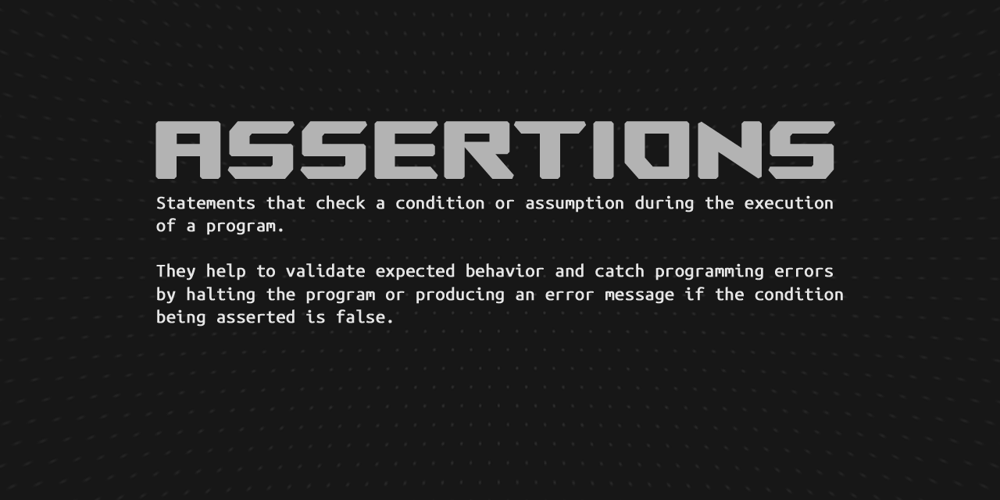

<div align="center">
  
[](https://github.com/mrrobinofficial/guide-unitysteamnetcodegameobjects/blob/HEAD/LICENSE.txt)


</div>

#

<table><tr><td>

## TODO LIST

* Rewrite [Soft vs hard references](#-soft-vs-hard-references) seciton.
* Rewrite [Unreal Motion Graphics (UMG)](#-unreal-motion-graphics-umg) section.
* Rewrite [Circular Dependency](#%EF%B8%8F-circular-dependency) section.
* Add emojis to most sections.
* Add image/banner cover to help visualize.
* Use more tables for better understanding.
* Add more video links.
* Add more content to [Tips and best practices](#-tips-and-best-practices) section.
* Add video link and image to visualize stack vs heap.
* 

</td></tr></table>

#

**Are you interested in creating games with Unreal Engine using C++?**

*In this repo, we'll guide you through the basics of getting started with Unreal Engine and C++. We'll cover the fundamentals of C++ programming, such as data types and pointers, and show you how to use these concepts in the context of game development with Unreal Engine. We'll also introduce you to the Unreal Engine module system, which is an important aspect of organizing your game code into smaller, more manageable pieces.*

## Table of contents

<table><tr><td>

* 0\. [👑 Cheatsheets](#-cheatsheets)
* 1\. [⌛ Getting started with C++](#-getting-started-with-c)
    * 1.1\. [🟢 Benefits of using C++ with Unreal Engine](#-benefits-of-using-c-with-unreal-engine)
    * 1.2\. [🔴 Drawbacks of using C++ with Unreal Engine](#-drawbacks-of-using-c-with-unreal-engine)
* 2\. [🗺️ Summary of C++ and Programming World](#%EF%B8%8F-summary-of-c-and-programming-world)
  * 2.1\. [Object-Oriented Programming](#object-oriented-programming)
  	* 2.1.1\. [Encapsulation](#encapsulation)
   	* 2.1.2\. [Data Hiding](#data-hiding)
   	* 2.1.3\. [Inheritance](#inheritance)
	* 2.1.4\. [Polymorphism](#polymorphism)
  * 2.2\. [Syntax and Structure](#syntax-and-structure)
    * 2.2.1\. [Weak vs Strong typing](#weak-vs-strong-typing)
    * 2.2.2\. [Semicolons in C++](#semicolons-in-c)
    * 2.2.3\. [Curly Braces in C++](#curly-braces-in-c)
    * 2.2.4\. [Comments in C++](#comments-in-c)
      * 2.2.4.1\. [Single-line comments](#single-line-comments)
      * 2.2.4.2\. [Multi-line comments](#multi-line-comments)
  * 2.3\. [Data types](#data-types)
    * 2.3.1\. [Char](#char)
    * 2.3.1\. [Booleans](#booleans)
    * 2.3.1\. [Integers](#integers)
    * 2.3.1\. [Floating points (floats and doubles)](#floating-points-floats-and-doubles)
  * 2.4\. [Modifiers](#modifiers)
  * 2.5\. [Typedefs](#typedefs)
  * 2.6\. [Members](#members)
    * 2.6.1\. [Variables](#variables)
    * 2.6.2\. [Assignments](#assignments)
    * 2.6.3\. [Functions](#functions)
  * 2.7\. [Classes](#classes)
  * 2.8\. [Accessibility](#accessibility)
  * 2.9\. [If-statements](#if-statements)
  * 2.10\. [Comparisons and Boolean Operators](#comparisons-and-boolean-operators)
    * 2.10.1\. [Conditional Expressions](#conditional-expressions)
  * 2.10\. [Switches](#switches)
  * 2.11\. [Loops](#loops)
    * 2.11.1\. [While Loop](#while-loop)
    * 2.11.2\. [Do-While Loop](#do-while-loop)
    * 2.11.3\. [For Loop](#for-loop)
    * 2.11.4\. [Foreach Loop](#foreach-loop)
  * 2.12\. [Polymorphism (In Depth)](#polymorphism-in-depth)
    * 2.12.1\. [Operator Overloading](#operator-overloading)
    * 2.12.2\. [Function Overloading](#function-overloading)
    * 2.12.3\. [Virtual functions](#virtual-functions)
  * 2.13\. [Generic Programming](#generic-programming)
  * 2.14\. [Lambda](#lambda)
  * 2.15\. [Stack vs Heap](#stack-vs-heap)
  * 2.16\. [Design Patterns And Principles](#design-patterns-and-principles)
  	* 2.16.1\. [Open-Closed Principle](#open-closed-principle)
   	* 2.16.2\. [KISS (Keep It Simple, Stupid)](#kiss-keep-it-simple-stupid)
    * 2.16.3\. [Singleton](#singleton)
    * 2.16.4\. [Observer](#observer)
    * 2.16.5\. [Factory](#factory)
    * 2.16.6\. [Strategy](#strategy)
    * 2.16.7\. [MVC (Model-View-Controller)](#mvc-model-view-controller)
* 3\. [🚧 Blueprint vs C++](#-blueprint-vs-c)
* 4\. [🪧 Unreal's Architecture](#-unreals-architecture)
* 5\. [Constructors and Destructors](#constructors-and-destructors)
* 6\. [✍️ Naming Convention](#%EF%B8%8F-naming-convention)
	* 6.1\. [Prefixes](#prefixes)
	* 6.2\. [Abbreviations, Acronyms and Synonyms](#abbreviations-acronyms-and-synonyms)
* 7\. [🧱 Data Types](#-data-types)
	* 7.1\. [Char](#char)
    * 7.2\. [Booleans](#booleans)
    * 7.3\. [Integers](#integers)
    * 7.4\. [Floating points (floats and doubles)](#floating-points-floats-and-doubles)
    * 7.5\. [Modifiers/Typedefs](#modifierstypedefs)
    * 7.6\. [Strings](#strings)
    * 7.7\. [Vector, Rotator, Quat and Transform](#vector-rotator-quat-and-transform)
    * 7.7\. [Collections](#collections)
      * 7.7.1\. [TArray](#tarray)
      * 7.7.2\. [TSet](#tset)
      * 7.7.3\. [TMap](#tmap)
      * 7.7.4\. [TMultiMap](#tmultimap)
    * 7.8\. [Value type vs Reference type](#value-type-vs-reference-type)
    * 7.9\. [Pointers](#pointers)
      * 7.9.1\. [Raw pointers](#raw-pointers)
      * 7.9.2\. [Smart pointers](#smart-pointers)
      * 7.9.3\. [TWeakObjectPtr](#tweakobjectptr)
      * 7.9.4\. [TWeakInterfacePtr](#tweakinterfaceptr)
      * 7.9.5\. [TSoftObjectPtr](#tsoftobjectptr)
      * 7.9.6\. [TSoftClassPtr](#tsoftclassptr)
      * 7.9.7\. [TSharedPtr](#tsharedptr)
      * 7.9.8\. [TWeakPtr](#tweakptr)
      * 7.9.9\. [UniquePtr](#uniqueptr)
  * 8\. [💾 Soft vs hard references](#-soft-vs-hard-references)
  * 9\. [🌍 Global Functions](#-global-functions)
  * 10\. [🏛️ Libraries](#%EF%B8%8F-libraries)
  * 11\. [📃 Macros](#-macros4)
  * 12\. [☑️ Assertions](#%EF%B8%8F-assertions)
  * 13\. [🔔 Delegates](#-delegates)
  * 14\. [🪪 Unreal Motion Graphics (UMG)](#-unreal-motion-graphics-umg)
  * 15\. [📚 Creating a module](#-creating-a-module)
      * 15.1\. [♻️ Circular Dependency](#%EF%B8%8F-circular-dependency)
  * 16\. [💡 Creating a plugin](#-creating-a-plugin)
  * 17\. [📝 preprocessor](#-preprocessor)
    * 17.1\. [Pragma once](#pragma-once)
    * 17.2\. [Editor code](#editor-code)
  * 18\. [Deep Dive](#deep-dive)
    * 18.1\. [🔖 Keywords](#-keywords)
    * 18.2\. [🛸 Reflection System](#direct-references)
    * 18.3\. [🪄 Tips and best practices](#-tips-and-best-practices)
      * 18.3.1\. [Ticking](#ticking)
      * 18.3.2\. [Direct references](#ticking)
      * 18.3.3\. [Math Expression Node](#math-expression-node)
      * 18.3.4\. [Call In Editor and `CallInEditor`](#call-in-editor-and-callineditor)
  * 19\. [👁️‍🗨️ Console Commands](#%EF%B8%8F%EF%B8%8F-console-commandss)
  * 20\. [📌 Shortcuts](#-shortcuts)
  * 21\. [⚠️ Common Problems/Issues](#%EF%B8%8F-common-problemsissues)
    * 21.1\. [Compiler Error C2628](#compiler-error-c2628)
    * 22.2\. [Compiler Error C2065](#compiler-error-c2065)
  * 22\. [🔗 Helpful links](#-helpful-links)
  * 23\. [🆘 Support](#-support)
  * 24\. [📍 Footnotes](#-footnotes)

</td></tr></table>

## 👑 Cheatsheets

<details open>
  <summary>Click to expand</summary>

[jbtronics - CheatSheet Poster](https://github.com/jbtronics/UE4-CheatSheet/blob/master/CheatSheet_Poster.pdf)

[Winslow - Unreal Engine 5 Blueprint CheatSheet Dark Theme](https://uecasts.com/resources/unreal-engine-5-blueprint-cheat-sheet-dark-theme?utm_source=epicgames&utm_campaign=cheat_sheet_ue5&utm_content=blueprint_dark)

[Winslow - Unreal Engine 5 C++ CheatSheet Dark Theme](https://uecasts.com/resources/unreal-engine-5-c-plus-plus-cheat-sheet-dark-theme?utm_source=epicgames&utm_campaign=cheat_sheet_ue5&utm_content=c_plus_plus_dark)

[Winslow - Unreal Engine 5 Editor CheatSheet Dark Theme](https://uecasts.com/resources/unreal-engine-5-editor-hotkeys-cheat-sheet-dark-theme?utm_source=epicgames&utm_campaign=cheat_sheet_ue5&utm_content=hotkeys_dark)

[VictoriaLyons - ProfilingCheatSheet](https://www.reddit.com/r/unrealengine/comments/gqi2xu/quick_performance_cheat_sheet/)

</details>

## ⌛ Getting started with C++

Highly recommend taking a short class of native C++. Here is a video link to ~1h long [video tutorial from Mosh](https://www.youtube.com/watch?v=ZzaPdXTrSb8).

Using C++ with Unreal Engine allows developers to take advantage of the engine's full feature set, including advanced graphics rendering, physics simulations, networking, and AI.

C++ is a statically typed, compiled, general-purpose, case-sensitive, free-form programming language that supports procedural, object-oriented, and generic programming.

C++ is regarded as a **middle-level language**, as it comprises a combination of both **high-level** and **low-level** language features.

C++ was developed by [Bjarne Stroustrup](https://en.wikipedia.org/wiki/Bjarne_Stroustrup) starting in 1979 at Bell Labs in Murray Hill, New Jersey, as an enhancement to the C language and originally named C with Classes but later it was renamed C++ in 1983.

C++ also offers a level of control and customization that is not available through visual scripting alone. Developing with C++ in Unreal Engine also allows for better debugging and profiling, as well as the ability to optimize performance through techniques such as multithreading and memory management.

Additionally, C++ code can be integrated with third-party libraries, providing even greater flexibility and functionality.

**To use C++ effectively with Unreal Engine**, it's important to have a strong foundation in programming principles and an understanding of Unreal Engine's architecture and conventions. It's also important to take advantage of the resources available, such as the Unreal Engine documentation and community forums, as well as to collaborate with other developers to share knowledge and best practices.

### 🟢 Benefits of using C++ with Unreal Engine

* High performance - C++ allows you to write code that can run directly on the CPU and GPU, making it possible to achieve very high performance levels in your game or application.
* Access to low-level functionality - C++ gives you access to lower-level functionality than other programming languages, which can be especially useful in game development where fine-grained control over memory, data structures, and algorithms is often necessary.
* Integration with existing codebases - If you have existing C++ code that you want to integrate with your Unreal Engine project, using C++ allows you to do so more easily.
* More control over memory management - C++ requires you to manage memory manually, which can be a challenge but also gives you more control over how your code uses memory. This can be important in situations where memory usage is a concern, such as on mobile devices or consoles.
* Flexibility - With C++, you have the flexibility to write code in a variety of styles, including object-oriented, procedural, and functional programming. This allows you to choose the approach that best suits your needs.

### 🔴 Drawbacks of using C++ with Unreal Engine

* Steep learning curve - C++ is a complex language with many features, and it can be difficult to learn for beginners. Unreal Engine's architecture can also be challenging to understand, especially if you're new to game development.
* Time-consuming - Writing C++ code can be more time-consuming than using other programming languages. C++ requires more attention to detail, and it can take longer to write and debug code.
* More prone to errors - C++ requires manual memory management and has less strict type checking than some other languages. This can make it more prone to errors like memory leaks, null pointer dereferences, and type mismatches.
* Harder to prototype - Because C++ requires more code to accomplish even simple tasks, it can be harder to quickly prototype ideas in C++ than in other programming languages.

## 🗺️ Summary of C++ and Programming World

<details open>
  <summary>Click to expand</summary>

### Object-Oriented Programming

<details>
  <summary>Click to expand</summary>

Object-Oriented Programming (**OOP**) is a programming paradigm that organizes code around objects, which are instances of classes. It focuses on the concept of objects, their properties (attributes), and behaviors (methods), allowing for modular, reusable, and structured code design.

#### Encapsulation

Encapsulation is the practice of bundling data and the methods that operate on that data within a single unit, which is typically a class. It promotes data hiding and information hiding, ensuring that the internal state and implementation details of an object are not directly accessible from outside the object. Encapsulation helps achieve data integrity, security, and abstraction by controlling access through well-defined interfaces.

#### Data Hiding

Data hiding is a principle closely related to encapsulation. It involves concealing the internal implementation details of an object and exposing only the necessary information through well-defined interfaces. By hiding implementation details, the object's data is protected and can only be accessed or modified through controlled methods. This enhances data security, code maintainability, and reduces the risk of unintended modifications or access to critical data.

#### Inheritance


Inheritance is a mechanism in OOP that allows new classes (derived classes or subclasses) to inherit properties and behaviors from existing classes (base classes or superclasses). Inheritance promotes code reuse, as derived classes can inherit and extend the functionality of their base classes. The derived classes can add new attributes and behaviors or override existing ones to customize the behavior of inherited members. Inheritance facilitates code organization, modularity, and the creation of hierarchical relationships between classes.

#### Polymorphism


Polymorphism is a fundamental concept in object-oriented programming (OOP) that allows objects of different classes to be treated as objects of a common base class. It enables you to write code that can work with objects of multiple types in a uniform manner.

Polymorphism is often illustrated through inheritance, where you have a base class and multiple derived classes that inherit from it. The derived classes can override or extend the behavior of the base class's methods, while still adhering to the common interface.

</details>

### Syntax and Structure

Syntax refers to the set of rules that define the structure, format, and grammar of a programming language. It dictates how statements and expressions should be written to form valid code.

C++ follows a structured syntax that includes elements such as keywords[^1], identifiers, operators, punctuation, and control structures. The syntax is designed to provide precise instructions to the compiler on how to interpret and execute the code.

#### Weak vs Strong typing

Weak and strong typing refer to different approaches in how programming languages handle data types and type safety.

In C++, the language is considered strongly typed, as it requires explicit type conversions and does not perform implicit type coercion without the programmer's explicit instruction. C++ enforces strong typing to ensure type safety and minimize potential errors.

Weak Typing (Python code):

```python3
a = 5 # Correct! Because Python is a weak typing language.
```

Strong Typing (C++ code):

```cpp
a = 5; // Error!

int a = 5; // Correct!
```

#### Semicolons in C++

In C++, a semicolon (<kbd>;</kbd>) is used to mark the end of a statement. It serves as a delimiter, indicating to the compiler that one statement has finished and another begins. The presence of semicolons allows the compiler to separate statements and interpret code correctly.

The requirement for semicolons in C++ is a design choice that provides explicit statement termination. This approach allows for more fine-grained control over program execution and eliminates ambiguity.

In contrast, languages like Python use indentation to define blocks of code, eliminating the need for explicit statement termination with semicolons.

#### Curly Braces in C++

C++ uses curly braces (<kbd>{}</kbd>) as block delimiters to enclose multiple statements or define the body of control structures, functions, and classes. The use of curly braces provides a clear and explicit way to define the boundaries of code blocks.

Curly braces help define the scope of variables and maintain code readability. They ensure that statements within the braces are treated as a single unit, making it easier to understand the flow and logic of the program.

#### Comments in C++

Both single-line and multi-line comments are helpful for adding explanatory notes, documenting code, or temporarily disabling sections of code during debugging or development. They enhance code readability, facilitate collaboration, and provide valuable information to developers maintaining the codebase.

##### Single-line comments

Single-line comments start with two forward slashes `//` and continue until the end of the line.

They are typically used for brief comments or explanations on a single line.

```cpp
// This is a single-line comment in C++
```

##### Multi-line comments

Multi-line comments, also known as block comments, start with a forward slash followed by an asterisk (`*`) `/` and end with an asterisk followed by a forward slash `/`.

Multi-line comments can span multiple lines and are used for more extensive comments or documentation.

```cpp
/*
This is a multi-line comment
It can span multiple lines
*/
```

### Data types

<table><tr><td>

## Native Types

* ```bool``` - Represents a logical value, either `true` or `false`
* ```char``` - Represents a single character in the ASCII[^3] character set
* ```int``` - Represents a integer (whole number)
* ```float``` - Represents a floating-point number, which is a real number with a fractional component
* ```double``` - Represents a double-precision floating-point number, which has twice the precision of a float

</td></tr></table>

#### Char

```cpp
// Declaring and initializing a char variable
char myChar = 'a';
```

#### Booleans

```cpp
bool isDead = true; 

if (isDead)
{
  // Do some logic
}
```

#### Integers

```cpp
int health = 10;

if (health <= 0)
{
  isDead = true;
  return;
}
```

#### Floating points (floats and doubles)

```cpp
float speedInMetersPerSecond = 5.5f; // C++ always uses 'f' or 'F' literal for defining a float variable.

float speedInKph = speedInMetersPerSecond * 3.6f;
```

```cpp
double speedInMetersPerSecond = 5.5; // C++ never uses a literal for defining a double variable.

double speedInKph = speedInMetersPerSecond * 3.6;
```

### Modifiers

In C++, a modifier is used to alter the meaning of the base type so that it more precisely fits the needs of various situations. The most common modifiers in C++ are `signed`, `unsigned`, `long` and `short`, which are used to modify the size of integer types.

The default behavior for all integer types is `signed`.

```cpp
//~ Unsigned base types

unsigned char; // 8-bit unsigned integer
unsigned short int; // 16-bit unsigned integer
unsigned int; // 32-bit unsigned integer
unsigned long long; // 64-bit unsigned integer

//~ Signed base types.

signed char; // 8-bit signed integer
signed short int; // 16-bit signed integer
signed int; // 32-bit signed integer
signed long long; // 64-bit signed integer
```

### Typedefs

In C++, the `typedef` keyword[^1] is used to create an alias or alternative name for existing data types. It provides a way to define a new name that can be used as a shorthand for the original type, improving code readability and maintainability.

Here's an example:

```cpp
typedef int myInt; // Declare our alias for custom type

myInt x = 5;  // Equivalent to: int x = 5;
```

Typedefs can be particularly useful in the following scenarios:

<table><tr><td>

* Enhancing Code Readability: By creating typedefs with meaningful names, you can make the code more self-explanatory and easier to understand, especially when dealing with complex or lengthy type names.

* Abstraction and Portability: Typedefs provide a level of abstraction that allows you to switch the underlying type without affecting the rest of the code. If you need to change the type used, you only need to update the typedef rather than modifying every occurrence of the original type.

* Simplifying Complex Declarations: Typedefs can simplify complex declarations involving function pointers, function signatures, or template specializations by providing more concise and descriptive names.

</td></tr></table>

> **Warning**
> Unreal Engine doesn't support typedefs with UHT[^2]. Meaning, you can't expose to Blueprint.

### Members

Members are variables or functions that are part of a class or object. They define the properties and behaviors of the class.

There are two main types of members: `variables` and `functions`.

#### Variables

Members that store data. They can be of different types such as numbers, strings, booleans, or custom data types. Variables hold values that can be accessed and manipulated within the class or object.

##### Assignments

There are abbreviations for frequently done kinds of assignments. Here are a few:

| Abbreviation  | Meaning | Note |
| ------------- | ------------- | ------------- |
| `n += k`  | `n = n + k`  | |
| `n -= k`  | `n = n - k`  | |
| `++n`  | `n = n + 1`  | Where the value of expression `++n` is the value of `n` after the assignment |
| `n++`  | `n = n + 1`  | But the value of expression `n++` is the value of `n` before the assignment |
| `--n`  | `n = n - 1`  | Where the value of expression `--n` is the value of `n` after the assignment |
| `n--`  | `n = n - 1`  | But the value of expression `n--` is the value of `n` before the assignment |

#### Functions

Functions are blocks of code that perform a specific task or set of tasks. They encapsulate a series of instructions and can be called and executed from various parts of a program. Functions can accept input parameters (arguments) and can also return a value as a result.

Functions can be defined outside of classes as standalone functions or can be defined within classes as member functions. Standalone functions are typically used for common tasks that are not specific to any particular class or object.

### Classes

Classes are the building blocks of object-oriented programming (OOP). They are a blueprint for creating objects, which are instances of a class. A class defines the structure and behavior of objects by specifying the members it contains.

A class can have variables (members) to store data and functions (methods) to perform actions. The variables defined within a class are often referred to as attributes, while the functions are referred to as methods.

Objects created from a class can access and modify the class's members. They provide a way to create multiple instances that share the same structure and behavior defined by the class. Objects can be thought of as individual entities that represent real-world objects or abstract concepts.

Classes allow for code reusability, encapsulation (hiding internal details), and the ability to model complex systems by organizing related data and behavior together.

### Accessibility

| Keyword	    | Access ability | Description                                                                                          |
| ----------- | -------------- | ---------------------------------------------------------------------------------------------------- |
| `public`    | All	           | Members and functions are accessible from anywhere, including outside the class.                     |
| `protected` |	Subclasses     | Members and functions are accessible from within the class and any subclasses, but not from outside. |
| `private`   |	Class	         | Members and functions are only accessible from within the class itself.                              |
| `mutable`   |	Class	         | Specifies that a member variable can be modified even if the owning object is const.                 |
| `friend`    | Class          | Allows a non-member function or class to access the private and protected members of a class.        |

### If-statements

If-statement is a fundamental control structure that allows you to conditionally execute a block of code based on a specified condition.
It provides a way to control the flow of execution in your program.

```cpp
if (condition)
{
    // Code to be executed if the condition is true
}
else if (secondCondition)
{
    // Code to be executed if the secondCondition is true, but condition was false
}
else
{
    // Code to be executed if the condition and secondCondition is both false
}
```

### Comparisons and Boolean Operators

Here are some operations for creating conditions:

* `==` 	- Equality check
* `!=` 	- Inequality check
* `>` 	- Check for greater
* `<` 	- Check for less
* `>=`	- Check for greater or equal
* `<=`	- Check for less or equal
* `&&` 	- Expression A && B is evaluated by first evaluating A. A has value 0, then A && B also has value 0, and B is not evaluated. Otherwise, B is evaluated; if B has value 0, then A && B has the same value 0, and otherwise has value 1. Also called `AND` operator.
* `||`	- Expression A || B is evaluated by first evaluating A. If A has a nonzero value, then A || B has value 1, and B is not evaluated. Otherwise, A || B has value 1 if B is nonzero and value 0 if B is zero. Also called `OR` operator.
* `!` 	- Expression !A is 0 if A is nonzero, and is 1 if A is 0. Also called `NOT` operator.

#### Conditional Expressions

Conditional expressions in C++ are statements that evaluate a condition and return a value based on the result of the condition. They provide a concise way to express simple conditions and perform different actions or assignments based on the outcome.

The basic syntax of a conditional expression in C++ is as follows:

```cpp
(condition) ? value_if_true : value_if_false;
```

* 1\. The condition within the parentheses is evaluated.

* 2\. If the condition is true, the value or expression before the colon (<kbd>:</kbd>) is returned as the result of the conditional expression.

* 3\. If the condition is false, the value or expression after the colon is returned as the result.

### Switches

In C++, a switch statement is a control flow construct used to select one of many possible execution paths based on the value of a given expression. It provides an alternative to using multiple if-else statements when checking a variable against different values.

The basic syntax of a switch statement in C++ is as follows:

```cpp
switch (expression)
{
    case value1:
        // Code to be executed if expression matches value1
        break;
    case value2:
        // Code to be executed if expression matches value2
        break;
    // Add more case statements as needed
    default:
        // Code to be executed if none of the cases match
        break;
}
```

* 1\. The expression is evaluated, and its value is compared against the cases specified in the switch statement.

* 2\. If a case matches the value of the expression, the code block associated with that case is executed. The execution then continues until a break statement is encountered, which exits the switch statement.

* 3\. If none of the cases match the expression's value, the code block associated with the default case (optional) is executed. The default case serves as a fallback option when no matching cases are found.

### Loops

Loops are essential constructs in programming languages that allow repetitive execution of a block of code based on a specified condition. They provide a way to automate tasks, process collections of data, and iterate over a sequence of elements.

#### While Loop

While loop are used when the number of iterations is uncertain but depends on a condition. The loop continues as long as the specified condition remains true. It evaluates the condition before each iteration, and if it becomes false, the loop terminates.

Here is an example:

```cpp
// Example: Find the first power of 2 greater than 100

int num = 1;

while (num <= 100)
{
    num *= 2;
}

std::cout << "First power of 2 greater than 100: " << num << std::endl;

// Output: First power of 2 greater than 100: 128
```

#### Do-While Loop

A do-while loop is a control flow structure in programming that executes a block of code at least once, and then repeats the execution as long as a specified condition remains true. It is similar to the while loop, but with the condition checked at the end of each iteration.

```cpp
// Example: Print numbers from 1 to 5 using a do-while loop

int i = 1;

do
{
    std::cout << i << " ";
    i++;
} while (i <= 5);

// Output: 1 2 3 4 5
```

#### For Loop

For loop are used when you know the number of iterations in advance. They consist of an initialization, a condition for continuation, and an iteration statement. The loop iterates over a range of values or a collection, incrementing or decrementing a counter variable with each iteration.

Here is an example:

```cpp
// Example: Print numbers from 1 to 5

for (int i = 1; i <= 5; i++)
{
    std::cout << i << " ";
}

// Output: 1 2 3 4 5
```

#### Foreach Loop

Foreach loop are designed to iterate over collections or sequences of elements. They automatically handle the iteration logic, allowing you to process each element without managing an explicit index or counter. The loop iterates over each element in the collection until all elements have been processed.

```cpp
// Example: Print each character of a string

std::string message = "Hello";

for (char c : message)
{
    std::cout << c << " ";
}

// Output: H e l l o
```

### Polymorphism (In Depth)

The power of polymorphism lies in the ability to use a base class pointer or reference to refer to objects of derived classes. This allows you to write code that operates on the base class, without needing to know the specific derived class. During runtime, the appropriate version of the overridden method in the derived class will be invoked, based on the actual type of the object being referred to.

Here's a simplified example in C++ to illustrate polymorphism:

```cpp
class Animal
{
public:
    virtual void makeSound()
    {
        // Common implementation for all animals
        std::cout << "The animal makes a sound." << std::endl;
    }
};

class Dog : public Animal
{
public:
    void makeSound() override
    {
        std::cout << "The dog barks." << std::endl;
    }
};

class Cat : public Animal
{
public:
    void makeSound() override
    {
        std::cout << "The cat meows." << std::endl;
    }
};

int main()
{
    Animal* animal1 = new Dog();
    Animal* animal2 = new Cat();

    animal1->makeSound(); // Output: "The dog barks."
    animal2->makeSound(); // Output: "The cat meows."

    delete animal1;
    delete animal2;

    return 0;
}
```

In the example, we have an Animal base class and two derived classes, Dog and Cat. Each derived class overrides the makeSound() method with its own implementation.

In the `main()` function, we create pointers of the base class type (`Animal*`) and assign them to objects of derived classes (`Dog` and `Cat`). When calling the `makeSound()` method through these base class pointers, the appropriate derived class's implementation is invoked, demonstrating polymorphism.

Polymorphism allows you to write more flexible and reusable code by treating objects based on their common behavior, rather than their specific type. It promotes code extensibility and enhances the ability to work with a variety of objects in a unified way.

##### Operator Overloading

In C++, operators are symbols or keywords[^1] used to perform various operations on data, such as arithmetic operations, logical operations, assignment, comparison, and more. They enable concise and expressive manipulation of variables and values.

Operator Overloading is a feature in C++ that allows you to redefine the behavior of an operator for user-defined types. It enables you to provide a specific implementation for an operator based on the operands' types, allowing custom operations to be performed.

Here's an example of overloading the greater-than-or-equal-to `>=` operator in C++:

```cpp
class MyClass
{
public:
    int value;

    MyClass(int val) : value(val) {}

    bool operator>=(const MyClass& other) const
	{
        return value >= other.value;
    }
};

int main()
{
    MyClass obj1(5);
    MyClass obj2(3);

    if (obj1 >= obj2)
    {
        std::cout << "obj1 is greater than or equal to obj2" << std::endl;
    }
    else
    {
        std::cout << "obj1 is not greater than or equal to obj2" << std::endl;
    }

    return 0;
}
```

In this example, the `>=` operator is overloaded for the user-defined class `MyClass`. The `operator>=` function is defined as a member function of `MyClass`. It compares the value member of the current object (`this`) with the `value` member of the `other` object.

By overloading operators, you can define custom behavior for how objects of a class interact with the corresponding operator. This provides flexibility and allows you to use familiar syntax and semantics for user-defined types, making the code more intuitive and expressive.

Operator overloading is not limited to comparison operators; you can also overload arithmetic operators `+`, `-`, `*` and `/` assignment operators `=`, logical operators `&&`, `||`, and more. Overloading operators helps create more natural and concise code, improves code readability, and enhances the usability of user-defined types.

##### Function Overloading

Function overloading is a feature in C++ that allows you to define multiple functions with the same name but different parameters.

It enables you to create functions that perform similar operations but on **different data types** or with **different parameter sets**.

```cpp
void TakeDamage(int DamageAmount)
{
	// Logic...
}

void TakeDamage(float DamageAmount)
{
	// Logic...
}

void TakeDamage(double DamageAmount)
{
	// Logic...
}
```

When you call an overloaded function, the compiler determines the appropriate function to invoke based on the arguments passed.

```cpp
TakeDamage(10); // Calling function with integer parameter
TakeDamage(11.1f); // Calling function with float parameter
TakeDamage(12.25052651); // Calling function with double parameter
```

With function overloading, it provides several benefits, including:

<table><tr><td>

* Code Reusability: Overloading allows you to reuse a function name and provide multiple implementations for different scenarios, reducing code duplication.

* Readability and Intuitive API: By using the same function name for similar operations, code becomes more readable and intuitive to understand.

* Compile-Time Dispatch: The appropriate overloaded function is determined at compile-time based on the arguments, resulting in efficient and optimized code execution.

</td></tr></table>

> **Warning**
> Unreal Engine doesn't support function overloading with UHT[^2]. Meaning, you can't expose to Blueprint.

##### Virtual functions

In object-oriented programming (OOP), a virtual function is a function declared in a base class that can be overridden in derived classes. It allows you to provide a common interface in the base class while allowing different implementations in the derived classes.

When a function is declared as `virtual` in the base class, it indicates that the function can be overridden by derived classes. This means that the derived class can provide its own implementation of the function, tailored to its specific needs.

Here's an example in C++ to illustrate the concept of virtual functions:

```cpp
class Shape
{
public:
    virtual void draw()
    {
        // Common implementation for all shapes
        std::cout << "Drawing a shape." << std::endl;
    }
};

class Circle : public Shape
{
public:
    void draw() override
    {
        std::cout << "Drawing a circle." << std::endl;
    }
};

class Rectangle : public Shape
{
public:
    void draw() override
    {
        std::cout << "Drawing a rectangle." << std::endl;
    }
};

int main()
{
    Shape* shape1 = new Circle();
    Shape* shape2 = new Rectangle();

    shape1->draw(); // Output: "Drawing a circle."
    shape2->draw(); // Output: "Drawing a rectangle."

    delete shape1;
    delete shape2;

    return 0;
}
```

In this example, we have a `Shape` base class and two derived classes, `Circle` and `Rectangle`. The `Shape` class has a virtual function called `draw()`. Both derived classes override this function and provide their own implementations.

In the `main()` function, we create pointers of the base class type (`Shape*`) and assign them to objects of the derived classes (`Circle` and `Rectangle`). When calling the `draw()` function through these base class pointers, the appropriate derived class's implementation is invoked, thanks to the virtual function mechanism.

The key aspect of the virtual function is that the appropriate implementation to be executed is determined at runtime, based on the actual type of the object being referred to. This is called dynamic dispatch or late binding.

Virtual functions are useful when you want to define a common interface in a base class but allow derived classes to provide their own implementations based on their specific behaviors. It enables polymorphism, allowing objects of different derived classes to be treated uniformly through a base class pointer or reference.

Using virtual functions, you can write code that works with objects based on their common interface, without needing to know their specific types. This promotes code extensibility and flexibility, as new derived classes can be added without modifying the existing code that uses the base class interface.

| Keyword used | Matching virtual function in base class | Result                   |
|--------------|-----------------------------------------|--------------------------|
| Neither      | No                                      | New non-virtual function |
| Neither      | Yes                                     | Override                 |
| `virtual`      | No                                      | New virtual function     |
| `virtual`      | Yes                                     | Override                 |
| `override`     | No                                      | Compile error            |
| `override`     | Yes                                     | Override                 |
| Both         | No                                      | Compile error            |
| Both         | Yes                                     | Override                 |

### Generic Programming

Generic Programming is a programming paradigm that focuses on writing reusable code by abstracting away specific types and working with generic types that can be instantiated with various concrete types. It allows programmers to create functions, classes, and algorithms that can operate on different data types without requiring code duplication.

In C++, the `template` keyword[^1] is used to implement generic programming through templates. Templates allow you to define functions or classes that can be instantiated with different types. They provide a powerful mechanism for code reuse and flexibility.

Here is a video about [templates in C++ by Cazz](https://www.youtube.com/watch?v=p3OQDb4nWfg)

Here is an example:

```cpp
template <typename T>
T add(T a, T b)
{
    return a + b;
}

int main()
{
    int result1 = add(5, 10);        // Instantiated as add<int>(5, 10)
    double result2 = add(3.5, 2.7);  // Instantiated as add<double>(3.5, 2.7)
    // ...
    return 0;
}
```

### Lambda

In C++, a lambda expression, often referred to as a lambda function or lambda, is an anonymous function that you can define inline. It provides a convenient way to create small, inline functions without the need for explicitly declaring a separate function.

Here is a video by [The Cherno about Lambdas in C++](https://www.youtube.com/watch?v=mWgmBBz0y8c).

The basic syntax of a lambda expression in C++ is as follows:

```cpp
[capture_list](parameters) -> return_type
{
    // Function body
    // Statements
    // Return statement
};
```

Here's how a lambda expression works:

* 1\. Capture List: The capture list, denoted by [ ], specifies variables from the enclosing scope that the lambda function can access. It can capture variables by value ([=]) or by reference ([&]). You can also specify individual variables to capture explicitly.

* 2\. Parameters: The parameters represent the input arguments to the lambda function, similar to regular function parameters.

* 3\. Return Type: The return type, denoted by ->, specifies the type of the value returned by the lambda function. If the return type is omitted, it is deduced by the compiler.

* 4\. Function Body: The function body contains the statements and logic of the lambda function. It can include any valid C++ code, such as variable declarations, control flow statements, and computations.

### Stack vs Heap

In programming languages, stack and heap are two different areas of memory used for [memory allocation](https://en.wikipedia.org/wiki/Memory_management). They serve distinct purposes and have different characteristics.

In C++, you have the flexibility to choose between stack and heap memory allocation based on your program's requirements. Stack memory is typically used for most local variables and function calls, providing automatic memory management and efficient access. On the other hand, heap memory is used when dynamic memory allocation is needed, allowing you to control the lifetime of objects and manage more extensive data structures.

C++ provides features like dynamic memory allocation with `new` and `delete` operators, allowing you to allocate memory on the heap explicitly. However, it is important to manage heap memory carefully to avoid memory leaks and unnecessary memory consumption.

#### Stack Memory Allocation

* Stack memory is a region of memory used for automatic memory allocation.
* It is managed by the compiler and follows a "last-in, first-out" (LIFO) data structure.
* Stack memory is typically used for storing local variables, function call frames, and other short-lived data.
* Memory allocation and deallocation in the stack are handled implicitly by the compiler.
* Stack memory is fast and efficient but limited in size.
* Variables allocated on the stack have automatic storage duration and are deallocated automatically when they go out of scope.

#### Heap Memory Allocation

* Heap memory is a region of memory used for dynamic memory allocation.
* It allows for manual control over memory allocation and deallocation.
* Memory on the heap can be allocated and deallocated at runtime using functions like `new` and `delete` in C++.
* Heap memory is typically used for storing objects with longer lifetimes or for data structures that need dynamic resizing.
* Memory allocated on the heap needs to be explicitly deallocated to avoid memory leaks.
* Heap memory is slower than stack memory due to dynamic allocation and deallocation operations.
* The size of heap memory is typically much larger than the stack, but its allocation and deallocation require manual management.

### Design Patterns And Principles

`SOLID` or Single responsibility principle, Open-closed principle, Liskov substitution principle, Interface segregation principle, and Dependency inversion principle. SOLID is a mnemonic acronym for five design principles designed to make software designs more flexible, understandable, and maintainable.

Design patterns are reusable solutions to common programming problems that have been proven effective over time. They provide guidelines and templates for structuring code, promoting best practices, and improving software design. Here are a few notable design patterns:

#### Open-Closed Principle

The [Open-Closed Principle (OCP)](https://en.wikipedia.org/wiki/Open%E2%80%93closed_principle) is a fundamental principle in object-oriented programming that states that software entities (classes, modules, functions, etc.) should be open for extension but closed for modification. It encourages the design of code that can be easily extended with new functionality without needing to modify the existing codebase.

#### KISS (Keep It Simple, Stupid)

The [KISS principle](https://en.wikipedia.org/wiki/KISS_principle) emphasizes simplicity and avoiding unnecessary complexity in software design. It encourages keeping code, algorithms, and systems as simple as possible to enhance readability, maintainability, and reduce the likelihood of errors.

#### Singleton

The [Singleton pattern](https://en.wikipedia.org/wiki/Singleton_pattern) ensures that only one instance of a class is created and provides a global point of access to that instance. It is useful in scenarios where you need to control access to a shared resource or want to limit the instantiation of a class to a single object.

#### Observer

The [Observer](https://en.wikipedia.org/wiki/Observer_pattern) pattern establishes a one-to-many dependency between objects. It allows multiple observer objects (listeners) to be notified and updated automatically when the observed object (subject) undergoes a change in state. This pattern is widely used in event-driven systems or scenarios requiring loose coupling between objects.

#### Factory

The [Factory pattern](https://en.wikipedia.org/wiki/Factory_(object-oriented_programming)) provides an interface for creating objects without exposing the creation logic to the client. It centralizes object creation, allowing clients to use the factory interface to create objects based on specific criteria or conditions. This pattern promotes flexibility, decoupling, and abstraction in object creation.

#### Strategy

The [Strategy pattern](https://en.wikipedia.org/wiki/Strategy_pattern) defines a family of algorithms and encapsulates each algorithm as a separate class. It allows clients to dynamically choose and switch between different algorithms at runtime. This pattern enables code reuse, promotes separation of concerns, and facilitates the "Open-Closed Principle" by allowing new algorithms to be added without modifying existing code.

#### MVC (Model-View-Controller)

[MVC is an architectural design pattern](https://en.wikipedia.org/wiki/Model%E2%80%93view%E2%80%93controller) commonly used in user interface development. It separates an application into three interconnected components: the Model (data and business logic), the View (presentation and user interface), and the Controller (handles user input and updates the model). MVC promotes code organization, maintainability, and modularity.

</details>

## 🚧 Blueprint vs C++

Watch this video by Alex Forsythe, in which he talks about when to use C++ and when to use Blueprint in Unreal development.

[](https://youtu.be/VMZftEVDuCE)

### Summary

|             | Pros of Blueprint                          | Cons of Blueprint                              | Pros of C++                                   | Cons of C++                                       |
|-------------|--------------------------------------------|------------------------------------------------|-----------------------------------------------|--------------------------------------------------|
| Ease of Use | Visual scripting with a node-based interface | Limited control over low-level optimizations   | Greater control over memory management         | Steeper learning curve                           |
| Rapid       | Quick iteration and prototyping             | Performance may be slower compared to C++      | Efficient execution and runtime performance    | More verbose syntax and code complexity          |
| Development | No compilation required                     | Limited support for complex algorithms         | Extensive standard library and third-party libraries for various functionalities     | Error-prone manual Potential for crashes and undefined behavior memory management             |
| Flexibility | Easy to modify and maintain                 | Limited access to low-level engine features     | Full access to Unreal Engine internals         | Requires understanding of engine architecture   |
| Collaboration| Visual representation of logic             | More challenging for team collaboration        | Easier integration with external libraries     | Collaboration may require code comprehension    |

> **Tip**
> Choose C++ when you anticipate the need for interaction with other C++ code or require extensive control over low-level optimizations and memory management. C++ is well-suited for classes that require direct access to engine internals and efficient execution.

> **Tip**
> Use Blueprint as an inherited class when you want to benefit from the visual scripting capabilities and quick prototyping offered by Blueprint, while still having the option to incorporate C++ code in the future. This allows for a flexible approach where you can leverage the power of Blueprint while having the ability to extend functionality with C++ when needed.

## 🪧 Unreal's Architecture


```UObject``` is a base class for objects in the engine that require some common functionality such as garbage collection, serialization, reflection, and more. ```UObject``` also provides some additional functionality such as networking support, dynamic class creation, and object-oriented programming features like inheritance and polymorphism.

Some of the notorious classes, that inherit from ```UObject``` include:

<details>
  <summary>Click to expand</summary>

* ```AActor```
  * A base class for the every object placed in the world. It's an ```UObject``` that usually contains other ```UObject```s specialized to be part of an actor - this what we call components.
  * This class contains a basic functionality to operate on the "object placed in the world".
  * ```AActor``` itself doesn't have a transform (i.e. position in the world), it depends on the transform of the root component.
  * *Functions*:
    * ```BeginPlay()``` - Called when the level starts ticking, only during actual gameplay.
    * ```Tick(float DeltaSeconds)``` - Update function, called every frame on Actor.
    * ```EndPlay(const EEndPlayReason::Type EndPlayReason)``` - Whenever actor is being removed from a level
    * ```SetLifeSpan(float InLifespan)``` - Set the lifespan of actor.
    * ```Destroy(bool bNetForce, bool bShouldModifyLevel)``` - Destroy actor.
 
* ```APawn```
  * Represents a pawn in the game world. A pawn is an entity that can be controlled by the player or by AI, and can move and interact with the game world.
  * ```APawn``` provides basic movement and input handling functionality, as well as collision detection and physics simulation.

* ```AHUD```
  * Represents the heads-up display (HUD) in the game. The HUD displays important information to the player, such as health and ammunition levels, as well as providing visual feedback for game events such as damage or power-up pickups.
  * ```AHUD``` can be customized to display different types of information and to use different visual styles.

* ```ACharacter```
  * Represents a playable character in the game world. ```ACharacter``` is a subclass of ```APawn``` and provides additional functionality specific to player-controlled characters, such as animation and movement controls, camera handling, and input management.
  * ```ACharacter``` can be used as a base class for player characters, enemies, and other types of characters in the game.

* ```AController```
  * Represents a controller in the game, which can be used to control a ```APawn``` or ```ACharacter```.
  * ```AController``` provides input handling and navigation functionality, allowing players or AI to move and interact with the game world. ```AController``` can be used to implement different types of control schemes, such as first-person or third-person controls, and can be customized to support different input devices and control configurations.

* ```UActorComponent```
  * A base class for every object placed inside AActor.
  * Used for components contains only the logic, i.e. ```UMovementComponent``` or ```SceneComponent```.
  * ```UActorComponent``` doesn't appear in the world.
  * *Functions*:
    * ```BeginPlay()``` - Begins Play for component.
    * ```TickComponent(float DeltaTime, enum ELevelTick TickType, FActorComponentTickFunction * ThisTickFunction)``` - Function called every frame on ActorComponent.
    * ```EndPlay(const EEndPlayReason::Type EndPlayReason)``` - Ends gameplay for component.
 
* ```UMovementComponent```
  * Provides movement functionality to an actor in the game world. ```UMovementComponent``` can be used to implement a variety of movement types, such as flying, walking, swimming, or sliding.
  * ```UMovementComponent``` handles physics simulation and collision detection for the actor, and can be customized to provide different movement behaviors.

* ```USceneComponent```
  * A base class for every component which actually appears in the world, it has a transform evaluated every frame.
  * It's used by components that need to know its place in the world to run the logic, i.e. ```UAudioComponnent```, ```UCameraComponent```.
  * Component of this class isn't rendered or doesn't collide with anything.

* ```UPrimitiveComponent```
  * And this finally the base class for all components representing any sort of geometry.
  * These components are rendered and tested for collision.

* ```USubsystem```
  * Provide services or functionality that can be used by other parts of the engine or by games built with the engine.
  * Examples of subsystems in Unreal Engine include the rendering subsystem, the physics subsystem, and the input subsystem.
  * Subsystems are responsible for initializing, updating, and shutting down their associated services, and can be used to customize or extend engine functionality as needed.
  * 4 types of subsystems
    * Engine (Engine lifetime)
    * Editor (Editor lifetime)
    * GameInstance (Game instance lifetime)
    * LocalPlayer (share lifetime of local players)

* ```UBlueprintFunctionLibrary```
  * Allows you to create custom static functions that can be used in Blueprint graphs. These functions can be called from any Blueprint and can perform complex calculations or operations that are not easily achievable with standard Blueprint nodes.

* ```UEngine```, ```UEditorEngine``` and ```UGameEngine```
  * Manages the main loop of the engine, handles rendering, input, audio, networking, and more.
  * `UEditorEngine` is used to manage the editor, which includes all of the tools and systems needed to create and edit levels, assets, and other game content.
  * `UGameEngine` is used to manage the game itself, which includes gameplay mechanics, AI, physics, rendering, and so on.

* ```UGameViewportClient```
  * Manages the viewport and input handling for the game. It is responsible for rendering the game's output to the screen, handling user input, and managing the game's display settings.

* ```ULocalPlayer```
  * Manages the player's input, screen rendering, and other local gameplay-related tasks. ULocalPlayer is often used in conjunction with other classes, such as APlayerController, to manage local player interactions with the game.

* ```UWorld```
* Represents a single instance of a level or map. It contains all the actors, components, and other objects that are present in the level, as well as information about the level's environment and physics settings.
* Functions:
  * ```SpawnActor()``` and ```SpawnActorDeferred()``` (deferred allow you to set actor properties before it's spawned into the world.)

* ```ULevel```
  * Represents a level in the game world that contains actors, geometry, lighting, and other assets.

* ```UGameInstance```
  * Represents the game instance, which is created when the game starts up and persists for the duration of the game.
  * The game instance can be used to manage persistent data and game state across levels, as well as to perform global game operations such as handling networking, input, and other system-level tasks.

* ```AGameMode```
  * Defines the rules and mechanics of a particular game mode, such as deathmatch or capture the flag.
  * Can be used to control game behavior, spawn actors, manage player input and game state, and perform other game-specific tasks.
  * Each level in a game can have its own ```AGameMode```, allowing for different game modes to be used in different levels.

* ```AGameState```
  * Represents the state of the game during play. ```AGameState``` can be used to store and manage data that is specific to a particular game, such as player scores, game timers, and other game state information.
  * ```AGameState``` can also be used to synchronize game state across multiple clients in a networked game, ensuring that all players have an accurate view of the game world.

* ```UUserWidget```
  * Represents a user interface (UI) widget in the game. ```UUserWidget``` provides a flexible framework for creating UI elements such as buttons, text fields, and images, and can be customized to implement complex UI behaviors such as animations, transitions, and data binding.
  * ```UUserWidget``` can be used to create menus, health bars, inventory screens, and other UI elements in the game.

* ```UPrimaryDataAsset```
  * Represents a primary data asset in the engine. A primary data asset is a piece of game content that is created in the Unreal Editor, such as a mesh, texture, sound, or level. ```UPrimaryDataAsset``` provides a base class for creating custom data assets that can be loaded and used by the game at runtime.
  * ```UPrimaryDataAsset``` can be used to manage and organize game content, and can be customized to provide additional functionality such as data validation and metadata management.

* ```USoundBase```
  * Represents a sound or audio asset in the engine. ASoundBase can be used to play sound effects, music, and other audio in the game world. ```ASoundBase``` provides a number of features for controlling the playback of audio, including volume, pitch, and spatialization effects such as 3D sound and reverb.

* ```UMaterial```
  * Represents a material which defines the visual appearance of objects in the game world.

* ```UTexture```
  * Represents an image or texture that can be used in the engine for various purposes such as materials or user interface elements.
 
</details>

You can watch this video, which explain in small details about main classes in Unreal Engine. <a href="https://www.youtube.com/watch?v=QcXHEsR0xHI" target="_blank">Link here</a>!

You can also watch a video discussion about Multiplayer Framework of Unreal Engine from *Kekdot*. <a href="https://www.youtube.com/watch?v=Hsr6mbNKBLU" target="_blank">Link here</a>!

> **Note**
> This architecture is based on a multiplayer game setup. However, if you are making a singleplayer game, then you can ignore some of the main classes.

You can also watch "*The Unreal Engine Game Framework: From int main() to BeginPlay*" by Alex Forsythe, which talks about Unreal Engine's architecture.
<a href="https://www.youtube.com/watch?v=IaU2Hue-ApI" target="_blank">Link here</a>

### Constructors and Destructors

With ```AActor``` and ```UActorComponent``` you can control how the classes should be instantiated.

> **Note**
> Only use constructors for initializing variables. The constructor will also be called in the editor. Meaning, it should not use for runtime execution. Instead, use ```BeginPlay()``` function.

> **Warning**
> Don't use destructors for deleting memory with Unreal ```UObject```. This is handle by Unreal Engine's garbage collector.

## ✍️ Naming Convention


Here is a github repo about <a href="https://github.com/Allar/ue5-style-guide" target="_blank">Unreal Engine's style guide by Michael Allar</a>.

Unreal Engine has a convention for naming boolean variables, which is to use a prefix of b followed by a descriptive name in camel case. For example, a boolean variable that controls whether a character is running might be named `bIsRunning`.  

### Prefixes

| Prefix | Class        | Subclasses                                                                |
| ------ | ------------ | ------------------------------------------------------------------------- |
| U      | `UObject`    | `UActorComponent`, `UPrimaryDataAsset`, `UEngine`, `UGameplayStatics`     |
| A      | `AActor`     | `APawn`, `ACharaacter`, `AController`, `AHUD`, `AGameMode`                |
| F      | Struct       | `FHitResult`, `FVector`, `FRotator`, `FTableRowBase`                      |
| E      | Enum         | `EEnvQueryStatus`, `EConstraintType`, `EEndPlayReason`                    |
| I      | Inteface     | `IInputDevice`, `IHapticDevice`, `ITargetPlatform`                        |
| T      | Template     | `TSubclassOf<T>`, `TArray<T>`, `TSet<T>`, `TMap<T>`, `TMultiMap<T>`       |
| G      | Global Class | `GEngine`, `GConfig`, `GWorld`, `GEngineLoop`, `GIsEditor`                |

### Abbreviations, Acronyms and Synonyms

<table><tr><td>

## Common Language features

* `arg` = Argument
* `arr` = Array
* `async` = Asynchronous
* `attr` = Attribute
* `auth` = Authentication

* `btn` = Button
* `buff` = Buffer

* `ctx` = Context
* `const` = Constant

* `db` = Database
* `dest` = Destination
* `desc` = Description
* `doc` or `docs` = Documentation
* `dir` = Direction or Directory (depending on the context)

* `elem` = Element
* `elem` = Element
* `err` = Error
* `e` or `evt` = Event
* `exe` = Execution
* `expr` = Expression
* `ext` = Extension

* `func` = Function
* `fmt` = Format

* `gen` = Generation

* `hex` = Hexadecimal

* `impl` = Implementation
* `imp` = Import
* `i` or `idx` = Index
* `info` = Information
* `init` = initialization
* `it` or `iter` = Iterator
* `ident` = Identifier

* `lang` = Language
* `len` = Length
* `lvl` = Level
* `lib` = Library
* `loc` = Location

* `msg` = Message

* `num` = Number

* `obj` = Object
* `opt` = Option
* `out` = Output

* `pkg` = Package
* `param` = Parameter
* `px` = Pixel
* `pos` = Position
* `prev` = Previous
* `priv` = Private
* `pub` = Public

* `q` = Query

* `rand` = Random
* `rng` = Range
* `ref` = Reference
* `rm` or `rmv` = Remove
* `req` = Request
* `res` = Result or Response (depending on the context)
* `ret` = Return

* `sel` = Selection
* `sep` = Separator
* `sec` = Sequence
* `sol` = Solver
* `src` = Source
* `spec` = Specifier or Specification (depending on the context)
* `std` = Standard
* `stdio` = Standard Input Output
* `stmt` = Statement
* `stat` = Statistic
* `str` = String
* `sync` = Synchronization

* `tmp` = Temperature
* `temp` = Temporary

* `util` = Utility

* `val` = Value
* `var` = Variable

* `ws` = White space
* `win` = Windows
* `wiz` = Wizard

## Unreal Engine features

* `PC` - Indicates that a variable is a **PlayerController**
* `LP` - Indicates that a variable is a **LocalPlayer**
* `Char` = Indicates that a variable is a **Character** (not to be confused about `char` data type)
* `Comp` - Indicates that a variable is a **component**
* `Ptr` - Indicates that a variable is a **pointer** to an object.
* `Ref` - Indicates that a variable is a **reference** to an object.
* `dt` = Delta Time

## Networking
* `OAuth` or Open Authentication – An open standard for authenticating applications or websites to access the content.
* `TCP` or Transmission Control Protocol – A standard defining how to exchange messages between systems.
* `UDP` or User Datagram Protocol – A standard defining how to exchange messages between systems.
* `UDP` or User Datagram Protocol – A standard defining how to exchange messages between systems.

## Tools/Frameworks

* `IDE` or Integrated Development Environment - A software application that provides facilities to programmers for software development.
* `JSON` or Javascript Object Notation – A file format, written with JavaScript notation, used widely for transferring data over the network.
* `XML` or Extensible Markup Language – A markup language used mainly for storing and transporting data.
* `SQL` or Structured Query Language – A query language for storage, retrieval, and modification of data.
* `CSV` or Comma-separated values - A CSV file is a delimited text file that uses a comma to separate values.

## Math

* `add` = Addition 
* `sub` = Subtraction
* `mul` = Multiplication
* `div` = Division

* `abs` = Absolute
* `sin` = Sinus 
* `cos` = Cosinus
* `tan` = Tangens
* `rad` = Radian
* `r` = Radius

* `frac` = Fraction
* `freq` = Frequency
* `long` = Longitude or Longitudinal (depending on the context)
* `lat` = Latitude or Lateral (depending on the context)

* `sqrt` = Square Root
* `mod` = Modulo
* `min` = Minimum
* `max` = Maximum
* `lerp` = Linear Interpolation

## Misc

* `API` or Application Programming Interface – An interface for connecting multiple isolated components.
* `SDK` or Software Development Kit – A collection of software often needed for development in a specific platform.
* `TDD` or Test-driven development - TDD is a software development process that is based on the repetition of a short development cycle: requirements are turned into specific test cases, and then the code is fixed so that the tests pass.
* `UUID` or Universally unique identifier - A UUID is a 128-bit number used to identify information in computer systems.
* `GUI` or Graphic User Interface - A GUI or graphical user interface is a form of user interface that allows users to interact with electronic devices through a graphical interface.
* `misc` = Miscellaneous
* `os` = Operating System
* `org` = Organization
* `pwr` = Power
* `pref` = Preference
* `repo` = Repository

</td></tr></table>

## 🧱 Data Types


<details open>
  <summary>Click to expand</summary>

<table><tr><td>

## All Types

* `bool` - Represents a logical value, either `true` or `false`
* `char` - Represents a single character in the ASCII[^3] character set
* `int8` - Represents a signed 8-bit integer
* `int` or ```int32``` - Represents a signed 32-bit integer
* `int16` - Represents a signed 16-bit integer
* `int64` - Represents a signed 64-bit integer
* `uint8` - Represents an unsigned 8-bit integer
* `uint16` - Represents an unsigned 16-bit integer
* `uint32` - Represents an unsigned 32-bit integer
* `uint64`- Represents an unsigned 64-bit integer
* `float` - Represents a floating-point number, which is a real number with a fractional component
* `double` - Represents a double-precision floating-point number, which has twice the precision of a float
* `FName` - Represents a unique name (case-insensitive, and are stored as a combination of an index into a table of unique strings and an instance number.)
* `FText` - Represents a localized string of characters
* `FString` - Represents a string of characters
* `FVector` - Represents a 3D vector, which consists of three float values (X, Y, and Z). It is often used to represent positions, directions, and velocities in 3D space.
* `FRotator` - Represents a rotation in 3D space, which consists of three float values (Pitch, Yaw, and Roll) that correspond to rotations around the X, Y, and Z axes, respectively
* `FQuat` - Lorem Ipsum
* `FTransform` - Represents a transformation in 3D space, which consists of a location, rotation, and scale
* `TArray` - Dynamic array data structure that can hold any type of data
* `TSet` - Dynamic set data structure that can hold any type of data
* `TMap` - Dynamic map data structure that can hold key-value pairs of any type of data (similar to Dictionary)
* `TMultiMap` - Lorem Ipsum
* `TStaticArray` - Lorem Ipsum

</td></tr></table>

We start off with simple variables types, such as `char`, `bool`, `int`, `float`, `string` and pointers.

### Char

```cpp
// Declaring and initializing a char variable
char myChar = 'a';

// Printing the value of the char to the console
UE_LOG(LogTemp, Display, TEXT("The value of myChar is: %c"), myChar);
```

### Booleans

```cpp
bool bIsDead = true; // Unreal has prefixed of a 'b' (always lowercase) 

if (bIsDead)
{
  // Do some logic
}
```

### Integers

```cpp
int Health = 10; // Unreal always uses PascalCase naming convention.

if (Health <= 0)
{
  bIsDead = true;
  return;
}
```

> **Note**
> It is generally recommended to use ```int32``` instead of ```int``` for representing 32-bit signed integers. This is because the exact size of ```int``` is not defined by the C++ standard and can vary across different platforms and compilers. By using ```int32```, you can ensure that the size of the integer is consistent regardless of the platform.

So, here is the updated code:

```cpp
int32 Health = 10; // Unreal always uses PascalCase naming convention.

if (Health <= 0)
{
  bIsDead = true;
  return;
}
```

### Floating points (floats and doubles)

```cpp
float SpeedInMetersPerSecond = 5.5f; // C++ always uses 'f' or 'F' literal for defining a float variable.

float SpeedInKph = SpeedInMetersPerSecond * 3.6f;
```

```cpp
double SpeedInMetersPerSecond = 5.5; // C++ never uses a literal for defining a double variable.

double SpeedInKph = SpeedInMetersPerSecond * 3.6;
```

### Modifiers/Typedefs

In C++, a modifier is used to alter the meaning of the base type so that it more precisely fits the needs of various situations. The most common modifiers in C++ are ```signed```, ```unsigned```, ```long``` and ```short```, which are used to modify the size of integer types.

The default behavior for all integer types is ```signed```.

In Unreal Engine, instead of writing ```signed long long``` for an 64-bit integer, you can now write ```int64``` instead. These alias are called **typedefs**, which you can read more about <a href="https://en.cppreference.com/w/cpp/language/typedef" target="_blank">here</a>!

Here is a list of *Unreal Engine's* typedefs:

```cpp
//~ Unsigned base types

// 8-bit unsigned integer
typedef unsigned char 		uint8;

// 16-bit unsigned integer
typedef unsigned short int	uint16;

// 32-bit unsigned integer
typedef unsigned int		uint32;

// 64-bit unsigned integer
typedef unsigned long long	uint64;

//~ Signed base types.

// 8-bit signed integer
typedef	signed char			int8;

// 16-bit signed integer
typedef signed short int	int16;

// 32-bit signed integer
typedef signed int	 		int32;

// 64-bit signed integer
typedef signed long long	int64;
```

And here is how you can use these typedefs for specifying a size for an integer:

```cpp
// Can only store 8 bits (also known as a signed byte)
// Can store postive and negative numbers
// Range                          -128                          to    127
int8 a = 15;

// Can only store 16 bits (2x bytes)
// Can store postive and negative numbers
// Range                          -32,768                       to    32,767
int16 b = 15;

// Can only store 32 bits (4x bytes)
// Can store postive and negative numbers
// Range                          -2,147,483,648                to    2,147,483,647
int32 c = -10;

// Can only store 64 bits (8x bytes)
// Can store postive and negative numbers
// Range                          -9,223,372,036,854,775,808    to    9,223,372,036,854,775,807
int64 d = 10;

// Can only store 8 bits (also know as a byte)
// Can only store postive numbers
// Range                          0                             to    255
uint8 e = 15;

// Can only store 16 bits (2x bytes)
// Can only store postive numbers
// Range                          0                             to    65,535
uint16 f = 15;

// Can only store 32 bits (4x bytes)
// Can only store postive numbers
// Range                          0                             to    4,294,967,295
uint32 g = 15;

// Can only store 64 bits (8x bytes)
// Can only store postive numbers
// Range                          0                             to    18,446,744,073,709,551,615
uint64 h = 10;
```

```cpp
//~ Unsigned base types.
/// An 8-bit unsigned integer.
typedef FPlatformTypes::uint8		uint8;
/// A 16-bit unsigned integer.
typedef FPlatformTypes::uint16		uint16;
/// A 32-bit unsigned integer.
typedef FPlatformTypes::uint32		uint32;
/// A 64-bit unsigned integer.
typedef FPlatformTypes::uint64		uint64;

//~ Signed base types.
/// An 8-bit signed integer.
typedef	FPlatformTypes::int8		int8;
/// A 16-bit signed integer.
typedef FPlatformTypes::int16		int16;
/// A 32-bit signed integer.
typedef FPlatformTypes::int32		int32;
/// A 64-bit signed integer.
typedef FPlatformTypes::int64		int64;

//~ Character types.
/// An ANSI character. Normally a signed type.
typedef FPlatformTypes::ANSICHAR	ANSICHAR;
/// A wide character. Normally a signed type.
typedef FPlatformTypes::WIDECHAR	WIDECHAR;
/// Either ANSICHAR or WIDECHAR, depending on whether the platform supports wide characters or the requirements of the licensee.
typedef FPlatformTypes::TCHAR		TCHAR;
/// An 8-bit character containing a UTF8 (Unicode, 8-bit, variable-width) code unit.
typedef FPlatformTypes::UTF8CHAR	UTF8CHAR;
/// A 16-bit character containing a UCS2 (Unicode, 16-bit, fixed-width) code unit, used for compatibility with 'Windows TCHAR' across multiple platforms.
typedef FPlatformTypes::CHAR16		UCS2CHAR;
/// A 16-bit character containing a UTF16 (Unicode, 16-bit, variable-width) code unit.
typedef FPlatformTypes::CHAR16		UTF16CHAR;
/// A 32-bit character containing a UTF32 (Unicode, 32-bit, fixed-width) code unit.
typedef FPlatformTypes::CHAR32		UTF32CHAR;

/// An unsigned integer the same size as a pointer
typedef FPlatformTypes::UPTRINT UPTRINT;
/// A signed integer the same size as a pointer
typedef FPlatformTypes::PTRINT PTRINT;
/// An unsigned integer the same size as a pointer, the same as UPTRINT
typedef FPlatformTypes::SIZE_T SIZE_T;
/// An integer the same size as a pointer, the same as PTRINT
typedef FPlatformTypes::SSIZE_T SSIZE_T;

/// The type of the NULL constant.
typedef FPlatformTypes::TYPE_OF_NULL	TYPE_OF_NULL;
/// The type of the C++ nullptr keyword.
typedef FPlatformTypes::TYPE_OF_NULLPTR	TYPE_OF_NULLPTR;
```

> **Warning**
> Unreal Engine only supports int32 and int64 for Blueprint editor. The other types are not supported, but can be still be used by Unreal reflection system (UPROPERTY and UFUNCTION).

### Strings

Strings differs in Unreal Engine and native C++.

You can read more about string handling <a href="https://docs.unrealengine.com/4.26/en-US/ProgrammingAndScripting/ProgrammingWithCPP/UnrealArchitecture/StringHandling/" target="_blank">here</a>!

This is how you would define it in native C++:

```cpp
std::string Message("Hello, World!"); // This is string in C++ standard library
```

And this is how you define it in Unreal Engine's C++:

```cpp
FString Message = TEXT("Hello, World!"); // Unreal always uses a macro called 'TEXT' to ensure the string is in Unicode characters.
```

You also have other data types for storing string/text. Here is other examples:

```cpp
// Helpful in the editor to localize the text into another language.
FText NewGameText = FText::FromString(TEXT("New Game"));

// Helpful for storing short name string.
// Also, FNames are case-insensitive, and are stored as a combination of an index into a table of unique strings and an instance number.
FName Username = FName(TEXT("mRrObIN"));
```

Also, here is an example how to add on-screen debug message.

```cpp
GEngine->AddOnScreenDebugMessage(-1, 5.f, FColor::Red, TEXT("This is an on screen message!"));
GEngine->AddOnScreenDebugMessage(-1, 5.f, FColor::Red, FString::Printf(TEXT("Some variable values: x: %f, y: %f"), x, y));
```

And here is the function parameters:

```cpp
void AddOnScreenDebugMessage
(
    uint64 Key, // A unique key to prevent the same message from being added multiple times.
    float TimeToDisplay, // How long to display the message, in seconds.
    FColor DisplayColor, // The color to display the text in.
    const FString & DebugMessage, // The message to display.
    bool bNewerOnTop,
    const FVector2D & TextScale
)

// Add a FString to the On-screen debug message system. bNewerOnTop only works with Key == INDEX_NONE
// This function will add a debug message to the onscreen message list. It will be displayed for FrameCount frames.
```

### Vector, Rotator, Quat and Transform

* ```FVector``` - A struct representing a 3D vector, consisting of three float values for the `X`, `Y`, and `Z` components. It is often used to represent position or direction in 3D space, and provides many useful functions such as vector addition, subtraction, normalization, and dot and cross products.
* ```FRotator``` - A struct representing a rotation in 3D space, consisting of three float values for the `Pitch`, `Yaw`, and `Roll` angles. It is often used to represent the orientation of an object, and provides many useful functions such as conversion to and from quaternions, and rotation of other vectors and rotators.
* `FQuat` (Quaternion) - A struct representing a quaternion, which is a mathematical concept used to represent 3D rotations. It is commonly used in conjunction with `FVector` to represent orientations and rotations in 3D space.
* ```FTransform``` - A struct representing a 3D transformation, consisting of a `FVector` for translation, a `FRotator` for rotation, and a `FVector` for scale. It is often used to represent the position, orientation, and size of an object in 3D space, and provides many useful functions for transforming other vectors and transforms.
  
```cpp
FVector Location = FVector::ZeroVector; // X, Y and Z
FRotator Rotation = FRotator::Identify; // Pitch, Yaw and Roll
FTransform Transform = FTransform::Identify;
```

Here is a short example:

```cpp
// Declare and initialize a FVector
FVector MyVector(1.0f, 2.0f, 3.0f);

// Declare and initialize a FRotator
FRotator MyRotator(0.0f, 90.0f, 0.0f);

// Create a new FQuat representing a rotation of 90 degrees around the X axis
FQuat MyQuat = FQuat(FRotator(90.0f, 0.0f, 0.0f));

// Apply the rotation to a vector
MyVector = MyQuat.RotateVector(MyVector);

// Combine the FVector and FRotator to create a FTransform
FTransform MyTransform(MyRotator, MyVector);

// Access the position and rotation components of the FTransform
FVector MyTransformPosition = MyTransform.GetLocation();
FRotator MyTransformRotation = MyTransform.Rotator();

// Output the values to the log
UE_LOG(LogTemp, Display, TEXT("MyVector: %s"), *MyVector.ToString());
UE_LOG(LogTemp, Display, TEXT("MyRotator: %s"), *MyRotator.ToString());
UE_LOG(LogTemp, Display, TEXT("MyTransform: %s"), *MyTransform.ToHumanReadableString());
UE_LOG(LogTemp, Display, TEXT("MyTransformPosition: %s"), *MyTransformPosition.ToString());
UE_LOG(LogTemp, Display, TEXT("MyTransformRotation: %s"), *MyTransformRotation.ToString());
```

### Collections


#### TArray

A dynamic array that can store a variable number of elements of the same type. It provides many useful functions, such as adding, removing, sorting, and searching for elements, as well as iterating over them.

```cpp
// Declare a TArray of integers
TArray<int32> MyIntArray;

// Add an element to the array
MyIntArray.Add(5);

// Add multiple elements to the array
MyIntArray.Append({10, 15, 20});

// Loop through the array and print each element
for (int32 Element : MyIntArray)
{
    UE_LOG(LogTemp, Warning, TEXT("Element: %d"), Element);
}
```

#### TSet

A set of unique elements of a single type, implemented as a hash table. It provides many of the same functions as ```TArray```, but with faster lookup times for large collections of elements.

Here is an example:

```cpp
// Declare a TSet of strings
TSet<FString> MyStringSet;

// Add an element to the set
MyStringSet.Add(TEXT("Hello"));

// Add multiple elements to the set
MyStringSet.Append({TEXT("World"), TEXT("Unreal"), TEXT("Engine")});

// Check if an element exists in the set
if (MyStringSet.Contains(TEXT("Unreal")))
{
    UE_LOG(LogTemp, Warning, TEXT("Unreal is in the set"));
}

// Remove an element from the set
MyStringSet.Remove(TEXT("Engine"));
```

#### TMap

A map of key-value pairs, implemented as a hash table. It allows fast lookup of a value given a key, and supports adding, removing, and iterating over key-value pairs.

Here is an example:

```cpp
// Declare a TMap of integers to strings
TMap<int32, FString> MyIntStringMap;

// Add elements to the map
MyIntStringMap.Add(1, TEXT("One"));
MyIntStringMap.Add(2, TEXT("Two"));
MyIntStringMap.Add(3, TEXT("Three"));

// Access an element in the map
FString Value;
if (MyIntStringMap.TryGetValue(2, Value))
{
    UE_LOG(LogTemp, Warning, TEXT("Value for key 2: %s"), *Value);
}

// Modify an element in the map
MyIntStringMap[2] = TEXT("NewTwo");

// Remove an element from the map
MyIntStringMap.Remove(3);
```

#### TMultiMap

Similar to ```TMap```, but allows multiple values to be associated with the same key. It also provides functions for iterating over all the values associated with a particular key.

```cpp
// Declare a TMultiMap of integers to strings
TMultiMap<int32, FString> MyIntStringMultiMap;

// Add elements to the map
MyIntStringMultiMap.Add(1, TEXT("One"));
MyIntStringMultiMap.Add(2, TEXT("Two"));
MyIntStringMultiMap.Add(2, TEXT("AnotherTwo"));
MyIntStringMultiMap.Add(3, TEXT("Three"));

// Get all values for a key in the map
TArray<FString> Values;
MyIntStringMultiMap.MultiFind(2, Values);

// Loop through the values and print each one
for (const FString& Value : Values)
{
    UE_LOG(LogTemp, Warning, TEXT("Value: %s"), *Value);
}

// Remove all values for a key in the map
MyIntStringMultiMap.Remove(2);
```

Here is an example:

> **Warning**
> Unreal Engine doesn't support `TMultiMap` with UHT[^3]. Meaning, you can't expose to Blueprint.

#### TStaticArray

Here is an example:

```cpp
// ...
```

> **Warning**
> Unreal Engine doesn't support `TStaticArray` with UHT[^3]. Meaning, you can't expose to Blueprint.

### Value type vs Reference type

Let's talk about what value type and reference types.

In various programming languages like Python, Java, and C#, you may have encountered both value types and reference types.

A value type creates a copy when initialized from another variable. For instance, let's consider variable A, and when we initialize variable B with the value of A, a separate copy of the value is created in B. Essentially, B is an independent entity that holds its own value.

```cpp
int A = 69;
int B = A; // A copy
```

On the other hand, a reference type directly references the memory location of the variable. In this case, when variable B is initialized by variable A, B becomes a reference to the same memory location as A. Consequently, any changes made to B will also affect A since B essentially points to the same underlying value as A.

```cpp
int A = 69;
int& B = A; // A reference
```

Everything in C++ is value type by default. Even classes, which differ from C#.

You can watch this video about [references in C++ from Low Level Learning](https://www.youtube.com/watch?v=wro8Bb6JnwU).

Here is an example:

```cpp
#include <iostream>
#include <string>

struct Coords // Test struct and class
{
public:
    Coords(int x, int y)
        : X(x)
        , Y(y) {}

public:
    int X;
    int Y;

public:
    std::string toString() const
    {
        return "(" + std::to_string(X) +  ", " + std::to_string(Y) + ")"; 
    }
};

int main()
{
    Coords A(1, 2);
    Coords& B = A; // Test value type and reference type
    Coords* C = &B;
    Coords* D = new Coords(5, 10);
    Coords* E = &(*C); // Or &*C;

    B.X = 69;
    C->Y = 1337;
    D->Y = D->Y * 2;

    E = &*D;
    E->X = 10;

    std::cout << A.toString() << std::endl;
    std::cout << B.toString() << std::endl;
    std::cout << C->toString() << std::endl;
    std::cout << D->toString() << std::endl;
    std::cout << E->toString() << std::endl;

    delete D; // Remember: Delete raw pointers

    return 0;
}
```

With references, you can only assign them once, and they cannot be changed throughout the code. For example, you can have a direct reference to an argument passed into a function. This argument can then be modified within the function, similar to how an "out" parameter works in C#.

Here's an example:

```cpp
bool DamageHealth(int& Health)
{
   Health -= 100; // Modifying the value through the reference
   return Health <= 0;
}

int PlayerHealth = 100;

if (DamageHealth(PlayerHealth)) // Passing the `PlayerHealth` as a direct reference
{
   // Player just died!
}
```

### Pointers


And lastly, we have pointers. This section, will go over about raw pointers and smart pointers. If you have no clue about pointers, highly recommend watching Cherno video about [pointers](https://www.youtube.com/watch?v=DTxHyVn0ODg).

In a short summary, a pointer is like writing down the address of a building on a piece of paper. The address on the paper tells you where the building is located, just as the memory address stored in the pointer variable tells you where a variable is located in memory. Similarly, you can also pass the address on the paper to someone else, allowing them to find the building too, just as you can pass a pointer variable to a function or another part of your code, allowing it to access the variable in memory.

#### Raw pointers

A raw pointer can be sometime dangerous, because there is no validation when accessing this pointer. And when the pointer is pointing to nothing (meaning, the pointer is a 'nullptr'). The program will throw a null pointer exception, also known as a segmentation fault (segfault).

A segmentation fault occurs when a program tries to access a memory location that it does not have permission to access, which can happen when the program tries to dereference a null pointer. When this happens, the operating system will usually terminate the program and generate an error message.

To avoid this, you must check before if the pointer is valid, before using it.

To do this in Unreal Engine's C++, you would use the function called ```IsValid()``` for raw pointers. Here is an example:

```cpp
UPROPERTY()
AActor* ActorPtr = nullptr;

// Use UPROPERTY() macro, in order to tell the compiler, this pointer must be release into GC (garbage collector).
// If not, then this will cause a memory leak. Meaning, the pointer is still alive, even tough we are not using this memory block.

void KillActor()
{
  // IsValid() function also check if the pointer is not already destroyed by the GC (garbage collector).

  if (!IsValid(ActorPtr)) // The pointer has value of 'nullptr', therfore is NOT valid! 
      return;

  ActorPtr->Destroy();
}
```

After Unreal Engine (5.0) version, is now recommending to use ```TObjectPtr``` instead of ```*``` to mark raw pointers. ```TObjectPtr``` contains some optimization for the editor.

Here is the updated code:

```cpp
UPROPERTY()
TObjectPtr<AActor> ActorPtr = nullptr;
```

#### Smart pointers

In Unreal Engine, a raw pointer is a basic C++ pointer that holds the memory address of an object or resource. It provides direct access and control over memory but requires manual memory management, including allocation and deallocation. Raw pointers do not provide built-in memory safety features.

In contrast, smart pointers in Unreal Engine are specialized classes, such as `TSharedPtr` and `TWeakPtr`, that handle memory management automatically. Smart pointers offer benefits like automatic deallocation, reference counting, and improved memory safety. They help prevent memory leaks and simplify memory management tasks within the game engine.

By using smart pointers in Unreal Engine, developers can reduce the risk of memory-related issues, such as accessing invalid memory or leaking resources. Smart pointers handle the lifetime of objects, making it easier to manage dynamically loaded or created objects during gameplay. They provide a more robust and efficient approach to memory management compared to raw pointers in the context of Unreal Engine.

##### TWeakObjectPtr

This smart pointer is used to hold a weak reference to an `UObject` subclass. It allows you to safely reference an object without affecting its lifespan. It is commonly used to prevent strong references that could potentially create circular dependencies.

Example usage:

```cpp
TWeakObjectPtr<UObject> WeakPtr;

if (SomeObject.IsValid())
{
    WeakPtr = SomeObject;  // Assign weak reference to an object
}

if (WeakPtr.IsValid())
{
    // Access the object if it still exists
    WeakPtr->DoSomething();
}

```

##### TWeakInterfacePtr

This smart pointer is used to hold a weak reference to an interface implemented by an `UObject`. It allows you to safely reference the interface without affecting its lifespan.

Example usage:

```cpp
TWeakInterfacePtr<IMyInterface> WeakPtr;

if (SomeObject->Implements<IMyInterface>())
{
    WeakPtr = SomeObject;  // Assign weak reference to the interface
}

if (WeakPtr.IsValid())
{
    // Access the interface if the object still implements it
    WeakPtr->InterfaceFunction();
}

```

##### TSoftObjectPtr

This smart pointer is used to hold a soft reference to an `UObject` subclass. It is used for referencing assets that can be loaded and unloaded during runtime. Soft references do not prevent the asset from being garbage collected.

Example usage:

```cpp
TSoftObjectPtr<UTexture2D> SoftPtr; // Assign soft reference to a texture asset

if (SoftPtr.IsValid())
{
    UTexture2D* Texture = SoftPtr.LoadSynchronous();
    
    if (Texture)
    {
        // Use the loaded texture
    }
}
```

##### TSoftClassPtr

This smart pointer is used to hold a soft reference to a `UClass` subclass. It is used for referencing blueprint classes or other classes that can be loaded and unloaded during runtime.

Example usage:

```cpp
TSoftClassPtr<AMyBlueprintClass> SoftPtr; // Assign soft reference to a blueprint class

if (SoftPtr.IsValid())
{
    UClass* Class = SoftPtr.LoadSynchronous();
    if (Class)
    {
        // Use the loaded class
    }
}

```

##### TSharedPtr

This smart pointer is a general-purpose shared pointer that can hold a reference to any class or struct. It uses reference counting to automatically manage the memory. It is used when multiple references need to share ownership of an object.

Example usage:

```cpp
TSharedPtr<MyClass> SharedPtr = MakeShared<MyClass>();  // Create a shared pointer to an instance of MyClass

if (SharedPtr.IsValid())
{
    SharedPtr->DoSomething();  // Access the object via the shared pointer
}

TSharedPtr<MyClass> OtherSharedPtr = SharedPtr;  // Share ownership with another shared pointer
```

##### TWeakPtr

This smart pointer is another smart pointer provided by the engine. It is used to hold a weak reference to an object derived from `TSharedFromThis`.

`TWeakPtr` is used specifically for weak references to objects derived from `TSharedFromThis`, while `TWeakObjectPtr` is a more general-purpose weak pointer for any `UObject` subclass. `TWeakPtr` requires the object to inherit from `TSharedFromThis` to enable weak referencing, whereas `TWeakObjectPtr` can be used without such a requirement.

Example usage:

```cpp
TSharedPtr<MyClass> SharedPtr = MakeShared<MyClass>(); // Create a shared pointer
TWeakPtr<MyClass> WeakPtr(SharedPtr); // Create a weak pointer from the shared pointer

if (TSharedPtr<MyClass> StrongPtr = WeakPtr.Pin()) // Convert weak pointer to shared pointer
{
    // Access the object through the shared pointer
    StrongPtr->DoSomething();
}
```

##### UniquePtr

`UniquePtr` is a smart pointer class that provides automatic memory management for dynamically allocated objects. It is part of the Unreal Smart Pointer Library and serves as a unique ownership container.

The purpose of `UniquePtr` is to ensure that only a single `UniquePtr` instance owns a particular object at any given time. This ownership means that when the `UniquePtr` is destroyed or reassigned, it automatically deletes the associated object, freeing up the memory.

Example usage:

```cpp
#include "Containers/UniquePtr.h"

// Custom class for demonstration
class MyCustomObject
{
public:
    MyCustomObject()
    {
        // Constructor
    }

    ~MyCustomObject()
    {
        // Destructor
    }

    void DoSomething()
    {
        // Perform some action
    }
};

void MyFunction()
{
    // Creating a UniquePtr to manage a dynamically allocated MyCustomObject
    TUniquePtr<MyCustomObject> MyObjectPtr = MakeUnique<MyCustomObject>();

    // Accessing member functions of the managed object
    MyObjectPtr->DoSomething();

    // No need to manually delete the object, it will be automatically cleaned up
}
```

</details>

## 💾 Soft vs hard references


### Renting a Car (Soft Reference)

Imagine you want to rent a car from a rental agency. When you rent a car, you have temporary access to it, and you can use it for a specific period of time. However, you don't have ownership rights over the car. You can drive the car, but you cannot sell it to someone else or trade it with the rental agency. In this analogy, the rental agreement represents a soft reference. It allows you to use the car, but you don't have full control or ownership over it.
In programming terms, a soft reference is similar. It allows you to access an object or data temporarily, but you don't have full control over its lifetime. The object can be garbage collected (released from memory) if there is not enough memory available or if it's no longer needed, even if you still hold a soft reference to it. Soft references are useful for caching or holding onto expendable objects that can be recreated if necessary.

###  Owning a Car (Hard Reference)

Now, let's consider the scenario of owning a car. When you own a car, you have full control over it. You can drive it, sell it to a dealership, trade it with someone else, or dispose of it as you wish. You have a direct and strong relationship with the car as its owner. In this analogy, owning a car represents a hard reference. It provides you with complete control over the car and its fate.
In programming terms, a hard reference is similar. When you have a hard reference to an object, you have a direct and strong relationship with it. The object will not be garbage collected as long as the hard reference is in scope or being used. Hard references ensure that the referenced object remains available for use and that you have full control over its lifetime.

## 🌍 Global Functions

* ```IsValid()``` - Is used to check if a pointer or object reference is valid. This is important to avoid accessing or modifying null pointers, which can cause crashes or other unexpected behavior.
* ```IsValidChecked()``` - Checks if an object is valid, which means that it is not a nullptr and is not pending kill. It is intended for use in low-level code and is faster than ```IsValid()```.
* ```IsValidLowLevel()``` - Similar to ```IsValidChecked()```, but it also performs a runtime check in debug builds to ensure that the object is valid. If the check fails, it will trigger an assertion.
* ```Cast()``` - Is used to attempt to cast an object from one type to another. If the object is not of the specified type, it will return a nullptr. If the object is of the specified type or a subclass of it, the function will return a pointer to the object cast to the specified type.
* ```CastChecked()``` - Is similar to ```Cast()```, but it also performs a runtime check in debug builds to ensure that the object is of the specified type. If the check fails, it will trigger an assertion. This function is useful when you are certain that an object should be of a particular type and want to catch errors early in development.

## 🏛️ Libraries

Blueprint Function Libraries are a collection of static functions that provide utility functionality not tied to a particular gameplay object. These libraries can be grouped into logical function sets, e.g. AI Blueprint Library, or contain utility functions that provide access to many different functional areas, e.g. System Blueprint Library.

Creating a Blueprint Function Library is very similar to exposing functions to Blueprints using the `UFUNCTION()` macro[^4]. Instead of deriving from an Actor or directly from `UObject` all Blueprint Libraries inherit from `UBlueprintFunctionLibrary`. They should also contain only static methods. The code below is a snippet from the Analytics Blueprint Library, showing how to setup your library class.

```cpp
    UCLASS()
    class UAnalyticsBlueprintLibrary :
        public UBlueprintFunctionLibrary
    {
        GENERATED_UCLASS_BODY()
        /** Starts an analytics session without any custom attributes specified */
        UFUNCTION(BlueprintCallable, Category="Analytics")
        static bool StartSession();
```

As you can see in the example above, a Blueprint Function Library is indirectly a `UObject` derived and therefore requires the standard `UCLASS()` and `GENERATED_UCLASS_BODY()` macros[^4]. It decorates the functions that are to be callable from Blueprints with the `UFUNCTION()` macro[^4]. Functions in a Blueprint Function Library can be designated as BlueprintCallable or BlueprintPure depending on whether the calls have side effects or not.

Below is the implementation of the `StartSession()` function:

```cpp
    bool UAnalyticsBlueprintLibrary::StartSession()
    {
        TSharedPtr<IAnalyticsProvider> Provider = FAnalytics::Get().GetDefaultConfiguredProvider();
        if (Provider.IsValid())
        {
            return Provider->StartSession();
        }
        else
        {
            UE_LOG(LogAnalyticsBPLib, Warning, TEXT("StartSession: Failed to get the default analytics provider. Double check your [Analytics] configuration in your INI"));
        }
        return false;
    }
```

You can read more about [Blueprint Function Libraries here](https://docs.unrealengine.com/5.2/en-US/blueprint-function-libraries-in-unreal-engine/)!

### Kismet Library

* `UGameplayStatics` - `gameplay` utility functions that can be called from both Blueprint and C++
* `UKismetMathLibrary` - `math` utility functions that can be called from both Blueprint and C++
* `UKismetStringLibrary` - `string` utility functions that can be called from both Blueprint and C++
* `UKismetTextLibrary` - `text` utility functions that can be called from both Blueprint and C++
* `UKismetSystemLibrary` - `system` utility functions that can be called from both Blueprint and C++
* `UKismetMaterialLibrary` - `material` utility functions that can be called from both Blueprint and C++
* `UKismetInputLibrary` - `input` utility functions that can be called from both Blueprint and C++
* `UKismetGuidLibrary` - `guid` utility functions that can be called from both Blueprint and C++
* `UKismetArrayLibrary` - `array` utility functions that can be called from both Blueprint and C++
* `FMath` - Math helper functions (Check ```GenericPlatformMath.h``` for additional math functions).
* `DrawDebugHelpers.h` - Header file containg debug draw functions. Read more about <a href="https://unrealcpp.com/draw-debug-helpers/" target="_blank">here</a>!

## 📃 Macros[^4]

* `GENERATED_BODY()` - Boilerplate code required by the engine.
* `TEXT()` - Convert a string literal to a wide-character string literal.
* `TEXTVIEW()` - Calculates the length of a string from a string literal at compile time.
* `INVTEXT()` - Mark text strings for localization. It stands for "Invariant Text" and is used to specify text that should remain unchanged during the localization process.
* `LOCTEXT()` - Creating localized text. It stands for "Localized Text" and allows you to define text literals that can be localized for different languages.
* `IN` and `OUT` - Function parameter decorators. They provide a hint about the intention and direction of data flow. `IN` indicates that the parameter is an input parameter, meaning it provides data to the function. `OUT` indicates that the parameter is an output parameter, meaning the function will modify or provide data through that parameter.
* `LINE_TERMINATOR` - Represent the line terminator character sequence in Unreal Engine. It provides a platform-independent way of specifying line breaks in text files or strings.
* `CONSTEXPR` - Declare a constant expression. It is used in conjunction with the `constexpr` keyword[^1] to specify that a function or variable can be evaluated at compile-time and treated as a constant expression.
* `ABSTRACT` - Declare an abstract class. It indicates that a class cannot be instantiated directly and must be subclassed. An abstract class serves as a base class for other classes and provides a blueprint for their common functionality.
* `UPROPERTY()`` - Defines the type and behavior of the property, as well as its metadata and display names.
* `UFUNCTION()` - Defines the parameters and return type of the function, as well as its behavior and metadata.
* `UCLASS()` - Defines the properties and behavior of the class, including its inheritance hierarchy, default properties, and editor metadata.
* `USTRUCT()` - Defines the properties and behavior of the struct, including its fields, default values, and editor metadata.
* `UINTERFACE()` - Defines the values of the enumeration, as well as its metadata and display names.
* `UPARAM()` - Specify additional metadata for function parameters in Unreal Engine. This metadata can be used for a variety of purposes, such as specifying the category or tooltip for the parameter in the editor.
* `UENUM()` - Define an enumeration that can be used in Unreal Engine classes. This allows developers to define a set of named constants that can be used in a type-safe way.
* `UMETA()` - Specify additional metadata for enumeration values in Unreal Engine. This metadata can be used for a variety of purposes, such as specifying the display name or tooltip for the value in the editor.
* `INLINE` - Suggestion to the compiler that a function should be inlined, but the compiler is not required to honor it. (Replacement for `inline` keyword[^1])
* `FORCEINLINE` - A stronger suggestion that the compiler should inline the function if possible, and it may even produce an error if the function cannot be inlined. (Replacement for `force_inline` keyword[^1])'
* `UE_LOG` - Outputs the log message into the log file. The first input parameter it takes is the name of the logging category.

What are inlined functions?
> When a function is inlined, the compiler replaces the function call with the actual code of the function, as if the code had been written directly in place of the call.
>
> This can improve performance by eliminating the overhead of a function call, but it can also increase the size of the executable.

Difference between a macro and function then?
> While both macros[^4] and `FORCEINLINE` functions can be used to improve performance and reduce code repetition, `FORCEINLINE` functions are generally preferred over macros[^4] in Unreal Engine, as they offer type safety, scoping and visibility rules, and better debugging support.

## ☑️ Assertions



Assertions are a programming technique used to detect and report errors or unexpected behavior in code. In Unreal Engine, assert macros are provided to make it easier to add assertions to code and to customize the behavior of the engine when an assertion fails.

### Check

Used to test a condition at runtime and to report an error if the condition fails. If the condition is false, the `check(Expression)` macro will print an error message to the console and either halt the game or break into the debugger, depending on the configuration of the engine.

The `check(Expression)` macro is typically used to detect programming errors or unexpected runtime conditions.

```cpp
// Logic...
```

### Ensure

Similar to the `check(Expression)` macro, but is used to test conditions that are not necessarily fatal to the program. If the condition is false, the `ensure(Expression)` macro will print a warning message to the console and either halt the game or break into the debugger, depending on the configuration of the engine.

The `ensure(Expression)` macro is typically used to detect non-fatal errors or unexpected conditions that can be recovered from.

```cpp
// Logic...
```

### Verify

Similar to the `check(Expression)` macro, but is only enabled in debug builds of the engine. If the condition is false, the `verify()` macro will break into the debugger but will not halt the game.

The `verify(Expression)` macro is typically used to detect errors during development or testing, but does not impact the performance of the final release build.

```cpp
// Logic...
```

### Alternatives Assertions

There is also alternatives macros[^4] that displays text.

<table><tr><td>
  
* `checkf(Expression, FormattedText, ...)` or `checkfSlow(Expression, FormattedText, ...)` - Halts execution if `Expression` is false and outputs `FormattedText` to the log
* `verifyf(Expression, FormattedText, ...)` or `verifySlow(Expression, FormattedText, ...)` - Halts execution if `Expression` is false and outputs `FormattedText` to the log.
* `ensureMsgf(Expression, FormattedText, ...)` - Notifies the crash reporter and outputs `FormattedText` to the log on the first time `Expression` is false.
* `ensureAlwaysMsgf(Expression, FormattedText, ...)` - Notifies the crash reporter and outputs `FormattedText` to the log if `Expression` is false.

</td></tr></table>
  
You can read more about <a href="https://docs.unrealengine.com/5.1/en-US/asserts-in-unreal-engine/" target="_blank">here</a>!

## 🔔 Delegates


Delegates are a powerful feature of the Unreal Engine that allows developers to create and manage events in a flexible and modular way. A delegate is essentially a type-safe function pointer that can be used to bind one or more functions to an event, and then trigger those functions when the event occurs.

### Define a delegate type

The first step in using delegates is to define a delegate type. This is done using the ```DECLARE_DYNAMIC_MULTICAST_DELEGATE()``` macro, which takes the name of the delegate as an argument.  

```cpp
DECLARE_DYNAMIC_MULTICAST_DELEGATE(FMyDelegate);
```

### Declare a delegate variable

Once you have defined a delegate type, you can declare a delegate variable of that type. This is done using the UPROPERTY() macro to ensure that the delegate variable is properly managed by the Unreal Engine.
  
```cpp
UPROPERTY(BlueprintAssignable)
FMyDelegate MyEvent;
```

### Bind functions to the delegate

With the delegate variable declared, you can now bind one or more functions to it using the BindDynamic() method. This method takes a reference to the object that owns the function, the name of the function, and an optional user data parameter.

```cpp
MyEvent.BindDynamic(this, &AMyActor::MyFunction);
```

### Trigger the delegate

Finally, you can trigger the delegate by calling the broadcast() method. This will cause all bound functions to be called with the specified parameters.  

```cpp
MyEvent.Broadcast();
```

By using delegates, developers can create modular and flexible event systems that can be easily extended and customized. Delegates can be used to trigger events in response to user input, game state changes, or other types of events, and can be used to implement a wide variety of gameplay features and mechanics.

**TIP**: Here is an online tool (by BenUI) for helping you to create a delegate macro. <a href="https://benui.ca/unreal/delegates-advanced/#delegate-signature-tool" target="_blank">Click here</a>.

**TIP**: Try to use delegates where ticking is not necessary. This help save on performance.

| Type                                         | Binds C++ Function | Binds `UFUNCTION` |
| -------------------------------------------- | ------------------ | ----------------- |
| Singlecast                                   | Yes                | Yes               |
| Multicast                                    | Yes                | No                |
| Event                                        | Yes                | ?                 |
| Dynamic Singlecast                           | No                 | Yes               |
| Dynamic Multicast                            | No                 | Yes               |
| `FTimerDelegate` (Singlecast)                | Yes                | Yes               |
| `FTimerDynamicDelegate` (Dynamic Singlecast) | No                 | Yes               |

## 🪪 Unreal Motion Graphics (UMG)

UI Tweening Libary for UE4/UMG by *BenUI*, <a href="https://github.com/benui-dev/UE-BUITween" target="_blank">link here</a>!

```cpp
UPROPERTY(meta=(BindWidget)) // To bind via UMG editor
UTextBlock* PlayerDisplayNameText;
```

## 📚 Creating a module

You can read more about Unreal Engine's modules [here](https://docs.unrealengine.com/5.1/en-US/unreal-engine-modules/)!

In Unreal Engine, a module is a way to organize game code into smaller pieces, similar to Unity's Assembly Definitions. By separating code into modules, you can reduce compile times and keep your code more organized. For example, you could create a module called 'Vehicle' to contain all the code related to the vehicle system. This would allow you to isolate the vehicle code from other parts of the game, such as the inventory system, and make it easier to maintain and update.

Here is a list of Unreal Engine's modules:

<table><tr><td>

* Core
* CoreUObject
* InputCore
* Engine
* UnrealEd
* SlateCore
* Slate
* UMG
* UMGEditor

</td></tr></table>

> **Note**
> Unreal Engine modules are not related to C++ 20 modules.

Working with modules can also help you stay focused on the specific functionality you're implementing, as you only need to work with the code relevant to that module.

### Module structure

All modules should be placed in the Source directory for either a plugin or project. The module's root folder should have the same name as the corresponding module.

There should also be a [ModuleName].Build.csfile for each module in its root folder, and its C++ code should be contained in Private and Public folders.


### ♻️ Circular Dependency

It's possible to encounter circular dependencies when multiple modules access the same module. This occurs when module A depends on module B, and module B also depends on module A.

To resolve circular dependencies, you can take several approaches:

<table><tr><td>

* One option is to use the ```CircularlyReferencedDependentModules``` statement in the [ModuleName].Build.cs file. You can read more about [here](https://forums.unrealengine.com/t/workaround-for-circular-dependencies/264945)!

* Another option is to create another module to further separate the code into smaller pieces.

* Finally, you can also refactor your code to avoid circular dependencies altogether.

</td></tr></table>

*The best solution will depend on your specific situation and the complexity of your code.*

## 💡 Creating a plugin

Plugins are a powerful feature of the Unreal Engine that allows developers to easily extend and customize the engine's functionality to fit their specific needs. A plugin is essentially a module that can be added to a Unreal Engine project to provide additional features, tools, and content. Unlike modules, plugins are designed to be self-contained and can be shared across multiple projects.

When you create a plugin, you can define your own modules, content, and assets that can be loaded and used in your project. Plugins can include any number of modules, each with their own classes, assets, and functionality. This allows you to keep your code organized and separated, making it easier to manage and maintain.

**One of the biggest advantages of using plugins is that they can be shared with other developers, making it easy to create and distribute custom functionality to the Unreal Engine community. You can even sell your plugins on the Unreal Marketplace and earn revenue from your work.**

Plugins can also be used to add support for third-party libraries and tools, such as physics engines or audio systems. This makes it easy to integrate these tools into your game and take advantage of their features without having to write custom code from scratch.

*You can read more about plugins, <a href="https://docs.unrealengine.com/5.1/en-US/plugins-in-unreal-engine/" target="_blank">over here</a>!*

## 📝 Preprocessor

In programming languages, including C++, the preprocessor is a component of the compiler that performs text manipulation before the actual compilation process. It operates on the source code and handles directives starting with a hash symbol <kbd>#</kbd>.

In C++, the preprocessor handles tasks such as macro expansion, file inclusion, and conditional compilation. It modifies the source code based on these directives before the code is compiled into machine-readable instructions.

The preprocessor can be used to define macros, which are text replacements performed by the preprocessor before the compilation stage. Macros[^4] allow for code reuse, conditional compilation, and other preprocessing operations. Directives like `#include` are used to include header files, and conditional directives like `#ifdef`, `#ifndef`, `#if`, and `#endif` are used for conditional compilation based on certain conditions.

You can read more about [Preprocessor from cppreference.com](https://en.cppreference.com/w/cpp/preprocessor).

You can also watch a video called [Preprocessor Directives" by NeuralNine](https://www.youtube.com/watch?v=voGGB5TGsV4).

### Pragma once

`#pragma once` is a preprocessor directive used in C++ header files to ensure that the header is included only once during the compilation of a source file, regardless of how many times it is referenced.

It is an alternative to traditional header guards, which involve using #ifndef and #define statements to prevent multiple inclusions.
`#pragma once` is a simpler and more efficient way to achieve the same effect, and is supported by most modern compilers.

Here is an example:

```cpp
#pragma once

#include "Vehicle.generated.h"

UINTERFACE(BlueprintType)
class COMMONVEHICLE_API UVehicle : public UInterface
{
	GENERATED_UINTERFACE_BODY()
};

class COMMONVEHICLE_API IVehicle
{
	GENERATED_IINTERFACE_BODY()

    // ...
};
```

### Strip out editor functionality

Using preprocessor directives to strip out editor functionality in Unreal Engine with C++ is a good habit, because it allows for efficient compilation and reduces the size of the final executable by excluding code that is specific to the editor but not needed in the final game build.

For an example, in this scenaro.

Here is an example:

```cpp
#if WITH_EDITORONLY_DATA
    UPROPERTY(VisibleAnywhere)
    UArrowComponent* ArrowComponent;
#endif

#if WITH_EDITOR
void SetupArrow()
{
  ArrowComponent->SetArrowColor(FLinearColor::Yellow);
}
#endif
```

In this scenario, `ArrowComponent` is not needed for the final build. Only inside the editor version. Therefore, with the use of preprocessor, we can mark it for stripping. Once Unreal Engine is building/packing the game, the piece of code will be removed.

You can also use `#elif` as `else if` or `#else` as `else`, in order to branch off the stripping processes.

Here is an updated example of this:

```cpp
#if WITH_EDITORONLY_DATA
    UPROPERTY(VisibleAnywhere)
    UArrowComponent* ArrowComponent;
#endif

void SetupArrow()
{
#if WITH_EDITOR
  ArrowComponent->SetArrowColor(FLinearColor::Yellow);
#else
    GEngine->AddOnScreenDebugMessage(-1, 15.0f, FColor::Yellow, TEXT("Some debug message!"));
#endif
}

```

## Deep dive

### 🔖 Keywords

Here is a video about [constants keywords in C++ by Cazz](https://www.youtube.com/watch?v=KBny6MZJR64)

* `const` - Specifies that an object or variable is read-only and cannot be modified.
* `constexpr` - Specifies that a function or variable can be evaluated at compile-time. `constexpr` can be used for inlining variables, without using macros[^4]. **Note**, the compiler does not guarantee compile-time evaluation (only it **CAN** be evaluated at compile-time).
* `consteval` - Specifies that a function must be evaluated at compile-time. **Note**, the compiler has to evaluated at compile-time.
* `constinit` - Specifies that an object with static or thread storage duration should be initialized only with constant expressions.
* ```auto``` - Allows the compiler to deduce the type of a variable based on its initializer.
* ```static``` - Specifies that a variable or function is associated with a class rather than with a specific instance of the class.
* ```virtual``` - Specifies that a function should be polymorphic, meaning that it can be overridden by a derived class.
* ```override``` - Indicates that a function in a derived class is intended to override a function in the base class.
* ```break``` - Causes the program to exit a loop or switch statement.
* ```continue``` - Causes the program to skip to the next iteration of a loop.
* ```class``` and ```struct``` - Are used to define user-defined types that encapsulate data and functions.
* ```inline``` - Specifies that a function should be inlined (i.e., its code should be inserted directly into the calling code rather than calling the function).
* ```force_inline``` - Instructs the compiler to inline a function, regardless of whether it would normally do so.
* ```new``` - Allocates memory for an object and calls its constructor.
* ```delete``` - Deallocates memory that was allocated with new.
* ```dynamic_cast``` - Performs a runtime check to determine whether an object can be cast to a different type.
* ```static_cast``` - Performs a static cast, which allows an expression to be converted to a different data type at compile time.
* `const_cast` - - Performs a const cast.
* ```explicit``` - Specifies that a constructor or conversion operator cannot be used for implicit type conversions.
* ```namespace``` - Defines a scope for identifiers to avoid naming conflicts.
* ```operator``` - Declares a function as an overloaded operator.
* ```template``` - Allows generic programming by defining a type or function with parameters that are specified at compile time.
* ```try``` and ```catch``` - Implements exception handling by trying a block of code that may throw an exception and catching the exception if it is thrown.

Difference between a class and struct then?
> In native C++, the main difference between a struct and a class is that struct members are public by default, whereas class members are private by default. However, this difference is largely syntactic, and struct and class can be used interchangeably to define custom types.

> However, Unreal Engine structs are used to represent data types that are typically used for data storage and manipulation, whereas classes are used to represent objects that have behavior and state.

In Unreal Engine, it's recommended to use the built-in memory management functions like ```NewObject()``` and ```MakeShared()``` to allocate memory for objects, rather than using ```new``` and ```delete```. Using ```new``` and ```delete``` can interfere with the garbage collector and cause memory leaks or crashes in your game. It's always best to follow Unreal Engine's recommended memory management practices to ensure the stability and performance of your game.

### 🛸 Reflection System

Unreal Engine's reflection system is a powerful feature that allows objects and their properties to be accessed and modified at runtime. The reflection system works by storing information about each class and its members, such as properties and functions, in metadata that can be accessed at runtime. This metadata is generated automatically by the Unreal Header Tool (UHT[^2]) during compilation. With the help of `GENERATED_BODY()` macro and "[FileName].generated.h" header.

The generated header file is typically included in the source file that defines the corresponding class or struct, and it is also included in any other source files that use that class or struct. This ensures that the metadata is available to the engine at compile-time and runtime.

The reflection system is also used in many other areas of the engine, such as serialization and networking. When objects are saved to disk or sent over the network, their properties are serialized into a binary format. The reflection system is used to determine which properties to serialize, and how to convert them to and from their binary representation.

One of the key benefits of the header system is that it allows for very efficient compilation times. Because each C++ file has its own header file, changes to one file do not require recompilation of other files that depend on it. Instead, only the files that include the modified header file need to be recompiled.

You can read more about <a href="https://docs.unrealengine.com/5.0/en-US/reflection-system-in-unreal-engine/" target="_blank">here</a>!

### 🪄 Tips and best practices

Here is a video explaining some of the best practices with Unreal Engine and C++. <a href="https://www.youtube.com/watch?v=g7WVBZZTRDk" target="_blank">Link here</a>!

Also, here is a Google Docs (if video is not enough), <a href="https://docs.google.com/document/d/1kIgOM7VONlPtx3WPiKdNVRYquX-GTduqSw0mU7on5h8/" target="_blank">link here</a>!

#### Ticking

##### For actors

```cpp
PrimaryActorTick.bCanEverTick = false;
PrimaryActorTick.bStartWithTickEnabled = false;
```

##### For components

```cpp
PrimaryComponentTick.bCanEverTick =  false;
PrimaryComponentTick.bStartWithTickEnabled = false;
```

##### If you have to use tick

* Set the tick interval to the maximum value you can get away with. Unfortunately this is often per frame for smoothly moving things

```cpp
PrimaryActorTick.TickInterval = 0.2f;
PrimaryComponentTick.TickInterval = 0.2f;
```

* Enable/disable tick to only tick when required.

```cpp
SetActorTickEnabled()
SetComponentTickEnabled()
```

#### ```FTickFunction```

*Abstract base class for all tick functions.*

> **Note**
> Tick any object you want, UObject or not!

> **Warning**
> `USTRUCT` don't support expose functions with UHT[^2].

Sample code to get started:

##### MyTickableThing.h

```cpp
#pragma once

#include "CoreMinimal.h"
#include "Tickable.h"

class FMyTickableThing : public FTickableGameObject
{
public:
	// FTickableGameObject Begin
	virtual void Tick( float DeltaTime ) override;
	virtual ETickableTickType GetTickableTickType() const override
	{
		return ETickableTickType::Always;
	}
	virtual TStatId GetStatId() const override
	{
		RETURN_QUICK_DECLARE_CYCLE_STAT( FMyTickableThing, STATGROUP_Tickables );
	}
	virtual bool IsTickableWhenPaused() const
	{
		return true;
	}
	virtual bool IsTickableInEditor() const
	{
		return false;
	}
	// FTickableGameObject End


private:
	// The last frame number we were ticked.
	// We don't want to tick multiple times per frame 
	uint32 LastFrameNumberWeTicked = INDEX_NONE;
};
```

##### MyTickableThing.cpp

```cpp
#include "MyTickableThing.h"

void FMyTickableThing::Tick( float DeltaTime )
{
	if ( LastFrameNumberWeTicked == GFrameCounter )
		return;

	// Do our tick
	// ...

	LastFrameNumberWeTicked = GFrameCounter;
}
```

#### Direct references

```cpp
int a = 5;
int b = a; // Gets a copy

b = b * 2; // B = 10 and A = 5

int& c = 10;
int& d = c;

d = 20; // C = 20 and D = C, which is 20

const int& e = 10; // Direct reference (use const for stopping ability to modify the variable)
const int& f = e;

f = 11; // COMPILER ERROR!!! Cannot modify const variable!!
```

#### Math Expression Node

The Math Expression node acts like a collapsed graph. It is a single node that you can Double-click to open the sub-graph that makes up its functionality. Initially, the name/expression is blank. Whenever you rename the node, then the new expression is parsed and a new sub-graph is generated.


Read more <a href="https://docs.unrealengine.com/5.2/en-US/math-expression-node-in-unreal-engine/" target="_blank">here</a>!

#### Call In Editor and `CallInEditor`

Expose a function to call inside the Blueprint editor. With C++, you can mark UFUNCTION specifier `CallInEditor`.

Here is an example:

```cpp
UFUNCTION(CallInEditor, BlueprintCallable)
void DebugMessage()
{
  // Display message
}
```

## 👁️‍🗨️ Console Commands

* `stat fps` - Display FPS.
* `stat unit` - Display frame time.
* `stat game` - Display a general idea on how long the various gameplay ticks are taking.
* `dumpticks` - Display a list of current actors, which currently ticks in the level.
* `slomo` - To speed up or slow down the game time.
* `obj list` - Display a list of current loaded objects.
* `obj list class=BP_PlayerCharacter_C` - Same as `obj list` but with a filter.
* `obj gc` - Collect all objects with GC (Garbage Collector).
* `au.Debug.AudioSoloSoundWave` - Text.

## 📌 Shortcuts

To change any of the shortcuts, you can access the keyboard shortcut settings via `Editor Preferences`, then under `General` select `Keyboard Shortcuts`.

### Basic
* <kbd>Ctrl + C</kbd> - Copy
* <kbd>Ctrl + X</kbd> - Cut
* <kbd>Ctrl + V</kbd> - Paste

* <kbd>Del</kbd> - Delete
* <kbd>Ctrl + Y</kbd> - Undo
* <kbd>Ctrl + Z</kbd> - Redo
* <kbd>Ctrl + A</kbd> - Select All

* <kbd>Esc</kbd> - Clear Selection
* <kbd>Up/Down/Left/Right Arrow Keys</kbd> - Move Selection

* <kbd>Ctrl + Spacebar</kbd> - Open Content Browser
* <kbd>Ctrl + B</kbd> - Find in Content Browser
* <kbd>Ctrl + Tab</kbd> - Browse Tabs
* <kbd>Ctrl + O</kbd> - Open Level
* <kbd>Ctrl + P</kbd> - Asset Picker

* <kbd>Alt + P</kbd> or <kbd>Alt + S</kbd> - Play/Simulate
* <kbd>P</kbd> - Show Nav Mesh
* <kbd>Mouse Wheel Up/Down</kbd> - Zoom

### Outliner
* <kbd>Ctrl + G</kbd> or `Shift + G` - Group/Ungroup
* <kbd>Right-Click</kbd> on Group - Pin/Unpin

### Blueprint editor
* <kbd>Ctrl + S</kbd> - Save Blueprint
* <kbd>Ctrl + F</kbd> - Find within Blueprint
* <kbd>Ctrl + Shift + F</kbd> - Find in all Blueprints

### Level editing
* <kbd>Ctrl + S</kbd> - Save All

* <kbd>End</kbd> - Snap to Floor
* <kbd>Alt + End</kbd> - Snap Pivot to Floor
* <kbd>Shift + End</kbd> - Snap Bounds to Floor
* <kbd>Ctrl + End</kbd> - Snap Origin to Grid

* <kbd>Alt + Transform</kbd> - Duplicate and Transform

### Camera/transformation
* <kbd>Alt + G</kbd> - Perspective View
* <kbd>Alt + H</kbd> - Front View
* <kbd>Alt + J</kbd> - Top View
* <kbd>Alt + K</kbd> - Side View

* <kbd>F</kbd> - Focus
* <kbd>G</kbd> - View

* <kbd>R</kbd> - Scale
* <kbd>W</kbd> - Translate
* <kbd>E</kbd> - Rotate
* <kbd>Spacebar</kbd> - Toggle Move/Rotate/Scale

### Tools
* <kbd>Ctrl + Shift + Comma</kbd> - GPU Visualizer

## ⚠️ Common Problems/Issues


### Compiler Error C2628

Description
> A semicolon may be missing.

The following sample generates C2628:
```cpp
// C2628.cpp
class CMyClass {} // C2628 error

int main()
{

}
```

Possible resolution:

```cpp 
// C2628b.cpp
class CMyClass {};

int main()
{

}
```

[Link](https://learn.microsoft.com/en-us/cpp/error-messages/compiler-errors-2/compiler-error-c2628?view=msvc-170) to error message.

### Compiler Error C2065

Description
> The compiler doesn't recognize the identifier and, therefore, considers it undeclared. The compiler needs to be aware of the existence of identifiers before they can be used. By declaring an identifier, you provide the compiler with the necessary information about its name and type, allowing it to properly allocate memory or resolve references.

The following sample generates C2065:

```cpp
// C2065.cpp
#include <iostream>

int main()
{
    std::cout << x; // C2065 error
    return 0;
}
```

Possible resolution:

```cpp
// C2065.cpp
#include <iostream>

int main()
{
    int x = 5; // Declare and initialize the variable x
    std::cout << x;
    return 0;
}
```

[Link](https://learn.microsoft.com/en-us/cpp/error-messages/compiler-errors-1/compiler-error-c2065?view=msvc-170) to error message.

## 🔗 Helpful links

| Type | Author | Title | Length | Description | Link |
| ------------- | ------------- | ------------- | ------------- | ------------- | ------------- |
| Video | Mosh Hamedani | C++ Tutorial for Beginners - Learn C++ in 1 Hour | 01:22:55 | | https://www.youtube.com/watch?v=ZzaPdXTrSb8 |
| VS Tool | Naotsun | UnrealMacroGenerator | | | https://marketplace.visualstudio.com/items?itemName=Naotsun.Naotsun-UE-UMG |
| Article | Ben | benui | | | https://benui.ca/unreal/ |
| Article | Unreal Engine | Dev Community | | | https://dev.epicgames.com/community/ |
| Article | Community-driven | Unreal Engine Community Wiki | | | https://unrealcommunity.wiki/ |
| Video | Alex Forsythe | Blueprints vs. C++: How They Fit Together and Why You Should Use Both | 47:13 | | https://www.youtube.com/watch?v=VMZftEVDuCE |
| Video | Alex Forsythe | The Unreal Engine Game Framework: From int main() to BeginPlay | 27:22 | | https://www.youtube.com/watch?v=IaU2Hue-ApI |
| Video | Alex Forsythe | Multiplayer in Unreal Engine: How to Understand Network Replication | 22:07 | | https://www.youtube.com/watch?v=JOJP0CvpB8w |
| Video | Alex Forsythe | What do you do when Unreal Editor crashes? | 13:04 | | https://www.youtube.com/watch?v=TXZGIvpEhW8 |
| Video | Unreal Engine | Blockout and Asset Production in UE5 | 34:07 | | https://www.youtube.com/watch?v=R5TsbnW4fk8 |
| Video | Unreal Engine | Building Open Worlds in Unreal Engine 5 | 49:41 | | https://www.youtube.com/watch?v=EEf07ggFWRw |
| Video | Unreal Engine | 35 UE5 Features You Probably Don't Know About | 49:55 | | https://www.youtube.com/watch?v=k2IP5DYQ0-0 |
| Video | Amir Ansari | Unreal Overloaded - Soft and Hard References | 01:13:35 | | https://www.youtube.com/watch?v=giDf4G6Ndk8 |
| Video | UNF Games | Unreal Engine 5 Beginner Modeling Tutorial - Learn to Model Inside Unreal! | 02:12:34 | | https://www.youtube.com/watch?v=9InU0xbX7l0 |
| Article | Jonas Reich | OpenUnrealConventions | | | https://jonasreich.github.io/OpenUnrealConventions/C++/ |
| Online Tool | Sébastien Rancoud | blueprintUE | | Uunofficial tool with the intent of helping Unreal Engine developers | https://blueprintue.com/ |
| Online Tool | Matt Godbolt | Compiler Explorer | | Run compilers interactively from your web browser and interact with the assembly | https://godbolt.org/ |
| Online Tool | | Unreal Engine 4 Console Variables and Commands | | List of all UE commands | https://digilander.libero.it/ZioYuri78/ |
| Article | Oskar Świerad | UNREAL ART OPTIMIZATION | | Help you achieve smooth graphics performance in Unreal Engine-based projects | https://unrealartoptimization.github.io/book/ |
| Extension | Thomas Ingram | Developer Notes | | See and post notes on developer documentation. | https://chrome.google.com/webstore/detail/developer-notes/fchdfdnnpkphopmdaochdfnmcahndmnb |

## 🆘 Support
If you have any questions or issue, just write either to my [YouTube channel](https://www.youtube.com/@mrrobinofficial), [Email](mailto:mrrobin123mail@gmail.com) or [Twitter DM](https://twitter.com/MrRobinOfficial).

<table><tr><td>

<sub><sup><sup>IT'S 14 PAGES LONG!</sup></sup></sub>

</td></tr></table>

## 📍 Footnotes

[^1]: Keyword, also known as a [Reserved word](https://en.wikipedia.org/wiki/Reserved_word).
[^2]: The [Unreal Header Tool](https://docs.unrealengine.com/5.2/en-US/unreal-header-tool-for-unreal-engine/) (UHT) is a powerful tool for managing dependencies between C++ files in an Unreal Engine project. The header tool is designed to work with the [Unreal Build Tool](https://docs.unrealengine.com/5.2/en-US/unreal-build-tool-in-unreal-engine/) (UBT), which is responsible for compiling the engine and all its modules.
[^3]: `ASCII` or American Standard Code for Information Interchange. A character encoding standard for representing English (Latin) characters and symbols.
[^4]: Macros in C++ are preprocessor directives that enable the definition of reusable code snippets through text replacement before compilation. Here is a [video about it](https://www.youtube.com/watch?v=j3mYki1SrKE).
