<div align="center">

[](https://github.com/mrrobinofficial/guide-unitysteamnetcodegameobjects/blob/HEAD/LICENSE.txt)


</div>

#

**Are you interested in creating games with Unreal Engine using C++?**

_In this repo, we'll guide you through the basics of getting started with Unreal Engine and C++. We'll cover the fundamentals of C++ programming, such as data types and pointers, and show you how to use these concepts in the context of game development with Unreal Engine. We'll also introduce you to the Unreal Engine module system, which is an important aspect of organizing your game code into smaller, more manageable pieces._

> [!NOTE]
> This repository was created in conjunction with [ChatGPT](https://en.wikipedia.org/wiki/ChatGPT) to assist in writing and formulating each sentence. While it provides valuable information, it may not be entirely accurate. If you detect any errors or false statements, please feel free to create a new [issue](https://github.com/MrRobinOfficial/Guide-UnrealEngine/issues/) to report them for further improvement and clarification.
>
> You can also send a new [pull request](https://github.com/MrRobinOfficial/Guide-UnrealEngine/pulls) to make correct changes to codebase.
>
> **Your contributions and feedback are appreciated!**

> [!NOTE]
> Examples and documentation are intended to work on **UE 5.0** version and upwards. Some code may or may not work on previous versions!

## Table of contents

<table><tr><td>

<!-- START doctoc generated TOC please keep comment here to allow auto update -->
<!-- DON'T EDIT THIS SECTION, INSTEAD RE-RUN doctoc TO UPDATE -->

- [👑 Cheatsheets](#-cheatsheets)
- [🎩 Plugins](#-plugins)
  - [Marketplace Plugins](#marketplace-plugins)
  - [Github Plugins](#github-plugins)
  - [Epic Games Plugins](#epic-games-plugins)
  - [MrRobinOfficial's Plugins](#mrrobinofficials-plugins)
- [⌛ Getting started with C++](#-getting-started-with-c)
  - [🌈 Integrated Development Environment](#-integrated-development-environment)
  - [⛏️ Tools to help your journey](#-tools-to-help-your-journey)
  - [🟢 Benefits of using C++ with Unreal Engine](#-benefits-of-using-c-with-unreal-engine)
  - [🔴 Drawbacks of using C++ with Unreal Engine](#-drawbacks-of-using-c-with-unreal-engine)
- [🌍 Summary of C++ and Programming World](#-summary-of-c-and-programming-world)
- [🚧 Blueprint vs C++](#-blueprint-vs-c)
- [🎪 Architecture](#-architecture)
- [⚓ Naming Convention](#-naming-convention)
  - [Prefixes](#prefixes)
  - [🎨 Abbreviations, Acronyms and Synonyms](#-abbreviations-acronyms-and-synonyms)
- [🧱 Data Types](#-data-types)
  - [Characters](#characters)
  - [Booleans](#booleans)
  - [Integers](#integers)
  - [Floating point numbers](#floating-point-numbers)
  - [🛟 Size can vary](#-size-can-vary)
  - [🦺 Unreal Engine Typedefs](#-unreal-engine-typedefs)
  - [📖 String Data Types](#-string-data-types)
  - [Text Macros](#text-macros)
    - [FName](#fname)
    - [FText](#ftext)
    - [FString](#fstring)
  - [🚀 Math Data Types](#-math-data-types)
    - [Vector4](#vector4)
    - [Vector3](#vector3)
    - [Vector2](#vector2)
    - [IntPoint](#intpoint)
    - [IntRect](#intrect)
    - [Rotator](#rotator)
    - [Quaternion](#quaternion)
    - [Transform](#transform)
    - [Plane](#plane)
    - [Matrix](#matrix)
    - [Sphere](#sphere)
    - [Box](#box)
    - [Box2D](#box2d)
    - [Ray](#ray)
    - [Colors](#colors)
  - [💐 Collections](#-collections)
    - [TArray](#tarray)
    - [TSet](#tset)
    - [TMap](#tmap)
    - [Common and helpful functions](#common-and-helpful-functions)
    - [Algo Namespace](#algo-namespace)
    - [TMultiMap](#tmultimap)
    - [TStaticArray](#tstaticarray)
    - [FHashTable](#fhashtable)
    - [TStaticHashTable](#tstatichashtable)
    - [TSortedMap](#tsortedmap)
    - [TList](#tlist)
    - [TLinkedList](#tlinkedlist)
    - [TDoubleLinkedList](#tdoublelinkedlist)
    - [TQueue](#tqueue)
    - [TArrayView](#tarrayview)
    - [String View](#string-view)
    - [String Builder](#string-builder)
    - [TEnumAsByte](#tenumasbyte)
  - [🧨 Value type vs Reference type](#-value-type-vs-reference-type)
  - [👈 Pointers](#-pointers)
    - [🦴 Raw pointers](#-raw-pointers)
    - [🤖 Smart pointers library](#-smart-pointers-library)
      - [TSharedPtr](#tsharedptr)
      - [TWeakPtr](#tweakptr)
      - [TUniquePtr](#tuniqueptr)
    - [🤖 Smart `UObject` pointers](#-smart-uobject-pointers)
      - [TWeakObjectPtr](#tweakobjectptr)
      - [TWeakInterfacePtr](#tweakinterfaceptr)
      - [TSoftObjectPtr](#tsoftobjectptr)
      - [TSoftClassPtr](#tsoftclassptr)
- [💎 Unreal Header Tool](#-unreal-header-tool)
  - [UPROPERTY](#uproperty)
    - [Specifiers](#specifiers)
    - [Meta tags](#meta-tags)
    - [Examples](#examples)
  - [UFUNCTION](#ufunction)
    - [Common Specifiers](#common-specifiers)
    - [Common Meta tags](#common-meta-tags)
    - [Examples](#examples-1)
  - [UCLASS](#uclass)
    - [Common Specifiers](#common-specifiers-1)
    - [Common Meta tags](#common-meta-tags-1)
    - [Examples](#examples-2)
  - [USTRUCT](#ustruct)
    - [Common Specifiers](#common-specifiers-2)
    - [Common Meta tags](#common-meta-tags-2)
    - [Examples](#examples-3)
  - [UENUM](#uenum)
    - [Common Specifiers](#common-specifiers-3)
    - [Common Meta tags](#common-meta-tags-3)
    - [Examples](#examples-4)
  - [UPARAM](#uparam)
    - [Examples](#examples-5)
  - [UMETA](#umeta)
    - [Common Specifiers](#common-specifiers-4)
    - [Examples](#examples-6)
- [👷 Constructors, destructors and initialization](#-constructors-destructors-and-initialization)
    - [Constructors](#constructors)
    - [Destructors](#destructors)
    - [Constructors and destructors in UE](#constructors-and-destructors-in-ue)
    - [Initialization](#initialization)
- [🏛 Create custom class](#-create-custom-class)
  - [AActor](#aactor)
  - [UActorComponent](#uactorcomponent)
  - [USceneComponent](#uscenecomponent)
  - [APawn](#apawn)
  - [UObject](#uobject)
- [🏛 Create custom interface](#-create-custom-interface)
  - [Creating interface inside C++](#creating-interface-inside-c)
  - [Extending the interface function:](#extending-the-interface-function)
  - [Calling the interface function](#calling-the-interface-function)
  - [Reference to an interface object](#reference-to-an-interface-object)
- [🛸 Reflection System](#-reflection-system)
- [🗑️ Garbage Collection](#-garbage-collection)
  - [How does it work](#how-does-it-work)
    - [Rules](#rules)
    - [Examples](#examples-7)
  - [Manual memory management](#manual-memory-management)
  - [Collection and Mark as garbage](#collection-and-mark-as-garbage)
  - [Validation](#validation)
- [💾 Soft vs hard references](#-soft-vs-hard-references)
  - [Soft References](#soft-references)
  - [Hard References](#hard-references)
- [🌍 Global Functions](#-global-functions)
- [🏛️ Libraries](#-libraries)
  - [Kismet Library](#kismet-library)
  - [Misc Library](#misc-library)
- [📃 Macros](#-macros)
- [📜 Logging](#-logging)
  - [UE_LOGFMT](#ue_logfmt)
  - [Log to game-view](#log-to-game-view)
- [☑️ Assertions](#-assertions)
  - [Check](#check)
  - [Verify](#verify)
  - [Ensure](#ensure)
  - [Alternatives Assertions](#alternatives-assertions)
  - [Misc Assertions](#misc-assertions)
- [🔔 Delegates](#-delegates)
  - [Define a delegate type](#define-a-delegate-type)
  - [Declare a delegate variable](#declare-a-delegate-variable)
  - [Bind functions to the delegate](#bind-functions-to-the-delegate)
  - [Trigger the delegate](#trigger-the-delegate)
  - [Summary](#summary)
- [🧩 UMG](#-umg)
  - [UMG with C++](#umg-with-c)
  - [UI Tweening Library](#ui-tweening-library)
- [📚 Create custom module](#-create-custom-module)
  - [Module structure](#module-structure)
  - [Module code](#module-code)
  - [♻️ Circular Dependency](#-circular-dependency)
- [💡 Create custom plugin](#-create-custom-plugin)
- [📝 Preprocessor](#-preprocessor)
  - [Pragma once](#pragma-once)
  - [Strip out editor functionality](#strip-out-editor-functionality)
- [🦄 Units](#-units)
  - [Use cases with UHT](#use-cases-with-uht)
  - [Use cases with code](#use-cases-with-code)
- [🎨 Draw Debug Shapes](#-draw-debug-shapes)
  - [Draw a point](#draw-a-point)
  - [Draw a sphere](#draw-a-sphere)
  - [Draw a circle](#draw-a-circle)
  - [Draw a circle arc](#draw-a-circle-arc)
  - [Draw a 2D donut](#draw-a-2d-donut)
  - [Draw a solid box](#draw-a-solid-box)
  - [Draw a wired box](#draw-a-wired-box)
  - [Draw a cylinder](#draw-a-cylinder)
  - [Draw a capsule](#draw-a-capsule)
  - [Draw a cone](#draw-a-cone)
  - [Draw a plane](#draw-a-plane)
  - [Draw a line](#draw-a-line)
  - [Draw an arrow](#draw-an-arrow)
  - [Draw a crosshair](#draw-a-crosshair)
  - [Draw a camera](#draw-a-camera)
  - [Draw a mesh](#draw-a-mesh)
  - [Draw a string:](#draw-a-string)
  - [Draw a centripetal catmull-rom spline](#draw-a-centripetal-catmull-rom-spline)
- [🧠 Multithreading and Asynchronous Tasks](#-multithreading-and-asynchronous-tasks)
  - [Multithreading](#multithreading)
  - [Runnables](#runnables)
  - [Tasks](#tasks)
    - [AsyncTask](#asynctask)
    - [ParallelFor](#parallelfor)
    - [FNonAbandonableTask](#fnonabandonabletask)
- [🎯 Extend Unreal Editor](#-extend-unreal-editor)
  - [Slate](#slate)
  - [Creating custom asset type](#creating-custom-asset-type)
- [🗝️ Deep dive](#-deep-dive)
  - [🔖 Keywords](#-keywords)
  - [K2Node](#k2node)
  - [➗ Math Expression Node](#-math-expression-node)
  - [Call function in editor](#call-function-in-editor)
  - [Call function via Console Commands](#call-function-via-console-commands)
  - [Renaming variables without breaking references](#renaming-variables-without-breaking-references)
  - [Compiling a plugin for a new engine version](#compiling-a-plugin-for-a-new-engine-version)
  - [Gameplay Timers](#gameplay-timers)
  - [Sampling a curve](#sampling-a-curve)
  - [HTTP requests](#http-requests)
  - [Encryption and Decryption](#encryption-and-decryption)
  - [🐣 Tips and best practices](#-tips-and-best-practices)
  - [Disable BlueprintPure](#disable-blueprintpure)
  - [Switch case fall-through](#switch-case-fall-through)
    - [📦 Refactoring](#-refactoring)
      - [Renaming](#renaming)
      - [Extract Method](#extract-method)
      - [Introduce/Inline typedefs](#introduceinline-typedef%EF%BB%BFs)
      - [Introduce Variable](#introduce-variable)
      - [Invert 'if' statement to reduce nesting](#invert-if-statement-to-reduce-nesting)
    - [⏱ Ticking](#-ticking)
      - [For actors](#for-actors)
      - [For components](#for-components)
      - [If you have to use tick](#if-you-have-to-use-tick)
    - [`FTickFunction`](#ftickfunction)
      - [MyTickableThing.h](#mytickablethingh)
      - [MyTickableThing.cpp](#mytickablethingcpp)
    - [🔌 Direct references](#-direct-references)
- [📛 Console Commands](#-console-commands)
- [📌 Shortcuts](#-shortcuts)
- [⚠️ Common Issues](#-common-issues)
  - [⛔ Compiler Error C2628](#-compiler-error-c2628)
  - [⛔ Compiler Error C2065](#-compiler-error-c2065)
- [🔗 Helpful Links](#-helpful-links)
- [🆘 Support](#-support)
- [📍 Footnotes](#-footnotes)

<!-- END doctoc generated TOC please keep comment here to allow auto update -->

</td></tr></table>

## 👑 Cheatsheets

<details open>
  <summary>Click to expand</summary>

[jbtronics - CheatSheet Poster](https://github.com/jbtronics/UE4-CheatSheet/blob/master/CheatSheet_Poster.pdf)

[Winslow - Unreal Engine 5 Blueprint CheatSheet Dark Theme](https://uecasts.com/resources/unreal-engine-5-blueprint-cheat-sheet-dark-theme?utm_source=epicgames&utm_campaign=cheat_sheet_ue5&utm_content=blueprint_dark)

[Winslow - Unreal Engine 5 C++ CheatSheet Dark Theme](https://uecasts.com/resources/unreal-engine-5-c-plus-plus-cheat-sheet-dark-theme?utm_source=epicgames&utm_campaign=cheat_sheet_ue5&utm_content=c_plus_plus_dark)

[Winslow - Unreal Engine 5 Editor CheatSheet Dark Theme](https://uecasts.com/resources/unreal-engine-5-editor-hotkeys-cheat-sheet-dark-theme?utm_source=epicgames&utm_campaign=cheat_sheet_ue5&utm_content=hotkeys_dark)

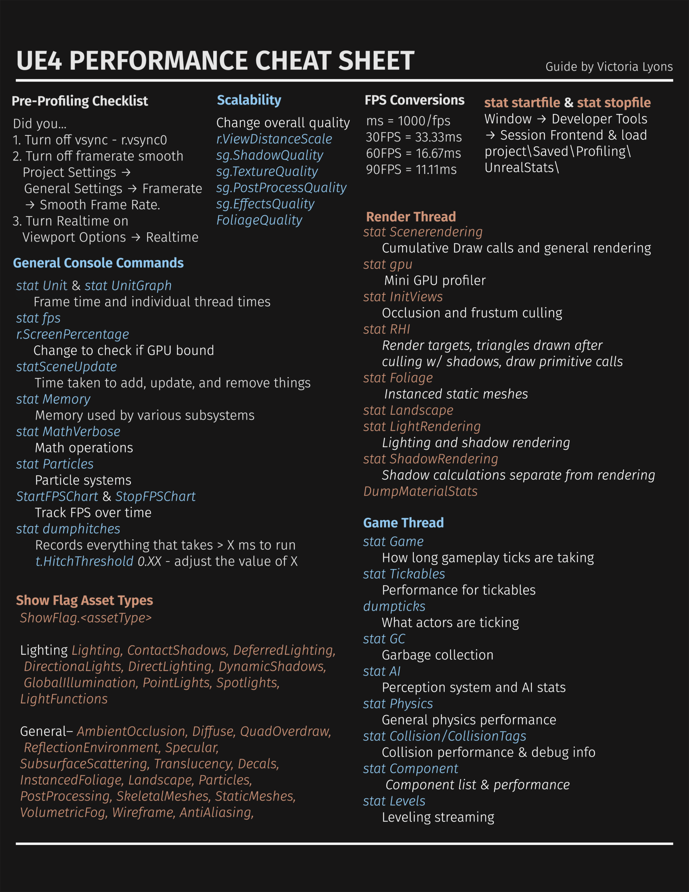[VictoriaLyons - ProfilingCheatSheet](https://www.reddit.com/r/unrealengine/comments/gqi2xu/quick_performance_cheat_sheet/)

</details>

## 🎩 Plugins

<details open>
  <summary>Click to expand</summary>

Over these years, I found some awesome and helpful plugins for extending and improving my productivity.

The plugins that I recommend the most are: **Batch Rename Tool**, **Common Maps**, **Quick Actions**, **ActorLocker**, **FlatNodes**, **CrystalNodes**, **ALS** and **Audio Meters**.

And here is a full list of plugins that I discovered so far:

### Marketplace Plugins

-   [Achievement System](https://www.unrealengine.com/marketplace/en-US/product/achievement-system-blueprint-compatible) (Easily define and manage achievements in any UE4 project).
-   [Animate](https://www.unrealengine.com/marketplace/en-US/product/animate-curve-driven-animations) (Animate anything using Vector Curves).
-   [Attachment Sync](https://www.unrealengine.com/marketplace/en-US/product/attachment-sync) (Ability to any weapon to have attachments).
-   [Audio Metering Lite](https://www.unrealengine.com/marketplace/en-US/product/audio-metering-lite) (lets you analyze and meter Submixes).
-   [Auto Size Comments](https://www.unrealengine.com/marketplace/en-US/product/auto-size-comments) (makes comment boxes auto resize to fit the nodes inside).
-   [Blueprintable Developer Settings](https://www.unrealengine.com/marketplace/en-US/product/blueprintable-developer-settings) (access to work with config files through blueprints and editor, just like `UDeveloperSettings`).
-   [Common Maps](https://www.unrealengine.com/marketplace/en-US/product/common-maps) (Allows you to quickly switch to the maps you use frequently in the project you are working on by storing them in a list).
-   [Custom Details Sections](https://www.unrealengine.com/marketplace/en-US/product/custom-details-sections) (Organize the details panel by grouping your variables into custom sections).
-   [DzX Radial Menu](https://www.unrealengine.com/marketplace/en-US/product/dzx-radial-menu-umg/questions) (The radial menu plugin gives complete freedom in widget design for pie chart looking widgets).
-   [Enhanced Input Sequence](https://www.unrealengine.com/marketplace/en-US/product/enhanced-input-sequence) (allows you to process Input Actions and their sequences).
-   [Extended Debug Library](https://www.unrealengine.com/marketplace/en-US/product/extended-debug-library) (Extends some of the native debugging functions, exposing more functionality).
-   [File System Library](https://www.unrealengine.com/marketplace/en-US/product/file-system-library) (Open, Save, Copy, Move and delete files and directories in tranquillity).
-   [Game Flow](https://www.unrealengine.com/marketplace/en-US/product/game-flow) (Allows user to create state machines and configure them for various reasons).
-   [Gradient Generator](https://www.unrealengine.com/marketplace/en-US/product/gradient-generator) (helps you create complex gradients).
-   [Live Blueprint Debugger](https://www.unrealengine.com/marketplace/en-US/product/live-blueprint-debugger) (Integrates the Blueprint Debugger's variables window directly into the Level Editor's details panel for any selected Actor that is an instance of a Blueprint class).
-   [Outliner Shortcuts](https://www.unrealengine.com/marketplace/en-US/product/outliner-shortcuts) (Allows the binding of shortcuts to some basic World Outliner functions).
-   [Project Acoustics](https://www.unrealengine.com/marketplace/en-US/product/project-acoustics-for-unreal-audio) (audio wave acoustics engine for adding accurate acoustics to your 3D environments).
-   [Project Cleaner](https://www.unrealengine.com/marketplace/en-US/product/projectcleaner) (Remove unused assets and empty folders in project).
-   [Quest Editor Plugin](https://www.unrealengine.com/marketplace/en-US/product/quest-editor-plugin) (manage and create quests and dialogs for NPCs, with very dynamic and customizable features).
-   [Quick Actions](https://www.unrealengine.com/marketplace/en-US/product/quick-actions) (Find anything inside Unreal quick).
-   [Regex in Blueprints](https://www.unrealengine.com/marketplace/en-US/product/regex-in-blueprints) (Regular expressions available for blueprints).
-   [Restart Unreal Editor](https://www.unrealengine.com/marketplace/en-US/product/restart-editor-01) (Utility to restart the Unreal Editor with a click or with a shortcut).
-   [Screen Fade Library](https://www.unrealengine.com/marketplace/en-US/product/screen-fade-library) (Plugin that makes it easy to implement screen fade in Blueprints and C++).
-   [SweejTech Audio Inspector](https://www.unrealengine.com/marketplace/en-US/product/sweejtech-audio-inspector) (Allows you to see a detailed, useful info about all active sounds in game in a compact editor tab window).
-   [Time Clock](https://www.unrealengine.com/marketplace/en-US/product/time-clock) (Easily track how long you have to work in a project, and manage your times with alarms).
-   [Universal Camera](https://www.unrealengine.com/marketplace/en-US/product/universal-camera) (A flexible camera for your games).

### Github Plugins

-   [ActorLocker](https://github.com/Gradess2019/ActorLocker) (Ability to lock actors while editing the level).
-   [Advanced Locomotion System Refactored](https://github.com/Sixze/ALS-Refactored) (C++ version).
-   [Agora Static Mesh Thumbnail Renderer](https://github.com/ryanjon2040/AgoraStaticMeshThumbnailRenderer) (Provides some information about Static Mesh in Content Browser).
-   [Aliaser](https://github.com/AyeTSG/Aliaser) (Allows aliases to be shown in the Content Browser).
-   [ALS-Refactored XT](https://github.com/Voidware-Prohibited/ALSXT) (Expand ALS Refactored with expanded Character States, Improved Foot Print system, Sliding, Vaulting and Wallrunning).
-   [AsyncLoadingScreen](https://github.com/truong-bui/AsyncLoadingScreen) (Ability to add custom loading screen).
-   [Audio Analysis Tools](https://github.com/gtreshchev/AudioAnalysisTools) (Provides a variety of functions for analyzing audio data. Works in conjunction with the Runtime Audio Importer plugin).
-   [Audio Meters for Unreal Engine 5.1](https://michaelgarydean.itch.io/audio-metering-editor-utility-widget) (Ability to monitoring your audio levels).
-   [Batch Rename Tool](https://github.com/FrozenStormInteractive/Unreal-Batch-Rename-Tool) (rename multiple assets quickly with a set of naming rules).
-   [BlueprintUE C++](https://github.com/blueprintue/blueprintue-cpp-plugin) (Allows you to send your blueprints on [](https://blueprintUE.com) associated to your account).
-   [BUI Cheat Manager](https://github.com/benui-dev/UE-BUICheatManager/) (Cheat manager, providing a way of defining cheat shortcut).
-   [Circular Dependencies Detector](https://github.com/bstt/CircularDependenciesDetector/).
-   [CrystalNodes](https://github.com/SkylakeOfficial/CrystalNodes) (Beautify the unreal editor graph nodes).
-   [CsToCpp](https://github.com/CSharpForUnrealEngine5/CsToCpp) (C# to UE C++ compiler).
-   [CustomShapeButton](https://github.com/JanSeliv/CustomShapeButton) (Allows to make buttons of any shape in UE5.3).
-   [Elementus Inventory](https://github.com/lucoiso/UEElementusInventory) (Data-Driven Inventory & Items system).
-   [ExtendedUnreal](https://github.com/BenVlodgi/UE-ExtendedUnreal) (Exposes useful functions to Blueprints).
-   [FlatNodes](https://github.com/brumenn/FlatNodes) (A minimalist style for Unreal Engine graph nodes).
-   [FlowGraph](https://github.com/MothCocoon/FlowGraph) (Design-agnostic node system for scripting game’s flow).
-   [Function Picker](https://github.com/JanSeliv/FunctionPicker) (Allows to choose a function right in the property from any blueprint in UE5.3).
-   [Hotbar and Inventory System](https://github.com/finalstack/InventorySystem) (Easy to use Hotbar and Inventory system).
-   [MDMetaDataEditor](https://github.com/DoubleDeez/MDMetaDataEditor) (Ability to edit metadata of Blueprint Properties, Functions, and Function and Event Parameters).
-   [Neat Metadata](https://github.com/pramberg/NeatMetadata) (Allow various metadata to be used in Blueprints that is otherwise only available in C++.).
-   [ObjectPool](https://github.com/dslabkowski/ObjectPool/) (Improve performance and memory use by reusing objects from a fixed pool instead of allocating and freeing them individually).
-   [PBCharacterMovement](https://github.com/ProjectBorealis/PBCharacterMovement) (HL2-style, classic FPS movement for UE in C++).
-   [Pool Manager](https://github.com/JanSeliv/PoolManager) (Helps reuse objects in UE5.3).
-   [RefreshAllNodes](https://github.com/nachomonkey/RefreshAllNodes) (Ability to refresh all nodes in a single Blueprint Instance. Helpful when Blueprint version has not been updated to its counterpart of C++).
-   [Serial Communication](https://github.com/videofeedback/Unreal_Engine_SerialCOM_Plugin) (Serial Com Port Library).
-   [Settings Widget Constructor](https://github.com/JanSeliv/SettingsWidgetConstructor) (Automated UI generation of game settings from data table in UE5.3).
-   [Subsystem Browser Plugin](https://github.com/aquanox/SubsystemBrowserPlugin/) (Adds a Subsystem Browser panel to explore running subsystems and edit their properties).
-   [TabRestore](https://github.com/Theliraan/TabRestore) (restore closed tabs).
-   [UI Tweening Library for UE4/UMG](https://github.com/benui-dev/UE-BUITween).
-   [Unreal Blueprint CSV Parsing](https://github.com/IncantaGames/unreal-bp-csv-parsing).
-   [UnrealImGui](https://github.com/benui-dev/UnrealImGui) (Integrates [Dear ImGui](https://github.com/ocornut/imgui) framework into Unreal Engine).
-   [VoxelCore](https://github.com/VoxelPlugin/VoxelCore) (Use voxel inside UE).

### Epic Games Plugins

-   [Chaos Vehicles](https://docs.unrealengine.com/5.3/en-US/vehicles-in-unreal-engine/) made by Epic Games (Vehicle System).
-   [Common UI](https://docs.unrealengine.com/5.3/en-US/common-ui-plugin-for-advanced-user-interfaces-in-unreal-engine/) made by Epic Games. ​
-   [Enhanced Input](https://docs.unrealengine.com/5.3/en-US/enhanced-input-in-unreal-engine/) made by Epic Games.
-   [Sun Position Calculator](https://docs.unrealengine.com/5.3/en-US/geographically-accurate-sun-positioning-tool-in-unreal-engine/) made by Epic Games (Real-time sky).

### MrRobinOfficial's Plugins

-   [Common Time](https://github.com/MrRobinOfficial/Unreal-CommonTime) (Provides an editor view for editing DateTime and Timespan values).
-   [Common Vehicle](https://github.com/MrRobinOfficial/Unreal-CommonVehicle) (Extend Chaos Vehicle System).
-   [IniParser](https://github.com/MrRobinOfficial/Unreal-IniParser) (Import/export .ini files).

I am planning to make more plugins, which you can find me on [Github](https://github.com/MrRobinOfficial).

</details>

## ⌛ Getting started with C++

<table><tr><td>
This section was written in conjunction with ChatGPT.
</td></tr></table>

Highly recommend taking a short class of native C++. Here is a video link to ~1h long [video tutorial from Mosh](https://www.youtube.com/watch?v=ZzaPdXTrSb8).

You can also watch a playlist from [GGameDev about getting started with Unreal Engine C++](https://youtube.com/playlist?list=PLaaDnVlfJwc4Lncf4XTYaTRG_osOk-T0N).

C++ is a statically typed, compiled, general-purpose programming language that offers a combination of high-level and low-level features. It was developed by [Bjarne Stroustrup](https://en.wikipedia.org/wiki/Bjarne_Stroustrup) at Bell Labs in 1979 as an enhancement to the [C language](https://en.wikipedia.org/wiki/C_(programming_language)), originally named C[^10] with Classes and later renamed [C++](https://en.wikipedia.org/wiki/C%2B%2B) in 1983.

You can read more about [C++ Language Reference from Microsoft Learn](https://learn.microsoft.com/en-us/cpp/cpp/cpp-language-reference?view=msvc-170).

Using C++ with Unreal Engine unlocks the engine's full feature set, allowing developers to harness advanced graphics rendering, physics simulations, networking, and AI capabilities. C++ provides a level of control, customization, and performance optimization that complements visual scripting.

Developing with C++ in Unreal Engine enables better debugging, profiling, and performance optimization through techniques such as multithreading and memory management. It also facilitates integration with third-party libraries, expanding the range of functionality and flexibility available to developers.

You can read more about it on [their docs](https://docs.unrealengine.com/5.2/en-US/unreal-engine-programming-and-scripting/).

To use C++ effectively in Unreal Engine, it is crucial to have a strong foundation in programming principles and understanding of Unreal Engine's architecture and conventions. Leveraging resources like the Unreal Engine documentation, community forums, and collaboration with other developers helps to gain knowledge and best practices.

*By combining the power of C++ and Unreal Engine, developers can create immersive experiences and unlock the full potential of the engine's capabilities.*

### 🌈 Integrated Development Environment

<table><tr><td>
This section was written in conjunction with ChatGPT.
</td></tr></table>

An Integrated Development Environment (IDE) is a software application that provides comprehensive tools for writing, debugging, and managing code. IDEs offer a streamlined and feature-rich environment for software development, making it easier for developers to work on their projects efficiently.

Popular IDEs used in Unreal Engine and C++ development include:

* [Visual Studio](https://visualstudio.microsoft.com/): The Visual Studio IDE for Unreal Engine development. It offers a powerful set of C++ tools and seamless integration with Unreal Engine, providing a robust development environment. `Free`.

* [Visual Studio Code (VSCode)](https://code.visualstudio.com/): Visual Studio Code is a lightweight, cross-platform code editor with a rich ecosystem of extensions, including ones for Unreal Engine development. `Free`.

* [Rider](https://www.jetbrains.com/rider/): Rider is a popular IDE developed by JetBrains, designed for game development, and it offers solid integration with Unreal Engine projects. `Cost`.

### ⛏️ Tools to help your journey

<table><tr><td>
This section was NOT written in conjunction with ChatGPT.
</td></tr></table>

Here are some tools that can be integrated into your IDE's for better performance, debugging or writing good code practices.

* [Visual Assist](https://www.wholetomato.com/): A productivity tool for refactoring, reading, writing, navigating and generating C/C++/C# code. `Cost` and for `VS`.

* [UnrealMacroGenerator](https://marketplace.visualstudio.com/items?itemName=Naotsun.Naotsun-UE-UMG): Provides a macro editor used by Unreal C ++ of Unreal Engine. You can create macros and edit already written macros. `Free` and for `VS`.

### 🟢 Benefits of using C++ with Unreal Engine

<table><tr><td>
This section was written in conjunction with ChatGPT.
</td></tr></table>

* High performance: C++ allows you to write code that can run directly on the CPU and GPU, making it possible to achieve very high performance levels in your game or application.

* Integration with existing codebases: If you have existing C++ code that you want to integrate with your Unreal Engine project, using C++ allows you to do so more easily.

* Access to low-level functionality: C++ gives you access to lower-level functionality than other programming languages, which can be especially useful in game development where fine-grained control over memory, data structures, and algorithms is often necessary.

* Garbage Collection and Memory Management: While C++ demands manual memory management, Unreal Engine provides a [garbage collector](https://en.wikipedia.org/wiki/Garbage_collection_(computer_science)) that efficiently clears out `UObject` classes from memory. With the control over manual memory handling, you can precisely dictate when to allocate and deallocate memory as necessary.

### 🔴 Drawbacks of using C++ with Unreal Engine

<table><tr><td>
This section was NOT written in conjunction with ChatGPT.
</td></tr></table>

* More prone to errors: C++ is a strongly typed language, requiring the precise use of semicolons, braces and accurate syntax to ensure successful compilation. Rectifying these issues can be time-consuming. On the contrary, the Blueprint's node-based graph system operates without the need for "correct" syntax, offering a more "forgiving" environment.

* Tied to Unreal's API: Throughout the evolution of Unreal Engine, Epic Games may modify the [source code](https://en.wikipedia.org/wiki/Source_code), rendering certain functions and members as **obsolete**/**deprecated**. Consequently, Unreal might recommend the need to update the codebase with the latest [API](https://en.wikipedia.org/wiki/API) changes. Failure to do so can lead to compilation errors, in the future.

* Updating your codebase: When working with C++ and Unreal Engine, your C++ code is compiled into a [.DLL](https://en.wikipedia.org/wiki/Dynamic-link_library) (in Windows OS) file that Unreal Engine can read and use within Blueprint graphs. However, this necessitates Unreal Engine to reload to incorporate your code changes. Epic Games has introduced [Hot Reload](https://unrealcommunity.wiki/live-compiling-in-unreal-projects-tp14jcgs), allowing for code reloading without editor restart, streamlining the development process. While Hot Reload often works for a while, it is unreliable and frequently causes blueprint corruption or other issues.

* Requires more storage: When working with C++ within Unreal Engine, it often involves using "Editor Symbols for debugging," consuming approximately 60 GB of storage. Similarly, if you opt to build Unreal Engine from its source code (on their github page), you'll require around 200 GB of storage space.

## 🌍 Summary of C++ and Programming World

If you wish to extend your knowledge about C++ and general programming principles and ideology, I highly recommend reading about this [section](https://github.com/MrRobinOfficial/Guide-UnrealEngine/blob/dev/sections/summary_of_cpp_and_programming_world.md).

## 🚧 Blueprint vs C++

<table><tr><td>
This section was written in conjunction with ChatGPT.
</td></tr></table>

[](https://youtu.be/VMZftEVDuCE)

**Choose C++** when you anticipate the need for interaction with other C++ code or require extensive control over low-level optimizations and memory management. C++ is well-suited for classes that require direct access to engine internals and efficient execution.

**Use Blueprint** as an inherited class when you want to benefit from the visual scripting capabilities and quick prototyping offered by Blueprint, while still having the option to incorporate C++ code in the future. This allows for a flexible approach where you can leverage the power of Blueprint while having the ability to extend functionality with C++ when needed.

## 🎪 Architecture

<table><tr><td>
This section was NOT written in conjunction with ChatGPT.
</td></tr></table>


When getting started with Unreal Engine and their workflow, it can be intimidating to learn their architecture. However, I would argue it to facilitate your experience with Unreal, if you started learning each classes and their purpose.

Unreal has many classes, which would take a long time to explain. However, here is a list of notable classes:

<details open>
  <summary>Click to expand</summary>

-   [UClass](https://dev.epicgames.com/documentation/en-us/unreal-engine/API/Runtime/CoreUObject/UObject/UClass) inherit `UStruct`

    -   An object class.

-   [UObject](https://dev.epicgames.com/documentation/en-us/unreal-engine/API/Runtime/CoreUObject/UObject/UObject) inherit `UObjectBaseUtility`

    -   The base class of all UE objects.
    -   The type of an object is defined by its `UClass`.
    -   This provides support functions for creating and using objects, and virtual functions that should be overridden in child classes.

-   [AActor](https://dev.epicgames.com/documentation/en-us/unreal-engine/API/Runtime/Engine/GameFramework/AActor) inherit `UObject`

    -   Actor is the base class for an Object that can be placed or spawned in a level.
    -   Actors may contain a collection of ActorComponents, which can be used to control how actors move, how they are rendered, etc. The other main function of an Actor is the replication of properties and function calls across the network during play.
    -   `AActor` itself doesn't have a transform (i.e. position in the world), it depends on the transform of the root component.
    -   _Common Functions_:
        -   `void PreInitializeComponents()` - Called before InitializeComponent is called on the actor's components. This is only called during gameplay and in certain editor preview windows.
        -   `void InitializeComponent()` - This will be called only if the component has bWantsInitializeComponentSet. This only happens once per gameplay session.
        -   `void PostInitializeComponents()` - Called after the actor's components have been initialized, only during gameplay and some editor previews.´
        -   `void BeginPlay()` - Called when the level starts ticking, only during actual gameplay. This normally happens right after PostInitializeComponents but can be delayed for networked or child actors.
        -   `void Tick(float DeltaSeconds)` - Function called every frame on this Actor.
        -   `void EndPlay(const EEndPlayReason::Type EndPlayReason)` - Overridable function called whenever this actor is being removed from a level
        -   `void SetLifeSpan(float InLifespan)` - Set the lifespan of actor.
        -   `void Destroy(bool bNetForce, bool bShouldModifyLevel)` - Destroy the actor.
        -   `void SetActorTickEnabled(bool bEnabled)` - Set this actor's tick functions to be enabled or disabled.
        -   `SetActorTickInterval(float TickInterval)` - Sets the tick interval of this actor's primary tick function.

-   [APawn](https://dev.epicgames.com/documentation/en-us/unreal-engine/API/Runtime/Engine/GameFramework/APawn) inherit `AActor`

    -   Pawn is the base class of all actors that can be possessed by players or AI. They are the physical representations of players and creatures in a level.
    -   `APawn` provides basic possession mechanisms and support for input handling, as well as collision detection and physics simulation.
    -   _Common Functions_:
        -   `BeginPlay()` - Called when the level starts ticking, only during actual gameplay.
        -   `Tick(float DeltaSeconds)` - Update function, called every frame on Actor.
        -   `EndPlay(const EEndPlayReason::Type EndPlayReason)` - Whenever actor is being removed from a level
        -   `SetLifeSpan(float InLifespan)` - Set the lifespan of actor.
        -   `Destroy(bool bNetForce, bool bShouldModifyLevel)` - Destroy actor.

-   [AHUD](https://dev.epicgames.com/documentation/en-us/unreal-engine/API/Runtime/Engine/GameFramework/AHUD) inherit `AActor`

    -   Base class of the heads-up display. The HUD displays important information to the player, such as health and ammunition levels, as well as providing visual feedback for game events such as damage or power-up pickups.
    -   This has a canvas and a debug canvas on which primitives can be drawn. It also contains a list of simple hit boxes that can be used for simple item click detection. A method of rendering debug text is also included. Provides some simple methods for rendering text, textures, rectangles and materials which can also be accessed from blueprints.

-   [ACharacter](https://dev.epicgames.com/documentation/en-us/unreal-engine/API/Runtime/Engine/GameFramework/ACharacter) inherit `APawn`

    -   Characters are Pawns (`APawn`) that have a mesh, collision, and built-in movement logic.
    -   They are responsible for all physical interaction between the player or AI and the world, and also implement basic networking and input models. They are designed for a vertically-oriented player representation that can walk, jump, fly, and swim through the world using `UCharacterMovementComponent`.
    -   `ACharacter` can be used as a base class for player characters, enemies, and other types of characters in the game.

-   [AController](https://dev.epicgames.com/documentation/en-us/unreal-engine/API/Runtime/Engine/GameFramework/AController) inherit `AActor`

    -   Controllers are non-physical actors that can possess a Pawn to control its actions. PlayerControllers are used by human players to control pawns, while AIControllers implement the artificial intelligence for the pawns they control. Controllers take control of a pawn using their `Possess()` method, and relinquish control of the pawn by calling `UnPossess()`.
    -   Controllers receive notifications for many of the events occurring for the Pawn they are controlling. This gives the controller the opportunity to implement the behavior in response to this event, intercepting the event and superseding the Pawn's default behavior.
    -   ControlRotation (accessed via `GetControlRotation()`), determines the viewing/aiming direction of the controlled Pawn and is affected by input such as from a mouse or gamepad.

-   [UActorComponent](https://dev.epicgames.com/documentation/en-us/unreal-engine/API/Runtime/Engine/Components/UActorComponent) inherit `UObject`

    -   ActorComponent is the base class for components that define reusable behavior that can be added to different types of Actors.
    -   ActorComponents that have a transform are known as SceneComponents (`USceneComponent`) and those that can be rendered are PrimitiveComponents (`UPrimitiveComponent`).
    -   `UActorComponent` doesn't appear in the world.
    -   _Common Functions_:
        -   `BeginPlay()` - Begins Play for component.
        -   `TickComponent(float DeltaTime, enum ELevelTick TickType, FActorComponentTickFunction* ThisTickFunction)` - Function called every frame on ActorComponent.
        -   `EndPlay(const EEndPlayReason::Type EndPlayReason)` - Ends gameplay for component.

-   [UMovementComponent](https://dev.epicgames.com/documentation/en-us/unreal-engine/API/Runtime/Engine/GameFramework/UMovementComponent) inherit `UActorComponent`

    -   MovementComponent is an abstract component class that defines functionality for moving a PrimitiveComponent (our UpdatedComponent) each tick.

-   [USceneComponent](https://dev.epicgames.com/documentation/en-us/unreal-engine/API/Runtime/Engine/Components/USceneComponent) inherit `UActorComponent`

    -   A SceneComponent has a transform and supports attachment, but has no rendering or collision capabilities.
    -   Useful as a 'dummy' component in the hierarchy to offset others.
    -   It's used by components that need to know its place in the world to run the logic, i.e. `UAudioComponnent`, `UCameraComponent`.

-   [UPrimitiveComponent](https://dev.epicgames.com/documentation/en-us/unreal-engine/API/Runtime/Engine/Components/UPrimitiveComponent) inherit `USceneComponent`

    -   PrimitiveComponents are SceneComponents that contain or generate some sort of geometry, generally to be rendered or used as collision data.
    -   There are several subclasses for the various types of geometry, but the most common by far are the ShapeComponents (Capsule, Sphere, Box), StaticMeshComponent, and SkeletalMeshComponent.
    -   ShapeComponents generate geometry that is used for collision detection but are not rendered, while StaticMeshComponents and SkeletalMeshComponents contain pre-built geometry that is rendered, but can also be used for collision detection.

-   [USubsystem](https://dev.epicgames.com/documentation/en-us/unreal-engine/API/Runtime/Engine/Subsystems/USubsystem) inherit `UObject`

    -   Subsystems are auto instanced classes that share the lifetime of certain engine constructs.
    -   Subsystems are responsible for initializing, updating, and shutting down their associated services, and can be used to customize or extend engine functionality as needed.
    -   6 types of subsystems
        -   [UEngineSubsystem](https://dev.epicgames.com/documentation/en-us/unreal-engine/API/Runtime/Engine/Subsystems/UEngineSubsystem) Share lifetime of Engine.
        -   [UEditorSubsystem](https://dev.epicgames.com/documentation/en-us/unreal-engine/API/Editor/EditorSubsystem/UEditorSubsystem) - Share the lifetime of the Editor.
        -   [UGameInstanceSubsystem](https://dev.epicgames.com/documentation/en-us/unreal-engine/API/Runtime/Engine/Subsystems/UGameInstanceSubsystem) Share lifetime of game instance.
        -   [ULocalPlayerSubsystem](https://dev.epicgames.com/documentation/en-us/unreal-engine/API/Runtime/Engine/Subsystems/ULocalPlayerSubsystem) - Share lifetime of local players.
        -   [UWorldSubsystem](https://dev.epicgames.com/documentation/en-us/unreal-engine/API/Runtime/Engine/Subsystems/UWorldSubsystem) - Share lifetime of a `UWorld`.
        -   [UTickableWorldSubsystem](https://dev.epicgames.com/documentation/en-us/unreal-engine/API/Runtime/Engine/Subsystems/UTickableWorldSubsystem) - Share lifetime of a `UWorld` and are ticking along with it.

-   [UBlueprintFunctionLibrary](https://dev.epicgames.com/documentation/en-us/unreal-engine/API/Runtime/Engine/Kismet/UBlueprintFunctionLibrary) inherit `UObject`

    -   This class is a base class for any function libraries exposed to blueprints.
    -   Methods in subclasses are expected to be static, and no methods should be added to this base class.

-   [UEngine](https://dev.epicgames.com/documentation/en-us/unreal-engine/API/Runtime/Engine/Engine/UEngine), [UEditorEngine](https://dev.epicgames.com/documentation/en-us/unreal-engine/API/Editor/UnrealEd/Editor/UEditorEngine) and [UGameEngine](https://dev.epicgames.com/documentation/en-us/unreal-engine/API/Runtime/Engine/Engine/UGameEngine) inherit `UObject`

    -   Abstract base class of all Engine classes, responsible for management of systems critical to editor or game systems. Also defines default classes for certain engine systems.
    -   `UGameEngine` manages core systems that enable a game.
    -   `UEditorEngine` drives the Editor. Separate from `UGameEngine` because it may have much different functionality than desired for an instance of a game itself.

-   [UGameViewportClient](https://dev.epicgames.com/documentation/en-us/unreal-engine/API/Runtime/Engine/Engine/UGameViewportClient) inherit `UScriptViewportClient`

    -   A game viewport (FViewport) is a high-level abstract interface for the platform specific rendering, audio, and input subsystems.
    -   Exactly one GameViewportClient is created for each instance of the game.

-   [ULocalPlayer](https://dev.epicgames.com/documentation/en-us/unreal-engine/API/Runtime/Engine/Engine/ULocalPlayer) inherit `UObject`

    -   Each player that is active on the current client/listen server has a LocalPlayer.
    -   It stays active across maps, and there may be several spawned in the case of splitscreen/coop. There will be 0 spawned on dedicated servers.
    -   LocalPlayer is often used in conjunction with other classes, such as `APlayerController`, to manage local player interactions with the game.
    -   _Common Functions_:
        -   `TSubsystemClass* GetSubsystem() const` - Get a Subsystem of specified type

-   [UWorld](https://dev.epicgames.com/documentation/en-us/unreal-engine/API/Runtime/Engine/Engine/UWorld) inherit `UObject`

    -   The World is the top level object representing a map or a sandbox in which Actors and Components will exist and be rendered.
    -   A World can be a single Persistent Level with an optional list of streaming levels that are loaded and unloaded via volumes and blueprint functions or it can be a collection of levels organized with a World Composition.
    -   In a standalone game, generally only a single World exists except during seamless area transitions when both a destination and current world exists. In the editor many Worlds exist: The level being edited, each PIE instance, each editor tool which has an interactive rendered viewport, and many more.
    -   _Common Functions_:
        -   `SpawnActor()` or `SpawnActorDeferred()` - Spawn an actor from it's class. Deferred method will allow you to set actor properties before it's spawned into the world.

-   [ULevel](https://dev.epicgames.com/documentation/en-us/unreal-engine/API/Runtime/Engine/Engine/ULevel)

    -   A Level is a collection of Actors (lights, volumes, mesh instances etc.). Multiple Levels can be loaded and unloaded into the World to create a streaming experience.

-   [UGameInstance](https://dev.epicgames.com/documentation/en-us/unreal-engine/API/Runtime/Engine/Engine/UGameInstance) inherit `UObject`

    -   High-level manager object for an instance of the running game. Spawned at game creation and not destroyed until game instance is shut down. Running as a standalone game, there will be one of these. Running in PIE (play-in-editor) will generate one of these per PIE instance.
    -   The game instance can be used to manage persistent data and game state across levels, as well as to perform global game operations such as handling networking, input, and other system-level tasks.

-   [AGameMode](https://dev.epicgames.com/documentation/en-us/unreal-engine/API/Runtime/Engine/GameFramework/AGameMode) inherit `AGameModeBase`

    -   GameMode is a subclass of GameModeBase that behaves like a multiplayer match-based game.
    -   It has default behavior for picking spawn points and match state. Or you define the rules and mechanics of a particular game mode, such as deathmatch or capture the flag.
    -   If you want a simpler base, inherit from GameModeBase instead.
    -   Each level (`ULevel`) in a game can have its own `AGameMode`, allowing for different game modes to be used in different levels.

-   [AGameState](https://dev.epicgames.com/documentation/en-us/unreal-engine/API/Runtime/Engine/GameFramework/AGameState) inherit `AGameStateBase`

    -   GameState is a subclass of GameStateBase that behaves like a multiplayer match-based game. It is tied to functionality in GameMode.
    -   `AGameState` can also be used to synchronize game state across multiple clients in a networked game, ensuring that all players have an accurate view of the game world.

-   [APlayerState](https://dev.epicgames.com/documentation/en-us/unreal-engine/API/Runtime/Engine/GameFramework/APlayerState) inherit `AInfo`

    -   A PlayerState is created for every player on a server (or in a standalone game).
    -   PlayerStates are replicated to all clients, and contain network game relevant information about the player, such as playername, score, etc.

-   [UWidget](https://dev.epicgames.com/documentation/en-us/unreal-engine/API/Runtime/UMG/Components/UWidget) inherit `UVisual`

    -   This is the base class for all wrapped Slate controls that are exposed to UObjects.

-   [UUserWidget](https://dev.epicgames.com/documentation/en-us/unreal-engine/API/Runtime/UMG/Blueprint/UUserWidget) inherit `UWidget`

    -   A widget that enables UI extensibility through WidgetBlueprint.
    -   `UUserWidget` provides a flexible framework for creating UI elements such as buttons, text fields, and images, and can be customized to implement complex UI behaviors such as animations, transitions, and data binding.

-   [UAssetManager](https://dev.epicgames.com/documentation/en-us/unreal-engine/API/Runtime/Engine/Engine/UAssetManager) inherit `UObject`

    -   A singleton `UObject` that is responsible for loading and unloading PrimaryAssets, and maintaining game-specific asset references Games should override this class and change the class reference

-   [UDataAsset](https://dev.epicgames.com/documentation/en-us/unreal-engine/API/Runtime/Engine/Engine/UDataAsset) inherit `UObject`

    -   Create a simple asset that stores data related to a particular system in an instance of this class.
    -   Assets can be made in the Content Browser using any native class that inherits from this.
    -   If you want data inheritance or a complicated hierarchy, Data Only Blueprint Classes should be created instead.

-   [UPrimaryDataAsset](https://dev.epicgames.com/documentation/en-us/unreal-engine/API/Runtime/Engine/Engine/UPrimaryDataAsset) inherit `UDataAsset`

    -   A DataAsset that implements `GetPrimaryAssetId()` and has asset bundle support, which allows it to be manually loaded/unloaded from the AssetManager (`UAssetManager`).
    -   Represents a primary data asset in the engine. A primary data asset is a piece of game content that is created in the Unreal Editor, such as a mesh, texture, sound, or level. `UPrimaryDataAsset` provides a base class for creating custom data assets that can be loaded and used by the game at runtime.
    -   `UPrimaryDataAsset` can be used to manage and organize game content, and can be customized to provide additional functionality such as data validation and metadata management.

-   [USoundBase](https://dev.epicgames.com/documentation/en-us/unreal-engine/API/Runtime/Engine/Sound/USoundBase) inherit `UObject`

    -   The base class for a playable sound object
    -   `USoundBase` can be used to play sound effects, music, and other audio in the game world.
    -   `USoundBase` provides a number of features for controlling the playback of audio, including volume, pitch, and spatialization effects such as 3D sound and reverb.

-   [UMaterial](https://dev.epicgames.com/documentation/en-us/unreal-engine/API/Runtime/Engine/Materials/UMaterial) inherit `UMaterialInterface`

    -   A Material is an asset which can be applied to a mesh to control the visual look of the scene.
    -   When light from the scene hits the surface, the shading model of the material is used to calculate how that light interacts with the surface.

-   [UMaterialInstance](https://dev.epicgames.com/documentation/en-us/unreal-engine/API/Runtime/Engine/Materials/UMaterialInstanceDynamic) inherit `UMaterialInterface`

    -   A instance of a material asset. This way, you can create a hierarchy material system.

-   [UMaterialInstanceDynamic](https://dev.epicgames.com/documentation/en-us/unreal-engine/API/Runtime/Engine/Materials/UMaterialInstanceDynamic) inherit `UMaterialInstance`

    -   A dynamic spawned instance material.

-   [UTexture](https://dev.epicgames.com/documentation/en-us/unreal-engine/API/Runtime/Engine/Engine/UTexture) inherit `UObject`

    -   Represents an image or texture that can be used in the engine for various purposes such as materials or user interface elements.

-   [UTexture2D](https://dev.epicgames.com/documentation/en-us/unreal-engine/API/Runtime/Engine/Engine/UTexture2D) inherit `UTexture`
    -   Represents an 2D image or texture that can be used in the engine for various purposes such as materials or user interface elements.

</details>

You can read more about [Unreal Architecture at their docs](https://docs.unrealengine.com/4.27/en-US/ProgrammingAndScripting/ProgrammingWithCPP/UnrealArchitecture/).

And for more information about Unreal's Architecture. Then I highly recommend, you can watch [underscore about Unreal Engine Architecture](https://www.youtube.com/watch?v=QcXHEsR0xHI) video.

You can also watch a video discussion about [Multiplayer Framework of Unreal Engine from Kekdot](https://www.youtube.com/watch?v=Hsr6mbNKBLU).

> [!NOTE]
> This architecture is based on a multiplayer game setup. However, if you are making a singleplayer game, then you can ignore some of classes. Mainly `APlayerState` and `AGameState` (as well as their base classes).

You can also watch [The Unreal Engine Game Framework: From int main() to BeginPlay by Alex Forsythe](https://www.youtube.com/watch?v=IaU2Hue-ApI), which he talks how Unreal starts your game/editor from the source code. And how these classes work with each other.

## ⚓ Naming Convention

<table><tr><td>
This section was written in conjunction with ChatGPT.
</td></tr></table>

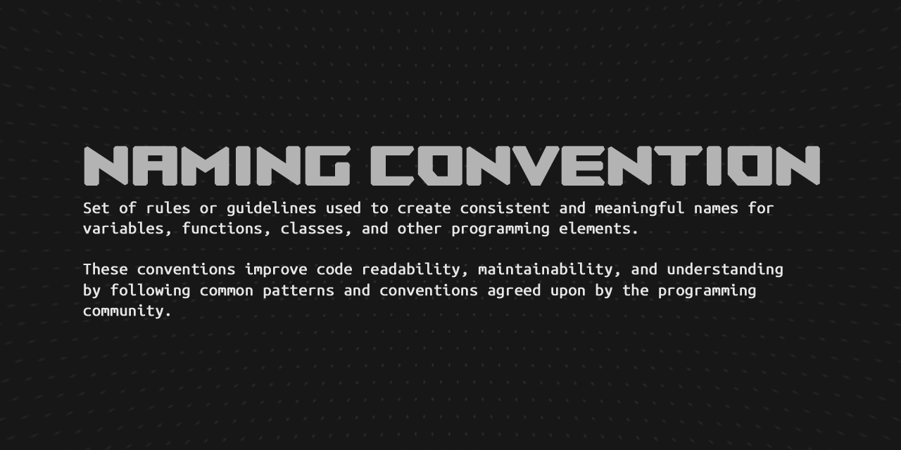

There is a github repo, which talks about Unreal's naming convention. The repo is very detailed and explains how you should name your assets, as well as your code. Repo is called [Unreal Engine's style guide by Michael Allar](https://github.com/Allar/ue5-style-guide).

You can read more about [Epic C++ Coding Standard on their docs](https://docs.unrealengine.com/5.3/en-US/epic-cplusplus-coding-standard-for-unreal-engine/).

Unreal Engine follows a specific naming convention that helps maintain consistency and readability in the codebase. When using Naming Conventions, all code and comments should use U.S. English spelling and grammar.

Pascal case is a naming convention used in programming and other contexts where compound words or phrases are created by capitalizing the first letter of each word and joining them without spaces. In Unreal Engine, pascal case is commonly used for naming classes, member variables, functions, and other constructs.

In Unreal Engine, the use of pascal case for classes is part of the naming convention for user-defined classes. When you create a new class in Unreal Engine, it is recommended to use pascal case for the class name. For example:

```cpp
class AMyPlayerCharacter : public ACharacter
{
    // Class definition here
};
```

Similarly, pascal case is used for member variables and functions in Unreal Engine to maintain consistency and improve code readability. For example:

```cpp
class AMyPlayerCharacter : public ACharacter
{
public:
    UPROPERTY()
    float MovementSpeed;

    UFUNCTION()
    void Jump();
};
```

Boolean variables, which uses a prefix of `b` followed by a descriptive name in pascal case.
For example, a boolean variable that controls whether a character is running might be named: `bIsRunning`.

Variable, method, and class names should be:

-   Clear
-   Unambiguous
-   Descriptive

The greater the scope of the name, the greater the importance of a good, descriptive name. Avoid over-abbreviation.

```cpp
// what does true mean?
bool CheckTea(FTea Tea);

// name makes it clear true means tea is fresh
bool IsTeaFresh(FTea Tea);
```

Enumerated (Enum) classes are a replacement for old-style namespaced enums, both for regular enums and `UENUMs`. For example:

```cpp
// Old enum
UENUM()
namespace EThing
{
    enum Type
    {
        Thing1,
        Thing2
    };
}

// New enum
UENUM()
enum class EThing : uint8
{
    Thing1,
    Thing2
}
```

Enums are supported as `UPROPERTYs`, and replace the old `TEnumAsByte<>` workaround. Enum properties can also be any size, not just bytes:

```cpp
// Old property
UPROPERTY()
TEnumAsByte<EThing::Type> MyProperty;

// New property
UPROPERTY()
EThing MyProperty;
```

### Prefixes

<table><tr><td>
This section was NOT written in conjunction with ChatGPT.
</td></tr></table>

| Prefix | Class        | Subclasses                                                            |
| ------ | ------------ | --------------------------------------------------------------------- |
| U      | `UObject`    | `UActorComponent`, `UPrimaryDataAsset`, `UEngine`, `UGameplayStatics` |
| A      | `AActor`     | `APawn`, `ACharaacter`, `AController`, `AHUD`, `AGameMode`            |
| F      | Struct       | `FHitResult`, `FVector`, `FRotator`, `FTableRowBase`                  |
| E      | Enum         | `EEnvQueryStatus`, `EConstraintType`, `EEndPlayReason`                |
| I      | Inteface     | `IInputDevice`, `IHapticDevice`, `ITargetPlatform`                    |
| T      | Template     | `TSubclassOf<T>`, `TArray<T>`, `TSet<T>`, `TMap<T>`, `TMultiMap<T>`   |
| G      | Global Class | `GEngine`, `GConfig`, `GWorld`, `GEngineLoop`, `GIsEditor`            |

> [!TIP]
> Did you know that `F` prefix actually stands for `Float` (floating point). but it was inadvertently spread throughout and has lost its original meaning.

### 🎨 Abbreviations, Acronyms and Synonyms

<table><tr><td>
This section was written in conjunction with ChatGPT.
</td></tr></table>

<table><tr><td>

Common Language features

-   `arg` - Argument
-   `arr` - Array
-   `async` - Asynchronous
-   `attr` - Attribute
-   `auth` - Authentication
-   `btn` - Button
-   `buff` - Buffer
-   `ctx` - Context
-   `const` - Constant
-   `db` - Database
-   `dest` - Destination
-   `desc` - Description
-   `doc` or `docs` - Documentation
-   `dir` - Direction or Directory (depending on the context)
-   `elem` - Element
-   `err` - Error
-   `e` or `evt` - Event
-   `exe` - Execution
-   `expr` - Expression
-   `ext` - Extension
-   `func` - Function
-   `fmt` - Format
-   `gen` - Generation
-   `hex` - Hexadecimal
-   `impl` - Implementation
-   `imp` - Import
-   `i` or `idx` - Index
-   `info` - Information
-   `init` - initialization
-   `it` or `iter` - Iterator
-   `ident` - Identifier
-   `lang` - Language
-   `len` - Length
-   `lvl` - Level
-   `lib` - Library
-   `loc` - Location
-   `msg` - Message
-   `num` - Number
-   `obj` - Object
-   `opt` - Option
-   `out` - Output
-   `pkg` - Package
-   `param` - Parameter
-   `px` - Pixel
-   `pos` - Position
-   `prev` - Previous
-   `priv` - Private
-   `pub` - Public
-   `q` - Query
-   `rand` - Random
-   `rng` - Range
-   `ref` - Reference
-   `rm` or `rmv` - Remove
-   `req` - Request
-   `res` - Result or Response (depending on the context)
-   `ret` - Return
-   `sel` - Selection
-   `sep` - Separator
-   `sec` - Sequence
-   `sol` - Solver
-   `src` - Source
-   `spec` - Specifier or Specification (depending on the context)
-   `std` - Standard
-   `stdio` - Standard Input Output
-   `stmt` - Statement
-   `stat` - Statistic
-   `str` - String
-   `sync` - Synchronization
-   `tmp` - Temperature
-   `temp` - Temporary
-   `util` - Utility
-   `val` - Value
-   `var` - Variable
-   `ws` - White space
-   `win` - Windows
-   `wiz` - Wizard

---

Unreal Engine features

-   `PC` - Indicates that a variable is a **PlayerController**
-   `LP` - Indicates that a variable is a **LocalPlayer**
-   `Char` - Indicates that a variable is a **Character** (not to be confused about `char` data type)
-   `Comp` - Indicates that a variable is a **component**
-   `Ptr` - Indicates that a variable is a **pointer** to an object.
-   `Ref` - Indicates that a variable is a **reference** to an object.
-   `dt` - Delta Time

---

Networking

-   `OAuth` or Open Authentication – An open standard for authenticating applications or websites to access the content.
-   `TCP` or Transmission Control Protocol – A standard defining how to exchange messages between systems.
-   `UDP` or User Datagram Protocol – A standard defining how to exchange messages between systems.

---

Tools/Frameworks

-   `IDE` or Integrated Development Environment - A software application that provides facilities to programmers for software development.
-   `JSON` or Javascript Object Notation – A file format, written with JavaScript[^14] notation, used widely for transferring data over the network.
-   `XML` or Extensible Markup Language – A markup language used mainly for storing and transporting data.
-   `SQL` or Structured Query Language – A query language for storage, retrieval, and modification of data.
-   `CSV` or Comma-separated values - A CSV file is a delimited text file that uses a comma to separate values.

---

Math

-   `add` - Addition
-   `sub` - Subtraction
-   `mul` - Multiplication
-   `div` - Division
-   `abs` - Absolute
-   `sin` - Sinus
-   `cos` - Cosinus
-   `tan` - Tangens
-   `rad` - Radian
-   `r` - Radius
-   `frac` - Fraction
-   `freq` - Frequency
-   `long` - Longitude or Longitudinal (depending on the context)
-   `lat` - Latitude or Lateral (depending on the context)
-   `sqrt` - Square Root
-   `mod` - Modulo
-   `min` - Minimum
-   `max` - Maximum
-   `lerp` - Linear Interpolation

---

Misc

-   `API` or Application Programming Interface – An interface for connecting multiple isolated components.
-   `SDK` or Software Development Kit – A collection of software often needed for development in a specific platform.
-   `TDD` or Test-driven development - TDD is a software development process that is based on the repetition of a short development cycle: requirements are turned into specific test cases, and then the code is fixed so that the tests pass.
-   `UUID` or Universally unique identifier - A UUID is a 128-bit number used to identify information in computer systems.
-   `GUI` or Graphic User Interface - A GUI or graphical user interface is a form of user interface that allows users to interact with electronic devices through a graphical interface.
-   `misc` - Miscellaneous
-   `os` - Operating System
-   `org` - Organization
-   `pwr` - Power
-   `pref` - Preference
-   `repo` - Repository

</td></tr></table>

<!-- prettier-ignore-start -->

## 🧱 Data Types

<table><tr><td>
This section was written in conjunction with ChatGPT.
</td></tr></table>


### Characters

In C++ native, you write a character by using `char` data type:

```cpp
char myChar = 'a';
```

In Unreal, there are couples or `char` data types:

* `ANSICHAR` - An ANSI character. Normally a signed type.
* `WIDECHAR` - A wide character. Normally a signed type.
* `TCHAR` - Either `ANSICHAR` or `WIDECHAR`, depending on whether the platform supports wide characters or the requirements of the licensee.
* `UTF8CHAR` - An 8-bit character containing a UTF8 (Unicode, 8-bit, variable-width) code unit.
* `UTF16CHAR` - An 16-bit character containing a UTF16 (Unicode, 16-bit, variable-width) code unit.
* `UTF32CHAR` - An 32-bit character containing a UTF32 (Unicode, 32-bit, fixed-width) code unit.

When working with Unreal, you are typical going to work with `TCHAR` data type as a `char` type.

Define `TCHAR`:

```cpp
TCHAR MyChar = 'A';
```

And to use the extra functions for these data types, you must use:

* `FChar` for `TCHAR`
* `FCharWide`  for `WIDECHAR`
* `FCharAnsi` for `ANSICHAR`

Here's a list of functions, you can access from `FChar`:

* `ToUpper()` - Only converts ASCII characters.
* `ToLower()` - Only converts ASCII characters.
* `IsUpper()` - Returns a boolean if the character is an uppercase letter.
* `IsLower()` - Returns a boolean if the character is a lowercase letter.
* `IsAlpha()` - Returns a boolean if the character is an alphabetic letter.
* `IsGraph()` - Returns a boolean if the character is a graphic character (printable and not a space).
* `IsPrint()` - Returns a boolean if the character is a printable character (including whitespace).
* `IsPunct()` - Returns a boolean if the character is a punctuation character (neither alphanumeric nor a whitespace).
* `IsAlnum()` - Returns a boolean if the character is an alphanumeric character (a letter or a digit).
* `IsDigit()` - Returns a boolean if the character is a hexadecimal digit (0-9, a-f or A-f).
* `IsHexDigit()` - Returns a boolean if the character is a decimal digit (0-9).
* `IsWhitespace()` - Returns a boolean if the character is a whitespace character (space, tab, newline, carriage return, vertical tab or form feed).
* `IsControl()` - Returns a boolean if the character is a control character (non-printing).
* `IsOctDigit()` - Returns a boolean if the character is an octal digit (0-7).
* `ConvertCharDigitToInt()` - Converts a character representing a decimal digit to an integer.
* `IsIdentifier()` - Returns a boolean if the character is an alphanumeric or underscore character.
* `IsUnderscore()` - Returns a boolean if the character is an underscore.
* `ToUnsigned()` - Convert a character to an unsigned integer to avoid sign extension problems with signed characters smaller than `int`.

Include the header file:

```cpp
#include "Misc/Char.h"
```

Here's an example, of using these functions from `FChar`:

```cpp
TCHAR MyChar = 'a';

MyChar = FChar::ToUpper(MyChar); // MyChar: A

bool bIsDigit = FChar::IsDigit(MyChar); // false
bool bIsDigit = FChar::IsAlpha(MyChar); // true
```

You can read more about [TCHAR on Unreal's docs](https://docs.unrealengine.com/5.3/en-US/API/Runtime/Core/Misc/TChar/).

### Booleans

```cpp
// Unreal uses a 'b' prefix for booleans (always in lowercase).
bool bIsDead = true;
```

### Integers

In C++ native, you write a integer by using `int` data type:

```cpp
int health = 10;
```

In Unreal, you write a integer by using `int32`:

```cpp
int32 Health = 10;
```

In Unreal, the availability of different integer types such as `int8`, `int16`, and `int64` alongside the standard `int32` provides developers with a range of options tailored to specific needs in terms of both data size and numerical range.

```cpp
int8 NumberA = 0;       // -128                             ->      127
int16 NumberB = 0;      // -32,768                           ->      32,767
int32 NumberC = 0;      // -2,147,483,648                   ->      2,147,483,647
int64 NumberD = 0;      // 9,223,372,036,854,775,808        ->      9,223,372,036,854,775,807
```

You also have unsigned (positive-only) integers as well:

```cpp
uint8 NumberA = 0;      // 0    ->      255
uint16 NumberB = 0;     // 0    ->      65,535
uint32 NumberC = 0;     // 0    ->      4,294,967,295
uint64 NumberD = 0;     // 0    ->      18,446,744,073,709,551,615
```

### Floating point numbers

```cpp
// C++ always uses 'f' or 'F' literal for defining a float variable.
float SpeedInMetersPerSecond = 5.5f;
```

```cpp
// C++ never uses a literal for defining a double variable.
double SpeedInMetersPerSecond = 5.5;
```

### 🛟 Size can vary

It is generally recommended to use Unreal's typedefs, such as `int32` instead of `int` for representing 32-bit signed integers. This is because the exact size of `int` is not defined by the C++ standard.

C++ implementation can define the size of a data type in bytes (`sizeof(type)`) to be any value, as long as:

* The expression `sizeof(type) * CHAR_BIT` evaluates to a number of bits high enough to contain required ranges.
* And the ordering of type is still valid (e.g. `sizeof(int) <= sizeof(long)`).

The `CHAR_BIT` is the number of bits in char. It is declared in “limits.h” header file in C++ language. It is of 8-bits per byte.

You can read more about data ranges in this [section](#-data-types).

So, the summary data sizes would be:

<table><tr><td>

* `char`, `signed char` and `unsigned char` are at least 8 bits

* `signed short`, `unsigned short`, `signed int` and `unsigned int` are at least 16 bits

* `signed long` and `unsigned long` are at least 32 bits

* `signed long long` and `unsigned long long` are at least 64 bits

</td></tr></table>

You can read more in-depth about this from [Alex on Stack Overflow](https://stackoverflow.com/a/589684/17067030).

---

Here's a full list of Unreal's data type sizes:

| Data Type | Signed | Size (bytes) |
| --------- | ------ | ------------ |
| `bool`   | -  | NEVER assume the size |
| `TCHAR`   | -  | NEVER assume the size |
| `uint8`   | false  | 1            |
| `int8`    | true   | 1            |
| `uint16`  | false  | 2            |
| `int16`   | true   | 2            |
| `uint32`  | false  | 4            |
| `int32`   | true   | 4            |
| `uint64`  | false  | 8            |
| `int64`   | true   | 8            |
| `float`   | true   | 4            |
| `double`  | true   | 8            |

### 🦺 Unreal Engine Typedefs

In Unreal Engine, instead of writing `signed long long` for a 64-bit integer, you can now write `int64` instead. These aliases are called **typedefs**, which you can read more about [typedef keyword in C++ docs](https://en.cppreference.com/w/cpp/language/typedef).

You can read more about C++ typedefs in [this section](#typedefs).

Here is a full list of Unreal Engine's typedefs:

```cpp
//~ Unsigned base types.
/// An 8-bit unsigned integer.
typedef FPlatformTypes::uint8		uint8;
/// A 16-bit unsigned integer.
typedef FPlatformTypes::uint16		uint16;
/// A 32-bit unsigned integer.
typedef FPlatformTypes::uint32		uint32;
/// A 64-bit unsigned integer.
typedef FPlatformTypes::uint64		uint64;

//~ Signed base types.
/// An 8-bit signed integer.
typedef	FPlatformTypes::int8		int8;
/// A 16-bit signed integer.
typedef FPlatformTypes::int16		int16;
/// A 32-bit signed integer.
typedef FPlatformTypes::int32		int32;
/// A 64-bit signed integer.
typedef FPlatformTypes::int64		int64;

//~ Character types.
/// An ANSI character. Normally a signed type.
typedef FPlatformTypes::ANSICHAR	ANSICHAR;
/// A wide character. Normally a signed type.
typedef FPlatformTypes::WIDECHAR	WIDECHAR;
/// Either ANSICHAR or WIDECHAR, depending on whether the platform supports wide characters or the requirements of the licensee.
typedef FPlatformTypes::TCHAR		TCHAR;
/// An 8-bit character containing a UTF8 (Unicode, 8-bit, variable-width) code unit.
typedef FPlatformTypes::UTF8CHAR	UTF8CHAR;
/// A 16-bit character containing a UCS2 (Unicode, 16-bit, fixed-width) code unit, used for compatibility with 'Windows TCHAR' across multiple platforms.
typedef FPlatformTypes::CHAR16		UCS2CHAR;
/// A 16-bit character containing a UTF16 (Unicode, 16-bit, variable-width) code unit.
typedef FPlatformTypes::CHAR16		UTF16CHAR;
/// A 32-bit character containing a UTF32 (Unicode, 32-bit, fixed-width) code unit.
typedef FPlatformTypes::CHAR32		UTF32CHAR;

/// An unsigned integer the same size as a pointer
typedef FPlatformTypes::UPTRINT UPTRINT;
/// A signed integer the same size as a pointer
typedef FPlatformTypes::PTRINT PTRINT;
/// An unsigned integer the same size as a pointer, the same as UPTRINT
typedef FPlatformTypes::SIZE_T SIZE_T;
/// An integer the same size as a pointer, the same as PTRINT
typedef FPlatformTypes::SSIZE_T SSIZE_T;

/// The type of the NULL constant.
typedef FPlatformTypes::TYPE_OF_NULL	TYPE_OF_NULL;
/// The type of the C++ nullptr keyword.
typedef FPlatformTypes::TYPE_OF_NULLPTR	TYPE_OF_NULLPTR;
```

> [!WARNING]
> `uint16`, `uint32`, `uint64`, `int8`, `int16` and `double` are not supported with UHT[^3]. Meaning, can't expose to Blueprint.

### 📖 String Data Types

String in programming languages are fundamental data types used to represent and manipulate sequences of characters, such as words, sentences, or even binary data. They are extensively used in various programming tasks, including input/output operations, text processing, data serialization, and more.

In Unreal Engine, strings play a crucial role in handling text-based information within the game or application. Unreal Engine provides several string-related classes to cater to different use cases and requirements.

You can read more about [string handling from the docs](https://docs.unrealengine.com/4.26/en-US/ProgrammingAndScripting/ProgrammingWithCPP/UnrealArchitecture/StringHandling/).

### Text Macros

<table><tr><td>

* `TEXT`: The `TEXT()` macro is used for specifying wide-character (UTF-16) encoding. This makes the string literal platform independent. Without this macro, you are using ANSI encoding (which can cause issues on other machines).

* `INVTEXT`: The `INVTEXT()` macro is calling FText::AsCultureInvariant(TEXT(InTextLiteral)) with InTextLiteral as parameter. Helpful creating culture invariant FText from the given string literal.

* `LOCTEXT`: The `LOCTEXT()` macro is used to create `FText` literals specifically for localization. It takes a namespace and a key to identify the localized string.

</td></tr></table>

#### FName

In Unreal Engine, `FName` is a specialized type used for identifying objects within the Unreal Engine object system. It is optimized for fast comparison and storage and is commonly used for referencing actors, components, or assets in a performance-efficient manner.

The `FName` class stores strings as hashed indices, making it a lightweight and fast alternative to regular strings. Because of this, `FName` are **immutable** string class.

**Here's an example:**

Include the header file:

```cpp
#include "UObject/NameTypes.h"
```

Declare `FName`:

```cpp
FName MyName = FName(TEXT("PlayerName"));
```

#### FText

<table><tr><td>
This section was NOT written in conjunction with ChatGPT.
</td></tr></table>

`FText` is a specialized string class designed for localization support in Unreal Engine. Because of this, `FText` are **immutable** string class. FText provides the ability to represent text in different languages and cultures, making it a crucial component for building multi-language games or applications.

You can read more about it on [Unreal's docs](https://docs.unrealengine.com/5.3/en-US/ftext-in-unreal-engine/).

**Here's an example:**

Include the header file:

```cpp
#include "Internationalization/Text.h"
```

Declare `FText` from a string literal (non-localized):

```cpp
// Avoid this! Since this cost more performance than initializing directly as FText.
FText NewGameText = FText::FromString(TEXT("New Game"));
```

To use a multi-line `FText` inside Unreal Editor, you can specify `UPROPERTY` with meta tag of `Multiline`:

```cpp
UPROPERTY(EditAnywhere, Category = "Details", meta = (MultiLine = "true"))
FText Description;
```

Declare `FText` from `INVTEXT()` macro. Which creates a culture invariant `FText` from a string literal:

```cpp
FText TooltipText = INVTEXT("Tooltip Text");

/*
    Inside Unreal Engine source code:

    // Creates a culture invariant FText from the given string literal.
    #define INVTEXT(InTextLiteral) FText::AsCultureInvariant(TEXT(InTextLiteral))
*/

// So, FText::AsCultureInvariant does the same thing as INVTEXT() macro.
FText NewTooltipText = FText::AsCultureInvariant(TEXT("This is another tooltip text"));
```

```cpp
// Define the namespace to use with LOCTEXT
// This is only valid within a single file, and must be undefined before the end of the file
#define LOCTEXT_NAMESPACE "MyNamespace"
// Create text literals
FText PlayGameText = LOCTEXT("PlayGame", "Spiel beginnen"); // German langauge

// Helpful in the editor to localize the text into another language.
FText QuitGameText = NSLOCTEXT("StartMenu", "QuitGame", "Avsluta spelet"); // Swedish language

uint32 VersionNumber = 1405476850;
FText MachineOS = INVTEXT("Windows 11 Pro, 22H2, 22621.2215");
FText UserName = INVTEXT("MrRobin");
int32 UserAge = 22;
int32 SpeedInKph = 30;
int32 FuelInPercentage = 80;

// Formatting with FText. The supported types is: int32, uint32, float, double, FText, ETextGender.
FText VersionMessageText = FText::Format(
    LOCTEXT("VersionMessage", "You current version is {0} and is running on {1}"),
    VersionNumber,
    MachineOS
);

// FString also has FString::Prinf() function for formatting. FString::Prinf() is also similar to the native C++ sprintf() function.

// Use FFormatNamedArguments for organizing the FText::Format function.
FFormatNamedArguments Args;
Args.Add(TEXT("Name"), UserName);
Args.Add(TEXT("Age"), UserAge);
FText UserText = FText::Format(LOCTEXT("UserData", "User's name is {UserName} and is {Age} years old."), Args);

// You can also use FText::FormatNamed() function for formatting as well. Great for inlining the code.
FText CarMessageText = FText::FormatNamed(
    LOCTEXT("VehicleMessage", "You current speed is {Speed} and the fuel is at {Fuel}%"),
    TEXT("Speed"), SpeedInKph,
    TEXT("Fuel"), FuelInPercentage
);

#undef LOCTEXT_NAMESPACE // Undefine the current namespace
```

You can convert specific data type into `FText` format. For an example, can you use `FText::AsNumber()` to convert a number into `FText` with specific `FNumberFormattingOptions` formatting options.

Here's an example:

```cpp
float Health = 99.8999f; // We want to round this up, like this: 100.00

bool bIncludeLeadingZero = true;
int32 Precision = 2; // Number of decimals after decimal point. (0.00)

FNumberFormattingOptions NumberFormat;
NumberFormat.MinimumIntegralDigits = (bIncludeLeadingZero) ? 1 : 0;
NumberFormat.MaximumIntegralDigits = 10000;
NumberFormat.MinimumFractionalDigits = Precision;
NumberFormat.MaximumFractionalDigits = Precision;

FText NumberText = FText::AsNumber(Health, &NumberFormat);
NumberText = FText::AsCultureInvariant(NumberText); // Disable the culture formatting
```

> [!NOTE]
> By default, Unreal will use local culture when doing this format. If you wish to disable culture formatting, use `FText::AsCultureInvariant` function.

#### FString

`FString` is a dynamic, **mutable** string type in Unreal Engine, which provides a more flexible approach to string manipulation. Unlike `FName`, `FString` allows for modifications, such as appending, inserting, or removing characters, making it suitable for general string operations. It is widely used for various tasks, such as displaying messages, concatenating text, or formatting output strings.

Example usage:

```cpp
#include "Containers/UnrealString.h"

FString MyString = FString("Hello, World!");
```

Replace a substring with another in a `FString`:

```cpp
FString OriginalString = FString("Hello, my friend.");
OriginalString.ReplaceInline(TEXT("friend"), TEXT("buddy")); // Output: "Hello, my buddy."
```

Split a `FString` into an array of substrings using a delimiter:

```cpp
FString Sentence = FString("This is a sentence.");
TArray<FString> Words;
Sentence.ParseIntoArray(Words, TEXT(" "), true); // Output: ["This", "is", "a", "sentence."]
```

Reverse a `FString`:

```cpp
FString Text = FString("abcde");
Text.ReverseString(); // Output: "edcba"
```

---

| Data Type | Description | Use Case |
|-----------|-------------|----------|
| `FName` | A fast and lightweight name identifier for objects in Unreal Engine. | Best used for identifying assets and objects within the engine to save memory and improve performance. |
| `FText` | A localized string that supports text localization and provides text display features. | Ideal for displaying text to users in the game, supporting multiple languages and localization. |
| `FString` | A dynamic string that can be modified and used for general-purpose string manipulation. | Suitable for general text handling and string operations within the game code. |

### 🚀 Math Data Types

> [!NOTE]
> In Unreal Engine 5.0+, by default, all math related data types are using `double` as backend data type. This allows Unreal to support [large world coordinates (LWC)](https://docs.unrealengine.com/5.3/en-US/large-world-coordinates-in-unreal-engine-5/).

#### Vector4

A struct representing a 4D vector, consisting of four float values for the `X`, `Y`, `Z`, and `W` components.

Declare and initialize a `FVector4`:

```cpp
FVector4 MyVector = FVector(1.0f, 2.0f, 3.0f, 4.0f);
```

You can also initalize by an pre-made vector:

```cpp
FVector4 OldLocation = FVector4::ZeroVector; // (0, 0, 0)
FVector4 NewLocation = FVector4::OneVector; // (1, 1, 1)
```

> [!NOTE]
> Use `FVector4f` for `float` and `FVector4d` for `double`, as explicit data type for the backend conversion.

---

To use the integer version of `FVector4`:

```cpp
FIntVector4 IntVector4; // Default to 32-bit
FInt32Vector4 Int32Vector4; // 32-bit
FInt64Vector4 Int64Vector4; // 64-bit

FUintVector4 UintVector4; // Default to unsigned 32-bit
FUint32Vector4 Uint32Vector4; // Unsigned 32-bit
FUint64Vector4 FUint64Vector4; // Unsigned 64-bit
```

#### Vector3

A struct representing a 3D vector, consisting of three float values for the `X`, `Y`, and `Z` components. It is often used to represent position or direction in 3D space, and provides many useful functions such as vector addition, subtraction, normalization, and dot and cross products.

Declare and initialize a `FVector`:

```cpp
FVector MyVector = FVector(1.0f, 2.0f, 3.0f);
```

You can also initalize by an pre-made vector:

```cpp
FVector OldLocation = FVector::ZeroVector; // (0, 0, 0)
FVector NewLocation = FVector::OneVector; // (1, 1, 1)
```

You can select each component separately:

```cpp
FVector Vec = FVector::OneVector;

double X = Vec.X;
double Y = Vec.Y;
double Z = Vec.Z;

// or

double& X = Vec[0];
double& Y = Vec[1];
double& Z = Vec[2];
```

> [!NOTE]
> Use `FVector3f` for `float` and `FVector3d` for `double`, as explicit data type for the backend conversion.

---

Common static functions to use:

* `FVector::Cross()` - Calculate cross product this and another vector.
* `FVector::CrossProduct()` - Calculate the cross product of two vectors.
* `FVector::Dot()` - Calculate the dot product between this and another vector.
* `FVector::DotProduct()` - Calculate the dot product of two vectors.
* `FVector::Dist()` or `FVector::Distance()` - Euclidean distance between two points.
* `FVector::Dist2D()` or `FVector::DistXY()` - Euclidean distance between two points in the XY plane (ignoring Z).
* `FVector::DistSquared()` - Squared distance between two points.
* `FVector::DistSquared2D()` or `FVector::DistSquaredXY()` - Squared distance between two points in the XY plane only.
* `FVector::AllComponentsEqual()` - Check whether all components of this vector are the same, within a tolerance.

> [!TIP]
> You can use `|` operator for calling the dot product.

> [!TIP]
> You can use `^` operator for calling the cross product.

Common local functions to use:

* `GetComponentForAxis()` - Get a specific component of the vector, given a specific axis by enum.
* `SetGetComponentForAxis()` - Set a specified component of the vector, given a specific axis by enum.
* `Set()` - Set the values of the vector directly.
* `GetMax()` - Get the maximum value of the vector's components.
* `GetAbsMax()` - Get the maximum absolute value of the vector's components.
* `GetMin()` - Get the minimum absolute value of the vector's components.
* `GetAbsMin()` - Get the minimum absolute value of the vector's components.
* `GetAbs()` - Get a copy of this vector with absolute value of each component.
* `Size()` or `Length()` - Get the length (magnitude) of this vector.
* `SizeSquared()` or `SquaredLength()` - Get the squared length of this vector.
* `Size2D()` - Get the length of the 2D components of this vector.
* `SizeSquared2D()` - Get the squared length of the 2D components of this vector.
* `HeadingAngle()` - Convert a direction vector into a 'heading' angle.
* `IsNearlyZero()` - Check whether vector is near to zero within a specified tolerance.
* `IsZero()` - Check whether all components of the vector are exactly zero.
* `IsUnit()` - Check if the vector is of unit length, with specified tolerance.
* `IsNormalized()` - Checks whether vector is normalized.
* `Normalize()` - Normalize this vector in-place if it is larger than a given tolerance. Leaves it unchanged, if not.
* `GetSignVector()` - Get a copy of the vector as sign only. Each component is set to +1 or -1, with the sign of zero treated as +1.
* `Projection()` - Projects 2D components of vector based Z.
* `GridSnap()` - Get a copy of this vector snapped to a grid.
* `IsUniform()` - Check whether X, Y and Z are nearly equal.
* `ConstainsNaN()` - Utility to check if there are any non-finite values (NaN or Inf) in this vector.
* `ToString()` - Get a textural representation of this vector.
* `ToCompactString()` - Get a short textural representation of this vector, for compact, readable logging.
* `ToText()` - Get a locale aware textural representation of this vector.
* `ToCompactText()` - Get a short locale aware textural representation of this vector, for compact, readable logging.

---

To use the integer version of `FVector`:

```cpp
FIntVector IntVector = FIntVector(5, 10, -25); // Default to 32-bit
FUintVector UintVector = FUintVector(5, 10, 25); // Default to unsigned 32-bit
```

Here's the more explicit versions:

```cpp
FIntVector3 IntVector3; // Default to 32-bit
FInt32Vector3 Int32Vector3; // 32-bit
FInt64Vector3 Int64Vector3; // 64-bit

FUintVector3 UintVector3; // Default to unsigned 32-bit
FUint32Vector3 Uint32Vector3; // Unsigned 32-bit
FUint64Vector3 FUint64Vector3; // Unsigned 64-bit
```

#### Vector2

A struct representing a 2D vector, consisting of two float values for the `X` and `Y` components.

Declare and initialize a `FVector2D`:

```cpp
FVector2D MyVector = FVector2D(1.0f, 2.0f, 3.0f);
```

You can also initalize by an pre-made vector:

```cpp
FVector2D OldLocation = FVector2D::ZeroVector; // (0, 0, 0)
FVector2D NewLocation = FVector2D::OneVector; // (1, 1, 1)
```

> [!NOTE]
> Use `FVector2f` for `float` and `FVector2d` for `double`, as explicit data type for the backend conversion.

---

To use the integer version of `FVector2D`:

```cpp
FIntVector2 IntVector2; // Default to 32-bit
FInt32Vector2 Int32Vector2; // 32-bit
FInt64Vector2 Int64Vector2; // 64-bit

FUintVector2 UintVector2; // Default to unsigned 32-bit
FUint32Vector2 Uint32Vector2; // Unsigned 32-bit
FUint64Vector2 FUint64Vector2; // Unsigned 64-bit
```

#### IntPoint

A struct representing a 2D integer points, consisting of two int values for the `X` and `Y` components.

Declare and initialize a `FIntPoint`:

```cpp
FIntPoint MinPoint = FIntPoint(-127, -127);
FIntPoint MaxPoint = FIntPoint(128, 128);
```

Declare and initialize a `FUIntPoint`:

```cpp
FUIntPoint UnsignedMinPoint = FUIntPoint(0, 0);
FUIntPoint UnsignedMaxPoint = FUIntPoint(255, 255);
```

> [!NOTE]
> Use `FInt32Point` for `int32`, `FUint32Point` for `uint32`, `FInt64Point` for `int64` and `FUint64Point` for `uint64`, as explicit data type for the backend conversion.

#### IntRect

A struct representing a 2D integer rectangles, consisting of two IntPoint values for the `Min` and `Max` components.

Declare and initialize a `FIntRect`:

```cpp
FIntPoint MinPoint = FIntPoint(-127, -127);
FIntPoint MaxPoint = FIntPoint(128, 128);
FIntReact Rect = FIntRect(MinPoint, MaxPoint);
```

Declare and initialize a `FUIntReact`:

```cpp
FUIntPoint UnsignedMinPoint = FUIntPoint(0, 0);
FUIntPoint UnsignedMaxPoint = FUIntPoint(255, 255);
FUIntReact UnsignedRect = FIntRect(UnsignedMinPoint, UnsignedMaxPoint);
```

> [!NOTE]
> Use `FInt32Rect` for `int32`, `FUint32Rect` for `uint32`, `FInt64Rect` for `int64` and `FUint64Rect` for `uint64`, as explicit data type for the backend conversion.

#### Rotator

A struct representing a rotation in 3D space, consisting of three float values for the `Pitch`, `Yaw`, and `Roll` angles. It is often used to represent the orientation of an object, and provides many useful functions such as conversion to and from quaternions, and rotation of other vectors and rotators.

Declare and initialize a `FRotator`:

```cpp
FRotator MyRotator = FRotator(0.0f, 90.0f, 0.0f);
```

You can also initalize by an pre-made rotator:

```cpp
FRotator MyRotator = FRotator::ZeroRotator; // (0, 0, 0)
```

> [!NOTE]
> Use `FRotator3f` for `float` and `FRotator3d` for `double`, as explicit data type for the backend conversion.

---

Common static functions to use:

* `FRotator::Vector()` - Convert a rotation into a unit vector facing in its direction.

Common local functions to use:

* `GetInverse()` - Returns the inverse of the rotator.
* `GridSnap()` - Get the rotation, snapped to specified degree segments.

#### Quaternion

A struct representing a quaternion in 3D space, consisting of three float values for the `X`, `Y`, `Z`, and `W` components. Quaternion a mathematical concept used to represent 3D rotations. It is commonly used in conjunction with `FVector` to represent orientations and rotations in 3D space.

Declare and initialize a `FQuat`:

```cpp
FQuat MyQuaternion = FQuat(0.0f, 90.0f, 0.0f, 0.0f);
```

You can also initalize by an pre-made quaternion:

```cpp
FQuat MyQuaternion = FQuat::Identify; // (0, 0, 0, 0)
```

> [!NOTE]
> Use `FQuat4f` for `float` and `FQuat4d` for `double`, as explicit data type for the backend conversion.

#### Transform

A struct representing a 3D transformation, consisting of a `FVector` for translation, a `FQuat` for rotation, and a `FVector` for scale. It is often used to represent the position, orientation, and size of an object in 3D space, and provides many useful functions for transforming other vectors and transforms.

Declare and initialize a `FTransform`:

```cpp
FVector Location = FVector::ZeroVector;
FRotator Rotation = FRotator::ZeroRotator;
FVector Scale = FVector::OneVector;

// Note! Unreal will convert FRotator into FQuat in the backend.
FTransform MyTransform = FTransform(Rotation, Location, Scale);
```

You can also initalize by an pre-made transform:

```cpp
FTransform MyTransform = FTransform::Identify; // NaN
```

> [!NOTE]
> Use `FTransform3f` for `float` and `FTransform3d` for `double`, as explicit data type for the backend conversion.

#### Plane

A struct representing a 3D plane.

Here's an example:

```cpp
float X = 0.0f;
float Y = 0.0f;
float X = 0.0f;

FPlane Plane = FVector(X, Y, Z);
```

Here's another way to initialize `FPlane`:

```cpp
FPlane Plane = FVector(FVector(0.0f, 0.0f, 0.0f));
```

> [!NOTE]
> Use `FPlane4f` for `float` and `FPlane4d` for `double`, as explicit data type for the backend conversion.

#### Matrix

A struct representing a 4x4 matrix of loating point values.

Here's an example:

```cpp
FPlane XPlane = FPlane(1.0f, 0.0f, 0.0f, 0.0f);
FPlane YPlane = FPlane(0.0f, 1.0f, 0.0f, 0.0f);
FPlane ZPlane = FPlane(0.0f, 0.0f, 1.0f, 0.0f);
FPlane WPlane = FPlane(0.0f, 0.0f, 0.0f, 1.0f);

FMatrix Matrix = FMatrix(XPlane, YPlane, ZPlane, WPlane);
```

```cpp
FVector XVector = FVector(1.0f, 0.0f, 0.0f);
FVector YVector = FVector(0.0f, 1.0f, 0.0f);
FVector ZVector = FVector(0.0f, 0.0f, 1.0f);
FVector WVector = FVector(0.0f, 0.0f, 0.0f);

FMatrix Matrix = FMatrix(XVector, YVector, ZVector, WVector);
```

```cpp
FMatrix Matrix;

int32 RowIndex = 0;
int32 ColumnIndex = 0;

double Element = Matrix[RowIndex][ColumnIndex];
```

> [!NOTE]
> Use `FMatrix44f` for `float` and `FMatrix44d` for `double`, as explicit data type for the backend conversion.

#### Sphere

A struct representing a 3D sphere.

Here's an example:

```cpp
FVector Center = FVector::ZeroVector;
float Radius = 500.0f;

FSphere Sphere = FSphere(Center, Radius);
```

> [!NOTE]
> Use `FSphere3f` for `float` and `FSphere3d` for `double`, as explicit data type for the backend conversion.

#### Box

A struct representing a 3D box.

Here's an example:

```cpp
FVector MinPoint = FVector(15.5f, 15.5f);
FVector MaxPoint = FVector(25.0f, 25.0f);

FBox Box2D = FBox(MinPoint, MaxPoint);
```

> [!NOTE]
> Use `FBox3f` for `float` and `FBox3d` for `double`, as explicit data type for the backend conversion.

#### Box2D

A struct representing a 2D box.

Here's an example:

```cpp
FVector2D MinPoint = FVector2D(10, 10);
FVector2D MaxPoint = FVector2D(20, 20);

FBox2D Box2D = FBox2D(MinPoint, MaxPoint);
```

> [!NOTE]
> Use `FBox2f` for `float` and `FBox2d` for `double`, as explicit data type for the backend conversion.

#### Ray

A struct representing a 3D ray, consisting of two vector values for the `Origin` and `Direction` components.

Here's an example:

```cpp
FVector Origin = FVector::ZeroVector;
FVector Direction = FVector::ForwardVector;
bool bDirectionIsNormalized = false;

FRay Ray = FRay(Origin, Direction, bDirectionIsNormalized);
```

Functions to use with `FRay`:

```cpp
FVector Point = FVector::ZeroVector;

FVector ClosestPoint = Ray.ClosestPoint(Point);
double MinDistance = Ray.Dist(Point);
double MinSqrtDistance = Ray.DistSquared(Point);

double ScalarDistance = 0.5; // Along the ray
FVector PointAt = Ray.PointAt(ScalarDistance);
double CalcScalarDistance = Ray.GetParameter(PointAt); // Will convert back to 'ScalarDistance'
```

> [!NOTE]
> Use `FRay3f` for `float` and `FRay3d` for `double`, as explicit data type for the backend conversion.

#### Colors

`FColor` stores a color with 8 bits (byte) of precision per channel.

`FLinearColor` stores a linear color with 32-bit/component floating point RGBA color.

Here's an example, how to initialize them:

```cpp
FLinearColor LinearColor = FLinearColor(0.5f, 1.0f, 0.3f);
```

```cpp
FColor Color = FColor(150, 200, 50);

// or

// Supported formats are: RGB, RRGGBB, RRGGBBAA, RGB, #RRGGBB, #RRGGBBAA
FColor HexColor = FColor::FromHex(TEXT("#9fd99e"));
FString HexString = HexColor.ToHex(); // Convert it back to a string. The format of the string is RRGGBBAA.
```

List of common colors of `FLinearColor`:

* `FLinearColor::White`
* `FLinearColor::Gray`
* `FLinearColor::Black`
* `FLinearColor::Transparent`
* `FLinearColor::Red`
* `FLinearColor::Green`
* `FLinearColor::Blue`
* `FLinearColor::Yellow`

List of common colors of `FColor`:

* `FColor::White`
* `FColor::Black`
* `FColor::Transparent`
* `FColor::Red`
* `FColor::Green`
* `FColor::Blue`
* `FColor::Yellow`
* `FColor::Cyan`
* `FColor::Magenta`
* `FColor::Orange`
* `FColor::Purple`
* `FColor::Turquoise`
* `FColor::Silver`
* `FColor::Emerald`

You can read more about [linear color at Unreal's docs](https://docs.unrealengine.com/5.3/en-US/API/Runtime/Core/Math/FLinearColor/).

You can also read more about [color at Unreal's docs](https://docs.unrealengine.com/5.3/en-US/API/Runtime/Core/Math/FColor/).

### 💐 Collections


<table><tr><td>
This section was NOT written in conjunction with ChatGPT.
</td></tr></table>

| Data Container | Description                                                                                                                                                                                                                                                     | Use Case                                                                                                                                                                                   |
|----------------|-----------------------------------------------------------------------------------------------------------------------------------------------------------------------------------------------------------------------------------------------------------------|--------------------------------------------------------------------------------------------------------------------------------------------------------------------------------------------|
| **TArray**         | A dynamic array that can grow or shrink in size at runtime, supporting random access and iteration.                                                                                                                                                            | Suitable for storing and managing a collection of elements where the size may change frequently and quick access to elements is required.                                                  |
| **TSet**           | A set data structure that stores unique elements in no particular order, efficiently supporting element insertion, deletion, and membership checks.                                                                                                              | Ideal for maintaining a collection of distinct elements and performing fast membership checks without duplicates.                                                                          |
| **TMap**           | An associative container that stores key-value pairs, allowing efficient lookup and retrieval based on keys.                                                                                                                                                  | Used for creating dictionaries or associative arrays, where data is organized based on unique keys for quick and efficient access.                                                          |

#### TArray

A dynamic array that can store a variable number of elements of the same type. It provides many useful functions, such as adding, removing, sorting, and searching for elements, as well as iterating over them.

**Here's an example:**

Include the header file:

```cpp
#include "Containers/Array.h"
```

Declare a `TArray` of `int32` (integers)

```cpp
TArray<int32> MyArray { 1, 2, 3 };
```

Add an element to the array:

```cpp
MyArray.Add(4);

// MyArray: { 1, 2, 3, 4 }
```

Add multiple elements to the array:

```cpp
MyArray.Append({10, 15, 20});

// MyArray: { 1, 2, 3, 4, 10, 15, 20 }
```

Remove elements from the array:

```cpp
MyArray.RemoveAt(0);
MyArray.RemoveAt(0);

// MyArray: { 3, 4, 10, 15, 20 }
```

Get the number of elements from the array:

```cpp
int32 NumOfElements = MyArray.Num(); // 5
```

Loop through the array and log each element:

```cpp
for (const int32& Element : MyArray)
{
    UE_LOG(LogTemp, Log, TEXT("Element: %i"), Element);
}
```

---

You can either allocate an array on the **stack** or on the **heap**. Without specifying, you are creating the array allocation on the heap, while the array returns a data container on the stack.

If you don't know about what the difference between **stack** and **heap** allocation, highly suggest reading upon the subject in [this section](#-stack-vs-heap).

Here is a way to allocate an array on the stack:

```cpp
TArray<int32, TInlineAllocator<4>> StackArray; // Allocate 4 elements on the stack

StackArray.Add(1);
StackArray.Add(2);
StackArray.Add(3);
StackArray.Add(4);

// Now we added the same amount of elements, to our buffer size (which has been allocated on the stack).
// If we try to add more elements than allocated, Unreal will default TArray to use heap allocation for the rest of elements.

StackArray.Add(5); // Will be allocated on the heap!
```

> [!WARNING]
> If you're trying to allocate a heap object on the stack with `TInlineAllocator`, Unreal will default to a heap allocation.

> [!WARNING]
> If you add more elements than have been allocated for, Unreal will default to a heap allocation instead.

> [!NOTE]
> Unreal will treat as stack allocated array as a different data type, compare to a regular array. To accommodate this, use `TArrayView` instead.

If you want to avoid filling up the rest of elements with heap allocation, then use `TFixedAllocator`:

```cpp
TArray<int32, TFixedAllocator<4>> StackArray; // Allocate 4 elements on the stack

StackArray.Add(1);
StackArray.Add(2);
StackArray.Add(3);
StackArray.Add(4);

StackArray.Add(5); // Unreal calls an assertion, which will CRASH Unreal in runtime mode!

// If you're continuing on with the assertion, using Visual Studio Debugger, Unreal will call Reset() function.
// Clearing out all elements, but keeping the current allocation size.

// Same thing happens with brace initialization.
TArray<int32, TFixedAllocator<4>> StackArray{ 1, 2, 3, 4, 5 }; // Allocate 4 elements on the stack, but we got 5 elements!
```

#### TSet

A set of unique elements of a single type, implemented as a hash table. It provides many of the same functions as `TArray`, but with faster lookup times for large collections of elements.

**Here's an example:**

Include the header file:

```cpp
#include "Containers/Set.h"
```

Declare a `TSet` of `FName` (names):

```cpp
TSet<FName> MySet;
```

Add elements to the set:

```cpp
// Add single element to the set
MySet.Add(TEXT("hello"));

// Add multiple elements to the set
MySet.Append({TEXT("cruel"), TEXT("world"), TEXT("hello")});

// MySet: { "hello", "cruel", "world" }
```

Get number of elements from the set:

```cpp
int32 NumOfElements = MySet.Num(); // 4
```

Check if an element exists in the set:

```cpp
if (MySet.Contains(TEXT("cruel")))
{
    UE_LOG(LogTemp, Log, TEXT("'Cruel' element is in the set"));
}
```

Remove an element from the set:

```cpp
MySet.Remove(TEXT("cruel"));

// MySet: { "hello", "world" }
```

Iterate through the set and log each element:

```cpp
for (const FName& Name : MySet)
{
    UE_LOG(LogTemp, Log, TEXT("Name: %s"), *Name.ToString());
}
```

Convert the set to an array:

```cpp
TArray<FName> CopyOfSet = MySet.Array();
CopyOfSet[0] = TEXT("goodbye");

// CopyOfSet: { "goodbye", "world" }
```

#### TMap

A map of key-value pairs, implemented as a hash table. It allows fast lookup of a value given a key, and supports adding, removing, and iterating over key-value pairs.

**Here's an example:**

Include the header file:

```cpp
#include "Containers/Map.h"
```

Declare a `TMap` of `FName` (names) to `int32` (integers):

```cpp
TMap<FName, int32> MyMap = { { TEXT("player_id"), 457865 }, { TEXT("player_age"), 35 } };

// MyMap: { { "player_id", 457865 }, { "player_age", 35 } }
```

Add elements to the map:

```cpp
int32& PlayerRankRef = MyMap.Add(TEXT("player_rank"));
PlayerRankRef = 420;

MyMap.Add(TEXT("player_speed"), 15);

// MyMap: { { "player_id", 457865 }, { "player_age", 35 }, { "player_rank", 420 }, { "player_speed", 15 } }
```

Finds the value in the map from the key. Otherwise, create and add the key to the map (with default value):

```cpp
int32& PlayerIDRef = MyMap.FindOrAdd(TEXT("player_id"));
PlayerIDRef = 001100;

// MyMap: { { "player_id", 001100 }, { "player_age", 35 }, { "player_rank", 420 }, { "player_speed", 15 } }
```

Get number of elements from the map:

```cpp
int32 NumOfElements = MyMap.Num(); // 4
```

Iterate through the map and log key-value pairs:

```cpp
for (const TPair<FName, int32>& KeyValuePair : MyMap)
{
    UE_LOG(LogTemp, Log, TEXT("Key: %s, Value: %i"), *KeyValuePair.Key.ToString(), KeyValuePair.Value);
}
```

Check if "player_rank" exists in the map and log its value if found:

```cpp
if (int32* PlayerRankPtr = MyMap.Find(TEXT("player_rank")))
{
    UE_LOG(LogTemp, Log, TEXT("Player rank is: %i"), *PlayerRankPtr);
}
```

Access an element in the map:

```cpp
int32 OutSpeed;

if (MyMap.TryGetValue(TEXT("player_speed"), OutSpeed))
{
    UE_LOG(LogTemp, Log, TEXT("Player's speed: %i [m/s]"), OutSpeed);
}
```

Modify an element in the map:

```cpp
MyMap[TEXT("player_age")] = -1;

// MyMap: { { "player_id", 001100 }, { "player_age", -1 }, { "player_rank", 420 }, { "player_speed", 15 } }
```

Remove an element from the map:

```cpp
MyMap.Remove(TEXT("player_age")); // Reference variables (such as PlayerRankRef and PlayerIDRef) become unsafe since the map size and elements have changed.

// MyMap: { { "player_id", 001100 }, { "player_rank", 420 }, { "player_speed", 15 } }
```

Convert the map to an array of key-value pairs:

```cpp
TArray<TPair<FName, int32>> KeyValueArray = MyMap.Array();
int32 PlayerID = KeyValueArray[0].Value; // 001100
```

#### Common and helpful functions

With these containers, you can use a couple of helpful functions.

* `Empty()` - Clears out the store elements (as well as resizing the buffer to zero).
* `Reset()` - Clears out the store elements (without resizing the buffer).
* `GetSlack()` - Gets the number of store elements minus it's buffer size. `Slack = NumOfElements - BufferCapacity`.
* `GetAllocationSize()` - Gets the buffer capacity.
* `Shrink()` - It will reset the buffer size to the number of elements, currently being stored.
* `Reserve()` - It will expand buffer size to that amount. Note, buffer size can change later on.
* `RemoveAll` - Will remove all elements with prediction as an argument.
* `RemoveAllSwap` - Same as `RemoveAll()` function, but doesn't preserve the order.

Here's an example:

```cpp
#include "Containers/Array.h"

TArray<int32> Array = { 1, 2, 2, 3, 4, 4, 5 };

// Create a lamba function (which is a temporary function, which takes this class as reference parameter)
Array.RemoveAll([&](const int32& Item)
{
    // Removes all item, if the item is equal to: 2
    return Item == 2;
});

// Current elements: { 1, 3, 4, 4, 5 }

Array.RemoveAllSwap([&](const int32& Item)
{
    // Removes all item, if the item is equal to: 2
    return Item == 4;
});

// Current elements: { 5, 3, 1 }
```

```cpp
#include "Containers/Array.h"

TArray<int32> Array;
Array.Add(1);
Array.Add(2);

// Current element count: 2
// Current buffer size: 4

Array.Empty();

// Current element count: 0
// Current buffer size: 0

Array.Add(1);
Array.Add(2);

// Current element count: 2
// Current buffer size: 4

Array.Reset();

// Current element count: 0
// Current buffer size: 4
```

```cpp
TArray<int32> Array;
Array.Add(1);
Array.Add(2);
Array.Add(3);
Array.Add(4);
Array.Add(5);

// Current element count: 5
// Current buffer size: 22

int32 SlackAmount = Array.GetSlack(); // 22 - 5 = 17 (Slack = BufferCapacity - NumOfElements)

Array.RemoveAt(0);
Array.RemoveAt(1);

// Current element count: 3
// Current buffer size: 22

Array.Shrink();

// Current element count: 3
// Current buffer size: 4
```

---

In order to remove an element without allowing the container to shrink, you can use these arguments:

```cpp
#include "Containers/Array.h"

TArray<int32> Array { 1, 2, 3 };

// Removes the last element, without enable the container to shrink itself.
int32 LastElementIndex = Array.Num() - 1;
int32 NumToRemove = 1;
bool bAllowShrinking = false;
Array.RemoveAt(LastElementIndex, NumToRemove, bAllowShrinking)
```

---

When and how much does the container allocated memory for future use cases?

If you run a for-loop and running the debugger, we can analyze the allocation size and where the container has its breakpoints for requesting more memory.

```cpp
#include "Containers/Array.h"

void UpdatingAllocationSize()
{
    TArray<int32> Array;

    int32 PreviousAllocatedSize = Array.GetAllocatedSize();

    for (int32 i = 0; i < 100; ++i)
    {
        Array.Add(69);

        int32 NewAllocatedSize = Array.GetAllocatedSize();

        if (PreviousAllocatedSize != NewAllocatedSize)
        {
            UE_LOG(LogTemp, Log, TEXT("[%s - %s]: Allocation size has changed from: %i to: %i. Current number of elements: %i and current max size: %i"), ANSI_TO_TCHAR(__FUNCTION__), TEXT("Adding"), PreviousAllocatedSize, NewAllocatedSize, Array.Num(), NewAllocatedSize / sizeof(int32));

            PreviousAllocatedSize = NewAllocatedSize;
        }
    }

    // Allocation size is data size times buffer size.

    // Int32 is 4 bytes in size
    // And the buffer size is currently at 4.

    // Allocation size = 4 * 4 = 16 bytes

    /*
        LogTemp: Allocation size has changed from: 0 to: 16. Current number of elements: 1 and current max size: 4
        LogTemp: Allocation size has changed from: 16 to: 88. Current number of elements: 5 and current max size: 22
        LogTemp: Allocation size has changed from: 88 to: 188. Current number of elements: 23 and current max size: 47
        LogTemp: Allocation size has changed from: 188 to: 328. Current number of elements: 48 and current max size: 82
        LogTemp: Allocation size has changed from: 328 to: 520. Current number of elements: 83 and current max size: 130
    */

    for (int32 i = 0; Array.Num() != 0; ++i)
    {
        Array.RemoveAt(Array.Num() - 1);

        int32 NewAllocatedSize = Array.GetAllocatedSize();

        if (PreviousAllocatedSize != NewAllocatedSize)
        {
            UE_LOG(LogTemp, Log, TEXT("[%s - %s]: Allocation size has changed from: %i to: %i. Current number of elements: %i and current max size: %i"), ANSI_TO_TCHAR(__FUNCTION__), TEXT("Removing"), PreviousAllocatedSize, NewAllocatedSize, Array.Num(), NewAllocatedSize / sizeof(int32));

            PreviousAllocatedSize = NewAllocatedSize;
        }
    }

    /*
        LogTemp: Allocation size has changed from: 520 to: 260. Current number of elements: 65 and current max size: 65
        LogTemp: Allocation size has changed from: 260 to: 0. Current number of elements: 0 and current max size: 0
    */
}
```

#### Algo Namespace

Algo is a namespace containing a lot of helper functions for container.

Here is common functions:

* `Algo::Accumulate()` - Sums a range.
* `Algo::AllOf()` - Checks if every projection of the elements in the range is truthy.
* `Algo::AnyOf()` - Checks if any projection of the elements in the range is truthy.
* `Algo::BinarySearch()` - Returns index to the first found element matching a value in a range, the range must be sorted by `<`
* `Algo::BinarySearchBy()` - Same as `Algo::BinarySearch()`, but with custom logic.
* `Algo::Compare()` - Compares two contiguous containers using operator== to compare pairs of elements.
* `Algo::CompareByPredicate()` - Compares two contiguous containers using a predicate to compare pairs of elements.
* `Algo::Copy()` - Copies a range into a container.
* `Algo::CopyIf()` - Conditionally copies a range into a container.
* `Algo::Count()` - Counts elements of a range that equal the supplied value.
* `Algo::CountBy()` - Counts elements of a range whose projection equals the supplied value.
* `Algo::CountIf()` - Counts elements of a range that match a given predicate.
* `Algo::Find()` - Returns a pointer to the first element in the range which is equal to the given value.
* `Algo::FindBy()` - Returns a pointer to the first element in the range whose projection is equal to the given value.
* `Algo::FindLast()` - Returns a pointer to the last element in the range which is equal to the given value.
* `Algo::FindLastBy()` - Returns a pointer to the last element in the range whose projection is equal to the given value.
* `Algo::FindSequence()` - Searches for the first occurrence of a sequence of elements in another sequence.
* `Algo::ForEach()` - Invokes a callable to each element in a range.
* `Algo::Includes()` - Checks if one sorted contiguous container is a subsequence of another sorted contiguous container by comparing pairs of elements.
* `Algo::IndexOf()` - Returns the index of the first element in the range which is equal to the given value.
* `Algo::IndexOfByPredicate()` - Returns the index of the first element in the range which matches the predicate.
* `Algo::IsSorted()` - Tests if a range is sorted by its element type's operator `<`.
* `Algo::MaxElement()` - Returns a pointer to the maximum element in a range.
* `Algo::MinElement()` - Returns a pointer to the minimum element in a range.
* `Algo::NoneOf()` - Checks if no element in the range is truthy.
* `Algo::Sort()` - Sort the range. It will default to `<` operator (ascending order). However, custom logic can be added.
* `Algo::SortBy()` - Same as `Algo::Sort`, but uses a projection method. Projections are transformations but for values.
* `Algo::RandomShuffle()` - Randomly shuffle a range of elements.
* `Algo::RemoveIf()` - Moves all elements which do not match the predicate to the front of the range, while leaving all other elements is a constructed but unspecified state.
* `Algo::Replace()` - Replaces all elements that compare equal to one value with a new value.
* `Algo::ReplaceIf()` - Replaces all elements that satisfy the predicate with the given value.
* `Algo::Reverse()` - Reverses a range.
* `Algo::Transform()` - Applies a transform to a range and stores the results into a container.

You can read more about Algo on [Unreal's docs](https://docs.unrealengine.com/5.3/en-US/API/Runtime/Core/Algo/).

Here's an example of using them:

```cpp
#include "Algo/ForEach.h"
#include "Algo/Accumulate.h"
#include "Algo/IndexOf.h"

TArray<FString> Array;
Array.Add(TEXT("hello"));
Array.Add(TEXT("cRuEL"));
Array.Add(TEXT("WORLD"));

const int32 FoundIndex = Algo::IndexOf(Array, FString(TEXT("cRuEL")));

if (FoundIndex != INDEX_NONE)
{
    // Successfully found the index
}

const int32 FoundIndexPred = Algo::IndexOfByPredicate(Array,
    [&](const FString& Arg)
    {
        return TEXT("hello") == Arg.ToLower();
    });

if (FoundIndexPred != INDEX_NONE)
{
    // Successfully found the index with prediction
}

TArray<FString> TransformArray;

Algo::Transform(Array, TransformArray, [](const FString& Item) { return Item.ToUpper(); });

// { "HELLO", "CRUEL", "WORLD" }

Algo::Reverse(TransformArray);

// { "WORLD", "CRUEL", "HELLO" }

TArray<int32> SortArray { 1, 5, 3, -4, 2, -1 };
Algo::Sort(SortArray);

// { -4, -1, 1, 2, 3, 5 }

// Create a lambda function for this projection
auto AbsProjection = [](int32 Value) { return FMath::Abs(Value); };

// Will sort based on this projection. But will still reserve the original values.
Algo::SortBy(SortArray, AbsProjection);

// { -1, 1, 2, 3, -4, 5 }

Algo::ForEach(SortArray, [](int32& Value)
{
    Value *= 2;
});

// { -2, 2, 4, 6, -8, 10 }

// Will sort based on descending order
auto ReverseSortPredicate = [](int32 A, int32 B) { return A > B; };
Algo::SortBy(SortArray, AbsProjection, ReverseSortPredicate);

// { 10, -8, 6, 4, 2, -2 }
```

#### TMultiMap

Similar to `TMap`, but allows multiple values to be associated with the same key. It also provides functions for iterating over all the values associated with a particular key.

**Here's an example:**

Include the header file:

```cpp
#include "Containers/Map.h"
```

Declare a `TMultiMap` of `FName` (names) to floats:

```cpp
TMultiMap<FName, float> MyMultiMap = { { TEXT("X"), 10.0f }, { TEXT("Y"), 69.0f }, { TEXT("Z"), 0.0f } }
```

Add elements to the map:

```cpp
MyMultiMap.Add(TEXT("X"), -10.0f);
MyMultiMap.Add(TEXT("Y"), 69.0f);
MyMultiMap.AddUnique(TEXT("Y"), 69.0f); // Will not add if both key and value match an existing association in the map!

// MyMultiMap: { { TEXT("X"), 10.0f }, { TEXT("Y"), 69.0f }, { TEXT("Z"), 0.0f }, { TEXT("Y"), 69.0f }, { TEXT("X"), -10.0f } }
```

Get all values for a key in the map:

```cpp
TArray<float> OutValues;
MyMultiMap.MultiFind(TEXT("Y"), OutValues);

// OutValues: { 69.0f, 69.0f }
```

Get number of elements from the multi-map:

```cpp
int32 NumOfElements = MyMultiMap.Num(); // 5
```

Loop through the values and log each one:

```cpp
for (const float& Value : OutValues)
{
    UE_LOG(LogTemp, Log, TEXT("Value: %f"), Value);
}
```

Remove all values for a key in the map:

```cpp
MyMultiMap.Remove(TEXT("Y"));

// MyMultiMap: { { TEXT("X"), 10.0f }, { TEXT("Z"), 0.0f }, { TEXT("X"), -10.0f } }
```

Remove the first association between the specified key and value from the map:

```cpp
MyMultiMap.RemoveSingle(TEXT("X"), 10.0f);

// MyMultiMap: { { TEXT("Z"), 0.0f }, { TEXT("X"), -10.0f } }
```

You can read more about it on [Unreal's docs](https://docs.unrealengine.com/5.3/en-US/API/Runtime/Core/Containers/TMultiMap/).

> [!WARNING]
> Unreal doesn't support `TMultiMap` with UHT[^3]. Meaning, you can't expose to Blueprint.

#### TStaticArray

An array with a static number of elements.

You cannot add or remove any of the entries of the static array. But you can still alter each element's data.

**Here's an example:**

Include the header file:

```cpp
#include "Containers/StaticArray.h"
```

Declare a `TStaticArray` of `int32` (integers) with 4 elements pre-allocated:

```cpp
// Allocate 4 elements of type 'FVector'
TStaticArray<FVector, 4> StaticArray;

// StaticArray: { (0, 0, 0), (0, 0, 0), (0, 0, 0), (0, 0, 0) }
```

You **CANNOT** use brace initialization with `TStaticArray`:

```cpp
TStaticArray<int32, 4> StaticArray { 1, 2, 3, 4 }; // Won't compile!
```

Update each element's value:

```cpp
StaticArray[0] = FVector::OneVector;
StaticArray[1] = FVector::ZeroVector;
StaticArray[2] = FVector::OneVector;
StaticArray[3] = FVector::ZeroVector;

// StaticArray: { (1, 1, 1), (0, 0, 0), (1, 1, 1), (0, 0, 0) }
```

Get number of elements from the static array:

```cpp
int32 NumOfElements = StaticArray.Num(); // 4
```

Loop through the values and log each one:

```cpp
for (const FVector& Vec : StaticArray)
{
    UE_LOG(LogTemp, Log, TEXT("Value: %s"), *Vec.ToString());
}
```

You can read more about it on [Unreal's docs](https://docs.unrealengine.com/5.3/en-US/API/Runtime/Core/Containers/TStaticArray/).

> [!WARNING]
> Unreal Engine doesn't support `TStaticArray` with UHT[^3]. Meaning, you can't expose to Blueprint. To use a static array with Blueprint, use `FixedSized` specifier for UPROPERTY on `TArray` property.

#### FHashTable

Dynamically sized hash table, used to index another data structure.
Vastly simpler and faster than `TMap`.

**Here's an example:**

Include the header file:

```cpp
#include "Containers/HashTable.h"
```

Define a `FHashTable`:

```cpp
FHashTable HashTable;
```

Add a new hash element to the table:

```cpp
const uint16 Hash = 50u;
const uint16 Index = 10u;

HashTable.Add(Hash, Index);
```

You can read more about it on [Unreal's docs](https://docs.unrealengine.com/5.3/en-US/API/Runtime/Core/Containers/FHashTable/).

#### TStaticHashTable

Statically sized hash table, used to index another data structure.
Vastly simpler and faster than `TMap`.

**Here's an example:**

Include the header file:

```cpp
#include "Containers/HashTable.h"
```

Define a `TStaticHashTable`:

```cpp
static const uint32 Capacity = 16u;
TStaticHashTable<1024u, Capacity> StaticHashTable;
```

Add a new hash element to the table:

```cpp
const uint16 Hash = 50u;
const uint16 Index = 10u;

StaticHashTable.Add(Hash, Index);
```

You can read more about it on [Unreal's docs](https://docs.unrealengine.com/5.3/en-US/API/Runtime/Core/Containers/TStaticHashTable/).

#### TSortedMap

A Map of keys to value, implemented as a sorted `TArray` of TPairs.

It has a mostly identical interface to `TMap` and is designed as a drop in replacement. Keys must be unique, there is no equivalent sorted version of `TMultiMap`. It uses half as much memory as `TMap`, but adding and removing elements is O(n), and finding is O(Log n). In practice it is faster than `TMap` for low element counts, and slower as n increases, This map is always kept sorted by the key type so cannot be sorted manually.

**Here's an example:**

Include the header file:

```cpp
#include "Containers/SortedMap.h"
```

Create a `TSortedMap` of `FName` (names) to `int32` (integers):

```cpp
TSortedMap<FName, int32> MyMap;
```

Add some elements to the map:

```cpp
MyMap.Add(TEXT("One"), 1);
MyMap.Add(TEXT("Two"), 2);
MyMap.Add(TEXT("Three"), 3);
```

Get the value associated with a key:

```cpp
int32 Value = MyMap[TEXT("One")];
```

Check if a key exists in the map:

```cpp
bool Exists = MyMap.Contains(TEXT("One"));
```

Iterate over the map and log each one:

```cpp
for (const TPair<FName, int32>& Element : MyMap)
{
    UE_LOG(LogTemp, Log, TEXT("Key: %s, Value: %i"), *Element.Key.ToString(), Element.Value);
}
```

You can read more about it on [Unreal's docs](https://docs.unrealengine.com/5.3/en-US/API/Runtime/Core/Containers/TSortedMap/).

#### TList

Simple single-linked list template.

It only stores two things:

```cpp
ElementType			Element; // Value
TList<ElementType>* Next; // Pointer to the next node
```

Helpful for scenarios like: Pathfinding, binary tree searching or dialogue tree system.

A linked list have some benefits compare to `TArray`, mainly it has **O(1)** in time complexity, for adding and removing elements in the list. This is because, every node has a pointer to the next node in the list. Thus giving `TList` a time complexity to **O(1)**.

You can read more about [time complexity by Joel Olawanle](https://www.freecodecamp.org/news/big-o-cheat-sheet-time-complexity-chart/).

There is a couple of downsides of using `TList` compare to `TArray`:

<table><tr><td>

Cache misses

When the computer reads the memory, it reads from RAM (Random-access memory). Hence, the name it will access the memory at random location. With `TArray`, your memory allocation contiguous. Meaning, that `TArray` will ask for a big spot to have its memory block.

However, if `TArray` cannot find nor fit a specific spot (as the `TArray` can grow and shrink), it needs to recalculate and find a new spot. Thus making it annoying to add or to remove elements.

But what `TArray` have which a linked list lacks is **cache hits**. Cache hits is a terminology, where the CPU can preload an array into CPU cached memory. Because an array stores in contiguous, allows the CPU to preload the whole array without jumping back and forth in memory location.

With linked lists, there is no contiguous memory. Meaning, the CPU needs to find each node in different location. Which doesn't allow the CPU to cache previous result into its memory. And this called a cache miss.

<figure>
    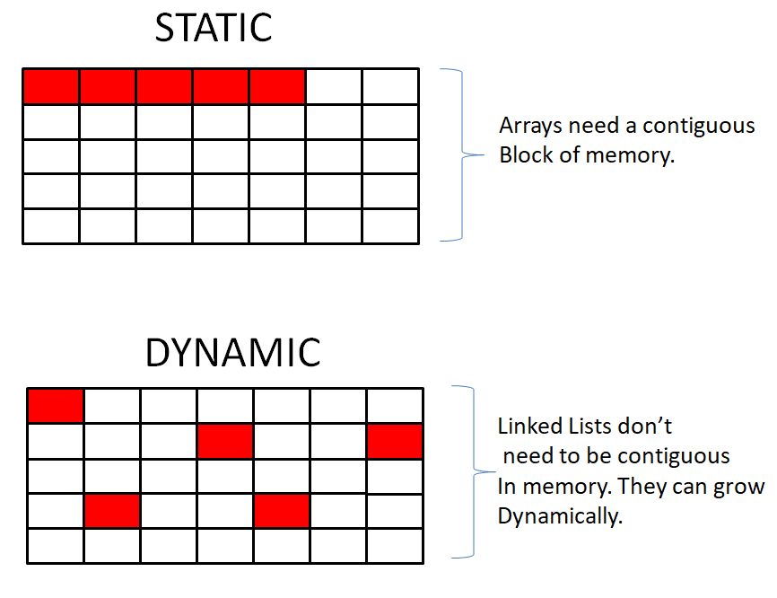
    <figcaption>Image from <a href="https://dhathriblog.medium.com/linked-list-data-structure-dc13fd807096">Dhathri Vupparapalli's blog</a>.</figcaption>
</figure>

Here is a video from [SimonDev about cache misses and hits](https://www.youtube.com/watch?v=247cXLkYt2M).

You can also read more about the [CPU's cache on Wikipedia](https://en.wikipedia.org/wiki/Cache_(computing)).

---

Memory space

`TList` takes up more memory space per each node.

Since every node needs to keep track of the next node in the list. And the next variable is a pointer, which takes up 4 bytes in 32-bit and 8 bytes in 64-bit computers.

And if you just want to use primary data types, such as (`int`, `float`, `double`, `bool` or `char`), then you can just use `TArray` instead. Whilst a `TArray` stores some overhead, it's very minimal overhead.

---

No helper functions

`TList` only offers the data element and the next node (as a pointer variable).

`TList` does **NOT** offer any helper functions for adding or removing a node in the list.

If you wish to have these functions, then you can just use `TLinkedList` instead.

---

Only goes forward

With `TList`, you can only forwards.

This is becuase there is no previous node per node. Meaning, you cannot go backwards in the list.

If you wish to go backwards, then you can just use `TDoubleLinkedList` instead.

</td></tr></table>

**Here's an example:**

Include the header file:

```cpp
#include "Containers/List.h"
```

```cpp
// Create the head of the list with data value of 69
TList<int32> Head(69);

// Create a new node with data 1337 and link it to the head
Head.Next = new TList<int32>(1337);

// Create another node with data 3 and link it to the previous node
Head.Next->Next = new TList<int32>(3);

// Re-assign the data value
Head.Next->Next->Next.Element = 420;

// Print the elements in the linked list
TList<int32>* CurrentNode = &Head;

while (CurrentNode != nullptr)
{
    UE_LOG(LogTemp, Log, TEXT("Element: %i"), CurrentNode->Element);
    CurrentNode = CurrentNode->Next;
}
```

> [!NOTE]
> `TList` doesn't offer an insert nor a remove function for each node. If you wish to use those function, then use `TLinkedList`.

> [!NOTE]
> As a rule of thumb, you should almost always use `TArray`, unless you have specific reasons to use a linked list.

You can read more about it on [Unreal's docs](https://docs.unrealengine.com/5.3/en-US/API/Runtime/Core/Containers/TList/).

#### TLinkedList

Encapsulates a link in a single linked list with constant access time.

This linked list is non-intrusive, i.e. it stores a copy of the element passed to it (typically a pointer)

**Here's an example:**

Include the header file:

```cpp
#include "Containers/List.h"
```

Define a `TLinkedList` of `int32` (integer):

```cpp
TLinkedList<int32> HeadNode;
```

Iterate over the linked list using `TIterator`:

```cpp
for (TLinkedList<int32>::TIterator It(&HeadNode); It; It.Next())
{
    // Get the value at the current position of the iterator
    int32 Value = *It;

    // Log the value.
    UE_LOG(LogTemp, Log, TEXT("Value: %i"), Value);
}
```

You can read more about it on [Unreal's docs](https://docs.unrealengine.com/5.3/en-US/API/Runtime/Core/Containers/TLinkedList/).

#### TDoubleLinkedList

It only stores three things:

```cpp
ElementType            Value;
TDoubleLinkedListNode* NextNode;
TDoubleLinkedListNode* PrevNode;
```

**Here's an example:**

Include the header file:

```cpp
#include "Containers/List.h"
```

Define a `TDoubleLinkedList` of `int32` (integers):

```cpp
TDoubleLinkedList<int32> A;
```

Add node to the head/tail of the list:

```cpp
A.AddHead(69);
A.AddTail(1337);
```

Get the number of elements in the list:

```cpp
int32 NumOfElements = A.Num();
```

Check if the list contains the value 5:

```cpp
bool bContains = A.Contains(5);
```

Find a node with value 1 in the list:

```cpp
TDoubleLinkedList<int32>::TDoubleLinkedListNode* Node = A.FindNode(1);

// Log the value of the found node
if (Node != nullptr)
{
    UE_LOG(LogTemp, Log, TEXT("Value of the node: %i"), Node->GetValue());
}
else
{
    UE_LOG(LogTemp, Log, TEXT("Node with value 1 not found."));
}
```

Get the next node and previous node in the list:

```cpp
TDoubleLinkedList<int32>::TDoubleLinkedListNode* NextNode = Node->GetNextNode();
TDoubleLinkedList<int32>::TDoubleLinkedListNode* PrevNode = Node->GetPrevNode();

// Log the values of the next and previous nodes
if (NextNode != nullptr)
{
    UE_LOG(LogTemp, Log, TEXT("Value of the next node: %i"), NextNode->GetValue());
}
else
{
    UE_LOG(LogTemp, Log, TEXT("Next node is null."));
}

if (PrevNode != nullptr)
{
    UE_LOG(LogTemp, Log, TEXT("Value of the previous node: %i"), PrevNode->GetValue());
}
else
{
    UE_LOG(LogTemp, Log, TEXT("Previous node is null."));
}
```

You can read more about it on [Unreal's docs](https://docs.unrealengine.com/5.3/en-US/API/Runtime/Core/Containers/TDoubleLinkedList/).

#### TQueue

This template implements an unbounded non-intrusive queue using a lock-free linked list that stores copies of the queued items. The template can operate in two modes: Multiple-producers single-consumer (MPSC) and Single-producer single-consumer (SPSC).

The queue is thread-safe in both modes. The `Dequeue()` method ensures thread-safety by writing it in a way that does not depend on possible instruction reordering on the CPU. The `Enqueue()` method uses an atomic compare-and-swap in multiple-producers scenarios.

**Here's an example:**

Include the header file:

```cpp
#include "Containers/Queue.h"
```

Define a `TQueue` of `FHitResult` (hit results):

```cpp
TQueue<FHitResult> MyQueue;
```

Add some elements to the queue:

```cpp
AActor* TargetActor = this;
UPrimitiveComponent* TargetComponent = this;
FVector HitLocation = FVector(900.0f, 0.0f, 500.0f);
FVector HitNormal = FVector(0.0f, 0.0f, 1.0f);

MyQueue.Enqueue(FHitResult(TargetActor, TargetComponent, HitLocation, HitNormal));
MyQueue.Enqueue(FHitResult(nullptr, nullptr, FVector::ZeroVector, FVector::OneVector.GetSafeNormal()));
```

Dequeue the first element in the queue:

```cpp
FHitResult DequeuedElement = MyQueue.Dequeue();
```

Check if the queue is empty:

```cpp
bool IsEmpty = MyQueue.IsEmpty();
```

Iterate over the queue:

```cpp
while (!MyQueue.IsEmpty())
{
    FHitResult HitResult = MyQueue.Dequeue();

    UE_LOG(LogTemp, Log, TEXT("Hit Target: %s"), *HitResult.GetActor()->GetName());
}
```

You can read more about it on [Unreal's docs](https://docs.unrealengine.com/5.3/en-US/API/Runtime/Core/Containers/TQueue/).

#### TArrayView

When you want to reuse an array without copying or referencing the base class, you can use `TArrayView`.

A statically sized view of an array of typed elements. Designed to allow functions to take either a fixed C-style array or a `TArray` with an arbitrary allocator as an argument when the function neither adds nor removes elements.

You can read more about from [Unreal's docs](https://docs.unrealengine.com/5.3/en-US/API/Runtime/Core/Containers/TArrayView/).

Here's an example:

```cpp
#include "Containers/Array.h"
#include "Containers/ArrayView.h"

#include "Algo/ForEach.h"
#include "Algo/Accumulate.h"

int32 SumArray(TArrayView<const int32> ArrayView)
{
    // Sum the array
    return Algo::Accumulate(ArrayView, 0);
}

// Allocates on heap, but returns an array on the stack
TArray<int32> RegularArray = { 1, 2, 3 };

 // Allocates on the stack
TArray<int32, TInlineAllocator<4>> StackAllocatedArray = { 1, 2, 3 };

 // Allocates on the stack
int32 CArray[4] = { 1, 2, 3 };

UE_LOG(LogTemp, Log, TEXT("Sum=%i"), SumArray(RegularArray));

UE_LOG(LogTemp, Log, TEXT("Sum=%i"), SumArray(StackAllocatedArray));

UE_LOG(LogTemp, Log, TEXT("Sum=%i"), SumArray(CArray));
```

> [!WARNING]
> `TArrayView` is a fixed size and independent array. Meaning, it will not affect from its original assignment, nor does it support Add() or Remove() functions.

> [!NOTE]
> It's still possible to use Algo library, which offers functions to use for TArrayView and TArray. Such as Algo::Reverse() and Algo::ForEach().

> [!CAUTION]
> Avoid using `TArrayView` with a temporary array variable. Since, the array can go out of scope, which then will make `TArrayView` variable invalid and point to a different memory block. This is because the view is relying on the array's memory block.

```cpp
#include "Containers/ArrayView.h"

// Note how to mark an ArrayView const!
void ConstArrayView()
{
    TArray<int32> MutableArray;
    TArrayView<int32> ArrayView = MutableArray;
    TArrayView<const int32> ConstArrayView = MutableArray;

    ArrayView[0] = 1337; // Allowed!
    ConstArrayView[0] = 69; // Compiling error!
}

// Do not create an array view to a temporary variable, as this can cause issues!
void UnsafeArrayView()
{
    // Create Array view with temporary TArray
    TArrayView<const int32> UnsafeArray = TArray<int32> { 1, 2, 3 };

    // This memory block has likely been freed, but the array view doesn't know about it!
    int32 Value = UnsafeArray[0]; // This will cause a crash!
}

// Do not modify the array while the array view is in scope! Array view is independent from the array.
void ModifyArrayView()
{
    TArray<int32> Array { 1, 2, 3 };
    TArrayView<int32> ArrayView = Array;

    int32 PreviousValue = ArrayView[0];

    Array.RemoveAt(0); // Will not update array view!

    int32 NewValue = ArrayView[0];

    bool bIsSame = PreviousValue == NewValue; // Will return true!
}
```

#### String View

`FStringView` is a lightweight, non-owning view of the string data, and copying the view itself is efficient and does not affect the underlying data. However, when you copy the `FStringView`, the new instance of the view still refers to the same original string data.

Same concept with `TArrayView` but with `FString` instead.

Here's an example:

```cpp
#include "Containers/UnrealString.h"

void ProcessString(FStringView StringView)
{
    // Use FStringView to read the string data without copying it.
    UE_LOG(LogTemp, Log, TEXT("String: %s"), *StringView);
}

FString MyString = TEXT("Hello, FStringView!");

// Pass FString as FStringView to the function without copying the data.
ProcessString(MyString);

// Copy FStringView to another variable.
FStringView CopiedStringView = MyString;

// Modifying the original FString does not affect the copied FStringView.
MyString = TEXT("Modified String");

// Print the contents of the copied FStringView.
UE_LOG(LogTemp, Log, TEXT("Copied StringView: %s"), *CopiedStringView);
```

You can read more about it on [Unreal's docs](https://docs.unrealengine.com/5.3/en-US/API/Runtime/Core/Containers/TStringView/).

#### String Builder

When working strings, you might have to concatenate a lot of string together. Sometimes, this can create complex and messy code to read. Whilst, `FString` is **mutable** and allows the developer to alter its data without copy a new instance. A string builder can still be a very helpful tool.

The string builder allocates a buffer space which is used to hold the constructed string. The intent is that the builder is allocated on the stack as a function local variable to avoid heap allocations.

The buffer is always contiguous, and the class is not intended to be used to construct extremely large strings.

This is not intended to be used as a mechanism for holding on to strings for a long time. The use case is explicitly to aid in constructing strings on the stack and subsequently passing the string into a function call or a more permanent string storage mechanism like `FString` et al.

The amount of buffer space to allocate is specified via a template parameter and if the constructed string should overflow this initial buffer, a new buffer will be allocated using regular dynamic memory allocations.

---

**There are two ways to construct a string builder**. Either with initialize buffer size or with unknown buffer size.

**Here's an example:**

Include the header file:

```cpp
#include "Containers/StringFwd.h"
```

To create a string builder with an unknown buffer size:

```cpp
FStringBuilderBase StringBuilder; // Note! This is using a regular dynamic memory allocation.
```

To create a string builder with initialize buffer size:

```cpp
int32 BufferSize = 12; // 12 characters of TCHAR
TStringBuilder<BufferSize> StringBuilder;
```

Append characters to the string builder:

```cpp
StringBuilder.Appendchar('H');
StringBuilder.Appendchar('e');
StringBuilder.Appendchar('l');
StringBuilder.Appendchar('l');
StringBuilder.Appendchar('o');
StringBuilder.Appendchar(',');
StringBuilder.Appendchar(' ');
StringBuilder.Appendchar('W');
StringBuilder.Appendchar('o');
StringBuilder.Appendchar('r');
StringBuilder.Appendchar('l');
StringBuilder.Appendchar('d');

// StringBuilder: { 'H', 'e', 'l', 'l', 'o', ',', ' ', 'W', 'o', 'r', 'l', 'd' }
```

In order to get the string either call `ToString()` or `ToView()` functions:

```cpp
FString Str = StringBuilder.ToString();
FStringView StrView = StringBuilder.ToView();
```

You can also append a string as well:

```cpp
// Note! The string builder will allocate more memory, if necessary.

// We only allocated 12 characters, and this call will make it go over bound.
// Causing to allocate more memory on heap.
StringBuilder.Append(TEXT(" and welcome!"));

// StringBuilder: { 'H', 'e', 'l', 'l', 'o', ',', ' ', 'W', 'o', 'r', 'l', 'd', ' ', 'a', 'n', 'd', ' ', 'w', 'e', 'l', 'c', 'o', 'm', 'e', '!' }
```

> [!WARNING]
> The string builder will allocate more memory, if necessary.

Here's an another example:

```cpp
TStringBuilder<256> MessageBuilder;

float PlayerHealth = 110.5285f;
MessageBuilder << TEXTVIEW("Player's health: ") << FString::SanitizeFloat(PlayerHealth);

return FString { MessageBuilder };
```

You can read more about it on [Unreal's docs](https://docs.unrealengine.com/5.3/en-US/API/Runtime/Core/Containers/TStringBuilderBase/).

#### TEnumAsByte

Template to store enumeration values as bytes in a type-safe way.

**Here's an example:**

Include the header file:

```cpp
#include "Containers/EnumAsByte.h"
```

Declare a `TEnumAsByte` with the enumeration type `ECollisionChannel`:

```cpp
TEnumAsByte<ECollisionChannel> Channel;
```

Get the value of the `TEnumAsByte`:

```cpp
ECollisionChannel Val = Channel.GetValue();
```

Get the integer value of the `TEnumAsByte`:

```cpp
int32 IntVal = Channel.GetIntValue();
```

Assign a new value to the `TEnumAsByte`

```cpp
Channel = ECollisionChannel::ECC_Camera;
```

Log the values:

```cpp
UE_LOG(LogTemp, Log, TEXT("Value of the: %i"), UEnum::GetValueAsName(Val));
UE_LOG(LogTemp, Log, TEXT("Integer value of the: %i"), IntVal);
```

> [!NOTE]
> That regular enums are supported by `UPROPERTY` and replaces the need of using `TEnumAsByte` anymore.

You can read more about it on [Unreal's docs](https://docs.unrealengine.com/5.3/en-US/API/Runtime/Core/Containers/TEnumAsByte/).

### 🧨 Value type vs Reference type

<table><tr><td>
This section was written in conjunction with ChatGPT.
</td></tr></table>

Let's talk about what value type and reference types.

In various programming languages like Python[^11], Java[^13], and C#[^12], you may have encountered both value types and reference types.

A value type creates a copy when initialized from another variable. For instance, let's consider variable A, and when we initialize variable B with the value of A, a separate copy of the value is created in B. Essentially, B is an independent entity that holds its own value.

```cpp
int A = 69;
int B = A; // A copy
```

On the other hand, a reference type directly references the memory location of the variable. In this case, when variable B is initialized by variable A, B becomes a reference to the same memory location as A. Consequently, any changes made to B will also affect A since B essentially points to the same underlying value as A.

```cpp
int A = 69;
int& B = A; // A reference
```

Everything in C++ is value type by default. Even classes, which differ from C#[^12].

You can watch this video about [references in C++ from Low Level Learning](https://www.youtube.com/watch?v=wro8Bb6JnwU).

Here's an example:

```cpp
// Test struct and class
struct Coords
{
    // Constructor: Initialize X and Y with given values
    Coords(int x, int y) : X(x), Y(y) {}

public:
    int X; // X coordinate
    int Y; // Y coordinate

public:
    // Return a string representation of this Coords struct
    std::string toString() const
    {
        // Use stringstream to concatenate strings
        std::stringstream ss;
        ss << "(" << X << ", " << Y << ")";
        return ss.str();
    }
};

int main()
{
    Coords A(1, 2); // Create struct A
    Coords& B = A; // B is a reference to A
    Coords* C = &B; // C is a pointer to A
    Coords* D = new Coords(5, 10); // Create a new Coords struct with new
    Coords* E = &(*C); // E is a pointer to what C points to

    B.X = 69; // Modify X of A through B
    C->Y = 1337; // Modify Y of A through C
    D->Y = D->Y * 2; // Modify Y of dynamically allocated struct

    E = &*D; // Make E point to what D points to
    E->X = 10; // Modify X of dynamically allocated struct

    // Print statements
    std::cout << A.toString() << std::endl;
    std::cout << B.toString() << std::endl;
    std::cout << C->toString() << std::endl;
    std::cout << D->toString() << std::endl;
    std::cout << E->toString() << std::endl;

    delete D; // Deallocate memory of dynamically allocated struct

    return 0;
}
```

With references, you can only assign them once, and they cannot be changed throughout the code. For example, you can have a direct reference to an argument passed into a function. This argument can then be modified within the function, similar to how an [out](https://learn.microsoft.com/en-us/dotnet/csharp/language-reference/keywords/out-parameter-modifier) parameter works in C#[^12].

Here's an example:

```cpp
bool DamageHealth(int& Health)
{
   Health -= 100; // Modifying the value through the reference
   return Health <= 0;
}

int PlayerHealth = 100;

if (DamageHealth(PlayerHealth)) // Passing the `PlayerHealth` as a direct reference
{
   // Player just died!
}
```

### 👈 Pointers

<table><tr><td>
This section was written in conjunction with ChatGPT.
</td></tr></table>


And lastly, we have pointers. This section, will go over about raw pointers and smart pointers. If you have no clue about pointers, highly recommend watching [Cherno about pointers](https://www.youtube.com/watch?v=DTxHyVn0ODg).

Pointers and references are similar in that they both refer to variables, but there's one key difference. Pointers are **indirect references**, meaning they can change throughout the code, pointing to different variables. On the other hand, regular references are **direct** and can only **refer to the specific variable** they were initialized with.

_In a short summary, a pointer is like writing down the address of a building on a piece of paper. The address on the paper tells you where the building is located, just as the memory address stored in the pointer variable tells you where a variable is located in memory. Similarly, you can also pass the address on the paper to someone else, allowing them to find the building too, just as you can pass a pointer variable to a function or another part of your code, allowing it to access the variable in memory._

Pointers are valuable tools in programming as they allow us to store memory addresses, enabling dynamic memory allocation and manipulation of data structures. By using pointers, we can create more flexible and efficient code that can adapt to changing data requirements during program execution.

Additionally, pointers are essential in scenarios like data structures, linked lists, and passing data to functions by reference, providing a level of control and precision that enhances the capabilities of the program. However, **it's important to handle pointers with care**, as incorrect usage can lead to **memory leaks** or **segmentation faults**.

#### 🦴 Raw pointers

A raw pointer can be sometime dangerous, because there is no validation when accessing this pointer. And when the pointer is pointing to nothing (meaning, the pointer is a `nullptr`). The program will throw a null pointer exception, also known as a segmentation fault (segfault).

A segmentation fault occurs when a program tries to access a memory location that it does not have permission to access, which can happen when the program tries to dereference a null pointer. When this happens, the operating system will usually terminate the program and generate an error message.

You can read more about [raw pointers from Microsoft Learn](https://learn.microsoft.com/en-us/cpp/cpp/raw-pointers?view=msvc-170).

To avoid this, you must check before if the pointer is valid, before using it.
> Use the function called `IsValid()` for raw pointers.

Here's an example:

```cpp
UPROPERTY()
AActor* ActorPtr = nullptr;

// Use UPROPERTY() macro, in order to tell the UHT (Unreal Header Tool), this pointer must be release into GC (garbage collector).
// If not, then this will cause a memory leak. Meaning, the pointer is still alive, even tough we are not using this memory block.

void KillActor()
{
  // IsValid() function also check if the pointer is not already destroyed by the GC (garbage collector).

  if (!IsValid(ActorPtr)) // The pointer has value of 'nullptr', therfore is NOT valid!
      return;

  ActorPtr->Destroy();
}
```

> [!NOTE]
`ActorPtr` is marked with `UPROPERTY()`in order to tell UHT[^3], that this pointer exists. When the pointer is unused, the garbage collector then marks it and deletes its memory. Also note, that this process can take a couple frames and is not instantaneously. Therefore, always use `IsValid()` function, which also checks if the pointer is not marked for the garbage collector. Avoid using manual checking, like this: `PlayerCharacter != nullptr` (since it will not work with GC system).

> [!WARNING]
> If something else is referencing `ActorPtr`, the pointer will not be destroyed via garbage collection (unless if it's a weak pointer).

After Unreal Engine (**5.0**) version, is now recommending to use `TObjectPtr` instead of `*` to mark raw pointers. `TObjectPtr` class contains some optimization for the editor.

Here is the updated code:

```cpp
UPROPERTY()
TObjectPtr<AActor> ActorPtr = nullptr;
```

#### 🤖 Smart pointers library

In Unreal Engine, the Smart Pointer's library provides a set of template classes to manage memory and object ownership more efficiently and safely. These smart pointers automatically handle memory management, such as allocating and deallocating memory, and help prevent memory leaks and null pointer dereferences.

The key smart pointers in Unreal Engine's library include `TSharedPtr`, `TWeakPtr`, and `TUniquePtr`. They are designed to handle various ownership scenarios and provide a safer alternative to raw pointers.

You can read more about [Unreal Smart Pointer Library on their docs](https://docs.unrealengine.com/5.2/en-US/smart-pointers-in-unreal-engine/).

##### TSharedPtr

`TSharedPtr` is a smart pointer that manages shared ownership of a dynamically allocated object. It uses reference counting to keep track of the number of shared references to the object and automatically releases the memory when the last reference goes out of scope.

Example:

```cpp
TSharedPtr<int32> sharedPtr = MakeShared<int32>(42);
```

##### TWeakPtr

`TWeakPtr` is a smart pointer that represents a weak reference to a dynamically allocated object. It allows accessing the object as long as it exists but does not affect the object's reference count. It is commonly used to avoid circular reference issues.

Example:

```cpp
TSharedPtr<int32> sharedPtr = MakeShared<int32>(42);
TWeakPtr<int32> weakPtr = sharedPtr;
```

##### TUniquePtr

`TUniquePtr` is a smart pointer that represents sole ownership of a dynamically allocated object. It ensures that only one pointer can own the object, and when the owning `TUniquePtr` goes out of scope, the memory is automatically deallocated.

Example:

```cpp
TUniquePtr<int32> uniquePtr = MakeUnique<int32>(42);
```

#### 🤖 Smart `UObject` pointers

Unreal Engine's Smart Pointers, such as `TSharedPtr`, `TWeakPtr`, and `TUniquePtr`, are generic smart pointers that can be used with any C++ classes or types, not limited to Unreal Engine's UObject-derived classes.

On the other hand, UObject Smart Pointers are specific to Unreal Engine's UObject-derived classes. These smart pointers, such as `TWeakObjectPtr`, `TWeakInterfacePtr`, `TSoftObjectPtr` and `TSoftClassPtr`, are designed to handle `UObject` ownership and management within the Unreal Engine ecosystem.

##### TWeakObjectPtr

This smart pointer is used to hold a weak reference to an `UObject` subclass. It allows you to safely reference an object without affecting its lifespan. It is commonly used to prevent strong references that could potentially create circular dependencies.

Example usage:

```cpp
TWeakObjectPtr<UObject> WeakPtr;

if (SomeObject.IsValid())
{
    WeakPtr = SomeObject;  // Assign weak reference to an object
}

if (WeakPtr.IsValid())
{
    // Access the object if it still exists
    WeakPtr->DoSomething();
}
```

##### TWeakInterfacePtr

This smart pointer is used to hold a weak reference to an interface implemented by an `UObject`. It allows you to safely reference the interface without affecting its lifespan.

Example usage:

```cpp
TWeakInterfacePtr<IMyInterface> WeakPtr;

if (SomeObject->Implements<IMyInterface>())
{
    WeakPtr = SomeObject;  // Assign weak reference to the interface
}

if (WeakPtr.IsValid())
{
    // Access the interface if the object still implements it
    WeakPtr->InterfaceFunction();
}
```

##### TSoftObjectPtr

This smart pointer is used to hold a soft reference to an `UObject` subclass. It is used for referencing assets that can be loaded and unloaded during runtime. Soft references do not prevent the asset from being garbage collected.

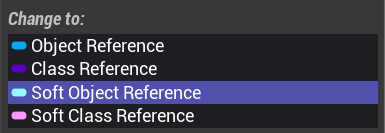

Example usage:

```cpp
TSoftObjectPtr<UTexture2D> SoftPtr; // Assign soft reference to a texture asset

if (SoftPtr.IsValid())
{
    UTexture2D* Texture = SoftPtr.LoadSynchronous(); // This will cause a lag spike (if the asset is heavily chained or large in size)

    if (Texture)
    {
        // Use the loaded texture
    }
}
```

Asynchronous Solution:

```cpp
TSoftObjectPtr<UTexture2D> SoftPtr; // Assign soft reference to a texture asset

if (SoftPtr.IsValid())
{
    OnTextureLoadedDelegate.BindLambda([]()
    {
        // Called when the texture is loaded and ready to use
        UTexture2D* Texture = SoftPtr.Get();

        if (Texture)
        {
            // Use the loaded texture as needed
        }
    });

    StreamableManager.RequestAsyncLoad(SoftPtr.ToSoftObjectPath(), OnTextureLoadedDelegate);
}
```

> [!WARNING]
> Don't use `FSoftObjectPath` or `FSoftObjectPtr`. Used for internal purpose.

##### TSoftClassPtr

This smart pointer is used to hold a soft reference to a `UClass` subclass. It is used for referencing blueprint classes or other classes that can be loaded and unloaded during runtime.

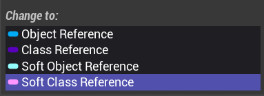

Example usage:

```cpp
TSoftClassPtr<AMyBlueprintClass> SoftPtr; // Assign soft reference to a blueprint class

if (SoftPtr.IsValid())
{
    UClass* Class = SoftPtr.LoadSynchronous(); // This will cause a lag spike (if the asset is heavily chained or large in size)

    if (Class)
    {
        // Use the loaded class
    }
}
```

Asynchronous Solution:

```cpp
TSoftClassPtr<AMyBlueprintClass> SoftPtr; // Assign soft reference to a blueprint class

if (SoftPtr.IsValid())
{
    OnBlueprintLoadedDelegate.BindLambda([]()
    {
        // Called when the blueprint class is loaded and ready to use
        UClass* BlueprintClass = SoftPtr.Get();

        if (BlueprintClass)
        {
            // Use the loaded blueprint class as needed
            AMyBlueprintClass* NewActor = GetWorld()->SpawnActor<AMyBlueprintClass>(BlueprintClass);

            if (NewActor)
            {
                // Successfully spawned the actor based on the loaded blueprint class
            }
        }
    });

    StreamableManager.RequestAsyncLoad(SoftPtr.ToSoftObjectPath(), OnBlueprintLoadedDelegate);
}
```

> [!WARNING]
> Don't use `FSoftClassPath`. Legacy code.

---

| Smart Pointer      | Type Based On      | Description                                                |
|--------------------|--------------------|------------------------------------------------------------|
| TSharedPtr         | Regular C++ Classes | Shared pointer for managing ownership of dynamically allocated objects. Allows multiple pointers to share ownership. |
| TWeakPtr           | Regular C++ Classes | Weak pointer for non-owning references to dynamically allocated objects. |
| TUniquePtr         | Regular C++ Classes | Unique pointer for exclusive ownership of dynamically allocated objects. Ensures only one pointer owns the object. |
| TWeakObjectPtr     | UObject Classes    | Weak pointer for non-owning references to UObject-derived objects. |
| TWeakInterfacePtr  | UObject Classes    | Weak pointer for non-owning references to objects implementing a specific interface. |
| TSoftObjectPtr     | UObject Classes    | Soft pointer for non-owning references to UObject-derived objects. Allows loading the object when needed, but won't prevent it from being garbage collected. |
| TSoftClassPtr      | UObject Classes    | Soft pointer for non-owning references to UClass-derived objects. Allows loading the class when needed, but won't prevent it from being garbage collected. |

<!-- prettier-ignore-end -->

## 💎 Unreal Header Tool

<table><tr><td>
This section was written in conjunction with ChatGPT.
</td></tr></table>

Unreal Header Tool (UHT[^3]) is a code generator and reflection system in Unreal Engine. It processes special macros and meta tags in C++ header files and generates additional code to support Unreal Engine's reflection system, which enables various engine features like Blueprint integration, serialization, networking, and more.

Layout:

```cpp
UPROPERTY([specifier1=setting1, specifier2, ...], [meta=(key1="value1", key2="value2", ...))])
UFUNCTION([specifier1=setting1, specifier2, ...], [meta=(key1="value1", key2="value2", ...))])
UCLASS([specifier1=setting1, specifier2, ...], [meta=(key1="value1", key2="value2", ...))])
USTRUCT([specifier1=setting1, specifier2, ...], [meta=(key1="value1", key2="value2", ...))])
UENUM([specifier1=setting1, specifier2, ...])
UPARAM([specifier1=setting1, specifier2, ...])
UMETA([specifier1=setting1, specifier2, ...])
```

| Macro     | Description                                                                                                                                                       | Use Case                                                                                                             |
| --------- | ----------------------------------------------------------------------------------------------------------------------------------------------------------------- | -------------------------------------------------------------------------------------------------------------------- |
| UPROPERTY | Specifies properties of a class member, such as replication, serialization, editability, and blueprint visibility.                                                | Used to define properties of variables within a class to control how they are handled by Unreal Engine systems.      |
| UFUNCTION | Identifies a C++ function that can be accessed and called from Blueprint visual scripting or other systems in Unreal Engine.                                      | Used to expose C++ functions to Blueprint for easy use in visual scripting and integration with Unreal Engine.       |
| UCLASS    | Defines a C++ class that is exposed to Unreal Engine's reflection system, allowing it to be used in Blueprint and other engine features.                          | Used to define classes that can be used in Blueprint and integrated into Unreal Engine systems like the Editor.      |
| USTRUCT   | Specifies a C++ struct that can be used with Unreal Engine's reflection system, making it usable in Blueprint and other engine features.                          | Used to define structs that can be used in Blueprint and integrated into Unreal Engine systems like the Editor.      |
| UENUM     | Defines a C++ enumeration that can be used with Unreal Engine's reflection system, making it usable in Blueprint and other engine features.                       | Used to define enumerations that can be used in Blueprint and integrated into Unreal Engine systems like the Editor. |
| UPARAM    | Specifies how a function parameter should be treated when used in Blueprint or other Unreal Engine systems.                                                       | Used to define parameter properties, such as Blueprint read/write access, in C++ functions exposed to Blueprint.     |
| UMETA     | Provides additional metadata for UPROPERTY, UFUNCTION, UCLASS, USTRUCT, and UENUM, allowing customization of their behavior in Unreal Engine's reflection system. | Used to attach additional information or customizations to C++ entities exposed to Unreal Engine reflection.         |

### UPROPERTY

`UPROPERTY` is a macro used to declare a property within a class that needs to be exposed to the Unreal Engine's reflection system. It allows the property to be accessed and modified by the engine and Blueprint scripts.

#### Specifiers

-   `EditAnywhere`: Allows the property to be edited in the editor and during runtime for all instances of the class.
-   `EditDefaultsOnly`: Permits editing the property only for the class's default object in the editor.
-   `EditInstanceOnly`: Enables editing the property only for instances of the class during runtime.
-   `VisibleAnywhere`: Displays the property value in the editor for all instances of the class.
-   `VisibleDefaultsOnly`: Shows the property value in the editor for the class's default object.
-   `VisibleInstanceOnly`: Displays the property value in the editor only for instances of the class.
-   `BlueprintReadOnly`: Exposes the property to Blueprint scripts, but only for reading, not writing.
-   `BlueprintReadWrite`: Exposes the property to Blueprint scripts for both reading and writing.
-   `Category`: Organizes properties into named categories in the editor for better organization and readability.
-   `EditFixedSize`: Specifies that an `TArray` or `TMap` property should be editable in the Details Panel of the Unreal Editor with a fixed number of elements, preventing addition or removal.
-   `Transient`: Indicates that a property should not be serialized, making it non-persistent and not saved when saving the state of the object.
-   `Replicated`: Automatically replicates the property's value to clients in a multiplayer environment when the property changes on the server.
-   `ReplicatedUsing`: Specifies a custom function that should be called on both the server and clients to handle replication of the property's value.
-   `SimpleDisplay`: Indicates that the property's value should be displayed in a simple and concise manner in editor UI.
-   `AdvancedDisplay`: Indicates that the property's value should be displayed with advanced options in editor UI.
-   `Config`: Marks the property to be serialized to the project configuration file for external customization.
-   `GlobalConfig`: Marks the property to be serialized to the global configuration file for external customization across all projects.

#### Meta tags

-   `DisplayName`: Sets a custom display name for the property in the Unreal Editor.
-   `Tooltip`: Provides a tooltip description for the property in the Unreal Editor.
-   `ClampMin`: Sets the minimum allowed value for the property in the Unreal Editor.
-   `ClampMax`: Sets the maximum allowed value for the property in the Unreal Editor.
-   `AllowPrivateAccess`: Allows access to private members within the class it belongs to.
-   `Units`: Provides a human-readable unit label for the property in the Unreal Editor.

#### Examples

```cpp
UPROPERTY(EditAnywhere, Category="Hello|Cruel|World")
int32 EditAnywhereNumber;
```

```cpp
UPROPERTY(Transient, Replicated)
int32 CurrentHealth;

UPROPERTY(Transient, ReplicatedUsing=OnArmorChanged)
int32 CurrentArmor;

UFUNCTION()
void OnArmorChanged();
```

```cpp
UPROPERTY(EditAnywhere, SimpleDisplay)
int32 MaxHealth = 100;

UPROPERTY(EditAnywhere, AdvancedDisplay)
float HealthRegenerationTime = 5.0f;
```

```cpp
// Must mark UCLASS with Config specifier

// Config can be overriden from the base class.
UPROPERTY(Config, BlueprintReadOnly)
bool bRegenerateHealth;

// GlobalConfig CANNOT be overridden from the base class.
UPROPERTY(GlobalConfig, BlueprintReadOnly)
bool bEnableHealthSimulation;
```

```cpp
UPROPERTY(EditAnywhere, EditFixedSize)
TArray<FName> Usernames = { TEXT("JohnDoe"), TEXT("MrRobin"), TEXT("JaneDoe") };
```

```cpp
UPROPERTY(EditAnywhere, meta=(Units="Celsius"))
float CookingTemperature;

UPROPERTY(EditAnywhere, meta=(Units="Kilograms"))
float TigerWeight;

UPROPERTY(EditAnywhere, meta=(Units="GB"))
float DiskSpace;

UPROPERTY(EditAnywhere, meta=(Units="Percent"))
float Happiness;

UPROPERTY(EditAnywhere, meta=(Units="times"))
float Deliciousness;
```

You can read more about [UPROPERTY by BenUi](https://benui.ca/unreal/uproperty/).

### UFUNCTION

`UFUNCTION` is a macro used to declare a function within a class that needs to be exposed to the Unreal Engine's reflection system. It allows the function to be used in Blueprint scripts and network replication.

#### Common Specifiers

-   `BlueprintCallable`: Exposes the function to Blueprint scripts, allowing it to be called from within Blueprint graphs.
-   `BlueprintPure`: Indicates that the function is a pure computation and does not modify any state, making it safe to use in Blueprint graphs without side effects.
-   `BlueprintImplementableEvent`: Serves as a placeholder function in C++ that can be overridden and implemented in Blueprint.
-   `BlueprintNativeEvent`: Similar to `BlueprintImplementableEvent`, but it also provides a C++ implementation that can be optionally overridden in Blueprint.
-   `Category`: Organizes properties into named categories in the editor for better organization and readability.

#### Common Meta tags

-   `DisplayName`: Sets a custom display name for the function in the Unreal Editor.
-   `Tooltip`: Provides a tooltip description for the function in the Unreal Editor.
-   `ShortToolTip`: Provides a short tooltip description for the function in the Unreal Editor.
-   `AllowPrivateAccess`: Allows access to private members within the class it belongs to.
-   `HideSelfPin`: Hides the "self" pin, which indicates the object on which the function is being called. The "self" pin is automatically hidden on `BlueprintPure` functions that are compatible with the calling Blueprint's Class. Functions that use the `HideSelfPin` Meta Tag frequently also use the `DefaultToSelf` Specifier.
-   `BlueprintInternalUseOnly`: This function is an internal implementation detail, used to implement another function or node. It is never directly exposed in a Blueprint graph.
-   `BlueprintProtected`: This function can only be called on the owning Object in a Blueprint. It cannot be called on another instance.
-   `DeprecatedFunction`: Any Blueprint references to this function will cause compilation warnings telling the user that the function is deprecated. You can add to the deprecation warning message (for example, to provide instructions on replacing the deprecated function) using the `DeprecationMessage` metadata specifier.

#### Examples

```cpp
UFUNCTION(BlueprintPure)
int32 BlueprintPureFunction();

UFUNCTION(BlueprintCallable)
int32 BlueprintCallableFunction();

UFUNCTION(BlueprintCallable)
int32 BlueprintCallableConstFunction() const;

UFUNCTION(BlueprintPure=false)
int32 BlueprintPureFalseFunction() const;
```

```cpp
UFUNCTION(BlueprintCallable, Category = "Doggy Daycare", meta=(ReturnDisplayName = "Success"))
bool TryPetDog(const FName Name);
```

You can read more about [UPROPERTY by BenUi](https://benui.ca/unreal/ufunction/).

### UCLASS

`UCLASS` is a macro used to declare a class that is intended to be used in Unreal Engine's reflection system. It allows the class to be instantiated, exposed to Blueprint, and used in various engine systems.

#### Common Specifiers

-   `Blueprintable`: Allows the class to be used as a blueprint in the Unreal Editor.
-   `BlueprintType`: Specifies that the class can be instantiated and manipulated in Blueprint scripts.
-   `Abstract`: Indicates that the class is an abstract class and cannot be instantiated directly.
-   `Transient`: Excludes the class from being serialized and saved in the game's persistent data.
-   `MinimalAPI`: Restricts the class's visibility for export, making it more suitable for engine internal use.
-   `NotBlueprintType`: Prevents the class from being used as a blueprint.

#### Common Meta tags

-   `DisplayName`: Sets a custom display name for the class in the Unreal Editor.
-   `ToolTip`: Provides a tooltip description for the class in the Unreal Editor.
-   `HideCategories`: Hides specific property categories from being displayed in the Unreal Editor.
-   `ClassGroup`: Assigns the class to a specific group in the Unreal Editor's class picker.
-   `IncludePath`: Specifies the include path for the generated code of the class.
-   `BlueprintSpawnableComponent`: Marks a class derived from `USceneComponent` as spawnable in Blueprint.

#### Examples

```cpp
UCLASS(Blueprintable)
class MyActor : public AActor
{
    GENERATED_BODY()

public:
    UPROPERTY(EditAnywhere, BlueprintReadWrite, Category = "MyActor")
    int32 MyIntProperty;

    UPROPERTY(EditAnywhere, BlueprintReadWrite, Category = "MyActor")
    float MyFloatProperty;

    UPROPERTY(EditAnywhere, BlueprintReadWrite, Category = "MyActor")
    FString MyStringProperty;

    UPROPERTY(EditAnywhere, BlueprintReadWrite, Category = "MyActor")
    FMyStruct MyStructProperty;
};
```

</td></tr></table>

You can read more about [UCLASS by BenUi](https://benui.ca/unreal/uclass/).

### USTRUCT

`USTRUCT` is a macro used to declare a C++ struct that is intended to be used in Unreal Engine's reflection system. It enables the struct to be used as a property within UCLASSes and exposed to Blueprint.

#### Common Specifiers

-   `BlueprintType`: Specifies that the structure can be used in Blueprint scripts.
-   `Atomic`: Ensures that the structure is treated as an atomic type for replication in multiplayer games.
-   `NotReplicated`: Excludes the structure from being replicated across the network.

#### Common Meta tags

-   `DisplayName`: Sets a custom display name for the structure in the Unreal Editor.
-   `ToolTip`: Provides a tooltip description for the structure in the Unreal Editor.
-   `Category`: Specifies the category in which the structure will appear in the Unreal Editor.

#### Examples

```cpp
USTRUCT(BlueprintType)
struct FMyStruct
{
    GENERATED_BODY()

    UPROPERTY(BlueprintReadWrite, Category = "MyStruct")
    int32 Value1;

    UPROPERTY(BlueprintReadWrite, Category = "MyStruct")
    FString Value2;
};
```

</td></tr></table>

You can read more about [USTRUCT by BenUi](https://benui.ca/unreal/ustruct/).

### UENUM

`UENUM` is a macro used to declare an enumeration that is intended to be used in Unreal Engine's reflection system. It allows the enumeration to be exposed to Blueprint and used within `UCLASS`es.

#### Common Specifiers

-   `BlueprintType`: Specifies that the enumeration can be used in Blueprint scripts.
-   `DisplayNames`: Specifies a list of custom display names for each enumeration value in the Unreal Editor.

#### Common Meta tags

-   `DisplayName`: Sets a custom display name for the enumeration in the Unreal Editor.
-   `ToolTip`: Provides a tooltip description for the enumeration in the Unreal Editor.
-   `Hidden`: Hides the enumeration from being displayed in the Unreal Editor.
-   `Bitflags`: Indicates that the enumeration represents a set of bit flags.
-   `EnumRange`: Specifies the minimum and maximum values for the enumeration.

#### Examples

```cpp
UENUM(BlueprintType)
enum class EWeaponType
{
    Sword         UMETA(DisplayName = "Sword Weapon"),
    Axe           UMETA(DisplayName = "Axe Weapon"),
    Bow           UMETA(DisplayName = "Bow Weapon"),
    Wand          UMETA(DisplayName = "Magic Wand"),
};
```

You can read more about [UENUM by BenUi](https://benui.ca/unreal/uenum/).

### UPARAM

`UPARAM` is a macro used to provide additional information to the Unreal Header Tool. It is used with parameters of UFUNCTION and UPROPERTY to specify how the engine should handle the data.

-   `UPARAM(Ref)`: Used to mark a parameter that is passed by reference. It ensures that the parameter is treated as a reference during code generation, which may affect how the engine handles the parameter.

-   `UPARAM(DisplayName)`: Used to set a custom display name for a function parameter when it appears in the Unreal Editor's Blueprint node graph.

-   `UPARAM(BlueprintCallable, BlueprintPure)`: Used to apply multiple specifiers to a function parameter. For example, to mark a parameter as both BlueprintCallable and BlueprintPure.

-   `UPARAM(meta = (CustomMetaTag))`: Allows developers to create custom meta tags and use them in function parameters to provide additional information to the Unreal Header Tool.

#### Examples

```cpp
UCLASS()
class MyActor : public AActor
{
    GENERATED_BODY()

public:
    // A function that takes a parameter passed by reference
    UFUNCTION(BlueprintCallable, Category = "MyActor")
    void ModifyValue(UPARAM(Ref) int32& ValueToModify)
    {
        // Modify the value passed by reference
        ValueToModify *= 2;
    }
};
```

You can read more about [UPARAM by BenUi](https://benui.ca/unreal/uparam/).

### UMETA

`UMETA` is a macro used to specify additional metadata for an UENUM entry. It allows adding custom information to enum values for use in Blueprint, UI, and other engine systems.

#### Common Specifiers

-   `DisplayName`: Sets a custom display name for the enumeration value in the Unreal Editor.
-   `ToolTip`: Provides a tooltip description for the enumeration value in the Unreal Editor.
-   `Hidden`: Hides the enumeration value from being displayed in the Unreal Editor.
-   `DisplayPriority`: Specifies the display priority for the enumeration value in the Unreal Editor.
-   `DisplayThumbnail`: Allows attaching a custom thumbnail image to the enumeration value in the Unreal Editor.
-   `CustomMetaData`: Specifies custom metadata that developers can define and use as needed.

#### Examples

```cpp
UENUM(BlueprintType)
enum class EMyEnum
{
    Value1 UMETA(DisplayName = "First Value", ToolTip = "This is the first value"),
    Value2 UMETA(DisplayName = "Second Value", ToolTip = "This is the second value"),
    Value3 UMETA(Hidden),
};
```

You can read more about [UMETA by BenUi](https://benui.ca/unreal/umeta/).

## 👷 Constructors, destructors and initialization

<table><tr><td>
This section was written in conjunction with ChatGPT.
</td></tr></table>

#### Constructors

Constructors are special member functions in C++ that are automatically called when an object is created. They are used to initialize the object's data members and set up its initial state. Constructors have the same name as the class and can be overloaded to take different sets of parameters, allowing for object initialization in various ways.

Here's an example:

```cpp
/**
 * This is a simple C++ class that demonstrates how to define a constructor.
 * Constructors are special member functions in C++ that are automatically
 * called when an object is created. They are used to initialize the object's
 * data members and set up its initial state.
 *
 * In Unreal Engine, you can define constructors and destructors in C++ classes
 * just like in standard C++. Constructors are useful for initializing
 * properties and setting up components when an object is created, while
 * destructors can be used for cleanup tasks like releasing resources or
 * stopping background processes when an object is destroyed.
 *
 * NOTE; Don't clean up UObject memory! As Unreal's garbage collector does this for you. Interfering with Unreal's GC can cause issue and even crashes.
 */
class RegularClass
{
    RegularClass()
    {
        // This constructor is called automatically,
        // when an instance of RegularClass is created.

        // It is used to initialize the object's data members,
        // and set up its initial state.
    }
};
```

#### Destructors

Destructors are another type of special member function in C++ that is automatically called when an object is destroyed or goes out of scope. They are used to perform cleanup tasks, release resources, and deallocate memory allocated during the object's lifetime. Like constructors, destructors have the same name as the class, preceded by a tilde (<kbd>~</kbd>).

Here's an example:

```cpp
/**
 * The destructor is a special member function in C++ that is automatically called
 * when an object is destroyed or goes out of scope. It is used to perform cleanup
 * tasks, release resources, and deallocate memory allocated during the object's
 * lifetime.
 *
 * In Unreal Engine, it is generally advised not to use destructors explicitly
 * for memory cleanup. Instead, Unreal Engine provides other mechanisms, such as
 * `BeginDestroy` and `EndPlay`, to handle object cleanup and resource release when
 * an object is destroyed or removed from the game world.
 */
class RegularClass
{
public:

    ~RegularClass()
    {
        // Destructor called when an instance of RegularClass is destroyed.
        // Or goes out of scope (curly brackets).
    }
};
```

#### Constructors and destructors in UE

In Unreal Engine, you can define constructors and destructors in C++ classes just like in standard C++. Constructors are useful for initializing properties and setting up components when an object is created, while destructors can be used for cleanup tasks like releasing resources or stopping background processes when an object is destroyed.

However, Unreal Engine has its own garbage collection system that automatically manages memory and deallocation of objects. This means that using destructors for memory deallocation or resource cleanup may interfere with the garbage collection process and lead to unexpected behavior or crashes.

Due to the automatic garbage collection in Unreal Engine, it is generally advised not to use destructors explicitly for memory cleanup. Instead, Unreal Engine provides other mechanisms, such as `BeginDestroy` and `EndPlay`, to handle object cleanup and resource release when an object is destroyed or removed from the game world.

Here's an example:

```cpp
#include "MyActor.h"

#include "GameFramework/Actor.h"
#include "GameFramework/MovementComponent.h"

AMyActor::AMyActor()
{
    // Set this actor to call Tick() every frame. You can turn this off to improve performance if you don't need it.
    PrimaryActorTick.bCanEverTick = false;

    // This is the default constructor for an Actor class in Unreal Engine.
    // You can initialize properties and set up components here.

    RootComponent = CreateDefaultSubobject<USceneComponent>("SceneComponent");

    MeshComponent = CreateDefaultSubobject<UStaticMeshComponent>(TEXT("MeshComponent"));
    MeshComponent->SetupAttachment(RootComponent);
    MeshComponent->bCastDynamicShadow = false;

    checkf(MeshComponent, TEXT("MeshComponent cannot be a nullptr!"));
    verifyf(MeshComponent, TEXT("MeshComponent cannot be a nullptr!"));
    ensureMsgf(MeshComponent, TEXT("MeshComponent cannot be a nullptr!"));

    // Cast<T> has to be used for *UObjects* due to type safety; it will return *nullptr* in case of a failure in comparison with *StaticCast()*. StaticCast is just a wrapper to *static_cast* function.
    if (UMovementComponent* MeshAsMovementComponent = Cast<UMovementComponent>(MeshComponent))
    {
        // Cast worked!

        MeshAsMovementComponent->bSnapToPlaneAtStart = true;
    }

    UStaticMeshComponent* RootAsActorComponent = CastChecked<UActorComponent>(RootComponent); // Cast must work, otherwise a crash will occur.
}

void AMyActor::BeginPlay()
{
    Super::BeginPlay();

    // This function is automatically called when the actor is spawned or added to the world.
    // You can perform any necessary setup or initialization here.
}

void AMyActor::EndPlay(const EEndPlayReason::Type EndPlayReason)
{
    // This function is automatically called when the actor is removed from the world or destroyed.
    // You can perform cleanup and resource release here.

    Super::EndPlay(EndPlayReason);
}
```

#### Initialization

In C++, initialization refers to the process of assigning an initial value to a variable when it is declared. Initialization is crucial because it ensures that variables have well-defined starting values, which can help avoid unexpected behavior and improve code clarity.

Here's a code snippet that demonstrates:

```cpp
// Initialization using assignment statement
int num1 = 10;

// Initialization using brace initializer
int num2{20};
```

There is an **important** difference when using brace initializer, especially in cases where narrowing conversions are involved. A narrowing conversion occurs when a value is assigned to a variable that has a smaller range than the provided value. For example:

```cpp
int num3 = 1000;       // OK, no narrowing conversion
int num4 = 1000.5;     // OK, narrowing conversion from double to int
int num5{1000.5};      // Error, narrowing conversion from double to int
```

In the last line, using brace initializer, the compiler will generate an error because it detects a narrowing conversion from `double` to `int`, which could potentially lead to data loss. This is a safety feature to help catch unintended data truncation.

## 🏛 Create custom class

<table><tr><td>
This section was NOT written in conjunction with ChatGPT.
</td></tr></table>

<figure>
    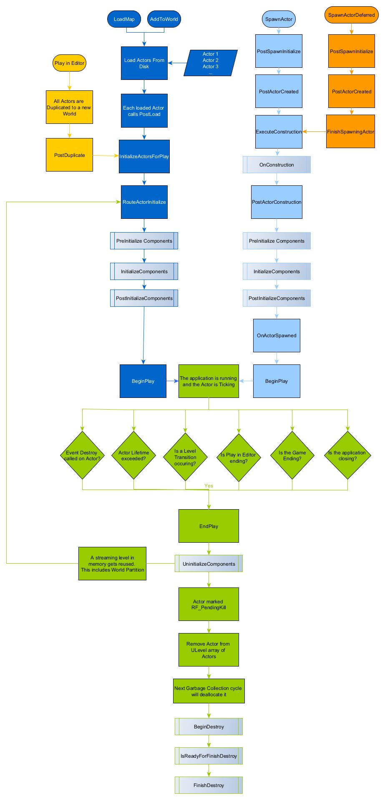
    <figcaption>Lifecycle breakdown</figcaption>
</figure>

You can read more about [Actor's lifecycle at Unreal's docs](https://docs.unrealengine.com/5.3/en-US/unreal-engine-actor-lifecycle/).

### AActor

By inheriting from `AActor` class, you have these popular functions:

```cpp
/**
 * This function is called after the class's constructor, inside the Editor.
 * It's a safe way to initialize components inside the editor.
 */
void PostInitComponents();

/**
 * "Awake/Start" method
 *
 * This function is called when an actor is spawned or respawned.
 *
 * It's the perfect place to set up default values for your actor's
 * properties, initialize components, and start any asynchronous work
 * that needs to occur when the actor is first created.
 */
void BeginPlay();

/**
 * "Update" method
 *
 * This function is called every frame, with the time since the last
 * update as its parameter.
 *
 * Use this function to update your actor's state, like checking
 * whether it's colliding with something or not.
 *
 * NOTE; Try to avoid overusing Tick() function. Since, Unreal's core logic, is simply as runs for loop and calling each function for each lickable UObject. Which can be very expensive, with many and unnecessary update calls.
 * Here are some tips to overcome this issue:
 *      - Change your workflow to an event based driven system. Either by using delegates or single call functions.
 *      - Change your tick interval to a slower interval. If you require for UObject to tick, but don't require updating a single frame (then this is a perfect fit).
 *
 * @param DeltaTime Time since last update
 */
void Tick(float DeltaTime);

/**
 * "Destroy" method
 *
 * This function is called when an actor is destroyed, or when it's
 * forced to be destroyed (e.g. when its outermost `UWorld` is shut
 * down).
 *
 * It's a good place to clean up any resources that your actor
 * allocated during its lifetime. Like delegates (NOTE; some delegates are bind directly to UObject and don't require to unbind directly).
 */
void EndPlay();

/**
 * Returns the location of the RootComponent of this Actor
 *
 * @return Location of the RootComponent
 */
FVector GetActorLocation() const;

/**
 * Returns the rotation of the RootComponent of this Actor
 *
 * @return Rotation of the RootComponent
 */
FRotator GetActorRotation() const;

/**
 * Returns the Actor's world-space scale.
 *
 * @return The world-space scale of the actor
 */
FVector GetActorScale3D() const;

/**
 * Getter for the cached world pointer, will return null if the actor is not actually spawned in a level
 *
 * @return The world pointer
 */
UWorld* GetWorld() const;

/**
 * Get the owner of this Actor, used primarily for network replication.
 *
 * @return The owner of this Actor
 */
AActor* GetOwner() const;

/**
 * Find all Actors which are attached directly to a component in this actor
 *
 * @param[out] OutActors       The array to fill with the attached actors
 * @param bResetArray          Whether to reset the array before adding new Actors
 * @param bRecursivelyIncludeAttachedActors Whether to include attached actors of attached actors also
 */
void GetAttachedActors(TArray<AActor*>& OutActors, bool bResetArray = true, bool bRecursivelyIncludeAttachedActors = false) const;

/**
 * Get all components derived from specified ComponentClass and fill in the OutComponents array with the result.
 *
 * @tparam AllocatorType       The allocator type to use for OutComponents
 * @tparam ComponentType       The type of the components to get
 * @param ComponentClass       The class of the components to get
 * @param[out] OutComponents  The array to fill with the found components
 * @param bIncludeFromChildActors Whether to include components from Child Actors also
 */
template<class AllocatorType, class ComponentType>
void GetComponents(TSubclassOf<UActorComponent> ComponentClass, TArray<ComponentType*, AllocatorType>& OutComponents, bool bIncludeFromChildActors = false) const;

/**
 * Searches components array and returns first encountered component of the specified class
 *
 * @param ComponentClass    The class of the component to search for
 * @return The found component or nullptr if not found
 */
UActorComponent* GetComponentByClass(TSubclassOf<UActorComponent> ComponentClass) const;
```

### UActorComponent

By inheriting from `UActorComponent` class, you have these popular functions:

```cpp
/**
 * Returns the owner of this component
 *
 * @return Owner of this component
 */
UObject* GetOwner() const;

/**
 * Returns the SceneComponent this component is attached to, or nullptr if not attached.
 *
 * @return The SceneComponent this component is attached to, or nullptr if not attached
 */
UWorld* GetWorld() const;

/**
 * Returns whether the component is active or not
 */
bool IsActive() const;

/**
 * Returns whether this component has tick enabled or not
 */
bool IsComponentTickEnabled() const;

/**
 * Activates the SceneComponent, should be overridden by native child classes.
 *
 * @param bReset If true, reset the component before activating it
 */
void Activate(bool bReset);

/**
 * Deactivates the SceneComponent.
 */
void Deactivate();

/**
 * Set this component's tick functions to be enabled or disabled.
 *
 * @param bEnabled If true, enable the tick functions, otherwise disable
 */
void SetComponentTickEnabled(bool bEnabled);

/**
 * Sets the tick interval for this component's primary tick function.
 *
 * @param TickInterval The tick interval in seconds
 */
void SetComponentTickInterval(float TickInterval);

/**
 * Function called every frame on this ActorComponent.
 *
 * @param DeltaTime The time since the last frame in seconds
 * @param TickType The kind of tick this is (LEVELTICK_All, LEVELTICK_Editor, LEVELTICK_TimeOnly)
 * @param ThisTickFunction Pointer to the original function that is being called
 */
void TickComponent(float DeltaTime, enum ELevelTick TickType, FActorComponentTickFunction* ThisTickFunction);
```

### USceneComponent

By inheriting from `USceneComponent` class, you have these popular functions:

```cpp
/**
 * Returns the SceneComponent this component is attached to, or nullptr if not attached.
 *
 * @return The SceneComponent this component is attached to, or nullptr if not attached
 */
USceneComponent* GetAttachmentRoot() const;

/**
 * Detaches this component from its parent component.
 *
 * @param bMaintainWorldTransform Whether to maintain the world transform of this component
 */
void DetachFromComponent(bool bMaintainWorldTransform = false);

/**
 * Attaches this component to the supplied parent component.
 *
 * @param Parent                The component to attach to
 * @param SocketName            If the parent is a USkeletalMeshComponent, this is the name of the socket to attach to
 * @param AttachLocation        The location in world space to attach this component
 */
void AttachToComponent(USceneComponent* Parent, FName SocketName = NAME_None, const FAttachmentTransformRules& AttachRules = AttachmentTransformRules::KeepRelativeTransform);

/**
 * Attaches this component to the supplied parent component.
 *
 * @param Parent                The component to attach to
 * @param AttachLocation        The location in world space to attach this component
 */
void AttachToComponent(USceneComponent* Parent, const FTransform& AttachLocation, const FAttachmentTransformRules& AttachRules  FAttachmentTransformRules::KeepRelativeTransform);

/**
 * Attaches this component to the supplied parent component.
 *
 * @param Parent                The component to attach to
 */
void AttachTo(USceneComponent* Parent);

/**
 * Attaches this component to the supplied parent component.
 *
 * @param Parent                The component to attach to
 */
void AttachTo(AActor* Parent);

/**
 * Attaches this component to the supplied parent component.
 *
 * @param Parent                The component to attach to
 */
void AttachToComponent(UActorComponent* Parent, const FAttachmentTransformRules& AttachRules = AttachmentTransformRules::KeepRelativeTransform);

/**
 * Attaches this component to the supplied parent component.
 *
 * @param Parent                The component to attach to
 */
void AttachToComponent(UActorComponent* Parent, const FTransform& AttachLocation, const FAttachmentTransformRules& AttachRules  FAttachmentTransformRules::KeepRelativeTransform);

/**
 * Attaches this component to the supplied parent component.
 *
 * @param Parent                The component to attach to
 */
void AttachTo(UActorComponent* Parent);

/**
 * Returns true if this component is currently attached to the supplied component
 *
 * @param InComponent           The component to check against
 * @return                      true if this component is currently attached to InComponent
 */
bool IsAttachedTo(const USceneComponent* InComponent) const;

/**
 * Returns true if this component is currently attached to the supplied component
 *
 * @param InComponent           The component to check against
 * @return                      true if this component is currently attached to InComponent
 */
bool IsAttachedTo(const UActorComponent* InComponent) const;

/**
 * Returns the Component to World transform, calculated from this component's AttachmentTransform,
 * unless overridden by any parents.
 */
const FTransform& GetComponentToWorld() const;

/**
 * Returns the Component to World transform, calculated from this component's AttachmentTransform,
 * unless overridden by any parents.
 */
FTransform CalcNewComponentToWorld(const FTransform& NewAttachmentTransform) const;
```

### APawn

By inheriting from `APawn` class, you have these popular functions:

```cpp

/**
 * Add movement input along the given world direction vector (usually normalized) scaled by 'ScaleValue'.
 *
 * This function is used to control movement of an actor without using physics or movement components.
 * For example, it can be used to move a character in a top-down game.
 *
 * @param WorldDirection Direction vector (in world space) in which movement is input.
 * @param ScaleValue Scale value for the input.
 * @param bForce If `true`, forces the input to be applied even if the component is not moving.
 */
void AddMovementInput(FVector WorldDirection, float ScaleValue, bool bForce);

/**
 * Add input (affecting Yaw) to the Controller's ControlRotation, if it is a local PlayerController.
 *
 * This function is used to control rotation of an actor without using a camera component.
 * For example, it can be used to rotate a character in a first-person shooter game.
 *
 * @param Val Input value (affecting Yaw) to be applied to the Controller's ControlRotation.
 */
void AddControllerYawInput(float Val);

/**
 * Add input (affecting Pitch) to the Controller's ControlRotation, if it is a local PlayerController.
 *
 * This function is used to control rotation of an actor without using a camera component.
 * For example, it can be used to rotate a character in a first-person shooter game.
 *
 * @param Val Input value (affecting Pitch) to be applied to the Controller's ControlRotation.
 */
void AddControllerPitchInput(float Val);

/**
 * Add input (affecting Roll) to the Controller's ControlRotation, if it is a local PlayerController.
 *
 * This function is used to control rotation of an actor without using a camera component.
 * For example, it can be used to rotate a character in a first-person shooter game.
 *
 * @param Val Input value (affecting Roll) to be applied to the Controller's ControlRotation.
 */
void AddControllerRollInput(float Val);

/**
 * Returns velocity (in cm/s (Unreal Units/second) of the rootcomponent if it is either using physics or has an associated ovementComponent
 *
 * This function is used to get the current velocity of an actor.
 *
 * @return Current velocity of the actor's root component (in cm/s (Unreal Units/second) or (0, 0, 0) if it doesn't have any ovement components.
 */
FVector GetVelocity();
```

### UObject

By inheriting from `UObject` class, you have these popular functions:

```cpp
/**
 * Returns the name of this object (with no path information)
 *
 * Name of the object.
 *
 * @return Name of the object (with no path information).
 */
FString GetName() const;

/**
 * Returns the UClass that defines the fields of this object
 *
 * @return UClass that defines the fields of this object.
 */
UClass* GetClass();

/**
 * Returns the UObject this object resides in (e.g. parent object)
 *
 * @return UObject this object resides in (e.g. parent object).
 */
UObject* GetOuter();

/**
 * Checks to see if the object appears to be valid
 *
 * @return true if the object appears to be valid, false otherwise.
 */
bool IsValidLowLevel();

/**
 * Returns true if this object is of the specified type.
 *
 * @param SomeBase The class to check this object against.
 * @return true if this object is of the specified type, false otherwise.
 */
template<typename OtherClassType>
bool IsA(OtherClassType SomeBase) const;
```

<!-- prettier-ignore-start -->

## 🏛 Create custom interface

<table><tr><td>
This section was NOT written in conjunction with ChatGPT.
</td></tr></table>

Interface are very useful for handling functions in a generic way. It allows you to create a contract with specified functions, which a programmer can extend on top of a specified class.

For an example, IVehicle can contain functions such as `Honk()` or `StallEngine()`. However, these functions can be implemented in a range of classes. Such as `ACarPawn` or `ABoatPawn`.

When calling the interface function in C++, Unreal will check if the type extends the interface. If not, the call gets skipped. This allows you to call the interface function on `UObject` and is not limited to only types of `ACarPawn` or `ABoatPawn`.

This also allows you to extend the interface inside Blueprint instead. For an example, you don't have to create the interface logic inside C++, but rather create the logic at Blueprint level instead.

### Creating interface inside C++

Here's a template file for creating an interface inside C++:

```cpp
// IVehicle.h

#pragma once

#include "CoreMinimal.h"
#include "UObject/Interface.h"
#include "IVehicle.generated.h"

/*
This class does not need to be modified.
Empty class for reflection system visibility.
Uses the UINTERFACE macro.
Inherits from UInterface.
*/
UINTERFACE(MinimalAPI, Blueprintable)
class UVehicle : public UInterface
{
    GENERATED_BODY()
};

/* Actual Interface declaration. */
class IVehicle
{
    GENERATED_BODY()

    // Add interface functions to this class. This is the class that will be inherited to implement this interface.

public:
    // Add interface function declarations here

    // BlueprintNativeEvent - Allows you to overwrite the function in either C++ or Blueprint
    // BlueprintImplementableEvent - Allows the function to only be overwritten in Blueprint

    UFUNCTION(BlueprintNativeEvent, BlueprintCallable, Category = "Vehicle")
    void Honk();

    UFUNCTION(BlueprintImplementableEvent, BlueprintCallable, Category = "Vehicle")
    void StallEngine();

    UFUNCTION(BlueprintImplementableEvent, BlueprintCallable, Category = "Vehicle")
    void Explode(bool bForce = true);
};
```

> [!WARNING]
> `BlueprintNativeEvent` allows you to overwrite the function in either C++ or Blueprint, but if you use `BlueprintImplementableEvent` it only allows the function to only be overwritten in Blueprint.

### Extending the interface function:

When adding an interface class to a C++ class, you must use the suffix of `_Implementation` for all the functions that you are overwriting. Otherwise, UHT will not recognize the function.

Here's an example, of extending the interface functions inside C++:

```cpp
// ACarPawn.h

#include "CoreMinimal.h"
#include "GameFramework/Pawn.h"
#include "IVehicle.h" // Include the interface's header
#include "CarPawn.generated.h"

UCLASS()
class ACarPawn : public APawn, public IVehicle
{
protected:
    void Honk_Implementation();
    void StallEngine_Implementation();
    void Explode_Implementation(bool bForce);
};
```

```cpp
// ACarPawn.cpp

void ACarPawn::Honk_Implementation()
{
    // Add code here...
}

void ACarPawn::StallEngine_Implementation()
{
    // Add code here...
}

void ACarPawn::Explode_Implementation(bool bForce)
{
    // Add code here...
}
```

### Calling the interface function

When calling the interface function inside C++, you are required to call the function with a prefix of `Execute`. If you don't use the prefix, you will get a warning from Unreal Engine.

> [!NOTE]
> You are calling the interface function from the interface itself. Meaning, instead of `ACarPawn->Explode()`, which is an interface function. You must call the function as: `IVehicle::Execute_Explode()` instead. With the parameter being on what object you want the interface function to be called on.

```cpp
UObject* CarObject = nullptr; // The UObject, that you wish to call the function on.
const bool bForce = true; // Parameters

// The syntax for calling the interface function
IVehicle::Execute_Explode(CarObject, bForce);
```

### Reference to an interface object

If you ever wish to reference an interface object, you then must you `TScriptInterface<>`, which works both for C++ and Blueprint. However, if you wish to have a pointer to the interface, you may want to use the `TWeakInterfacePtr` instead. Note, that this pointer is weak. Meaning, the weak pointer will not prevent destruction of the object it references.

For more information on weak pointers, you can read at [💾 Soft vs hard references](#-soft-vs-hard-references).

> [!TIP]
> You can use `TWeakInterfacePtr` for storing a weak pointer to a partial interface.

```cpp
void DestroyVehicle(const TScriptInterface<IVehicle>& Vehicle)
{
    const bool bForce = true;
    IVehicle::Execute_Explode(Vehicle.GetObject(), bForce);
}
```

> [!TIP]
> `TScriptInterface` inside Blueprint is nicer to look at, than C++ version.

<!-- prettier-ignore-end -->

## 🛸 Reflection System

<table><tr><td>
This section was written in conjunction with ChatGPT.
</td></tr></table>

Unreal Engine's reflection system is a powerful feature that allows objects and their properties to be accessed and modified at runtime. The reflection system works by storing information about each class and its members, such as properties and functions, in metadata that can be accessed at runtime. This metadata is generated automatically by the Unreal Header Tool (UHT[^2]) during compilation. With the help of `GENERATED_BODY()` macro and `[FileName].generated.h` header.

The generated header file is typically included in the source file that defines the corresponding class or struct, and it is also included in any other source files that use that class or struct. This ensures that the metadata is available to the engine at compile-time and runtime.

The reflection system is also used in many other areas of the engine, such as serialization and networking. When objects are saved to disk or sent over the network, their properties are serialized into a binary format. The reflection system is used to determine which properties to serialize, and how to convert them to and from their binary representation.

One of the key benefits of the header system is that it allows for very efficient compilation times. Because each C++ file has its own header file, changes to one file do not require recompilation of other files that depend on it. Instead, only the files that include the modified header file need to be recompiled.

You can read more about [reflection system from their docs](https://docs.unrealengine.com/5.0/en-US/reflection-system-in-unreal-engine/).

<!-- prettier-ignore-start -->

## 🗑️ Garbage Collection

<table><tr><td>
This section was written in conjunction with ChatGPT.
</td></tr></table>

Garbage Collection is an automatic memory management feature used in modern languages like C#[^12], Python[^11], and Javascript[^14], which automatically removes objects from memory when they are no longer in use.

In a garbage-collected environment, you can create objects, use them, and then set the variable pointing to them as null when done, and the garbage collector takes care of freeing up the memory. Unlike lower-level languages like C[^10] and C++, which require manual memory management, Unreal Engine has its own Garbage Collection system to simplify memory management for developers.

You can read more about [Stack vs Heap](#-stack-vs-heap) section. Which tells more about how the memory is management in programming languages.

You can also read more about [Unreal Object Handling on their docs](https://docs.unrealengine.com/5.2/en-US/unreal-object-handling-in-unreal-engine/).

### How does it work

When you create a UObject-derived object in Unreal Engine, it becomes part of the garbage collection system, which automatically identifies and removes unused objects every 30-60 seconds or as needed based on system memory. The garbage collection system maintains a "Root Set" of objects that should always be kept alive, and it uses reflection to trace object references and ensure objects are reachable. Objects outside the Root Set and not reachable are marked for garbage collection, and their memory is freed.

By properly using UE's decorators, you can avoid issues with dangling pointers and crashes caused by accessing garbage-collected objects.

#### Rules

Every member of a class should be declared as a `UPROPERTY`
> If an member is left “naked,” unreal will not know about it. So, an object you are pointing at could get deleted out from under you! It is safe to leave value types such as an `int` or a `bool` “naked” although they could not be saved, replicated, or appear in the editor.

Member pointers should only point at `UObject` or UObject-derived objects
> The garbage collector is only smart enough to recognize relationships to an object, so the object could get deleted out from under your pointer.

Any non-UObject pointer must be pointing to something “global” in the engine, or something within its own `UObject`
> The garbage collector could delete the object that owns what you are pointing at.

> [!WARNING]
> For the garbage collector to do its work of determining what is safe to delete (for a container), it must traverse every field of every object. While Unreal provides several types of containers (`TArray`, `TMap`, …) the garbage collector only considers pointers in `TArray`.

#### Examples

```cpp
UPROPERTY()
TArray<UWidget*> LotsOfWidgets;

TMap<int, TWeakObjectPtr<UWidget>> LotsOfWeakWidgets;
```

### Manual memory management

UObjects should never be created with `new`, but only with the default creation methods (`NewObject()`, `SpawnActor()`, `CreateDefaultSubobject()`).

### Collection and Mark as garbage

<table><tr><td>

Conditions

* By having a strong reference (`UPROPERTY`) to them (from objects that are also referenced)

* By calling `UObject::AddReferencedObjects()` (from objects that are also referenced)

* By adding them to the root set with `UObject::AddToRoot()` (typically unnecessary)

</td></tr></table>

When objects do not fulfill any of the above conditions, on the next GC cycle they will be marked as unreachable and garbage collected (destroyed).

To force the destruction of objects that are still reachable, you can call `UObjectBaseUtility::MarkAsGarbage()` on them, and it will force their destruction on the next GC cycle (you generally want to avoid doing this, as that is what garbage collection is for, and some classes, like `AActor` and `UActorComponent` do not directly support it).

The destruction of an object doesn't necessarily all happen in the same frame, when garbage collection starts on it, it will first call `BeginDestroy()` (do not call this yourself), then, when ready `FinishDestroy()`.

> [!NOTE]
> Raw pointers declared with `UPROPERTY`, will be set to `nullptr`

### Validation

Whenever code references an `AActor` or a `UActorComponent`, it has to deal with the possibility that `AActor::Destroy()` could be called on the actor or `UActorComponent::DestroyComponent()` could be called on the component. These functions will mark them for pending kill, thus triggering their garbage collection at the first opportunity (note that destroying an actor also destroys all its components).

Since the garbage collector automatically nulls out `UPROPERTY` pointers when it actually gets to destroy them, null-checking an actor or component pointer is sufficient to know it's safe to use, though you might also want to check `IsPendingKill()` on them (through `IsValid()`) to avoid accessing them after they have been marked for destruction (`TWeakObjectPtr` already checks for this when retrieving the raw pointer).

```cpp
bool IsValid(const UObject* Test);
```

Global function that automatically checks if an object pointer is non-null and not pending kill.

```cpp
UObjectBase::IsValidLowLevel();
UObjectBase::IsValidLowLevelFast();
```

Should not be used for Garbage Collection checks, as on `UPROPERTY` pointers it will always return true, while on raw pointer it will return true or false depending on whether the object had already been destroyed, but in the latter case it's also likely to also crash the application as the pointed memory could have been overwritten.

<!-- prettier-ignore-end -->

## 💾 Soft vs hard references

<table><tr><td>
This section was written in conjunction with ChatGPT.
</td></tr></table>


### Soft References

A soft reference is a weak reference to an asset that does not create a strong dependency. It allows assets to be loaded or unloaded dynamically at runtime based on usage or other conditions. Soft references are used when you want to indicate a loose dependency on an asset without forcing its loading.

An analogy for a soft reference could be a bookmark in a book. It points to a specific page but doesn't physically hold the content. You can easily remove or change the bookmark without affecting the book's content.

### Hard References

A hard reference is a strong reference to an asset that creates a firm dependency. It ensures that the referenced asset is loaded and remains loaded as long as the referencing asset is in use. Hard references are used when you require a guaranteed presence of an asset during runtime.

An analogy for a hard reference could be a puzzle piece that needs to fit into a specific spot. The puzzle piece is integral to the puzzle, and removing or changing it would break the intended structure.

---

When an asset with hard references is loaded, it triggers a chain of dependencies, causing all assets that have hard references to be loaded as well. This ensures that all required assets are available for proper functionality. This loading behavior is known as "chain loading" or "load-on-demand."

For example, if a level blueprint references a specific sound cue with a hard reference, when the level is loaded, the sound cue and any other assets directly or indirectly referenced by it will also be loaded to maintain the integrity of the referenced sound cue's functionality.

In contrast, if a soft reference is used, the referenced asset may or may not be loaded initially, and it can be loaded or unloaded dynamically based on the specific requirements of the game or application.

Using the appropriate combination of soft and hard references allows for efficient management of asset dependencies, optimizing memory usage, and providing flexibility in loading and unloading assets during runtime.

[Reference Viewer](https://docs.unrealengine.com/5.2/en-US/finding-asset-references-in-unreal-engine/) is a tool inside the editor, which allows you to look at the reference chain with a particular asset. Both hard and soft references. This tool helps you to figure it out which is loading which and what chain dependencies it has.

[Size Map](https://dev.epicgames.com/community/learning/tutorials/r4y7/unreal-engine-size-map) is another tool inside the editor, which allows you to look at the total and independent size of different assets, which has been loaded by the main asset. For example, you can see how big the character [memory footprint](https://en.wikipedia.org/wiki/Memory_footprint) is (with all the textures and skeletal mesh).

You can read more about soft and hard references in article called [Hard References & Reasons to Avoid Them by raharuu](https://raharuu.github.io/unreal/hard-references-reasons-avoid/).

You can also read more about Unreal Engine docs about [Referencing Assets](https://docs.unrealengine.com/5.2/en-US/referencing-assets-in-unreal-engine/).

## 🌍 Global Functions

<table><tr><td>
This section was written in conjunction with ChatGPT.
</td></tr></table>

Global functions are functions that are defined outside of any class and are not tied to any specific object instance. They are accessible from any part of the codebase and can be used to perform tasks or calculations that do not require access to specific object properties or methods.

Global functions in Unreal Engine are commonly used for utility functions, helper functions, or functions that operate on data independently of any particular object instance.

* `IsValid()`: Check if a pointer or object reference is valid. This is important to avoid accessing or modifying null pointers, which can cause crashes or other unexpected behavior.
* `Swap()`: Swaps the contents of two `TObjectPtr` objects.
* `Exchange()`: Exchanges the contents of a `TObjectPtr` with a new object, returning the previous object.
* `MakeWeakObjectPtr()`: Creates a weak pointer (`TWeakObjectPtr`) from a `TObjectPtr`, allowing for non-owning references to the object.
* `Cast()`: Is used to attempt to cast an object from one type to another. If the object is not of the specified type, it will return a nullptr. If the object is of the specified type or a subclass of it, the function will return a pointer to the object cast to the specified type.
* `CastChecked()`: Is similar to `Cast()`, but it also performs a runtime check in debug builds to ensure that the object is of the specified type. If the check fails, it will trigger an assertion. This function is useful when you are certain that an object should be of a particular type and want to catch errors early in development.

## 🏛️ Libraries

<table><tr><td>
This section was written in conjunction with ChatGPT.
</td></tr></table>

Blueprint Function Libraries (`UBlueprintFunctionLibrary`) are a collection of static functions that provide utility functionality not tied to a particular gameplay object. These libraries can be grouped into logical function sets, e.g. AI Blueprint Library, or contain utility functions that provide access to many different functional areas, e.g. System Blueprint Library.

```cpp
UCLASS()
class UAnalyticsBlueprintLibrary : public UBlueprintFunctionLibrary
{
    GENERATED_UCLASS_BODY()

public:
    /** Starts an analytics session without any custom attributes specified */
    UFUNCTION(BlueprintCallable, Category = "Analytics")
    static bool StartSession();
}
```

As you can see in the example above, a Blueprint Function Library is indirectly a `UObject` derived and therefore requires the standard `UCLASS()` and `GENERATED_UCLASS_BODY()` macros[^4]. It decorates the functions that are to be callable from Blueprints with the `UFUNCTION()` macro[^4]. Functions in a Blueprint Function Library can be designated as BlueprintCallable or BlueprintPure depending on whether the calls have side effects or not.

Below is the implementation of the `StartSession()` function:

```cpp
bool UAnalyticsBlueprintLibrary::StartSession()
{
    TSharedPtr<IAnalyticsProvider> Provider = FAnalytics::Get().GetDefaultConfiguredProvider();

    if (Provider.IsValid())
        return Provider->StartSession();
    else
    {
        UE_LOG(
            LogAnalyticsBPLib,
            Warning,
            TEXT("StartSession: Failed to get the default analytics provider. Double check your [Analytics] configuration in your INI")
        );
    }

    return false;
}
```

You can read more about [Blueprint Function Libraries here](https://docs.unrealengine.com/5.2/en-US/blueprint-function-libraries-in-unreal-engine/)!

### Kismet Library

* `UGameplayStatics` - `gameplay` utility functions that can be called from both Blueprint and C++
* `UKismetMathLibrary` - `math` utility functions that can be called from both Blueprint and C++
* `UKismetStringLibrary` - `string` utility functions that can be called from both Blueprint and C++
* `UKismetTextLibrary` - `text` utility functions that can be called from both Blueprint and C++
* `UKismetSystemLibrary` - `system` utility functions that can be called from both Blueprint and C++
* `UKismetMaterialLibrary` - `material` utility functions that can be called from both Blueprint and C++
* `UKismetInputLibrary` - `input` utility functions that can be called from both Blueprint and C++
* `UKismetGuidLibrary` - `guid` utility functions that can be called from both Blueprint and C++
* `UKismetArrayLibrary` - `array` utility functions that can be called from both Blueprint and C++

### Misc Library

* `FMath` - Math helper functions (Check `GenericPlatformMath.h` for additional math functions).
* `DrawDebugHelpers.h` - Header file contain debug draw functions. Read more about [here](https://unrealcpp.com/draw-debug-helpers/).

## 📃 Macros

Macros[^4] are preprocessor directives that perform text replacements before the compilation process. They are denoted by the <kbd>#</kbd> symbol and are used to define reusable code snippets, conditionally include or exclude code, and perform other preprocessing operations.

Creating a macro in C++ with Unreal Engine is straightforward. You can use the #define preprocessor directive to define a macro. Here's the basic syntax:

```cpp
#define MACRO_NAME(value) // Macro definition
```

Here's an example of PI macro:

```cpp
#define PI 3.14
#define PI_MULTIPLY(x) 3.14 * x
```

Here is a list of common macros in Unreal Engine:

* `GENERATED_BODY()` - Boilerplate code required by the engine.
* `TEXT()` - Used for specifying wide-character (UTF-16) encoding. This makes the string literal for being platform independent. Without this macro, you are using ANSI encoding (which can cause issue on other machines).
* `TEXTVIEW()` - Calculates the length of a string from a string literal at compile time.
* `INVTEXT()` - Mark text strings for localization. It stands for "Invariant Text" and is used to specify text that should remain unchanged during the localization process.
* `LOCTEXT()` - Creating localized text. It stands for "Localized Text" and allows you to define text literals that can be localized for different languages.
* `IN` and `OUT` - Function parameter decorators. They provide a hint about the intention and direction of data flow. `IN` indicates that the parameter is an input parameter, meaning it provides data to the function. `OUT` indicates that the parameter is an output parameter, meaning the function will modify or provide data through that parameter.
* `LINE_TERMINATOR` - Represent the line terminator character sequence in Unreal Engine. It provides a platform-independent way of specifying line breaks in text files or strings.
* `CONSTEXPR` - Declare a constant expression. It is used in conjunction with the `constexpr` keyword[^1] to specify that a function or variable can be evaluated at compile-time and treated as a constant expression.
* `ABSTRACT` - Declare an abstract class. It indicates that a class cannot be instantiated directly and must be subclassed. An abstract class serves as a base class for other classes and provides a blueprint for their common functionality.
* `UPROPERTY()` - Defines the type and behavior of the property, as well as its metadata and display names.
* `UFUNCTION()` - Defines the parameters and return type of the function, as well as its behavior and metadata.
* `UCLASS()` - Defines the properties and behavior of the class, including its inheritance hierarchy, default properties, and editor metadata.
* `USTRUCT()` - Defines the properties and behavior of the struct, including its fields, default values, and editor metadata.
* `UINTERFACE()` - Defines the values of the enumeration, as well as its metadata and display names.
* `UPARAM()` - Specify additional metadata for function parameters in Unreal Engine. This metadata can be used for a variety of purposes, such as specifying the category or tooltip for the parameter in the editor.
* `UENUM()` - Define an enumeration that can be used in Unreal Engine classes. This allows developers to define a set of named constants that can be used in a type-safe way.
* `UMETA()` - Specify additional metadata for enumeration values in Unreal Engine. This metadata can be used for a variety of purposes, such as specifying the display name or tooltip for the value in the editor.
* `INLINE` - Suggestion to the compiler that a function should be inlined, but the compiler is not required to honor it. (Replacement for `inline` keyword[^1])
* `FORCEINLINE` - A stronger suggestion that the compiler should inline the function if possible, and it may even produce an error if the function cannot be inlined. (Replacement for `force_inline` keyword[^1])'
* `UE_LOG` - Outputs the log message into the log file. The first input parameter it takes is the name of the logging category.
* `check` and `checkf` (**NOT ALLOWED IN BUILDS**) - Halts execution if `Expression` is false. `checkf` outputs `FormattedText` to the log.
* `verify` and `verifyf` (**ALLOWED IN BUILDS**) - Halts execution if `Expression` is false. `verifyf` outputs `FormattedText` to the log.
* `ensure` and `ensureMsgf` (**ALLOWED IN BUILDS**) - Notifies the crash reporter on the first time `Expression` is false. `ensureMsgf` outputs `FormattedText` to the log.
* `ensureAlways` and `ensureAlwaysMsgf` (**ALLOWED IN BUILDS**) - Notifies the crash reporter if Expression is false. `ensureAlwaysMsgf` outputs `FormattedText` to the log.
* `unimplemented` - Halts execution if the line is ever hit, similar to `check(false)`, but intended for virtual functions that should be overridden and not called.
* `checkCode` - Executes `Code` within a do-while loop structure that runs once; primarily useful as a way to prepare information that another Check requires.
* `checkNoEntry` - Halts execution if the line is ever hit, similar to `check(false)`, but intended for code paths that should be unreachable
* `checkNoReentry` - Halts execution if the line is hit more than once.
* `checkNoRecursion` - Halts execution if the line is hit more than once without leaving scope.

What are inlined functions?
> When a function is inlined, the compiler replaces the function call with the actual code of the function, as if the code had been written directly in place of the call.
>
> This can improve performance by eliminating the overhead of a function call, but it can also increase the size of the executable.

Difference between a macro and function then?
> While both macros[^4] and `FORCEINLINE` functions can be used to improve performance and reduce code repetition, `FORCEINLINE` functions are generally preferred over macros[^4] in Unreal Engine, as they offer type safety, scoping and visibility rules, and better debugging support.

## 📜 Logging

<table><tr><td>
This section was NOT written in conjunction with ChatGPT.
</td></tr></table>

All logs will be saved at: `YourProjectName\Saved\Logs`.

In order to view the log history inside the editor, you can access the window via: `Window -> Developer Tools -> Output Log`.

You can also access the log history via console command, by typing: `showlog` into the console.

To log to the console with C++ in Unreal Engine, you can use `UE_LOG()` macro. This macro takes in a couple of arguments.

1. Log Category
2. Log Verbosity
3. The actual text to log to the console

<table><tr><td>

Predefined log categories

-   `LogPath`
-   `LogController`
-   `LogPhysics`
-   `LogBlueprint`
-   `LogBlueprintUserMessages`
-   `LogAnimation`
-   `LogRootMotion`
-   `LogLevel`
-   `LogSkeletalMesh`
-   `LogStaticMesh`
-   `LogNet`
-   `LogRep`
-   `LogNetPlayerMovement`
-   `LogNetTraffic`
-   `LogRepTraffic`
-   `LogNetFastTArray`
-   `LogNetDormancy`
-   `LogSkeletalControl`
-   `LogSubtitle`
-   `LogTexture`
-   `LogPlayerManagement`
-   `LogSecurity`
-   `LogEngineSessionManager`
-   `LogHAL`
-   `LogSerialization`
-   `LogUnrealMath`
-   `LogUnrealMatrix`
-   `LogContentComparisonCommandlet`
-   `LogNetPackageMap`
-   `LogNetSerialization`
-   `LogMemory`
-   `LogProfilingDebugging`
-   `LogCore`
-   `LogOutputDevice`
-   `LogSHA`
-   `LogStats`
-   `LogStreaming`
-   `LogInit`
-   `LogExit`
-   `LogExec`
-   `LogScript`
-   `LogLocalization`
-   `LogLongPackageNames`
-   `LogProcess`
-   `LogLoad`
-   `LogTemp`

</td></tr></table>

The most common log category, that you will probably use, is `LogTemp` and `LogBlueprintUserMessages` for Blueprint messages.

You can also define your own log category, by using the `DECLARE_LOG_CATEGORY_EXTERN()` and `DEFINE_LOG_CATEGORY()` macros.

Inside you header file, you can write:

```cpp
// .h

// Arguments:
// 1. Name of your custom category. You can use LogTemp if you don't want to define a category.
// 2. Default verbosity when one is not specified. The most common value is Log.
// Valid verbosity levels are: Fatal, Error, Warning, Display, Log, Verbose, VeryVerbose
// 3. Maximum verbosity level to allow when compiling. Can also be All
DECLARE_LOG_CATEGORY_EXTERN(MyLogCategory, Log, All);
```

Then inside the source file, you can write:

```cpp
// .cpp

// Define the log category
DEFINE_LOG_CATEGORY(MyLogCategory);
```

Now you can reuse the log category, via including the header file.

Here is the list of types of verbosity levels:

| Verbosity Level | Printed in Console ? | Printed in Editor's Log? | Notes                                            |
| --------------- | -------------------- | ------------------------ | ------------------------------------------------ |
| Fatal           | Yes                  | N / A                    | Crashes the session, even if logging is disabled |
| Error           | Yes                  | Yes                      | Log text is coloured red                         |
| Warning         | Yes                  | Yes                      | Log text is coloured yellow                      |
| Display         | Yes                  | Yes                      | Log text is coloured grey                        |
| Log             | No                   | Yes                      | Log text is coloured grey                        |
| Verbose         | No                   | No                       |                                                  |
| VeryVerbose     | No                   | No                       |                                                  |

You can also override some of the pre-existing verbosity levels. These settings can be set in either `Engine.ini` or `DefaultEngine.ini`.

Here's an example of verbosity settings:

```dosini
[Core.Log]
Global=<Category>=<DesiredVerbosityLevel>
```

**Here's a couple of examples:**

Log to the console with a simple string:

```cpp
UE_LOG(LogTemp, Warning, TEXT("Hello"));
```

Similar to `sprintf()` function in C++, where you can use specific different arguments into the string formatter. There are a couple of arguments type, that you need to know about.

<table><tr><td>

-   `%s` - strings
-   `%d` or `%i` - integers and booleans
-   `%f` - floating point numbers (float and double)

</td></tr></table>

How to log to the console with `FString` as an argument:

```cpp
UE_LOG(LogTemp, Warning, TEXT("The Actor's name is: %s"), *YourActor->GetName());
```

> [!TIP]
> You can use `__func__`, `__FUNCTION__` or `__PRETTY_FUNCTION__` to get the name of the function and print it out in the log. However, to add this string, you must convert it into a TCHAR pointer. By using `ANSI_TO_TCHAR()` macro.

Sadly, `UE_LOG` does **NOT** support `bool` data type.

In order to print a boolean with `UE_LOG`, you can use `%i` or `%d` to convert a `bool` (boolean) into a `int32` (integer).

Log to the console with `bool` as an argument:

```cpp
bool bMyBoolean = true;

// You can either use %d or %i. Both will print an integer.
UE_LOG(LogTemp, Log, TEXT("The boolean value is: %i"), bMyBoolean); // The boolean value is: 1

// True -> 1
// False -> 0
```

You can also just convert the boolean into a string as well:

```cpp
bool bMyBoolean = false;

UE_LOG(LogTemp, Log, TEXT("The boolean value is: %s"), (bMyBoolean ? TEXT("true") : TEXT("false"))); // The boolean value is: false
```

Log to the console with `int32` as an argument:

```cpp
int32 MyInteger = 1337;
UE_LOG(LogTemp, Log, TEXT("The integer value is: %d"), MyInteger); // The integer value is: 1337
```

Log to the console with `float` as an argument:

```cpp
float MyFloat = 99.999999f;
UE_LOG(LogTemp, Log, TEXT("The float value is: %f"), MyFloat); // The float value is: 99.999999
```

Log to the console with `double` as an argument:

```cpp
double MyDouble = 3.1415926535897931;
UE_LOG(LogTemp, Log, TEXT("The double value is: %f"), MyDouble); // The double value is: 3.1415926535897931
```

Log to the console with `FVector` as an argument:

```cpp
FVector MyVector = FVector::OneVector;

// In order to log a FVector, you need to convert into a string.
UE_LOG(LogTemp, Log, TEXT("The vector value is: %s"), *MyVector.ToString()); // The vector value is: (1, 1, 1)
```

Log to the console with `FName` as an argument:

```cpp
// In order to log a FName, you need to convert into a string.
UE_LOG(LogTemp, Log, TEXT("The name is: %s"), *MyCharacter->GetFName().ToString());
```

You can also alter the decimal point, when printing floating point numbers.

This can help for readability’s sake.

Using `.2` will specify 2 digits after the decimal point.

Here's an example:

```cpp
double MyDouble = 3.1415926535897931;
UE_LOG(LogTemp, Log, TEXT("The double value is: %.2f"), MyDouble); // The double value is: 3.14
UE_LOG(LogTemp, Log, TEXT("The double value is: %.0f"), MyDouble); // The double value is: 3
UE_LOG(LogTemp, Log, TEXT("The double value is: %,2f"), MyDouble); // The double value is: 3,14
```

### UE_LOGFMT

<table><tr><td>

-   UE_LOG is extremely verbose, requiring the developer to constantly wrap log text in the `TEXT` macro.
-   UE_LOG is also incapable of printing basic types, such as `bool`, or `FStrings`, Unreal's standard String type.
-   UE_LOG requires awareness of types when printing different variables such as float, integer, booleans, strings.

</td></tr></table>

In Unreal Engine 5.2, you can use `UE_LOGFMT()` macro instead! The new `UE_LOGFMT()` macro allows to alleviate many of these issues.

Here's an example of using it:

Include the header file:

```cpp
#include "Logging/StructuredLog.h"
```

Then to log to the console, just write:

```cpp
UE_LOGFMT(LogTemp, Log, "This message will print to my log");
```

And to add some arguments, you can write:

```cpp
FString Name("SomeName");
int32 Value = 999;

UE_LOGFMT(LogTemp, Log, "Printing my Name: {0} with Value: {1}", Name, Value); // Printing my Name: SomeName with Value: 999
```

Here's a couple of examples:

```cpp
UE_LOGFMT(LogCore, Warning, "Loading '{0}' failed with error {1}", Package->GetName(), ErrorCode);
```

```cpp
UE_LOGFMT(LogCore, Warning, "Loading '{Name}' failed with error {Error}", ("Error", ErrorCode), ("Name", Package->GetName()), ("Flags", LoadFlags));
```

> [!NOTE]
> FText is not supported with `UE_LOGFMT()`, in order to use `FText` you need to convert into `FString` by simply calling `ToString()` function.

### Log to game-view

Currently, we have only logged to the console. In order to display the console messages inside the game-view, we need to call `AddOnScreenDebugMessage()` function instead. You can access this function inside the global engine variable (`GEngine`).

Here's an example:

```cpp
/*

    void AddOnScreenDebugMessage
    (
        uint64 Key, // A unique key to prevent the same message from being added multiple times.
        float TimeToDisplay, // How long to display the message, in seconds.
        FColor DisplayColor, // The color to display the text in.
        const FString & DebugMessage, // The message to display.
        bool bNewerOnTop,
        const FVector2D & TextScale
    )

    Add a FString to the On-screen debug message system. bNewerOnTop only works with Key == INDEX_NONE
    This function will add a debug message to the onscreen message list. It will be displayed for FrameCount frames.

*/

GEngine->AddOnScreenDebugMessage(-1, 5.0f, FColor::White, TEXT("This message will appear on the screen!"));
```

And to provide arguments to this function, you need to use `FString::Printf()`, which is similar to `sprintf()` function and `UE_LOG()` macro.

Here's an example, how to use `FString::Printf()` function `AddOnScreenDebugMessage()` function:

```cpp
GEngine->AddOnScreenDebugMessage(-1, 5.0f, FColor::Red, FString::Printf(TEXT("Some variable values: x = %f, y = %f"), x, y));
```

## ☑️ Assertions

<table><tr><td>
This section was written in conjunction with ChatGPT.
</td></tr></table>


Assertions are a programming technique used to detect and report errors or unexpected behavior in code. In Unreal Engine, assert macros are provided to make it easier to add assertions to code and to customize the behavior of the engine when an assertion fails.

### Check

Used to test a condition at runtime and to report an error if the condition fails. If the condition is false, the `check(Expression)` macro will print an error message to the console and either halt the game or break into the debugger, depending on the configuration of the engine.

The `check(Expression)` macro is typically used to detect programming errors or unexpected runtime conditions.

```cpp
void MyFunction()
{
    APlayerCharacter* PC = Cast<APlayerController>(GetController());

    // If the condition returns false, the game will crash.
    // By default, C++ and Unreal has some overloads for pointers and classes, which allows them to return as boolean.
    check(PC);

    // But, if you wish to be explicit:
    check(PC != nullptr);
}
```

### Verify

Similar to the `check(Expression)` macro, but is only enabled in debug builds of the engine. If the condition is false, the `verify(Expression)` macro will break into the debugger but will not halt the game.

The `verify(Expression)` macro is typically used to detect errors during development or testing, but does not impact the performance of the final release build.

```cpp
void MyFunction()
{
    APlayerCharacter* PC = Cast<APlayerController>(GetController());

    // Same as 'check' assertion.
    // However, this assertion will include in all builds (including shipping builds).
    verify(PC);
}
```

### Ensure

Similar to the `check(Expression)` macro, but is used to test conditions that are not necessarily fatal to the program. If the condition is false, the `ensure(Expression)` macro will print a warning message to the console and either halt the game or break into the debugger, depending on the configuration of the engine.

The `ensure(Expression)` macro is typically used to detect non-fatal errors or unexpected conditions that can be recovered from.

```cpp
void MyFunction()
{
    APlayerCharacter* PC = Cast<APlayerController>(GetController());

    // Non-critical check (assertion only during development and editor builds).
    // This will only call once and will not retrigger for each play.
    ensure(PC);

    // To have this assertion retriggerable, then use this macro instead:
    ensureAlways(PC);
}
```

### Alternatives Assertions

There is also alternatives macros[^4] that displays text.

<table><tr><td>

-   `checkf(Expression, FormattedText, ...)` or `checkfSlow(Expression, FormattedText, ...)` - Halts execution if `Expression` is false and outputs `FormattedText` to the log
-   `verifyf(Expression, FormattedText, ...)` or `verifySlow(Expression, FormattedText, ...)` - Halts execution if `Expression` is false and outputs `FormattedText` to the log.
-   `ensureMsgf(Expression, FormattedText, ...)` - Notifies the crash reporter and outputs `FormattedText` to the log on the first time `Expression` is false.
-   `ensureAlwaysMsgf(Expression, FormattedText, ...)` - Notifies the crash reporter and outputs `FormattedText` to the log if `Expression` is false.

```cpp
void MyFunction()
{
    APlayerCharacter* PC = Cast<APlayerController>(GetController());
    checkf(PC, TEXT("Player character cannot be null!"));

    ULocalPlayer LP = PC->GetLocalPlayer();
    verifyf(LP, TEXT("Local player cannot be null in shipping builds!"));

    bool bIsDead = false;
    ensureMsgf(bIsDead, TEXT("Player shouldn't be dead!"));
}
```

</td></tr></table>

### Misc Assertions

There is also an `unimplemented` assert macro. Useful for writing functions that require code, but is currently unimplemented.

```cpp
void DoSomething()
{
    unimplemented();
}
```

Another assert macro is `checkCode`. Which is an asserted marco to check your code is valid. Behind the scene, the code runs inside a do-while loop with while set to false. This prevents from looping. The main point of using this technique is to clean up memory afterwards and the ability to use `continue` or `break` keyword.

```cpp
checkCode(
    if (ObjectItem->IsPendingKill())
    {
        UE_LOG(LogGarbage, Fatal, TEXT("Object %s is part of root set though has been marked RF_PendingKill!"), *Object->GetFullName());
    }
);
```

And lastly, we have `checkNoEntry`, `checkNoReentry` and `checkNoRecursion` assert macros.

-   `checkNoEntry` indicates that code should never be reached.
-   `checkNoReentry` indicates that code should not be executed more than once.
-   `checkNoRecursion` indicates that code should never be called recursively.

```cpp
void KillPlayer()
{
    PlayerPtr->Destroy();
    PlayerPtr = nullptr;

    if (IsValid(Player))
    {
        checkNoEntry();
    }
}

void CleanupCharacters(int32 Count)
{
    if (Count > 3)
        return;

    checkNoRecursion();

    if (IsValid(Player))
    {
        checkNoReentry();
        KillPlayer();
    }

    CleanupCharacters(Count + 1);
}
```

---

You can read more about [Assertions from the docs](https://docs.unrealengine.com/5.1/en-US/asserts-in-unreal-engine/).

You can also watch a video about it from [Sneaky Kitty Game Dev](https://www.youtube.com/watch?v=zGeJgI2xiT4).

---

| Assertion | Description                                                                                                                                                                                             | Use Cases                                                                                                                                                          |
| --------- | ------------------------------------------------------------------------------------------------------------------------------------------------------------------------------------------------------- | ------------------------------------------------------------------------------------------------------------------------------------------------------------------ |
| `check`   | A macro used for runtime checks in Unreal Engine, which is enabled only in Debug builds.                                                                                                                | - Validating preconditions or assumptions in the code.<br>- Ensuring that critical conditions are met during development and debugging.                            |
|           | If the condition specified in the `check` macro evaluates to false, it triggers an assertion failure, halting the program's execution in Debug mode, allowing developers to identify and fix the issue. | - Detecting potential bugs or logic errors during development.<br>- Identifying unexpected conditions that should not occur during testing or debugging.           |
|           | The `check` macro is compiled out in non-Debug builds, so it has no impact on the performance of the release version of the game.                                                                       |                                                                                                                                                                    |
|           |                                                                                                                                                                                                         |                                                                                                                                                                    |
| `verify`  | A macro similar to `check`, used for runtime checks in Unreal Engine, but it is enabled in both Debug and Release builds.                                                                               | - Similar use cases as `check`, but with the intention of detecting issues in both Debug and Release builds.<br>- Useful for crucial runtime checks in production. |
|           | If the condition specified in the `verify` macro evaluates to false, it triggers an assertion failure in both Debug and Release builds, halting the program's execution.                                |                                                                                                                                                                    |
|           | This can help identify and fix critical issues even in the final release version of the game or application.                                                                                            |                                                                                                                                                                    |
|           |                                                                                                                                                                                                         |                                                                                                                                                                    |
| `ensure`  | A macro specifically designed for Unreal Engine, used for runtime checks with a focus on improving the robustness of code in shipping games.                                                            | - Verifying and enforcing assumptions, preconditions, and invariants in the code to avoid crashes and unexpected behavior in production environments.              |
|           | The `ensure` macro remains active in both Debug and Release builds, and its behavior can be configured in the Unreal Editor project settings.                                                           | - In a shipping build, `ensure` can be set to log a message or perform a fail-safe action instead of halting the program's execution.                              |
|           | If the condition specified in the `ensure` macro evaluates to false, it may trigger an assertion or perform an alternative action based on project settings.                                            |                                                                                                                                                                    |

## 🔔 Delegates

<table><tr><td>
This section was NOT written in conjunction with ChatGPT.
</td></tr></table>


A delegate is essentially a type-safe function pointer that can be used to bind one or more functions to an event, and then trigger those functions when the event occurs.

In Blueprint, you might have encounter "**Event Dispatcher**", which under the hood is just multicast delegate.

There are three types of delegates, that Unreal uses. **Single**, **Multicast** and **Dynamic**.

Dynamic or non-dynamic essential means if we want to support binding functions inside Blueprint via reflection system[^1], which tends to be slower in performance. And non-dynamic only support binding function inside C++ code.

Then, we have multicast and single delegate. Multicast support multiple listener and execute them all at once. Whist the single delegate only support one listener at all time.

You can read more about multicast delegates, at [Unreal's docs](https://docs.unrealengine.com/5.3/en-US/multicast-delegates-in-unreal-engine/).

### Define a delegate type

To define a dynamic multicast delegate, you can declare via this macro: `DECLARE_DYNAMIC_MULTICAST_DELEGATE()`, which takes the name of the delegate as an argument.

```cpp
DECLARE_DYNAMIC_MULTICAST_DELEGATE(FMyDelegate);
```

To define a non-dynamic multicast delegate, you can declare via this macro: `DECLARE_MULTICAST_DELEGATE()`, which takes the name of the delegate as an argument.

```cpp
DECLARE_MULTICAST_DELEGATE(FMyDelegate);
```

To define a dynamic single delegate, you can declare via this macro: `DECLARE_DYNAMIC_DELEGATE()`, which takes the name of the delegate as an argument.

```cpp
DECLARE_DYNAMIC_DELEGATE(FMyDelegate);
```

To define a non-dynamic single delegate, you can declare via this macro: `DECLARE_DELEGATE()`, which takes the name of the delegate as an argument.

```cpp
DECLARE_DELEGATE(FMyDelegate);
```

### Declare a delegate variable

Once you have defined a delegate type, you can declare a delegate variable of that type. This is done using the `UPROPERTY()` macro to ensure that the delegate variable is properly managed by the Unreal Engine.

```cpp
UPROPERTY(BlueprintAssignable)
FMyDelegate MyEvent;
```

### Bind functions to the delegate

With the dynamic delegate variable declared, you can now bind one or more functions to it using the `BindDynamic()` macro.

These are macros, will helps you to write smaller code. Behind the scenes, it will automatically generates the function name string. The macro takes a reference to the object that owns the function, the name of the function, and an optional user data parameter.

-   `BindDynamic(UserObject, FuncName, ...)`
-   `AddDynamic(UserObject, FuncName)`
-   `RemoveDynamic(UserObject, FuncName)`

```cpp
MyEvent.BindDynamic(this, &AMyActor::MyFunction);
```

```cpp
MyEvent.AddDynamic(this, &AMyActor::MyFunction);
```

```cpp
MyEvent.RemoveDynamic(this, &AMyActor::MyFunction);
```

With some arguments:

```cpp
MyEvent.BindDynamic(this, &AMyActor::MyFunction, 100, true, TEXT("Hello, World!"));
```

<!-- DECLARE_DYNAMIC_DELEGATE[_RetVal, ...]( DelegateName ) -->

Here is a list of binding functions for Non-Dynamic Single Delegate:

-   `Bind()` - Binds to an existing delegate object. This allows you to bind a delegate to an existing delegate, allowing for a more flexible way of binding delegates together.

-   `BindLambda()` - Binds a functor. This is generally used for lambda functions. The functor is stored by value, so make sure it's small and efficient to copy.

-   `BindRaw()` - Binds a raw C++ pointer delegate. Since raw pointers do not use any sort of reference, calling `Execute()` or `ExecuteIfBound()` after deleting the target object is unsafe.

-   `BindStatic()` - Binds a raw C++ pointer global function delegate. This is useful for binding to global functions that are not members of any class.

-   `BindSP()` - Binds a shared pointer-based member function delegate. Shared pointer delegates keep a weak reference to your object. You can use `ExecuteIfBound()` to call them.

-   `BindUFunction()` - Binds a `UFunction` delegate. This allows you to bind to a blueprint function or a function in a `UObject` subclass. When the delegate is executed, it will call the function on the object it was bound to at the time of binding. If the object is garbage collected, the delegate will not be executed. You can use `ExecuteIfBound()` to call the function if it's still valid.

-   `BindUObject()` - Binds a `UObject` member function delegate. `UObject` delegates keep a weak reference to the `UObject` you target. You can use `ExecuteIfBound()` to call them.

-   `BindWeakLambda()` - Binds a functor that keeps a weak reference to the object it's bound to. This allows you to bind a delegate to an object that may be garbage collected. When the delegate is executed, it will check if the object is still valid. If it is, it will call the functor. If it's not, the delegate will not be executed.

-   `BindThreadSafeSP()` - Binds a shared pointer-based member function delegate that is safe to call from any thread. This is similar to `BindSP()`, but it uses a thread-safe reference counting scheme.

-   `UnBind()` - Unbinds this delegate. This will clear the delegate, so it will not be executed when triggered.

And here is the list of binding functions for Non-Dynamic Multicast Delegate:

-   `Add()` - Adds a function delegate to this multi-cast delegate's invocation list. The delegate will be executed when the `Broadcast()` function is called.

-   `AddLambda()` - Adds a functor (a lambda, a std::function, or a functor class) as a delegate. The delegate will be executed when the `Broadcast()` function is called.

-   `AddRaw()` - Adds a raw C++ pointer delegate. The delegate will be executed when the `Broadcast()` function is called. The delegate will be invoked with the specified parameters.

-   `AddStatic()` - Adds a raw C++ pointer global function delegate. The delegate will be executed when the `Broadcast()` function is called. The delegate will be invoked with the specified parameters.

-   `AddSP()` - Adds a shared pointer-based (fast, not thread-safe) member function delegate. Shared pointer delegates keep a weak reference to your object. The delegate will be executed when the `Broadcast()` function is called. The delegate will be invoked with the specified parameters.

-   `AddUObject()` - Adds a UObject-based member function delegate. UObject delegates keep a weak reference to your object. The delegate will be executed when the `Broadcast()` function is called. The delegate will be invoked with the specified parameters.

-   `AddUFunction()` - Adds a UFunction delegate. The delegate will be executed when the `Broadcast()` function is called. The delegate will be invoked with the specified parameters.

-   `AddWeakLambda()` - Adds a functor that keeps a weak reference to the object it's bound to. This allows you to bind a delegate to an object that may be garbage collected. When the delegate is executed, it will check if the object is still valid. If it is, it will call the functor. If it's not, the delegate will not be executed. The delegate will be executed when the `Broadcast()` function is called. The delegate will be invoked with the specified parameters.

-   `AddThreadSafeSP()` - Adds a shared pointer-based member function delegate that is safe to call from any thread. This is similar to `AddSP()`, but it uses a thread-safe reference counting scheme. The delegate will be executed when the `Broadcast()` function is called. The delegate will be invoked with the specified parameters.

### Trigger the delegate

Finally, you can trigger the multicast delegate by calling the `Broadcast()` method. This will cause all bound functions to be called with the specified parameters.

```cpp
MyEvent.Broadcast();
```

And you can also trigger a single delegate, by calling the `Execute()` or `ExecuteIfBound()` method. This will cause the bound function to be called with the specified parameters.

```cpp
// If delegate is not bound, this will cause a crash.
MyEvent.Execute();

// Use this function, if you are unsure, if the delegate is bound or not.
MyEvent.ExecuteIfBound();

// You can also do manual checking, before calling ´Execute()´ function.
bool bIsBound = MyEvent.IsBound();
```

### Summary

By using delegates, developers can create modular and flexible event systems that can be easily extended and customized.

Delegates can be used to trigger events in response to user input, game state changes, or other types of events, and can be used to implement a wide variety of gameplay features and mechanics.

> [!TIP]
> Here is an [online tool by BenUI](https://benui.ca/unreal/delegates-advanced/#delegate-signature-tool) for helping you to create a delegate macro.

> [!TIP]
> Try to **USE** delegates where ticking is not necessary. This help save on performance on tick

> [!CAUTION]
> If you bind a delegate with raw binding, and don't remove the binding afterward, when the `UObject` gets destroyed. This will cause a memory leak. Since, the binding is still alive, even though the `UObject` not be alive. Therefore, is recommended to bind directly the `UObject` or `UFunction`.

| Type                                         | Binds C++ Function | Binds `UFUNCTION` |
| -------------------------------------------- | ------------------ | ----------------- |
| Singlecast                                   | Yes                | Yes               |
| Multicast                                    | Yes                | No                |
| ~~Event~~ (**OBSOLETE**)                     | Yes                | ?                 |
| Dynamic Singlecast                           | No                 | Yes               |
| Dynamic Multicast                            | No                 | Yes               |
| `FTimerDelegate` (Singlecast)                | Yes                | Yes               |
| `FTimerDynamicDelegate` (Dynamic Singlecast) | No                 | Yes               |

## 🧩 UMG

<table><tr><td>
This section was written in conjunction with ChatGPT.
</td></tr></table>

UMG (Unreal Motion Graphics) is a visual interface authoring tool in Unreal Engine that enables the creation of user interfaces (UI) and interactive elements for games and applications. It provides a user-friendly, node-based system for designing UI elements and connecting them to C++ code for functionality and interactivity.

You can read more about from the [docs](https://docs.unrealengine.com/5.2/en-US/umg-ui-designer-for-unreal-engine/).

There is also a video about [UMG Widgets with C++ by Lively Geek](https://www.youtube.com/watch?v=T7v3UnL6PNU).

### UMG with C++

To control Blueprint-created widgets from C++ in Unreal Engine, you can use the `BindWidget` meta property. This powerful feature allows you to establish a connection between widgets created in the Unreal Motion Graphics (UMG) editor and corresponding C++ variables.

By applying the `BindWidget` meta property to a C++ variable, you can establish the link between the widget and the variable, giving you direct access to the widget's properties and functionalities within your C++ code.

Here's an example that demonstrates how to use `BindWidget`:

```cpp
UPROPERTY(meta=(BindWidget)) // Binding via UMG editor
UTextBlock* PlayerDisplayNameText;
```

In this example, the `PlayerDisplayNameText` variable is declared as a `UTextBlock*` type, representing a text widget. The `meta=(BindWidget)` property indicates that this variable is bound to a widget created in the UMG editor.

With this binding in place, you can now access and control all the properties and functions of the `PlayerDisplayNameText` widget directly from your C++ code. This allows you to manipulate the widget's appearance, handle user interactions, and update its content dynamically based on game logic or user input.

Here's an example showcasing the usage of the widget:

```cpp
#include "MainMenu.h"

void UMainMenu::NativeConstruct()
{
    if (PlayerDisplayNameText == nullptr)
        return;

    PlayerDisplayNameText->OnClicked.AddDynamic(this, &UMainMenu::UpdatePlayerDisplayName);
}

void UMainMenu::UpdatePlayerDisplayName()
{
    if (PlayerDisplayNameText == nullptr)
        return;

    const FString& NewDisplayName = TEXT("John Doe");
    PlayerDisplayNameText->SetText(FText::FromString(NewDisplayName));
}
```

In this example, assume we have a custom player character class called `AMyPlayerCharacter`. The `UpdatePlayerDisplayName()` function receives a `NewDisplayName` as a parameter, which represents the updated display name for the player.

Inside the function, we check if the `PlayerDisplayNameText` widget is valid. If it is, we use the `SetText()` function to update the text displayed by the widget. In this case, we convert the `NewDisplayName` string to an FText object using `FText::FromString` before assigning it to the `PlayerDisplayNameText` widget.

You can read more about binding widgets with C++ from the [article by BenUI](https://benui.ca/unreal/ui-bindwidget/).

### UI Tweening Library

[BenUI](https://benui.ca/) has also created a free helpful plugin, which helps you animate UMG in C++. Plugin can be install from github[^5]. [Link to repository](https://github.com/benui-dev/UE-BUITween).

Here's an example from UI Tweening Library:

```cpp
UBUITween::Create( SomeWidget, 0.2f )
	.FromTranslation( FVector2D( -100, 0 ) )
	.FromOpacity( 0.2f )
	.ToTranslation( FVector2D( 20, 10 ) )
	.ToOpacity( 1.0f )
	.Begin();
```

## 📚 Create custom module

<table><tr><td>
This section was NOT written in conjunction with ChatGPT.
</td></tr></table>

In Unreal Engine, a module is a way to organize game code into smaller pieces, similar to Unity's Assembly Definitions. By separating code into modules, you can reduce compile times and keep your code more organized.

For example, you could create a module called `Vehicle` to contain all the code related to the vehicle system. This would allow you to isolate the vehicle code from other parts of the game, such as the inventory system, and make it easier to maintain and update.

You can read more about Unreal Engine's modules [here](https://docs.unrealengine.com/5.1/en-US/unreal-engine-modules/)!

> [!NOTE]
> Unreal Engine modules are not related to C++ 20 modules.

Here is a list of Unreal Engine's modules:

<table><tr><td>

-   Core
-   CoreUObject
-   InputCore
-   Engine
-   UnrealEd
-   SlateCore
-   Slate
-   UMG
-   UMGEditor

</td></tr></table>

Working with modules can also help you stay focused on the specific functionality you're implementing, as you only need to work with the code relevant to that module.

### Module structure

All modules should be placed in the Source directory for either a plugin or project. The module's root folder should have the same name as the corresponding module.

There should also be a [ModuleName].Build.csfile for each module in its root folder, and its C++ code should be contained in Private and Public folders.


### Module code

```csharp
// Gameplay.Build.cs

using UnrealBuildTool;

public class Gameplay : ModuleRules
{
    public Gameplay(ReadOnlyTargetRules Target) : base(Target)
    {
        PCHUsage = PCHUsageMode.UseExplicitOrSharedPCHs;

        PublicIncludePaths.AddRange(new string[]
        {
            // ... add public include paths required here ...
        });


        PrivateIncludePaths.AddRange(new string[]
        {
            // ... add other private include paths required here ...
        });


        PublicDependencyModuleNames.AddRange(new string[]
        {
            "Core",
            // ... add other public dependencies that you statically link with here ...
        });

        PrivateDependencyModuleNames.AddRange(new string[]
        {
            // ... add private dependencies that you statically link with here ...

            // NOTE, private dependencies will not be required to import in other modules
            // This means, if you require a plugin but don't want to import in other modules, here is the list for that.
        });

        DynamicallyLoadedModuleNames.AddRange(new string[]
        {
            // ... add any modules that your module loads dynamically here ...
        });
    }
}
```

```cpp
// Private/GameplayModule.cpp

#include "Modules/ModuleManager.h"

// NOTE, this macro is handling the default implementation for a module setup.
IMPLEMENT_MODULE(FDefaultModuleImpl, Gameplay);
```

If you require more setup for a module (callbacks on the editor), you must create a specific class for that.

Here is a full setup of module class:

```cpp
// Private/GameplayModule.cpp

#include "GameplayModule.h"

#define LOCTEXT_NAMESPACE "FGameplayModule"

void FGameplayModule::StartupModule()
{
	// This code will execute after your module is loaded into memory; the exact timing is specified in the .uplugin file per-module
}

void FGameplayModule::ShutdownModule()
{
	// This function may be called during shutdown to clean up your module.  For modules that support dynamic reloading,
	// we call this function before unloading the module.
}

#undef LOCTEXT_NAMESPACE

IMPLEMENT_MODULE(FGameplayModule, Gameplay)
```

```cpp
// Public/GameplayModule.h

#pragma once

#include "CoreMinimal.h"
#include "Modules/ModuleManager.h"

class FGameplayModule : public IModuleInterface
{
public:

	/** IModuleInterface implementation */
	void StartupModule() override;
	void ShutdownModule() override;
};
```

### ♻️ Circular Dependency

It's possible to encounter circular dependencies when multiple modules access the same module. This occurs when module A depends on module B, and module B also depends on module A.

To resolve circular dependencies, you can take several approaches:

-   One option is to use the `CircularlyReferencedDependentModules` statement in the [ModuleName].Build.cs file. You can read more about [here](https://forums.unrealengine.com/t/workaround-for-circular-dependencies/264945)!

Here's an example:

```cpp
using UnrealBuildTool;

public class ModuleB : ModuleRules
{
    public ModuleB(ReadOnlyTargetRules Target) : base(Target)
    {
        PrivateDependencyModuleNames.AddRange(new string[]
        {
            "ModuleA"
        });

        CircularlyReferencedDependentModules.Add("ModuleA");  // Avoid circular dependencies errors!
    }
}
```

-   Another option is to create another module to further separate the code into smaller pieces.

-   Finally, you can also refactor your modules to avoid circular dependencies altogether.

_The best solution will depend on your specific situation and the complexity of your code._

## 💡 Create custom plugin

<table><tr><td>
This section was written in conjunction with ChatGPT.
</td></tr></table>

Plugins are a powerful feature of the Unreal Engine that allows developers to easily extend and customize the engine's functionality to fit their specific needs. A plugin is essentially a module that can be added to a Unreal Engine project to provide additional features, tools, and content. Unlike modules, plugins are designed to be self-contained and can be shared across multiple projects.

When you create a plugin, you can define your own modules, content, and assets that can be loaded and used in your project. Plugins can include any number of modules, each with their own classes, assets, and functionality. This allows you to keep your code organized and separated, making it easier to manage and maintain.

**One of the biggest advantages of using plugins is that they can be shared with other developers, making it easy to create and distribute custom functionality to the Unreal Engine community. You can even sell your plugins on the Unreal Marketplace and earn revenue from your work.**

Plugins can also be used to add support for third-party libraries and tools, such as physics engines or audio systems. This makes it easy to integrate these tools into your game and take advantage of their features without having to write custom code from scratch.

*You can read more about plugins, <a href="https://docs.unrealengine.com/5.1/en-US/plugins-in-unreal-engine/" target="_blank">over here</a>!*

## 📝 Preprocessor

<table><tr><td>
This section was written in conjunction with ChatGPT.
</td></tr></table>

In programming languages, including C++, the preprocessor is a component of the compiler that performs text manipulation before the actual compilation process. It operates on the source code and handles directives starting with a hash symbol <kbd>#</kbd>.

In C++, the preprocessor handles tasks such as macro expansion, file inclusion, and conditional compilation. It modifies the source code based on these directives before the code is compiled into machine-readable instructions.

The preprocessor can be used to define macros, which are text replacements performed by the preprocessor before the compilation stage. Macros[^4] allow for code reuse, conditional compilation, and other preprocessing operations. Directives like `#include` are used to include header files, and conditional directives like `#ifdef`, `#ifndef`, `#if`, and `#endif` are used for conditional compilation based on certain conditions.

You can read more about [Preprocessor from cppreference.com](https://en.cppreference.com/w/cpp/preprocessor).

You can also watch a video called [Preprocessor Directives" by NeuralNine](https://www.youtube.com/watch?v=voGGB5TGsV4).

### Pragma once

`#pragma once` is a preprocessor directive used in C++ header files to ensure that the header is included only once during the compilation of a source file, regardless of how many times it is referenced.

It is an alternative to traditional header guards, which involve using #ifndef and #define statements to prevent multiple inclusions.
`#pragma once` is a simpler and more efficient way to achieve the same effect, and is supported by most modern compilers.

Here is an example:

```cpp
#pragma once

#include "Vehicle.generated.h"

UINTERFACE(BlueprintType)
class COMMONVEHICLE_API UVehicle : public UInterface
{
    GENERATED_UINTERFACE_BODY()
};

class COMMONVEHICLE_API IVehicle
{
    GENERATED_IINTERFACE_BODY()
    // ...
};
```

### Strip out editor functionality

Using preprocessor directives to strip out editor functionality in Unreal Engine with C++ is a good habit, because it allows for efficient compilation and reduces the size of the final executable by excluding code that is specific to the editor but not needed in the final game build.

For an example, in this scenaro.

Here's an example:

```cpp
#if WITH_EDITORONLY_DATA
    UPROPERTY(VisibleAnywhere)
    UArrowComponent* ArrowComponent;
#endif

#if WITH_EDITOR
void SetupArrow()
{
  ArrowComponent->SetArrowColor(FLinearColor::Yellow);
}
#endif
```

In this scenario, `ArrowComponent` is not needed for the final build. Only inside the editor version. Therefore, with the use of preprocessor, we can mark it for stripping. Once Unreal Engine is building/packing the game, the piece of code will be removed.

You can also use `#elif` as `else if` or `#else` as `else`, in order to branch off the stripping processes.

Here is an updated example of this:

```cpp
#if WITH_EDITORONLY_DATA
    UPROPERTY(VisibleAnywhere)
    UArrowComponent* ArrowComponent;
#endif

void SetupArrow()
{
#if WITH_EDITOR
    ArrowComponent->SetArrowColor(FLinearColor::Yellow);
#else
    GEngine->AddOnScreenDebugMessage(-1, 15.0f, FColor::Yellow, TEXT("Some debug message!"));
#endif
}

```

You can also used `UE_BUILD_SHIPPING` for negation to isolate debug code, so it wont be compiled in shipping build.

Example:

```cpp
void APlayerCharacter::Kill()
{
#if !UE_BUILD_SHIPPING
    GEngine->AddOnScreenDebugMessage(-1, 5.0f, FColor::Yellow, TEXT("Hello, World!"));
#endif
}
```

## 🦄 Units

With UHT[^2], you can specify a specific unit for UPROPERTY values. Epic has already provided some of the basic units. Which it includes both metric and imperial system.

Here's a list of units, that Epic has provided:

```cpp
/** Enum *must* be zero-indexed and sequential. Must be grouped by relevance and ordered by magnitude. */
/** Enum *must* match the mirrored enum that exists in CoreUObject/Classes/Object.h for the purposes of UObject reflection */
enum class EUnit : uint8
{
    /** Scalar distance/length units */
    Micrometers, Millimeters, Centimeters, Meters, Kilometers,
    Inches, Feet, Yards, Miles,
    Lightyears,

    /** Angular units */
    Degrees, Radians,

    /** Speed units */
    CentimetersPerSecond, MetersPerSecond, KilometersPerHour, MilesPerHour,

    /** Temperature units */
    Celsius, Farenheit, Kelvin,

    /** Mass units */
    Micrograms, Milligrams, Grams, Kilograms, MetricTons,
    Ounces, Pounds, Stones,

    /** Force units */
    Newtons, PoundsForce, KilogramsForce, KilogramCentimetersPerSecondSquared,

    /** Torque Units */
    NewtonMeters, KilogramCentimetersSquaredPerSecondSquared,

    /** Frequency units */
    Hertz, Kilohertz, Megahertz, Gigahertz, RevolutionsPerMinute,

    /** Data Size units */
    Bytes, Kilobytes, Megabytes, Gigabytes, Terabytes,

    /** Luminous flux units, luminous intensity, illuminance, luminance, exposure value */
    Lumens, Candela, Lux, CandelaPerMeter2, ExposureValue,

    /** Time units */
    Nanoseconds, Microseconds, Milliseconds, Seconds, Minutes, Hours, Days, Months, Years,

    /** Pixel density units */
    PixelsPerInch,

    /** Arbitrary multipliers */
    Percentage,	Multiplier,

    /** Stress units */
    Pascals, KiloPascals, MegaPascals, GigaPascals,

    /** Symbolic entry, not specifiable on meta data */
    Unspecified
};
```

Enumeration that specifies particular classes of unit:

```cpp
enum class EUnitType
{
    Distance, Angle, Speed, Temperature, Mass, Force, Torque, Frequency, DataSize, LuminousFlux, LuminousIntensity, Illuminance, Luminance, Time, PixelDensity, Multipliers, ExposureValue, Stress,

    // Symbolic entry - do not use directly
    NumberOf,
};
```

### Use cases with UHT

Now, we know what types of units there are. We can now use them inside our code.

First we can use them with UHT[^2], by specifying with meta tag.

```cpp
UPROPERTY(meta = (Units = "kg"))
float MassInKg{ 10.0f };
```

By default, Unreal will override your unit with the respective unit for that category. For an example, if I specified my mass variable to use **pounds**, Unreal will overwrite and use **kg** instead.

If you want to disable this feature, then you can use the specifier `ForceUnits` instead.

```cpp
UPROPERTY(meta = (ForceUnits = "lbs"))
float MassInPounds{ 22.0f };
```

### Use cases with code

Unreal also have a class for handling the unit conversion.

Here's an example, on how to use conversion class:

```cpp
float Distance = 15.535f; // Unit: Miles

// Miles -> Kilometers
Distance = FUnitConversion::Convert(Distance, EUnit::Miles, EUnit::Kilometers);

// Distance: 25 [km]
```

You can also get the specified unit category:

```cpp
EUnitType UnitType = FUnitConversion::GetUnitType(EUnit::Lumens);
// UnitType: LuminousFlux
```

You can also automatic change a unit to fit the best:

```cpp
float Distance = 300000.0f; // Units: Centimeters
FNumericUnit<float> DistanceUnit = FUnitConversion::QuantizeUnitsToBestFit(Distance, EUnit::Centimeters); // Will auto select a better unit

EUnit NewUnit = DistanceUnit.Units;
float NewDistance = DistanceUnit.Value;

// NewDistance: 3.0 [km]
```

## 🎨 Draw Debug Shapes

<table><tr><td>
This section was NOT written in conjunction with ChatGPT.
</td></tr></table>

Include the header file:

```cpp
#include "DrawDebugHelpers.h"
```

### Draw a point

```cpp
bool bPersistentLines = true;

FVector Location = FVector(0, 0, 600);
float Size = 200.0f;
FColor Color = FColor(52, 220, 239);

DrawDebugPoint(GetWorld(), Location, Size, Color, bPersistentLines);
```

<figure>
    
    <figcaption>Result</figcaption>
</figure>

### Draw a sphere

```cpp
bool bPersistentLines = true;
float LifeTime = -1.0f;
uint8 DepthPriority = 0;
float Thickness = 2.0f;

FVector Center = FVector(0, -600, 600);
float Radius = 200.0f;
int32 Segments = 26;
FColor Color = FColor(255, 0, 0);

DrawDebugSphere(GetWorld(), Center, Radius, Segments, Color, bPersistentLines, LifeTime, DepthPriority, Thickness);
```

<figure>
    
    <figcaption>Result</figcaption>
</figure>

### Draw a circle

```cpp
float Radius = 200.0f;
int32 Segments = 50;
bool bPersistentLines = true;
float LifeTime = -1.0f;
uint8 DepthPriority = 0;
float Thickness = 10.0f;

// Draw a circle via matrix
FMatrix TransformMatrix = FMatrix();
DrawDebugCircle(GetWorld(), TransformMatrix, Radius, Segments, FColor(0, 104, 167), bPersistentLines, LifeTime, DepthPriority, Thickness);

// Draw a circle via location
FVector Center = FVector(-300, 0, 600);
DrawDebugCircle(GetWorld(), Center, Radius, Segments, FColor(0, 0, 0), bPersistentLines, LifeTime, DepthPriority, Thickness);
```

<figure>
    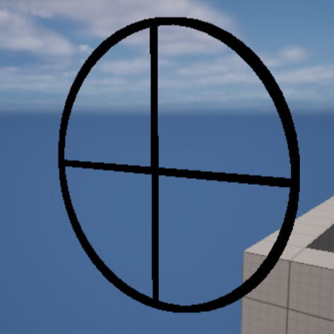
    <figcaption>Result</figcaption>
</figure>

### Draw a circle arc

```cpp

bool bPersistentLines = true;
float LifeTime = -1.0f;
uint8 DepthPriority = 0;
float Thickness = 10.0f;

FVector Center = FVector(-400, -600, 600);
float Radius = 200.0f;
FVector Direction = FVector::ForwardVector;
float AngleWidth = 500.0;
int32 Segments = 50;
FColor Color = FColor::Yellow;

DrawDebugCircleArc(GetWorld(), Center, Radius, Direction, AngleWidth, Segments, Color, bPersistentLines, LifeTime, DepthPriority, Thickness);
```

<figure>
    
    <figcaption>Result</figcaption>
</figure>

### Draw a 2D donut

```cpp
bool bPersistentLines = true;
float LifeTime = -1.0f;
uint8 DepthPriority = 0;
float Thickness = 10.0f;

const FVector Location = FVector(-400, -600, 600);
const FTransform Transform = FTransform(FQuat::Identity, Location);
FMatrix TransformMatrix = Transform.ToMatrixNoScale();

float InnerRadius = 100.0f;
float OuterRadius = 300.0f;
int32 Segments = 26;
FColor Color = FColor::Cyan;

DrawDebug2DDonut(GetWorld(), TransformMatrix, InnerRadius, OuterRadius, Segments, Color, bPersistentLines, LifeTime, DepthPriority, Thickness);
```

<figure>
    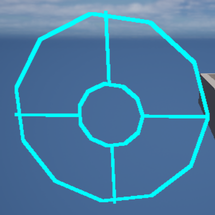
    <figcaption>Result</figcaption>
</figure>

### Draw a solid box

```cpp
bool bPersistentLines = true;

// Draw a solid box
FVector MinPoint = FVector(0, 0, 0);
FVector MaxPoint = FVector(200, 200, 200);
FBox MyBox = FBox(MinPoint, MaxPoint);
FTransform MyTransform = FTransform(FQuat::Identity, FVector(-400, -600, 600));

DrawDebugSolidBox(GetWorld(), MyBox, FColor(200, 100, 50), MyTransform, bPersistentLines);
```

<figure>
    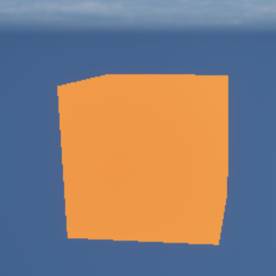
    <figcaption>Result</figcaption>
</figure>

### Draw a wired box

```cpp
bool bPersistentLines = true;
float LifeTime = -1.0f;
uint8 DepthPriority = 0;
float Thickness = 10.0f;

// Draw a wired box
FVector Center = FVector(-400, -600, 600);
FVector Extent = FVector(100, 100, 100);
FColor Color = FColor::Red;

DrawDebugBox(GetWorld(), Center, Extent, Color, bPersistentLines, LifeTime, DepthPriority, Thickness);
```

<figure>
    
    <figcaption>Result</figcaption>
</figure>

### Draw a cylinder

```cpp
bool bPersistentLines = true;
float LifeTime = -1.0f;
uint8 DepthPriority = 0;
float Thickness = 2.0f;

FVector Start = FVector(0, -600, 600);
FVector End = FVector(0, -1800, 600);
float Radius = 200.0f;
int32 Segments = 26;
FColor Color = FColor(255, 0, 0);

DrawDebugCylinder(GetWorld(), Start, End, Radius, Segments, Color, bPersistentLines, LifeTime, DepthPriority, Thickness);
```

<figure>
    
    <figcaption>Result</figcaption>
</figure>

### Draw a capsule

```cpp
bool bPersistentLines = true;
float LifeTime = -1.0f;
uint8 DepthPriority = 0;
float Thickness = 2.0f;

FVector Center = FVector(0, -600, 600);
float HalfHeight = 400.0f;
float Radius = 200.0f;
FQuat Rotation = FQuat::Identity;
FColor Color = FColor(255, 0, 0);

DrawDebugCapsule(GetWorld(), Center, HalfHeight, Radius, Rotation, Color, bPersistentLines, LifeTime, DepthPriority, Thickness);
```

<figure>
    
    <figcaption>Result</figcaption>
</figure>

### Draw a cone

```cpp
bool bPersistentLines = true;
float LifeTime = -1.0f;
uint8 DepthPriority = 0;
float Thickness = 0.0f;

FVector Origin = FVector(0, -600, 0);
FVector Direction = FVector(0, 0, -600);
float Length = 100.0f;
float AngleWidth = 45.0f;
float AngleHeight = 45.0f;
int32 NumSides = 12;
FColor Color = FColor::Yellow;

DrawDebugCone(
    GetWorld(),
    Origin,
    Direction,
    Length,
    FMath::DegreesToRadians(AngleWidth),
    FMath::DegreesToRadians(AngleHeight),
    NumSides,
    Color,
    bPersistentLines,
    LifeTime,
    DepthPriority,
    Thickness
);
```

<figure>
    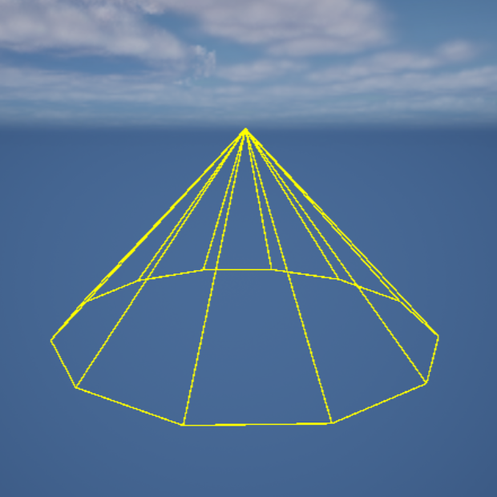
    <figcaption>Result</figcaption>
</figure>

### Draw a plane

```cpp
bool bPersistentLines = true;
float LifeTime = -1.0f;
uint8 DepthPriority = 0;
float Thickness = 2.0f;

FVector NormalVector = FVector::UpVector;
FPlane Plane = FPlane(NormalVector);
FVector Location = FVector(0, -600, 600);
FColor Color = FColor(255, 0, 0);

float Size = 100.0f;
DrawDebugSolidPlane(GetWorld(), Plane, Location, Size, Color, bPersistentLines, LifeTime, DepthPriority);

FVector2D Extents = FVector2D::One();
DrawDebugSolidPlane(GetWorld(), Plane, Location, Extents, Color, bPersistentLines, LifeTime, DepthPriority);
```

<figure>
    
    <figcaption>Result</figcaption>
</figure>

### Draw a line

```cpp
bool bPersistentLines = true;
float LifeTime = -1.0f;
uint8 DepthPriority = 0;
float Thickness = 10.0f;

FVector LocationFrom = FVector(0, -600, 600);
FVector LocationTo = FVector(0, 600, 600);
FColor Color = FColor::Emerald;

DrawDebugLine(GetWorld(), LocationFrom, LocationTo, Color, bPersistentLines, LifeTime, DepthPriority, Thickness);
```

<figure>
    
    <figcaption>Result</figcaption>
</figure>

### Draw an arrow

```cpp
bool bPersistentLines = true;
float LifeTime = -1.0f;
uint8 DepthPriority = 0;
float Thickness = 5.0f;

FVector LocationFrom =  FVector(-300, 600, 600);
FVector LocationTo = FVector(-300, -600, 600);
float ArrowSize = 120.0f;
FColor Color = FColor::Magenta;

DrawDebugDirectionalArrow(GetWorld(), LocationFrom, LocationTo, ArrowSize, Color, bPersistentLines, LifeTime, DepthPriority, Thickness);
```

<figure>
    
    <figcaption>Result</figcaption>
</figure>

### Draw a crosshair

```cpp
bool bPersistentLines = true;
float LifeTime = -1.0f;
uint8 DepthPriority = 0;

FVector AxisLocation = FVector(0, 0, 1000);
FRotator AxisRotation = FRotator::ZeroRotator;
float Scale = 500.0f;
FColor Color = FColor::White;

DrawDebugCrosshairs(GetWorld(), AxisLocation, AxisRotation, Scale, Color, bPersistentLines, LifeTime, DepthPriority);
```

<figure>
    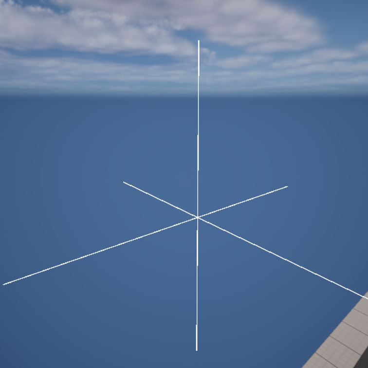
    <figcaption>Result</figcaption>
</figure>

### Draw a camera

```cpp
bool bPersistentLines = true;
float LifeTime = -1.0f;
uint8 DepthPriority = 0;

FVector Location = FVector(0, -600, 600);
FRotator Rotation = FRotator::ZeroRotator;
float FOVDeg = 45.0f;
float Scale = 1.0f;
FColor Color = FColor::White;

DrawDebugCamera(GetWorld(), Location, Rotation, FOVDeg, Scale, Color, bPersistentLines, LifeTime, DepthPriority);
```

<figure>
    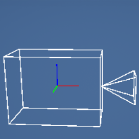
    <figcaption>Result</figcaption>
</figure>

### Draw a mesh

```cpp
FVector Offset = FVector(-300, 600, 600); // Example offset values

// Vertices for a cube with offset
const TArray<FVector> Verts = {
    FVector(-50, 50, 50) + Offset,  // 0
    FVector(50, 50, 50) + Offset,   // 1
    FVector(50, -50, 50) + Offset,  // 2
    FVector(-50, -50, 50) + Offset, // 3
    FVector(-50, 50, -50) + Offset, // 4
    FVector(50, 50, -50) + Offset,  // 5
    FVector(50, -50, -50) + Offset, // 6
    FVector(-50, -50, -50) + Offset // 7
};

// Indices for a cube
const TArray<int32> Indices = {
    0, 1, 2, 2, 3, 0, // Front face
    1, 5, 6, 6, 2, 1, // Right face
    5, 4, 7, 7, 6, 5, // Back face
    4, 0, 3, 3, 7, 4, // Left face
    4, 5, 1, 1, 0, 4, // Top face
    3, 2, 6, 6, 7, 3  // Bottom face
};

bool bPersistentLines = true;
float LifeTime = -1.0f;
uint8 DepthPriority = 0;
FColor Color = FColor(255, 0, 0);

DrawDebugMesh(GetWorld(), Verts, Indices, Color, bPersistentLines, LifeTime, DepthPriority);
```

<figure>
    
    <figcaption>Result</figcaption>
</figure>

### Draw a string:

```cpp
FVector TextLocation = FVector(0, -600, 600);
FString Str = TEXT("Hello, World!");
AActor* TestBaseActor = NULL;
FColor TextColor = FColor::White;
float Duration = -1.0f;
bool bDrawShadow = false;
float FontScale = 5.0f;

DrawDebugString(GetWorld(), TextLocation, Str, TestBaseActor, TextColor, Duration, bDrawShadow, FontScale);
```

<figure>
    
    <figcaption>Result</figcaption>
</figure>

### Draw a centripetal catmull-rom spline

```cpp
FVector Offset = FVector(-300, 600, 600); // Example offset values

TArray<FVector> Points;
Points.Emplace(FVector(0, 0, 0) + Offset); // Add the starting point with offset
Points.Emplace(FVector(100, 50, 0) + Offset); // Add the first control point with offset
Points.Emplace(FVector(200, 100, 0) + Offset); // Add the second control point with offset
Points.Emplace(FVector(300, 0, 0) + Offset); // Add the ending point with offset

float Alpha = 0.5f;
int32 NumSamplesPerSegment = 8;

bool bPersistentLines = true;
float LifeTime = -1.0f;
uint8 DepthPriority = 0;
float Thickness = 2.0f;

FColor Color = FColor(255, 0, 0);
DrawCentripetalCatmullRomSpline(GetWorld(), Points, Color, Alpha, NumSamplesPerSegment, bPersistentLines, LifeTime, DepthPriority, Thickness);

TConstArrayView<FColor> Colors;
DrawCentripetalCatmullRomSpline(GetWorld(), Points, Colors, Alpha, NumSamplesPerSegment, bPersistentLines, LifeTime, DepthPriority, Thickness);
```

<figure>
    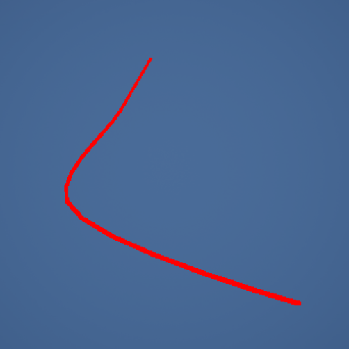
    <figcaption>Result</figcaption>
</figure>

---

You can read more about [drawing shapes by Harrison McGuire](https://unrealcpp.com/draw-debug-helpers/).

You can also watch a [video about it from Ryan Sweeney](https://www.youtube.com/watch?v=FQQmdirfVYg).

## 🧠 Multithreading and Asynchronous Tasks

<table><tr><td>
This section was NOT written in conjunction with ChatGPT.
</td></tr></table>

The most common way for a game engine to run your gameplay, is simply with a while loop. This pattern is very simple to understand and execute consistently. However, this pattern does not generate the greatest performance benefits. To gain performance, usually you would rewrite your code to be multithreaded.

You can read more about [Game Loop from Robert Nystrom](https://gameprogrammingpatterns.com/game-loop.html).

Ayliroé wrote an awesome documentation on Unreal's multithreading and asynchronous tasks system, which you can read either from [Google Docs](https://docs.google.com/document/d/1uw9Dfui5ZepSrBpMc1DrxFOeRFnDu8ubzFse8Mr_s7E/) or from [Forum Post](https://forums.unrealengine.com/t/multithreading-and-performance-in-unreal/1216417/1).

By the default, Unreal supports multithreading, but only makes partial use of it. While there are dedicated threads for audio, [render](https://docs.unrealengine.com/5.0/en-US/threaded-rendering-in-unreal-engine/) and stats, most operations are still done in the game thread, including EventTicks and Blueprints.

This is why doing expensive calculations in Blueprint will lead to loss of performance. That’s where threading comes in handy!

### Multithreading

Multithreading is the ability of a central processing unit (CPU) (or a single core in a multicore processor) to provide multiple threads of execution concurrently, supported by the operating system. In a multithreaded application, the threads share the resources of a single or multiple cores, which include the computing units, the CPU caches, and the translation lookaside buffer (TLB). This allows for faster speed of computation.

In order to make your game ready for multithreaded, then you're to change your mindset as well. When splitting your code into multiple threads can create [race conditions](https://en.wikipedia.org/wiki/Race_condition), which is when two operations are happening at the same time, and is competing for which one will be the first to execute. This can lead to instability and can cause bugs.

You can read more about [Multithreading from Vulkan Guide](https://vkguide.dev/docs/extra-chapter/multithreading/).

You can also watch a video from [Chris Kanich about deadlocks](https://www.youtube.com/watch?v=oEbXlSH8hyE).

If you want to create multithreading inside Blueprint will minimal C++ code, then here is a [video from Project Ispheria](https://www.youtube.com/watch?v=0Yyh3oQgonI).

### Runnables

`FRunnable` is a class which runs on a dedicated, newly created thread. Which you have full control over it.

They will automatically stop once their work is completed, and are generally useful for big computations that require a nearly continuously running thread.

Here's an example:

```cpp
// .h
#pragma once

#include "CoreMinimal.h"
#include "HAL/Runnable.h"

class FMyThread : public FRunnable
{
public:
    FMyThread( /*Parameters*/ )
    {
        bIsRunning = true;
        Thread = FRunnableThread::Create(this, TEXT("MyThread"));
    };

    virtual ~FMyThread()
    {
    	if (Thread)
    	{
            bool bShouldWait = false; // Will forcefully terminate the thread.
    		Thread->Kill(bShouldWait);
    		delete Thread;
    	}
    }

public:
    bool Init() override;
    uint32 Run() override;
    void Exit() override;
    void Stop() override;

private:
    FRunnableThread* Thread;
    bool bIsRunning;
};
```

```cpp
// .cpp
#include "FMyThread.h"

bool FMyThread::Init()
{
    /* Should the thread start? */
    return true;
}

uint32 FMyThread::Run()
{
    while (bIsRunning)
    {
        /* Work on a dedicated thread */
    }

    return 0;
}

void FMyThread::Exit()
{
    /* Post-Run code, threaded */
}

void FMyThread::Stop()
{
    bIsRunning = true;
}
```

When you want to start your thread, include its header and call its constructor (keep the pointer at hand!):

```cpp
auto* Thread = new FMyThread( /*Parameters*/ );
```

### Tasks

[TaskGraph](https://docs.unrealengine.com/5.0/en-US/tasks-systems-in-unreal-engine/), is a job manager that tries to balance out workload along multiple preexisting threads. This is ideal to send packages of small operations, as it abstracts away from you the complexity of managing threads, and also supports defining dependencies between Tasks.

Queuing Tasks will not cause performance concerns due to the threads being already running, but the system may also be less reactive as it has to find slots to fit the work in inside a limited pool, and sending long Tasks should be avoided to not clog-up threads. It may also sometimes decide to run Tasks directly in the game thread, depending on the setup.

#### AsyncTask

If you want to run a small async operation without creating a dedicated class or starting a new thread and do not need the control logic for pausing or callbacks, you can put it inside an `AsyncTask` running on the TaskGraph:

```cpp
AsyncTask(ENamedThreads::AnyHiPriThreadNormalTask, [this] ()
{
    /* Work on the TaskGraph */
    Caller->FunctionToThread(); // Function call captured using [this]
});
```

If you don't know about **lambda**, then highly recommend reading about it on this [section](https://github.com/MrRobinOfficial/Guide-UnrealEngine/#-lambda).

#### ParallelFor

A [fancier](https://isaratech.com/ue4-improving-speed-with-parallelfor/) version of `AsyncTask` that splits a for loop into multiple Tasks running in the TaskGraph.

```cpp
ParallelFor(Array.Num(), [&](int32 i)
{
    // Run Array.Num() operations, with current index i
    /* Work on the TaskGraph (order of execution is variable!) */
    ++Array[i];
});
```

There’s no guarantee about the order or the thread safety of the operation within, so you might want to use mutexes or atomics with it. MSVC has [an analogous](https://learn.microsoft.com/en-us/cpp/preprocessor/loop?view=msvc-170) #pragma loop(hint_parallel(n)). Practically speaking, the contents of your loop must be significant to really benefit from this approach.

#### FNonAbandonableTask

A way to declare your own AsyncTasks, in a format that sits inbetween FRunnable and lambda-like AsyncTasks. You can implement your own code in a standalone class to be more reusable, which will run on the TaskGraph instead of inside a dedicated thread, but missing some of FRunnable’s initializing and stopping logic.

```cpp
#pragma once

#include "CoreMinimal.h"
#include "Async/AsyncWork.h"

class FMyTask : public FNonAbandonableTask
{
    friend class FAutoDeleteAsyncTask<FMyTask>;

    FMyTask( /*Parameters*/ )
    {
        /* Constructor */
    }

    void DoWork()
    {
        /* Work on the TaskGraph */
    }

    FORCEINLINE TStatId GetStatId() const
    {
        // Probably declares the Task to the TaskGraph
        RETURN_QUICK_DECLARE_CYCLE_STAT(FMyTask, STATGROUP_ThreadPoolAsyncTasks);
    }
};
```

Start your custom Task like such:

```cpp
auto* MyTask = new FAsyncTask<FMyTask>( /*Parameters*/ );
MyTask->StartBackgroundTask();
```

---

As said before, Ayliroé wrote an awesome documentation on Unreal's multithreading and asynchronous tasks system, which you can read either from [Google Docs](https://docs.google.com/document/d/1uw9Dfui5ZepSrBpMc1DrxFOeRFnDu8ubzFse8Mr_s7E/) or from [Forum Post](https://forums.unrealengine.com/t/multithreading-and-performance-in-unreal/1216417/1).

## 🎯 Extend Unreal Editor

<table><tr><td>
This section was NOT written in conjunction with ChatGPT.
</td></tr></table>

You can find editor icons via this [github repo, made by EpicKiwi](https://github.com/EpicKiwi/unreal-engine-editor-icons).

### Slate

Lorem Ipsum

### Creating custom asset type

Lorem Ipsum

<!-- prettier-ignore-start -->

## 🗝️ Deep dive

<table><tr><td>
This section was written in conjunction with ChatGPT.
</td></tr></table>

### 🔖 Keywords

Here is a video about [constants keywords in C++ by Cazz](https://www.youtube.com/watch?v=KBny6MZJR64)

-   `const` - Specifies that an object or variable is read-only and cannot be modified.
-   `constexpr` - Specifies that a function or variable can be evaluated at compile-time. `constexpr` can be used for inlining variables, without using macros[^4]. **Note**, the compiler does not guarantee compile-time evaluation (only it **CAN** be evaluated at compile-time).
-   `consteval` - Specifies that a function must be evaluated at compile-time. **Note**, the compiler has to evaluated at compile-time.
-   `constinit` - Specifies that an object with static or thread storage duration should be initialized only with constant expressions.
-   `auto` - Allows the compiler to deduce the type of a variable based on its initializer.
-   `static` - Specifies that a variable or function is associated with a class rather than with a specific instance of the class.
-   `virtual` - Specifies that a function should be polymorphic, meaning that it can be overridden by a derived class.
-   `override` - Indicates that a function in a derived class is intended to override a function in the base class.
-   `break` - Causes the program to exit a loop or switch statement.
-   `continue` - Causes the program to skip to the next iteration of a loop.
-   `class` and `struct` - Are used to define user-defined types that encapsulate data and functions.
-   `inline` - Specifies that a function should be inlined (i.e., its code should be inserted directly into the calling code rather than calling the function).
-   `force_inline` - Instructs the compiler to inline a function, regardless of whether it would normally do so.
-   `new` - Allocates memory for an object and calls its constructor.
-   `delete` - Deallocates memory that was allocated with new.
-   `dynamic_cast` - Performs a runtime check to determine whether an object can be cast to a different type.
-   `static_cast` - Performs a static cast, which allows an expression to be converted to a different data type at compile time.
-   `const_cast` - - Performs a const cast.
-   `explicit` - Specifies that a constructor or conversion operator cannot be used for implicit type conversions.
-   `namespace` - Defines a scope for identifiers to avoid naming conflicts.
-   `operator` - Declares a function as an overloaded operator.
-   `template` - Allows generic programming by defining a type or function with parameters that are specified at compile time.
-   `try` and `catch` - Implements exception handling by trying a block of code that may throw an exception and catching the exception if it is thrown.

Difference between a class and struct then?

> In native C++, the main difference between a struct and a class is that struct members are public by default, whereas class members are private by default. However, this difference is largely syntactic, and struct and class can be used interchangeably to define custom types.

> However, Unreal Engine structs are used to represent data types that are typically used for data storage and manipulation, whereas classes are used to represent objects that have behavior and state.

In Unreal Engine, it's recommended to use the built-in memory management functions like `NewObject()` and `MakeShared()` to allocate memory for objects, rather than using `new` and `delete`. Using `new` and `delete` can interfere with the garbage collector and cause memory leaks or crashes in your game. It's always best to follow Unreal Engine's recommended memory management practices to ensure the stability and performance of your game.

### K2Node

<!-- TODO: Write text here! -->

You can read more about [K2Node by Oscar Olsson](https://olssondev.github.io/2023-02-13-K2Nodes/).

### ➗ Math Expression Node

<table><tr><td>
This section was NOT written in conjunction with ChatGPT.
</td></tr></table>

The Math Expression node acts like a collapsed graph. It is a single node that you can Double-click to open the sub-graph that makes up its functionality. Initially, the name/expression is blank. Whenever you rename the node, then the new expression is parsed and a new sub-graph is generated.

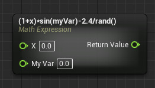

You can read more about math expression node at <a href="https://docs.unrealengine.com/5.2/en-US/math-expression-node-in-unreal-engine/" target="_blank">Unreal's docs</a>.

### Call function in editor

Expose a function to call inside the Blueprint editor. With C++, you can mark `UFUNCTION` specifier `CallInEditor`.

Here is an example:

```cpp
UFUNCTION(CallInEditor, BlueprintCallable)
void DebugMessage();
```

### Call function via Console Commands

In order to call a `UFUNCTION` inside the console command, you can use `Exec` specifier. This tells Unreal Engine to add the function into the console commands list.

Here's an example:

```cpp
UFUNCTION(Exec)
void KillCharacter();
```

However, there is a downside from using this approach. Because Unreal finds the function and map to the corresponding name, Unreal cannot call multiple instances of the same function. It only prioritizes the current pawn, which is currently under possession by the player.

To call a function with multiple instances, you can type `ke * FunctionName`.

Here's an example:

```console
$ ke * KillCharacter
```

> [!NOTE]
> In the context of a Command Line Interface (CLI), the dollar sign (`$`) is typically referred to as a "prompt symbol" or simply a "prompt." It indicates that the CLI is ready to receive input from the user. The specific appearance and behavior of the prompt may vary depending on the operating system and shell being used.

### Renaming variables without breaking references

<table><tr><td>
This section was NOT written in conjunction with ChatGPT.
</td></tr></table>

During development, there are occasions when you have to rename a property, function or a class. If you compile before changing the name in other location of your code, it can cause Unreal to no longer recognize existing Assets. And therefore replace with its default initialization value.

To address this issue, Unreal Engine uses Core Redirects. Core Redirects should be configured in your project's `DefaultEngine.ini` file, or, in the case of a Plugin, the prefixed, self-named .ini file for that Plugin (for example, `BasePaper2D.ini` for the Engine's Paper2D Plugin, or `Default<GamePluginName>.ini` for a game Plugin).

In either case, the Core Redirects will be placed in the "[CoreRedirects]" section. These Core Redirects will automatically remap obsolete data while loading Assets, thus preventing data loss resulting from the renaming process.

Here is the following structure for a redirect of a property value:

```dosini
+PropertyRedirect=(OldName="CurrentClass.OldVariableName", NewName="NewOldVariableName")
```

Here's a full example of different use cases with redirects:

```dosini
[CoreRedirects]
+PropertyRedirect=(OldName="PlayerCharacter.StartHealth", NewName="InitialHealth")

+ClassRedirects=(OldName="Pawn",NewName="MyPawn",InstanceOnly=true)

+ClassRedirects=(OldName="/Script/MyModule.MyOldClass",NewName="/Script/MyModule.MyNewClass")

+ClassRedirects=(OldName="PointLightComponent",NewName="PointLightComponent",ValueChanges=(("PointLightComponent0","LightComponent0")))

+ClassRedirects=(OldName="AnimNotify_PlayParticleEffect_C",NewName="/Script/Engine.AnimNotify_PlayParticleEffect",OverrideClassName="/Script/CoreUObject.Class")

+EnumRedirects=(OldName="ENumbers",NewName="ELetters",ValueChanges=(("NumberTwo","LetterB"),("NumberThree","LetterC")))

+FunctionRedirects=(OldName="MyOldActor.OldFunction",NewName="MyNewActor.NewFunction")
+FunctionRedirects=(OldName="MyActor.OldFunction",NewName="NewFunction")

+PackageRedirects=(OldName="OldPlugin",NewName="/NewPlugin/",MatchSubstring=true)
+PackageRedirects=(OldName="/Game/DeletedContentPackage",Removed=true)

+StructRedirects=(OldName="MyStruct",NewName="MyNewStruct")
```

You can read more about on [Unreal's docs](https://docs.unrealengine.com/5.3/en-US/core-redirects-in-unreal-engine/).

---

The `MatchSubstring` argument can be used in any Core Redirect type. If present and set to `true`, the `OldName` and `NewName` fields will be treated as substrings rather than requiring exact matches. This enables multiple matches with a single Core Redirect. In the following example, we will start with a struct and a class.

Original code and values:

```cpp
USTRUCT()
struct FMyStruct
{
    GENERATED_BODY()

    UPROPERTY(EditAnywhere, Category = "Documentation")
    int32 TestInt;

    UPROPERTY(EditAnywhere, Category = "Documentation")
    int32 TestIntFromStruct;
};

UCLASS()
class REDIRECTORSTEST_API AMyActor : public AActor
{
    GENERATED_BODY()

public:
    UPROPERTY(EditAnywhere, Category = "Documentation")
    int32 TestInt;

    UPROPERTY(EditAnywhere, Category = "Documentation")
    int32 MainClassTestInt;

    UPROPERTY(EditAnywhere, Category = "Documentation")
    FMyStruct TestStruct;
};
```

<figure>
    
    <figcaption>This is the original code and the original set of values we're saving into our `AMyActor` Asset.</figcaption>
</figure>

After creating and saving an `AMyActor` Asset with the values shown above, we can close the Editor and alter the the code in the `.h` file and the Core Redirects in the game's `.ini` file. We will change the code to read as follows, changing the names of our `int32` properties:

```cpp
USTRUCT()
struct FMyStruct
{
    GENERATED_BODY()

    UPROPERTY(EditAnywhere, Category = "Documentation")
    int32 TestInteger;

    UPROPERTY(EditAnywhere, Category = "Documentation")
    int32 TestIntegerFromStruct;
};

UCLASS()
class REDIRECTORSTEST_API AMyActor : public AActor
{
    GENERATED_BODY()

public:
    UPROPERTY(EditAnywhere, Category = "Documentation")
    int32 TestInteger;

    UPROPERTY(EditAnywhere, Category = "Documentation")
    int32 MainClassTestInteger;

    UPROPERTY(EditAnywhere, Category = "Documentation")
    FMyStruct TestStruct;
};
```

With this change, we can examine the effects of a Core Redirect, and in particular the impact of `MatchSubstring`.

Results follow:

<figure>
    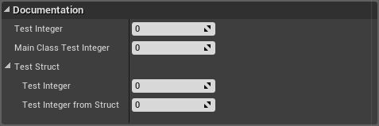
    <figcaption>The properties were renamed in code, but no Core Redirect was created. As a result, no data values have migrated to the new properties.</figcaption>
</figure>

<figure>
    
    <figcaption>`PropertyRedirects=(OldName="TestInt",NewName="TestInteger")` causes only the two preoperties with exact name matches to migrate their data.</figcaption>
</figure>

<figure>
    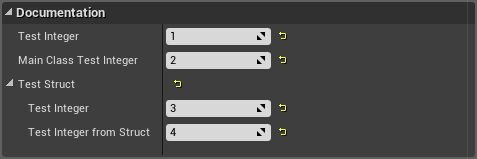
    <figcaption>`PropertyRedirects=(OldName="TestInt",NewName="TestInteger",MatchSubstring=true)` causes all four of our properties to migrate, due to substring matching.</figcaption>
</figure>

> [!NOTE]
> Because `MatchSubtring` requires checking incoming Assets much more thoroughly, it can impact startup times. `MatchSubstring` is intended to be used temporarily as a fixup when making sweeping changes. It is recommended that Assets involved in these changes be resaved immediately and checked into your project's source control database with any related code changes, and that the Core Redirect be deleted without entering source control.

### Compiling a plugin for a new engine version

When you find a plugin and trying to install it, you might find out that it doesn't support your current engine version.
And the Unreal's marketplace won't let you download unless you have a version associated.

One trick to avoid this, is to build the plugin manually and fixing compiling issues (header file missing or API changes). By installing the plugin with the access of the source code. Then by access the plugin with the UHT (Unreal Build Tool), you can then rebuild the plugin into a different engine version.

Here is `.bat` file (Windows Only) to locate the current engine directory, and compile your custom made plugin into another engine version:

```
@echo off

:: Setting up config variables
set EngineVersion=<EngineVersion>
set PluginName=<PluginName>
set InputDirectory=<InputDirectory>
set OutputDirectory=<OutputDirectory>
set TargetPlatforms=Win64

set PluginPath="%cd%\%InputDirectory%\%PluginName%\%PluginName%.uplugin"
set OutputPath="%cd%\%OutputDirectory%\%EngineVersion%\%PluginName%"

:: Locating a registry key, in order to find Unreal Engine source location

for /f "skip=2 tokens=2*" %%a in ('reg query "HKEY_LOCAL_MACHINE\SOFTWARE\EpicGames\Unreal Engine\%EngineVersion%" /v "InstalledDirectory"') do set "EngineDirectory=%%b"

set AutomationToolPath="%EngineDirectory%\Engine\Build\BatchFiles\RunUAT.bat"

title Build Plugin
echo Automation Tool Path: "%AutomationToolPath%"
echo:

call %AutomationToolPath% BuildPlugin -Plugin=%PluginPath% -Package=%OutputPath% -Rocket -TargetPlatforms=%TargetPlatforms%
echo:
pause
exit 0
```

And here is the bash file (Linux Only) version:

```
#!/bin/bash

# Setting up config variables
EngineVersion="<EngineVersion>"
PluginName="<PluginName>"
InputDirectory="<InputDirectory>"
OutputDirectory="<OutputDirectory>"
TargetPlatforms="Win64"

PluginPath="$PWD/$InputDirectory/$PluginName/$PluginName.uplugin"
OutputPath="$PWD/$OutputDirectory/$EngineVersion/$PluginName"

# Locating a registry key, in order to find Unreal Engine source location
EngineDirectory=$(reg query "HKEY_LOCAL_MACHINE\SOFTWARE\EpicGames\Unreal Engine\$EngineVersion" -v "InstalledDirectory" | awk 'NR==3{print $NF}')

AutomationToolPath="$EngineDirectory/Engine/Build/BatchFiles/RunUAT.bat"

echo "Automation Tool Path: \"$AutomationToolPath\""
echo

$AutomationToolPath BuildPlugin -Plugin="$PluginPath" -Package="$OutputPath" -Rocket -TargetPlatforms="$TargetPlatforms"

echo
read -p "Press Enter to continue..."
exit 0
```

### Gameplay Timers

Timer construct for performing delayed or repeated actions. Timers are incredibly helpful for gameplay scenarios.

**Timers** schedule actions to be performed after a delay, or over a period of time. For example, you may want to make the player invulnerable after obtaining a power-up item, then restore vulnerability after 10 seconds. Or you may want to apply damage once per second while the player moves through a room filled with toxic gas. Such actions can be achieved through the use of timers.

> [!NOTE]
> Timers will be canceled automatically if the Object that they are going to be called on, such as an Actor, is destroyed before the time is up. In this case, the timer handle will become invalid and the function will not be called.

```cpp
// .h

/* Handle to manage the timer */
FTimerHandle TimerHandle;

// Must mark a function with UFUNCTION, as UHT needs it, in order to find it.
UFUNCTION()
void OnExplode();
```

```cpp
// .cpp

/* Activate the bomb to explode after 1.5 seconds */
void ABombActor::OnUsed(APawn* InstigatorPawn)
{
    float Delay = 1.5f; // In seconds
    bool bLooping = false; // If we want to repeat this.

    GetWorld()->GetTimerManager().SetTimer(
        TimerHandle, // handle to cancel timer at a later time
        this, // the owning object
        &ABombActor::OnExplode, // function to call on elapsed
        Delay,
        bLooping
    );
}

void ABombActor::OnExplode()
{
    // ...
}
```

Instead of calling `SetTimer()`, you can create delegate object with a bind function.

```cpp
FTimerHandle TimerHandle;
FTimerDelegate Delegate; // Delegate to bind function with parameters

Delegate.BindUFunction(this, &ABombActor::OnExplode);

float Delay = 1.5f;
bool bLooping = false;

GetWorld()->GetTimerManager().SetTimer(TimerHandle, Delegate, Delay, bLooping);
```

You can also specify parameters, if you wish to pass to the bounded function:

```cpp
Delegate.BindUFunction(this, &APlayerCharacter::Heal, 150, true);

void Heal(int32 HealAmount, bool bReviveIfDead)
{
    // ...
}
```

If we wish to stop any of the timer, we can either call `ClearTimer()` or `ClearAllTimersForObject()`:

```cpp
// Clear the specified timer handle
GetWorld()->GetTimerManager().ClearTimer(TimerHandle);

// Alternatively you can clear ALL timers that belong to this (Actor) instance.
GetWorld()->GetTimerManager().ClearAllTimersForObject(this);
```

> [!TIP]
> Calling `SetTimer()` with a rate less than or equal to zero is identical to calling `ClearTimer()`.

To pause or unpause a timer, you can call either `PauseTimer()` or `UnPauseTimer()` function:

```cpp
// Pause the specified timer handle
GetWorld()->GetTimerManager().PauseTimer(TimerHandle);

// Unpause the specified timer handle
GetWorld()->GetTimerManager().UnPauseTimer(TimerHandle);
```

To check if a timer is running, you can call `IsTimerActive()` function:

```cpp
// Is this weapon waiting to be able to fire again?
GetWorldTimerManager().IsTimerActive(this, &AUTWeapon::RefireCheckTimer);
```

You can also access the current rate (time between activations) of a timer from its timer handle:

```cpp
// This weapon's rate of fire changes as it warms up. Is it currently waiting to fire, and if so, how long is the current delay between shots?
GetWorldTimerManager().GetTimerRate(this, &AUTWeapon::RefireCheckTimer);
```

If you want the elapsed and remaining time, you can access via `GetTimerElapsed()` function:

```cpp
// How long will it be until this weapon is ready to fire again? If the answer comes back as -1, it is ready now.
GetWorldTimerManager().GetTimerElapsed(this, &AUTWeapon::RefireCheckTimer);
```

You can read more about [Gameplay Timers on Unreal's docs](https://docs.unrealengine.com/5.3/en-US/gameplay-timers-in-unreal-engine/).

### Sampling a curve

Sometimes, you probably want to work with a curve. To access a curve inside C++, you can use `UCurveFloat` class. This class gives you access to interpolated points to evaluate over a given range.

You can create them from the **Content Browser** through **Miscellaneous → Curve**.

<table><tr><td>

Module: `Engine`

Header file:

```cpp
#include "Curves/CurveFloat.h"
```

</td></tr></table>

```cpp
// .h

UPROPERTY(EditAnywhere)
UCurveFloat TimeCycle;

UPROPERTY(EditAnywhere, meta = (ClampMin = 0.0, ClampMax = 1.0))
float TimeOfDay = 0.5f; // Range between 0 -> 1
```

```cpp
// .cpp

// This will be our output value from the curve
float SunIntensity = 0.0f;

// Check if the curve is valid before accessing it.
// Otherwise, if curve is a nullptr, a crash will happen.
if (IsValid(TimeCycle))
{
    // We read the curve at the current level, and assign the value to MaxHP
    SunIntensity = TimeCycle->GetFloatValue(TimeOfDay);
}
```

You can read more about [curves on Unreal's docs](https://docs.unrealengine.com/5.3/en-US/API/Runtime/Engine/Curves/UCurveFloat/).

### HTTP requests

<table><tr><td>

Module: `HTTP`

Header file:

```cpp
#include "HttpModule.h"
#include "Interfaces/IHttpResponse.h"
#include "PlatformHttp.h"
#include "JsonObjectConverter.h" // Include this, if you want to send some JSON data into the request
```

</td></tr></table>

```cpp
// .h

UENUM(BlueprintType)
enum class EHTTPRequestType : uint8
{
    GET,
    POST,
    PUT,
    DELETE
};

// Delegate for the callback
DECLARE_DYNAMIC_DELEGATE_ThreeParams(FHTTPRequest, const FString&, Result, int32 ResponseCode, bool, bWasSuccessful);

UFUNCTION(BlueprintCallable, Category = "MyPawn")
/**
* Send a request via HTTP protocol system.
*
* @param BaseURL - Base URL on which to process the request on.
* @param EndpointURL - Endpoint URL. Combined with base URL to get fully qualified URL for the request.
* @param RequestType - What type of request (GET, POST, PUT, DELETE)
* @param Callback - Callback of the request
* @return A boolean, if the request was successfully sent out.
*/
bool SendRequest(
    const FString BaseURL,
    const FString EndpointURL,
    const EHTTPRequestType RequestType,
    FString Payload,
    FHTTPRequest Callback
);
```

```cpp
// .cpp

bool YourClass::SendRequest(
	const FString BaseURL,
	const FString EndpointURL,
	const EHTTPRequestType RequestType,
	FString Payload,
	FHTTPRequest Callback)
{
    // Get a reference to the HTTP singleton and create a request object
    const FHttpRequestRef Request = FHttpModule::Get().CreateRequest();

    // Creates a lambda function and stores to a variable.
    auto LambdaFunc = [this, Callback](FHttpRequestPtr Req, FHttpResponsePtr Res, bool bWasSuccessful)
    {
        FString Result;

        // Check the status code
        const int32 ResCode = Res->GetResponseCode();

        if (!bWasSuccessful || ResCode < 100 || ResCode > 300)
        {
            // Only accepting 200 -> 299 response code
            Callback.ExecuteIfBound(Result, ResCode, false);
            return;
        }

        Result = Res->GetContentAsString();

        Callback.ExecuteIfBound(Result, ResCode, true);
    };

    // Bind the lambda as the callback
    Request->OnProcessRequestComplete().BindLambda(LambdaFunc);

    Request->SetURL(BaseURL + EndpointURL);
    Request->SetVerb(UEnum::GetDisplayValueAsText(RequestType).ToString());

    switch (RequestType)
    {
        case EHTTPRequestType::POST:
        case EHTTPRequestType::PUT:
        case EHTTPRequestType::DELETE:
        {
            // To send data into the request, you must include this header
            // Which tells the request to expect a JSON data type
            Request->SetHeader("Content-Type", "application/json");

            // Payload is in JSON format. Use JsonObjectConverter to convert Unreal's data type into JSON format.
            Request->SetContentAsString(Payload);
        }
        break;
    }

    // Returns true if the HTTP request has started. Does NOT return the result of the callback lambda.
    return Request->ProcessRequest();
}
```

Then you can call `SendRequest()` function:

```cpp
void YourClass::SendTestRequest()
{
    // Final URL: BASE_URL + ENDPOINT_URL = "https://swapi.dev/api/planets/3/"
    // Helpful to split the endpoint, as you can switch to another endpoint.
    const FString BASE_URL = "https://swapi.dev/api/";
    const FString ENDPOINT_URL = "planets/3/"; // "starships/9/", "people/1/"

    FString JSON;
    FHTTPRequest Delegate;
    Delegate.BindDynamic(this, &YourClass::OnRequestCompleted);

    // Send the request with delegate passed into the parameters
    SendRequest(BASE_URL, ENDPOINT_URL, EHTTPRequestType::GET, "", Delegate);
}

void YourClass::OnRequestCompleted(const FString& Result, bool bWasSuccessful)
{
    if (!bWasSuccessful)
    {
        UE_LOGFMT(LogTemp, Log, "The Request was not successful!");
        return;
    }

    UE_LOGFMT(LogTemp, Log, "Request Output: {0}", Result);
}
```

> [!TIP]
> You can test out HTTP request via [Postman](https://www.postman.com/) with [Star Wars API](https://swapi.dev/) example.

You can read more about [HTTP module on Unreal's docs](https://docs.unrealengine.com/5.3/en-US/API/Runtime/HTTP/FHttpModule/).

### Encryption and Decryption

When working with encryption and decryption.

```cpp
// .h

// Encrypts Int32 using a 10 digit Alpha-Numeric Key into an FString
UFUNCTION(BlueprintCallable, Category = "Encryption")
static FString EncryptInt32(int32 InInt, FString EncryptionKey);

// Decrypts an encrypted FString back to Int32 using a 10 digit Alpha-Numeric Key
UFUNCTION(BlueprintCallable, Category = "Encryption")
static int32 DecryptToInt32(FString EncryptedValue, FString EncryptionKey);
```

```cpp
// .cpp

#include "Kismet/KismetStringLibrary.h"

FString YourClass::EncryptString(FString Data, FString EncryptionKey)
{
    FString EncryptedValue;

    TArray<TCHAR> ValueChars = Data.GetCharArray();
    TArray<TCHAR> KeyChars = EncryptionKey.GetCharArray();

    for (int32 i = 0; i < ValueChars.Num() -1; i++)
    {
        FString TempString;
        TempString.AppendChar(ValueChars[i]);
        EncryptedValue.AppendChar(KeyChars[UKismetStringLibrary::Conv_StringToInt(TempString)]);
    }

    return EncryptedValue;
}

FString YourClass::DecryptToString(FString EncryptedValue, FString EncryptionKey)
{
    TArray<TCHAR> ValueChars = EncryptedValue.GetCharArray();
    TArray<TCHAR> KeyChars = EncryptionKey.GetCharArray();

    FString OutString;

    for (int32 i = 0; i < ValueChars.Num() -1; i++)
    {
        OutString = (OutInt * 10) + KeyChars.Find(ValueChars[i]);
    }

    return OutString;
}
```

### 🐣 Tips and best practices

<table><tr><td>
This section was written in conjunction with ChatGPT.
</td></tr></table>

### Disable BlueprintPure

When creating a `UFUNCTION` and marking it as `const`, Unreal will interpret this function as pure function. A pure function will evaluate every time it's called (inside Blueprint), compare to a regular function, which Unreal caches the result and save for later.

Pure function are helpful for small or quick function to execute. For an example: **getters**.

With Blueprint, every time you drag a pin from the result, the function will be evaluated every single time. And the result may differ at different execution time.

This is not the same, as a regular function. With regular function, Blueprint will then cache the result. And when dragging multiple pins from the result of the function, the same value will be used.

If you want to mark a `UFUNCTION` as const without Unreal converting into a pure function, you can add this specifier:

```cpp
UFUNCTION(BlueprintCallable, BlueprintPure = false)
void ComplexFunction() const
{
    // Expensive calculations
}
```

### Switch case fall-through

When working with switch case, one benefits it's to have fall-through cases. Where, a case can fall under multiple cases and same performance.

Although, it may be harder to read and understand this code, then doing with if-statements.

```cpp
double DistanceUnificationFactor(EUnit From)
{
    // Convert to meters
    double Factor = 1;

    switch (From)
    {
        case EUnit::Micrometers:		return 0.000001;
        case EUnit::Millimeters:		return 0.001;
        case EUnit::Centimeters:		return 0.01;
        case EUnit::Kilometers:			return 1000;

        case EUnit::Lightyears:			return 9.4605284e15;

        case EUnit::Miles:				Factor *= 1760;				// fallthrough
        case EUnit::Yards:				Factor *= 3;				// fallthrough
        case EUnit::Feet:				Factor *= 12;				// fallthrough
        case EUnit::Inches:				Factor /= 39.3700787;		// fallthrough
        default: 						return Factor;				// return
    }
}
```

#### 📦 Refactoring

Refactoring is the process of making changes to the codebase to improve its structure, readability, and maintainability without changing its external behavior.

Refactoring is an essential practice in software development that helps keep the codebase clean, maintainable, and scalable. It involves making incremental improvements to the code without changing its external behavior, which is crucial for maintaining a healthy and sustainable codebase throughout the software development lifecycle.

##### Renaming

Renaming members, such as variables, functions, or classes, is a common refactoring technique used to give them more meaningful and descriptive names, making the code easier to understand and maintain.

Example:

```cpp
// Note, this is regular raw C++ code.

// Before refactoring
class Rectangle
{
private:
    int w; // Width
    int h; // Height

public:
    Rectangle(int width, int height) : w(width), h(height) {}

    int area() { return w * h; }
};

// After refactoring
class Rectangle
{
private:
    int width; // Descriptive name for width
    int height; // Descriptive name for height

public:
    Rectangle(int width, int height) : width(width), height(height) {}

    int area() { return width * height; }
};
```

##### Extract Method

Extract Method is a refactoring technique where you take a portion of code within a method and move it into a separate method. This helps improve code readability, encourages code reuse, and simplifies complex methods.

Example:

```cpp
// Note, this is regular raw C++ code.

// Before refactoring
void printFullName(std::string firstName, std::string lastName)
{
    std::cout << "Full Name: " << firstName << " " << lastName << std::endl;
    // Some other logic related to printing the full name
}

// After refactoring
void printFullName(std::string firstName, std::string lastName)
{
    print("Full Name: " + firstName + " " + lastName);
}

void print(const std::string& message)
{
    std::cout << message << std::endl;
}
```

##### Introduce/Inline typedefs

Introducing a typedef can make complex type names more concise and easier to understand. On the other hand, inline typedefs are useful for reducing the complexity of code and improving code readability by avoiding unnecessary type aliases.

Example:

```cpp
// Note, this is regular raw C++ code.

// Before refactoring
typedef std::map<std::string, std::vector<int>> NameToNumbersMap;

NameToNumbersMap numbers;

// After refactoring (Introduce typedef)
using NumbersVector = std::vector<int>;
using NameToNumbersMap = std::map<std::string, NumbersVector>;

NameToNumbersMap numbers;

// After refactoring (Inline typedef)
std::map<std::string, std::vector<int>> numbers;
```

##### Introduce Variable

Introducing a variable can simplify complex expressions or improve code readability by giving meaningful names to intermediate results.

Example:

```cpp
// Note, this is regular raw C++ code.

// Before refactoring
int total = (price + tax) * quantity - discount + shippingCost;

// After refactoring
int netPrice = price + tax;
int totalPrice = netPrice * quantity - discount + shippingCost;
```

##### Invert 'if' statement to reduce nesting

Consider the following code snippet:

```cpp
void MyCharacter::DoSomething()
{
    if (bIsReadyToMove)
    {
        if (!bIsMoving)
        {
            MoveCharacter();
        }
        else
        {
            // Handle already moving
        }
    }
    else
    {
        // Handle not ready to move
    }
}
```

As you can see, the `if` blocks encompass the whole body of the method. This presents an opportunity to make code more readable by getting rid of the nested scope and adding `return` keyword[^1] as follows:

```cpp
void MyCharacter::DoSomething()
{
    if (!bIsReadyToMove)
    {
        // Handle not ready to move
        return;
    }

    if (!bIsMoving)
    {
        MoveCharacter();
    }
    else
    {
        // Handle already moving
    }
}
```

Here is a video explaining some of the best practices with Unreal Engine and C++.

There is a video about some of these best practices called [Best Practices (2019-2021) from Stephen Maloney](https://www.youtube.com/watch?v=g7WVBZZTRDk)

In the video, there is also a [Google documentation](https://docs.google.com/document/d/1kIgOM7VONlPtx3WPiKdNVRYquX-GTduqSw0mU7on5h8) (if video wasn't enough) for more details about some of his tips and tricks.

#### ⏱ Ticking

##### For actors

```cpp
PrimaryActorTick.bCanEverTick = false;
PrimaryActorTick.bStartWithTickEnabled = false;
```

##### For components

```cpp
PrimaryComponentTick.bCanEverTick =  false;
PrimaryComponentTick.bStartWithTickEnabled = false;
```

##### If you have to use tick

-   Set the tick interval to the maximum value you can get away with. Unfortunately this is often per frame for smoothly moving things

```cpp
PrimaryActorTick.TickInterval = 0.2f;
PrimaryComponentTick.TickInterval = 0.2f;
```

-   Enable/disable tick to only tick when required.

```cpp
SetActorTickEnabled()
SetComponentTickEnabled()
```

#### `FTickFunction`

Abstract base class for all tick functions.

Sample code to get started:

##### MyTickableThing.h

```cpp
#pragma once

#include "CoreMinimal.h"
#include "Tickable.h"

class FMyTickableThing : public FTickableGameObject
{
public:
    // FTickableGameObject Begin
    void Tick( float DeltaTime ) override;

    ETickableTickType GetTickableTickType() const override
    {
        return ETickableTickType::Always;
    }

    TStatId GetStatId() const override
    {
        RETURN_QUICK_DECLARE_CYCLE_STAT( FMyTickableThing, STATGROUP_Tickables );
    }

    bool IsTickableWhenPaused() const
    {
        return true;
    }

    bool IsTickableInEditor() const
    {
        return false;
    }
    // FTickableGameObject End

private:
	// The last frame number we were ticked.
	// We don't want to tick multiple times per frame
	uint32 LastFrameNumberWeTicked = INDEX_NONE;
};
```

##### MyTickableThing.cpp

```cpp
#include "MyTickableThing.h"

void FMyTickableThing::Tick( float DeltaTime )
{
	if ( LastFrameNumberWeTicked == GFrameCounter )
		return;

	// Do our tick
	// ...

	LastFrameNumberWeTicked = GFrameCounter;
}
```

> [!NOTE]
> Tick any object you want, `UObject` or not!

> [!WARNING]
> `USTRUCT` don't support expose functions with UHT[^2].

#### 🔌 Direct references

<table><tr><td>
This section was written in conjunction with ChatGPT.
</td></tr></table>

In C++, a direct reference is a reference variable that directly refers to the memory location of another variable. When you use a direct reference, you are essentially creating an alias or an alternative name for the original variable. This means any changes made to the reference will be reflected in the original variable, and vice versa.

Using direct references can be beneficial for performance in certain situations because it avoids creating unnecessary copies of data. When you pass large objects or structures as function arguments, using direct references instead of passing by value (copy) can save memory and processing time, especially for complex objects.

Using the `const` qualifier in a direct reference serves as a safety mechanism to prevent accidental modifications to the referenced variable. When you declare a variable as const, it means that its value cannot be changed after initialization.

In some cases, using `const` in direct references can also enable certain compiler optimizations, as it provides additional information to the compiler about the immutability of the referenced value.

```cpp
// Note, this is regular raw C++ code.

int a = 5;
int b = a; // Gets a copy

b = b * 2; // B = 10 and A = 5

int& c = 10;
int& d = c;

d = 20; // C = 20 and D = C, which is 20

const int& e = 10; // Direct reference (use const for stopping ability to modify the variable)
const int& f = e;

f = 11; // COMPILER ERROR!!! Cannot modify const variable!!
```

<!-- prettier-ignore-end -->

## 📛 Console Commands

<table><tr><td>
This section was NOT written in conjunction with ChatGPT.
</td></tr></table>

* `stat fps`: Display FPS.
* `stat unit`: Display frame time.
* `stat game`: Display a general idea on how long the various gameplay ticks are taking.
* `dumpticks`: Display a list of current actors, which currently ticks in the level.
* `slomo`: To speed up or slow down the game time.
* `obj list`: Display a list of current loaded objects.
* `obj list class=BP_PlayerCharacter_C`: Same as `obj list` but with a filter.
* `obj gc`: Collect all objects with GC (Garbage Collector).
* `au.Debug.AudioSoloSoundWave`: Takes a sound wave name as an additional input, and toggles whether that sound wave is solo (the only audible sound).

Here is also a [website](https://pongrit.github.io/) by Pongrit, which showcase all of Unreal Engine's console commands.

## 📌 Shortcuts

<table><tr><td>
This section was NOT written in conjunction with ChatGPT.
</td></tr></table>

To change any of the shortcuts, you can access the keyboard shortcut settings via **Editor Preferences**, then under **General** select **Keyboard Shortcuts**.

---

Basic

-   <kbd>Ctrl + C</kbd>: Copy
-   <kbd>Ctrl + X</kbd>: Cut
-   <kbd>Ctrl + V</kbd>: Paste
-   <kbd>Del</kbd> - Delete
-   <kbd>Ctrl + Y</kbd>: Undo
-   <kbd>Ctrl + Z</kbd>: Redo
-   <kbd>Ctrl + A</kbd>: Select All
-   <kbd>Esc</kbd>: Clear Selection
-   <kbd>Up/Down/Left/Right Arrow Keys</kbd>: Move Selection
-   <kbd>Ctrl + Spacebar</kbd>: Open Content Browser
-   <kbd>Ctrl + B</kbd>: Find in Content Browser
-   <kbd>Ctrl + Tab</kbd>: Browse Tabs
-   <kbd>Ctrl + O</kbd>: Open Level
-   <kbd>Ctrl + P</kbd>: Asset Picker
-   <kbd>Alt + P</kbd> or <kbd>Alt + S</kbd>: Play/Simulate
-   <kbd>P</kbd>: Show Nav Mesh
-   <kbd>Mouse Wheel Up/Down</kbd>: Zoom

---

Outliner

-   <kbd>Ctrl + G</kbd> or <kbd>Shift + G</kbd>: Group/Ungroup
-   <kbd>Right-Click</kbd> on Group: Pin/Unpin

---

Blueprint editor

-   <kbd>Ctrl + S</kbd>: Save Blueprint
-   <kbd>Ctrl + F</kbd>: Find within Blueprint
-   <kbd>Ctrl + Shift + F</kbd>: Find in all Blueprints

---

Level editing

-   <kbd>Ctrl + S</kbd>: Save All
-   <kbd>End</kbd>: Snap to Floor
-   <kbd>Alt + End</kbd>: Snap Pivot to Floor
-   <kbd>Shift + End</kbd>: Snap Bounds to Floor
-   <kbd>Ctrl + End</kbd>: Snap Origin to Grid
-   <kbd>Alt + Transform</kbd>: Duplicate and Transform

---

Camera/transformation

-   <kbd>Alt + G</kbd>: Perspective View
-   <kbd>Alt + H</kbd>: Front View
-   <kbd>Alt + J</kbd>: Top View
-   <kbd>Alt + K</kbd>: Side View
-   <kbd>F</kbd>: Focus
-   <kbd>G</kbd>: View
-   <kbd>R</kbd>: Scale
-   <kbd>W</kbd>: Translate
-   <kbd>E</kbd>: Rotate
-   <kbd>Spacebar</kbd>: Toggle Move/Rotate/Scale

---

Tools

-   <kbd>Ctrl + Shift + Comma</kbd>: GPU Visualizer

## ⚠️ Common Issues

<table><tr><td>
This section was NOT written in conjunction with ChatGPT.
</td></tr></table>


### ⛔ Compiler Error C2628

Description
> A semicolon may be missing.

The following sample generates C2628:
```cpp
// C2628.cpp
class CMyClass {} // C2628 error

int main()
{

}
```

Possible resolution:

```cpp
// C2628b.cpp
class CMyClass {};

int main()
{

}
```

[Link](https://learn.microsoft.com/en-us/cpp/error-messages/compiler-errors-2/compiler-error-c2628?view=msvc-170) to error message.

### ⛔ Compiler Error C2065

Description
> The compiler doesn't recognize the identifier and, therefore, considers it undeclared. The compiler needs to be aware of the existence of identifiers before they can be used. By declaring an identifier, you provide the compiler with the necessary information about its name and type, allowing it to properly allocate memory or resolve references.

The following sample generates C2065:

```cpp
// C2065.cpp
#include <iostream>

int main()
{
    std::cout << x; // C2065 error
    return 0;
}
```

Possible resolution:

```cpp
// C2065.cpp
#include <iostream>

int main()
{
    int x = 5; // Declare and initialize the variable x
    std::cout << x;
    return 0;
}
```

[Link](https://learn.microsoft.com/en-us/cpp/error-messages/compiler-errors-1/compiler-error-c2065?view=msvc-170) to error message.

## 🔗 Helpful Links

<!-- TODO: Fix this -->

<table><tr><td>
This section was NOT written in conjunction with ChatGPT.
</td></tr></table>

| Type        | Author            | Title                                                                      | Length   | Description                                                                      | Link                                                                                       |
| ----------- | ----------------- | -------------------------------------------------------------------------- | -------- | -------------------------------------------------------------------------------- | ------------------------------------------------------------------------------------------ |
| Video       | Mosh Hamedani     | C++ Tutorial for Beginners - Learn C++ in 1 Hour                           | 01:22:55 |                                                                                  | https://www.youtube.com/watch?v=ZzaPdXTrSb8                                                |
| VS Tool     | Naotsun           | UnrealMacroGenerator                                                       |          |                                                                                  | https://marketplace.visualstudio.com/items?itemName=Naotsun.Naotsun-UE-UMG                 |
| Article     | Ben               | benui                                                                      |          |                                                                                  | https://benui.ca/unreal/                                                                   |
| Article     | Unreal Engine     | Dev Community                                                              |          |                                                                                  | https://dev.epicgames.com/community/                                                       |
| Article     | Community-driven  | Unreal Engine Community Wiki                                               |          |                                                                                  | https://unrealcommunity.wiki/                                                              |
| Video       | Alex Forsythe     | Blueprints vs. C++: How They Fit Together and Why You Should Use Both      | 47:13    |                                                                                  | https://www.youtube.com/watch?v=VMZftEVDuCE                                                |
| Video       | Alex Forsythe     | The Unreal Engine Game Framework: From int main() to BeginPlay             | 27:22    |                                                                                  | https://www.youtube.com/watch?v=IaU2Hue-ApI                                                |
| Video       | Alex Forsythe     | Multiplayer in Unreal Engine: How to Understand Network Replication        | 22:07    |                                                                                  | https://www.youtube.com/watch?v=JOJP0CvpB8w                                                |
| Video       | Alex Forsythe     | What do you do when Unreal Editor crashes?                                 | 13:04    |                                                                                  | https://www.youtube.com/watch?v=TXZGIvpEhW8                                                |
| Video       | Unreal Engine     | Blockout and Asset Production in UE5                                       | 34:07    |                                                                                  | https://www.youtube.com/watch?v=R5TsbnW4fk8                                                |
| Video       | Unreal Engine     | Building Open Worlds in Unreal Engine 5                                    | 49:41    |                                                                                  | https://www.youtube.com/watch?v=EEf07ggFWRw                                                |
| Video       | Unreal Engine     | 35 UE5 Features You Probably Don't Know About                              | 49:55    |                                                                                  | https://www.youtube.com/watch?v=k2IP5DYQ0-0                                                |
| Video       | Amir Ansari       | Unreal Overloaded - Soft and Hard References                               | 01:13:35 |                                                                                  | https://www.youtube.com/watch?v=giDf4G6Ndk8                                                |
| Video       | UNF Games         | Unreal Engine 5 Beginner Modeling Tutorial - Learn to Model Inside Unreal! | 02:12:34 |                                                                                  | https://www.youtube.com/watch?v=9InU0xbX7l0                                                |
| Article     | Jonas Reich       | OpenUnrealConventions                                                      |          |                                                                                  | https://jonasreich.github.io/OpenUnrealConventions/C++/                                    |
| Online Tool | Sébastien Rancoud | blueprintUE                                                                |          | Uunofficial tool with the intent of helping Unreal Engine developers             | https://blueprintue.com/                                                                   |
| Online Tool | Matt Godbolt      | Compiler Explorer                                                          |          | Run compilers interactively from your web browser and interact with the assembly | https://godbolt.org/                                                                       |
| Online Tool |                   | Unreal Engine 4 Console Variables and Commands                             |          | List of all UE commands                                                          | https://digilander.libero.it/ZioYuri78/                                                    |
| Article     | Oskar Świerad     | UNREAL ART OPTIMIZATION                                                    |          | Help you achieve smooth graphics performance in Unreal Engine-based projects     | https://unrealartoptimization.github.io/book/                                              |
| Extension   | Thomas Ingram     | Developer Notes                                                            |          | See and post notes on developer documentation.                                   | https://chrome.google.com/webstore/detail/developer-notes/fchdfdnnpkphopmdaochdfnmcahndmnb |

## 🆘 Support
If you have any questions or issue, just write either to my [YouTube channel](https://www.youtube.com/@mrrobinofficial), [Email](mailto:mrrobin123mail@gmail.com) or [Twitter DM](https://twitter.com/MrRobinOfficial).

<table><tr><td>

<sub><sup><sup>IS 14 PAGES LONG!</sup></sup></sub>

</td></tr></table>

## 📍 Footnotes

[^1]: Keyword, also known as a [Reserved word](https://en.wikipedia.org/wiki/Reserved_word).
[^2]: The [Unreal Header Tool](https://docs.unrealengine.com/5.2/en-US/unreal-header-tool-for-unreal-engine/) (UHT) is a powerful tool for managing dependencies between C++ files in an Unreal Engine project. The header tool is designed to work with the [Unreal Build Tool](https://docs.unrealengine.com/5.2/en-US/unreal-build-tool-in-unreal-engine/) (UBT), which is responsible for compiling the engine and all its modules.
[^3]: `ASCII` or American Standard Code for Information Interchange. A character encoding standard for representing English (Latin) characters and symbols.
[^4]: Macros in C++ are preprocessor directives that enable the definition of reusable code snippets through text replacement before compilation. Here is a [video about it](https://www.youtube.com/watch?v=j3mYki1SrKE).
[^5]: GitHub is a web-based platform and version control repository that allows individuals and teams to collaborate on software development projects by providing a centralized location for code storage, version tracking, issue tracking, and collaboration features such as pull requests and code reviews. [Link to there site](https://github.com/).
[^10]: [C](https://en.wikipedia.org/wiki/C_(programming_language)) is a procedural programming language known for its efficiency and portability, commonly used for system-level programming and embedded systems development.
[^11]: [Python](https://en.wikipedia.org/wiki/Python_(programming_language)) is a user-friendly, high-level language often used for scripting, data analysis, web development, and artificial intelligence applications.
[^12]: [C#](https://en.wikipedia.org/wiki/C_Sharp_(programming_language)) is a high-level, object-oriented programming language developed by Microsoft, widely used for building Windows applications and games using the .NET framework.
[^13]: [Java](https://en.wikipedia.org/wiki/Java_(programming_language)) is a versatile, platform-independent language known for its "write once, run anywhere" capability, commonly used in web development and enterprise applications.
[^14]: [JavaScript](https://en.wikipedia.org/wiki/JavaScript) is a versatile, dynamic scripting language commonly used for web development to add interactivity and functionality to websites.
