## 🎪 Architecture

```mermaid
graph TD;
    UObjectBase-->UObjectBaseUtility;
    UObjectBaseUtility-->UObject;
    UObject-->USubsystem;
    USubsystem-->UDynamicSubsystem;
    USubsystem-->UGameInstanceSubsystem;
    USubsystem-->ULocalPlayerSubsystem;
    USubsystem-->UWorldSubsystem;
    UObject-->UBlueprintFunctionLibrary;
    UObject-->UEngine;
    UEngine-->UEditorEngine;
    UEngine-->UGameEngine;
    UObject-->UPlayer;
    UPlayer-->ULocalPlayer;
    UPlayer-->UNetConnection;
    UObject-->UScriptViewportClient;
    UScriptViewportClient-->UGameViewportClient;
    UObject-->UGameInstance;
    UGameInstance-->UPlatformGameInstance;
    UObject-->UWorld;
    UObject-->UPackage;
    UObject-->ULevel;
    UObject-->UInterface;
    UObject-->USoundBase;
    USoundBase-->USoundCue;
    USoundBase-->USoundWave;
    UObject-->UFXSystemAsset;
    UFXSystemAsset-->UParticleSystem;
    UObject-->UAnimationAsset;
    UAnimationAsset-->UAnimSequenceBase;
    UAnimSequenceBase-->UAnimSequence;
    UObject-->UTexture;
    UTexture-->UTexture2D;
    UTexture-->UMediaTexture;
    UObject-->UMaterial;
    UObject-->UVisual;
    UVisual-->UWidget;
    UWidget-->UUserWidget;
    UUserWidget-->UEditorUtilityWidget;
    UObject-->UDataAsset;
    UDataAsset-->UPrimaryDataAsset;
    UObject-->AActor;
    AActor-->AInfo;
    AInfo-->AGameSession;
    AInfo-->AGameModeBase;
    AGameModeBase-->AGameMode;
    AInfo-->AGameStateBase;
    AGameStateBase-->AGameState;
    AInfo-->AGameNetworkManager;
    AInfo-->AWorldSettings;
    AInfo-->APlayerState;
    AActor-->ALevelScriptActor;
    AActor-->AHUD;
    AActor-->APlayerCameraManager;
    AActor-->AController;
    AController-->AAIController;
    AController-->APlayerController;
    AActor-->APawn;
    APawn-->ADefaultPawn;
    APawn-->ACharacter;
    UObject-->UActorComponent;
    UActorComponent-->UMovementComponent;
    UActorComponent-->USceneComponent;
    USceneComponent-->UAudioComponnent;
    USceneComponent-->UCameraComponent;
    USceneComponent-->ULightComponentBase;
    USceneComponent-->UPrimitiveComponent;
    UPrimitiveComponent-->UMeshComponent;
    UMeshComponent-->UStaticMeshComponent;
    UMeshComponent-->USkinnedMeshComponent;
    USkinnedMeshComponent-->USkeletalMeshComponent;
    UMeshComponent-->UWidgetComponent;
    UPrimitiveComponent-->UShapeComponent;
    UShapeComponent-->UBoxComponent;
    UShapeComponent-->UCapsuleComponent;
    UShapeComponent-->USphereComponent;
```

<table><tr><td>
This section was NOT written in conjunction with ChatGPT.
</td></tr></table>

When getting started with Unreal Engine and their workflow, it can be intimidating to a class, since there are so many and with different purpose. However, I would argue it too helps grow your skills and experience by learning Unreal's architecture.

Not only do gain knowledge about Unreal, but also how a game engine could work under the hood. Compare to Unity, which is a [closed source](https://en.wikipedia.org/wiki/Proprietary_software) engine and their "architecture" is quite open to interpretation.

Unreal Engine was also built for creating an FPS multiplayer game. You can find some classes, which were intentionally designed for that FPS game, such as `AGameState` and `APlayerState` classes. Which are classes that keep track of match points and health points.

However, you can still use Unreal's architecture for different game genres. Unreal Engine works both for multiplayer and single player games.

Unreal has too many classes, which would take a very long time to explain each one of them. However, there are a couple of important classes, that I should mention:

  
Click to expand

-   [UClass](https://dev.epicgames.com/documentation/en-us/unreal-engine/API/Runtime/CoreUObject/UObject/UClass) inherit `UStruct`

    -   An object class.

-   [UObject](https://dev.epicgames.com/documentation/en-us/unreal-engine/API/Runtime/CoreUObject/UObject/UObject) inherit `UObjectBaseUtility`

    -   The base class of all UE objects.
    -   The type of an object is defined by its `UClass`.
    -   This provides support functions for creating and using objects, and virtual functions that should be overridden in child classes.

-   [AActor](https://dev.epicgames.com/documentation/en-us/unreal-engine/API/Runtime/Engine/GameFramework/AActor) inherit `UObject`

    -   Actor is the base class for an Object that can be placed or spawned in a level.
    -   Actors may contain a collection of ActorComponents, which can be used to control how actors move, how they are rendered, etc. The other main function of an Actor is the replication of properties and function calls across the network during play.
    -   `AActor` itself doesn't have a transform (i.e. position in the world), it depends on the transform of the root component.
    -   _Common Functions_:
        -   `void PreInitializeComponents()` - Called before InitializeComponent is called on the actor's components. This is only called during gameplay and in certain editor preview windows.
        -   `void InitializeComponent()` - This will be called only if the component has bWantsInitializeComponentSet. This only happens once per gameplay session.
        -   `void PostInitializeComponents()` - Called after the actor's components have been initialized, only during gameplay and some editor previews.´
        -   `void BeginPlay()` - Called when the level starts ticking, only during actual gameplay. This normally happens right after PostInitializeComponents but can be delayed for networked or child actors.
        -   `void Tick(float DeltaSeconds)` - Function called every frame on this Actor.
        -   `void EndPlay(const EEndPlayReason::Type EndPlayReason)` - Overridable function called whenever this actor is being removed from a level
        -   `void SetLifeSpan(float InLifespan)` - Set the lifespan of actor.
        -   `void Destroy(bool bNetForce, bool bShouldModifyLevel)` - Destroy the actor.
        -   `void SetActorTickEnabled(bool bEnabled)` - Set this actor's tick functions to be enabled or disabled.
        -   `void SetActorTickInterval(float TickInterval)` - Sets the tick interval of this actor's primary tick function.

-   [APawn](https://dev.epicgames.com/documentation/en-us/unreal-engine/API/Runtime/Engine/GameFramework/APawn) inherit `AActor`

    -   Pawn is the base class of all actors that can be possessed by players or AI. They are the physical representations of players and creatures in a level.
    -   `APawn` provides basic possession mechanisms and support for input handling, as well as collision detection and physics simulation.
    -   _Common Functions_:
        -   `void BeginPlay()` - Called when the level starts ticking, only during actual gameplay.
        -   `void Tick(float DeltaSeconds)` - Update function, called every frame on Actor.
        -   `void EndPlay(const EEndPlayReason::Type EndPlayReason)` - Whenever actor is being removed from a level
        -   `void SetLifeSpan(float InLifespan)` - Set the lifespan of actor.
        -   `void Destroy(bool bNetForce, bool bShouldModifyLevel)` - Destroy actor.

-   [AHUD](https://dev.epicgames.com/documentation/en-us/unreal-engine/API/Runtime/Engine/GameFramework/AHUD) inherit `AActor`

    -   Base class of the heads-up display. The HUD displays important information to the player, such as health and ammunition levels, as well as providing visual feedback for game events such as damage or power-up pickups.
    -   This has a canvas and a debug canvas on which primitives can be drawn. It also contains a list of simple hit boxes that can be used for simple item click detection. A method of rendering debug text is also included. Provides some simple methods for rendering text, textures, rectangles and materials which can also be accessed from blueprints.

-   [ACharacter](https://dev.epicgames.com/documentation/en-us/unreal-engine/API/Runtime/Engine/GameFramework/ACharacter) inherit `APawn`

    -   Characters are Pawns (`APawn`) that have a mesh, collision, and built-in movement logic.
    -   They are responsible for all physical interaction between the player or AI and the world, and also implement basic networking and input models. They are designed for a vertically-oriented player representation that can walk, jump, fly, and swim through the world using `UCharacterMovementComponent`.
    -   `ACharacter` can be used as a base class for player characters, enemies, and other types of characters in the game.

-   [AController](https://dev.epicgames.com/documentation/en-us/unreal-engine/API/Runtime/Engine/GameFramework/AController) inherit `AActor`

    -   Controllers are non-physical actors that can possess a Pawn to control its actions. PlayerControllers are used by human players to control pawns, while AIControllers implement the artificial intelligence for the pawns they control. Controllers take control of a pawn using their `Possess()` method, and relinquish control of the pawn by calling `UnPossess()`.
    -   Controllers receive notifications for many of the events occurring for the Pawn they are controlling. This gives the controller the opportunity to implement the behavior in response to this event, intercepting the event and superseding the Pawn's default behavior.
    -   ControlRotation (accessed via `GetControlRotation()`), determines the viewing/aiming direction of the controlled Pawn and is affected by input such as from a mouse or gamepad.

-   [UActorComponent](https://dev.epicgames.com/documentation/en-us/unreal-engine/API/Runtime/Engine/Components/UActorComponent) inherit `UObject`

    -   ActorComponent is the base class for components that define reusable behavior that can be added to different types of Actors.
    -   ActorComponents that have a transform are known as SceneComponents (`USceneComponent`) and those that can be rendered are PrimitiveComponents (`UPrimitiveComponent`).
    -   `UActorComponent` doesn't appear in the world.
    -   _Common Functions_:
        -   `void BeginPlay()` - Begins Play for component.
        -   `void TickComponent(float DeltaTime, enum ELevelTick TickType, FActorComponentTickFunction* ThisTickFunction)` - Function called every frame on ActorComponent.
        -   `void EndPlay(const EEndPlayReason::Type EndPlayReason)` - Ends gameplay for component.

-   [UMovementComponent](https://dev.epicgames.com/documentation/en-us/unreal-engine/API/Runtime/Engine/GameFramework/UMovementComponent) inherit `UActorComponent`

    -   MovementComponent is an abstract component class that defines functionality for moving a PrimitiveComponent (our UpdatedComponent) each tick.

-   [USceneComponent](https://dev.epicgames.com/documentation/en-us/unreal-engine/API/Runtime/Engine/Components/USceneComponent) inherit `UActorComponent`

    -   A SceneComponent has a transform and supports attachment, but has no rendering or collision capabilities.
    -   Useful as a 'dummy' component in the hierarchy to offset others.
    -   It's used by components that need to know its place in the world to run the logic, i.e. `UAudioComponnent`, `UCameraComponent`.

-   [UPrimitiveComponent](https://dev.epicgames.com/documentation/en-us/unreal-engine/API/Runtime/Engine/Components/UPrimitiveComponent) inherit `USceneComponent`

    -   PrimitiveComponents are SceneComponents that contain or generate some sort of geometry, generally to be rendered or used as collision data.
    -   There are several subclasses for the various types of geometry, but the most common by far are the ShapeComponents (Capsule, Sphere, Box), StaticMeshComponent, and SkeletalMeshComponent.
    -   ShapeComponents generate geometry that is used for collision detection but are not rendered, while StaticMeshComponents and SkeletalMeshComponents contain pre-built geometry that is rendered, but can also be used for collision detection.

-   [USubsystem](https://dev.epicgames.com/documentation/en-us/unreal-engine/API/Runtime/Engine/Subsystems/USubsystem) inherit `UObject`

    -   Subsystems are auto instanced classes that share the lifetime of certain engine constructs.
    -   Subsystems are responsible for initializing, updating, and shutting down their associated services, and can be used to customize or extend engine functionality as needed.
    -   6 types of subsystems
        -   [UEngineSubsystem](https://dev.epicgames.com/documentation/en-us/unreal-engine/API/Runtime/Engine/Subsystems/UEngineSubsystem) Share lifetime of Engine.
        -   [UEditorSubsystem](https://dev.epicgames.com/documentation/en-us/unreal-engine/API/Editor/EditorSubsystem/UEditorSubsystem) - Share the lifetime of the Editor.
        -   [UGameInstanceSubsystem](https://dev.epicgames.com/documentation/en-us/unreal-engine/API/Runtime/Engine/Subsystems/UGameInstanceSubsystem) Share lifetime of game instance.
        -   [ULocalPlayerSubsystem](https://dev.epicgames.com/documentation/en-us/unreal-engine/API/Runtime/Engine/Subsystems/ULocalPlayerSubsystem) - Share lifetime of local players.
        -   [UWorldSubsystem](https://dev.epicgames.com/documentation/en-us/unreal-engine/API/Runtime/Engine/Subsystems/UWorldSubsystem) - Share lifetime of a `UWorld`.
        -   [UTickableWorldSubsystem](https://dev.epicgames.com/documentation/en-us/unreal-engine/API/Runtime/Engine/Subsystems/UTickableWorldSubsystem) - Share lifetime of a `UWorld` and are ticking along with it.

-   [UBlueprintFunctionLibrary](https://dev.epicgames.com/documentation/en-us/unreal-engine/API/Runtime/Engine/Kismet/UBlueprintFunctionLibrary) inherit `UObject`

    -   This class is a base class for any function libraries exposed to blueprints.
    -   Methods in subclasses are expected to be static, and no methods should be added to this base class.

-   [UEngine](https://dev.epicgames.com/documentation/en-us/unreal-engine/API/Runtime/Engine/Engine/UEngine), [UEditorEngine](https://dev.epicgames.com/documentation/en-us/unreal-engine/API/Editor/UnrealEd/Editor/UEditorEngine) and [UGameEngine](https://dev.epicgames.com/documentation/en-us/unreal-engine/API/Runtime/Engine/Engine/UGameEngine) inherit `UObject`

    -   Abstract base class of all Engine classes, responsible for management of systems critical to editor or game systems. Also defines default classes for certain engine systems.
    -   `UGameEngine` manages core systems that enable a game.
    -   `UEditorEngine` drives the Editor. Separate from `UGameEngine` because it may have much different functionality than desired for an instance of a game itself.

-   [UGameViewportClient](https://dev.epicgames.com/documentation/en-us/unreal-engine/API/Runtime/Engine/Engine/UGameViewportClient) inherit `UScriptViewportClient`

    -   A game viewport (FViewport) is a high-level abstract interface for the platform specific rendering, audio, and input subsystems.
    -   Exactly one GameViewportClient is created for each instance of the game.

-   [ULocalPlayer](https://dev.epicgames.com/documentation/en-us/unreal-engine/API/Runtime/Engine/Engine/ULocalPlayer) inherit `UObject`

    -   Each player that is active on the current client/listen server has a LocalPlayer.
    -   It stays active across maps, and there may be several spawned in the case of splitscreen/coop. There will be 0 spawned on dedicated servers.
    -   LocalPlayer is often used in conjunction with other classes, such as `APlayerController`, to manage local player interactions with the game.
    -   _Common Functions_:
        -   `TSubsystemClass* GetSubsystem() const` - Get a Subsystem of specified type

-   [UWorld](https://dev.epicgames.com/documentation/en-us/unreal-engine/API/Runtime/Engine/Engine/UWorld) inherit `UObject`

    -   The World is the top level object representing a map or a sandbox in which Actors and Components will exist and be rendered.
    -   A World can be a single Persistent Level with an optional list of streaming levels that are loaded and unloaded via volumes and blueprint functions or it can be a collection of levels organized with a World Composition.
    -   In a standalone game, generally only a single World exists except during seamless area transitions when both a destination and current world exists. In the editor many Worlds exist: The level being edited, each PIE instance, each editor tool which has an interactive rendered viewport, and many more.
    -   _Common Functions_:
        -   `void SpawnActor()` or `void SpawnActorDeferred()` - Spawn an actor from it's class. Deferred method will allow you to set actor properties before it's spawned into the world.

-   [ULevel](https://dev.epicgames.com/documentation/en-us/unreal-engine/API/Runtime/Engine/Engine/ULevel)

    -   A Level is a collection of Actors (lights, volumes, mesh instances etc.). Multiple Levels can be loaded and unloaded into the World to create a streaming experience.

-   [UGameInstance](https://dev.epicgames.com/documentation/en-us/unreal-engine/API/Runtime/Engine/Engine/UGameInstance) inherit `UObject`

    -   High-level manager object for an instance of the running game. Spawned at game creation and not destroyed until game instance is shut down. Running as a standalone game, there will be one of these. Running in PIE (play-in-editor) will generate one of these per PIE instance.
    -   The game instance can be used to manage persistent data and game state across levels, as well as to perform global game operations such as handling networking, input, and other system-level tasks.

-   [AGameMode](https://dev.epicgames.com/documentation/en-us/unreal-engine/API/Runtime/Engine/GameFramework/AGameMode) inherit `AGameModeBase`

    -   GameMode is a subclass of GameModeBase that behaves like a multiplayer match-based game.
    -   It has default behavior for picking spawn points and match state. Or you define the rules and mechanics of a particular game mode, such as deathmatch or capture the flag.
    -   If you want a simpler base, inherit from GameModeBase instead.
    -   Each level (`ULevel`) in a game can have its own `AGameMode`, allowing for different game modes to be used in different levels.

-   [AGameState](https://dev.epicgames.com/documentation/en-us/unreal-engine/API/Runtime/Engine/GameFramework/AGameState) inherit `AGameStateBase`

    -   GameState is a subclass of GameStateBase that behaves like a multiplayer match-based game. It is tied to functionality in GameMode.
    -   `AGameState` can also be used to synchronize game state across multiple clients in a networked game, ensuring that all players have an accurate view of the game world.

-   [APlayerState](https://dev.epicgames.com/documentation/en-us/unreal-engine/API/Runtime/Engine/GameFramework/APlayerState) inherit `AInfo`

    -   A PlayerState is created for every player on a server (or in a standalone game).
    -   PlayerStates are replicated to all clients, and contain network game relevant information about the player, such as playername, score, etc.

-   [UWidget](https://dev.epicgames.com/documentation/en-us/unreal-engine/API/Runtime/UMG/Components/UWidget) inherit `UVisual`

    -   This is the base class for all wrapped Slate controls that are exposed to UObjects.

-   [UUserWidget](https://dev.epicgames.com/documentation/en-us/unreal-engine/API/Runtime/UMG/Blueprint/UUserWidget) inherit `UWidget`

    -   A widget that enables UI extensibility through WidgetBlueprint.
    -   `UUserWidget` provides a flexible framework for creating UI elements such as buttons, text fields, and images, and can be customized to implement complex UI behaviors such as animations, transitions, and data binding.

-   [UAssetManager](https://dev.epicgames.com/documentation/en-us/unreal-engine/API/Runtime/Engine/Engine/UAssetManager) inherit `UObject`

    -   A singleton `UObject` that is responsible for loading and unloading PrimaryAssets, and maintaining game-specific asset references Games should override this class and change the class reference

-   [UDataAsset](https://dev.epicgames.com/documentation/en-us/unreal-engine/API/Runtime/Engine/Engine/UDataAsset) inherit `UObject`

    -   Create a simple asset that stores data related to a particular system in an instance of this class.
    -   Assets can be made in the Content Browser using any native class that inherits from this.
    -   If you want data inheritance or a complicated hierarchy, Data Only Blueprint Classes should be created instead.

-   [UPrimaryDataAsset](https://dev.epicgames.com/documentation/en-us/unreal-engine/API/Runtime/Engine/Engine/UPrimaryDataAsset) inherit `UDataAsset`

    -   A DataAsset that implements `GetPrimaryAssetId()` and has asset bundle support, which allows it to be manually loaded/unloaded from the AssetManager (`UAssetManager`).
    -   Represents a primary data asset in the engine. A primary data asset is a piece of game content that is created in the Unreal Editor, such as a mesh, texture, sound, or level. `UPrimaryDataAsset` provides a base class for creating custom data assets that can be loaded and used by the game at runtime.
    -   `UPrimaryDataAsset` can be used to manage and organize game content, and can be customized to provide additional functionality such as data validation and metadata management.

-   [USoundBase](https://dev.epicgames.com/documentation/en-us/unreal-engine/API/Runtime/Engine/Sound/USoundBase) inherit `UObject`

    -   The base class for a playable sound object
    -   `USoundBase` can be used to play sound effects, music, and other audio in the game world.
    -   `USoundBase` provides a number of features for controlling the playback of audio, including volume, pitch, and spatialization effects such as 3D sound and reverb.

-   [UMaterial](https://dev.epicgames.com/documentation/en-us/unreal-engine/API/Runtime/Engine/Materials/UMaterial) inherit `UMaterialInterface`

    -   A Material is an asset which can be applied to a mesh to control the visual look of the scene.
    -   When light from the scene hits the surface, the shading model of the material is used to calculate how that light interacts with the surface.

-   [UMaterialInstance](https://dev.epicgames.com/documentation/en-us/unreal-engine/API/Runtime/Engine/Materials/UMaterialInstanceDynamic) inherit `UMaterialInterface`

    -   A instance of a material asset. This way, you can create a hierarchy material system.

-   [UMaterialInstanceDynamic](https://dev.epicgames.com/documentation/en-us/unreal-engine/API/Runtime/Engine/Materials/UMaterialInstanceDynamic) inherit `UMaterialInstance`

    -   A dynamic spawned instance material.

-   [UTexture](https://dev.epicgames.com/documentation/en-us/unreal-engine/API/Runtime/Engine/Engine/UTexture) inherit `UObject`

    -   Represents an image or texture that can be used in the engine for various purposes such as materials or user interface elements.

-   [UTexture2D](https://dev.epicgames.com/documentation/en-us/unreal-engine/API/Runtime/Engine/Engine/UTexture2D) inherit `UTexture`
    -   Represents an 2D image or texture that can be used in the engine for various purposes such as materials or user interface elements.

You can read more about [Unreal Architecture at their docs](https://docs.unrealengine.com/4.27/en-US/ProgrammingAndScripting/ProgrammingWithCPP/UnrealArchitecture/).

And for more information about Unreal's Architecture. Then I highly recommend, you can watch [underscore about Unreal Engine Architecture](https://www.youtube.com/watch?v=QcXHEsR0xHI) video.

You can also watch a video discussion about [Multiplayer Framework of Unreal Engine from Kekdot](https://www.youtube.com/watch?v=Hsr6mbNKBLU).

> [!NOTE]
> This architecture is based on a multiplayer game setup. However, if you are making a singleplayer game, then you can ignore some of classes. Mainly `APlayerState` and `AGameState` (as well as their base classes).

You can also watch [The Unreal Engine Game Framework: From int main() to BeginPlay by Alex Forsythe](https://www.youtube.com/watch?v=IaU2Hue-ApI), which he talks how Unreal starts your game/editor from the source code. And how these classes work with each other.
