## 🎪 Architecture

```mermaid
graph TD;
    UObjectBase-->UObjectBaseUtility;
    UObjectBaseUtility-->UObject;
    UObject-->USubsystem;
    USubsystem-->UDynamicSubsystem;
    USubsystem-->UGameInstanceSubsystem;
    USubsystem-->ULocalPlayerSubsystem;
    USubsystem-->UWorldSubsystem;
    UObject-->UBlueprintFunctionLibrary;
    UObject-->UEngine;
    UEngine-->UEditorEngine;
    UEngine-->UGameEngine;
    UObject-->UPlayer;
    UPlayer-->ULocalPlayer;
    UPlayer-->UNetConnection;
    UObject-->UScriptViewportClient;
    UScriptViewportClient-->UGameViewportClient;
    UObject-->UGameInstance;
    UGameInstance-->UPlatformGameInstance;
    UObject-->UWorld;
    UObject-->UPackage;
    UObject-->ULevel;
    UObject-->UInterface;
    UObject-->USoundBase;
    USoundBase-->USoundCue;
    USoundBase-->USoundWave;
    UObject-->UFXSystemAsset;
    UFXSystemAsset-->UParticleSystem;
    UObject-->UAnimationAsset;
    UAnimationAsset-->UAnimSequenceBase;
    UAnimSequenceBase-->UAnimSequence;
    UObject-->UTexture;
    UTexture-->UTexture2D;
    UTexture-->UMediaTexture;
    UObject-->UMaterial;
    UObject-->UVisual;
    UVisual-->UWidget;
    UWidget-->UUserWidget;
    UUserWidget-->UEditorUtilityWidget;
    UObject-->UDataAsset;
    UDataAsset-->UPrimaryDataAsset;
    UObject-->AActor;
    AActor-->AInfo;
    AInfo-->AGameSession;
    AInfo-->AGameModeBase;
    AGameModeBase-->AGameMode;
    AInfo-->AGameStateBase;
    AGameStateBase-->AGameState;
    AInfo-->AGameNetworkManager;
    AInfo-->AWorldSettings;
    AInfo-->APlayerState;
    AActor-->ALevelScriptActor;
    AActor-->AHUD;
    AActor-->APlayerCameraManager;
    AActor-->AController;
    AController-->AAIController;
    AController-->APlayerController;
    AActor-->APawn;
    APawn-->ADefaultPawn;
    APawn-->ACharacter;
    UObject-->UActorComponent;
    UActorComponent-->UMovementComponent;
    UActorComponent-->USceneComponent;
    USceneComponent-->UAudioComponnent;
    USceneComponent-->UCameraComponent;
    USceneComponent-->ULightComponentBase;
    USceneComponent-->UPrimitiveComponent;
    UPrimitiveComponent-->UMeshComponent;
    UMeshComponent-->UStaticMeshComponent;
    UMeshComponent-->USkinnedMeshComponent;
    USkinnedMeshComponent-->USkeletalMeshComponent;
    UMeshComponent-->UWidgetComponent;
    UPrimitiveComponent-->UShapeComponent;
    UShapeComponent-->UBoxComponent;
    UShapeComponent-->UCapsuleComponent;
    UShapeComponent-->USphereComponent;
```

`UObject` is a base class for objects in the engine that require some common functionality such as garbage collection, serialization, reflection, and more. `UObject` also provides some additional functionality such as networking support, dynamic class creation, and object-oriented programming features like inheritance and polymorphism.

You can read more about [Unreal Architecture at their docs](https://docs.unrealengine.com/4.27/en-US/ProgrammingAndScripting/ProgrammingWithCPP/UnrealArchitecture/).

Some of the notable classes, that inherit from `UObject` include:

  
Click to expand

-   `AActor`

    -   A base class for the every object placed in the world. It's an `UObject` that usually contains other `UObject`s specialized to be part of an actor - this what we call components.
    -   This class contains a basic functionality to operate on the "object placed in the world".
    -   `AActor` itself doesn't have a transform (i.e. position in the world), it depends on the transform of the root component.
    -   _Common Functions_:
        -   `BeginPlay()` - Called when the level starts ticking, only during actual gameplay.
        -   `Tick(float DeltaSeconds)` - Update function, called every frame on Actor.
        -   `EndPlay(const EEndPlayReason::Type EndPlayReason)` - Whenever actor is being removed from a level
        -   `SetLifeSpan(float InLifespan)` - Set the lifespan of actor.
        -   `Destroy(bool bNetForce, bool bShouldModifyLevel)` - Destroy actor.

-   `APawn`

    -   Represents a pawn in the game world. A pawn is an entity that can be controlled by the player or by AI, and can move and interact with the game world.
    -   `APawn` provides basic movement and input handling functionality, as well as collision detection and physics simulation.

-   `AHUD`

    -   Represents the heads-up display (HUD) in the game. The HUD displays important information to the player, such as health and ammunition levels, as well as providing visual feedback for game events such as damage or power-up pickups.
    -   `AHUD` can be customized to display different types of information and to use different visual styles.

-   `ACharacter`

    -   Represents a playable character in the game world. `ACharacter` is a subclass of `APawn` and provides additional functionality specific to player-controlled characters, such as animation and movement controls, camera handling, and input management.
    -   `ACharacter` can be used as a base class for player characters, enemies, and other types of characters in the game.

-   `AController`

    -   Represents a controller in the game, which can be used to control a `APawn` or `ACharacter`.
    -   `AController` provides input handling and navigation functionality, allowing players or AI to move and interact with the game world. `AController` can be used to implement different types of control schemes, such as first-person or third-person controls, and can be customized to support different input devices and control configurations.

-   `UActorComponent`

    -   A base class for every object placed inside AActor.
    -   Used for components contains only the logic, i.e. `UMovementComponent` or `USceneComponent`.
    -   `UActorComponent` doesn't appear in the world.
    -   _Common Functions_:
        -   `BeginPlay()` - Begins Play for component.
        -   `TickComponent(float DeltaTime, enum ELevelTick TickType, FActorComponentTickFunction* ThisTickFunction)` - Function called every frame on ActorComponent.
        -   `EndPlay(const EEndPlayReason::Type EndPlayReason)` - Ends gameplay for component.

-   `UMovementComponent`

    -   Provides movement functionality to an actor in the game world. `UMovementComponent` can be used to implement a variety of movement types, such as flying, walking, swimming, or sliding.
    -   `UMovementComponent` handles physics simulation and collision detection for the actor, and can be customized to provide different movement behaviors.

-   `USceneComponent`

    -   A base class for every component which actually appears in the world, it has a transform evaluated every frame.
    -   It's used by components that need to know its place in the world to run the logic, i.e. `UAudioComponnent`, `UCameraComponent`.
    -   Component of this class isn't rendered or doesn't collide with anything.

-   `UPrimitiveComponent`

    -   And this finally the base class for all components representing any sort of geometry.
    -   These components are rendered and tested for collision.

-   `USubsystem`

    -   Provide services or functionality that can be used by other parts of the engine or by games built with the engine.
    -   Examples of subsystems in Unreal Engine include the rendering subsystem, the physics subsystem, and the input subsystem.
    -   Subsystems are responsible for initializing, updating, and shutting down their associated services, and can be used to customize or extend engine functionality as needed.
    -   4 types of subsystems
        -   Engine (Engine lifetime)
        -   Editor (Editor lifetime)
        -   GameInstance (Game instance lifetime)
        -   LocalPlayer (share lifetime of local players)

-   `UBlueprintFunctionLibrary`

    -   Allows you to create custom static functions that can be used in Blueprint graphs. These functions can be called from any Blueprint and can perform complex calculations or operations that are not easily achievable with standard Blueprint nodes.

-   `UEngine`, `UEditorEngine` and `UGameEngine`

    -   Manages the main loop of the engine, handles rendering, input, audio, networking, and more.
    -   `UEditorEngine` is used to manage the editor, which includes all of the tools and systems needed to create and edit levels, assets, and other game content.
    -   `UGameEngine` is used to manage the game itself, which includes gameplay mechanics, AI, physics, rendering, and so on.

-   `UGameViewportClient`

    -   Manages the viewport and input handling for the game. It is responsible for rendering the game's output to the screen, handling user input, and managing the game's display settings.

-   `ULocalPlayer`

    -   Manages the player's input, screen rendering, and other local gameplay-related tasks. ULocalPlayer is often used in conjunction with other classes, such as APlayerController, to manage local player interactions with the game.

-   `UWorld`

    -   Represents a single instance of a level or map. It contains all the actors, components, and other objects that are present in the level, as well as information about the level's environment and physics settings.
    -   Functions:
        -   `SpawnActor()` and `SpawnActorDeferred()` (deferred allow you to set actor properties before it's spawned into the world.)

-   `ULevel`

    -   Represents a level in the game world that contains actors, geometry, lighting, and other assets.

-   `UGameInstance`

    -   Represents the game instance, which is created when the game starts up and persists for the duration of the game.
    -   The game instance can be used to manage persistent data and game state across levels, as well as to perform global game operations such as handling networking, input, and other system-level tasks.

-   `AGameMode`

    -   Defines the rules and mechanics of a particular game mode, such as deathmatch or capture the flag.
    -   Can be used to control game behavior, spawn actors, manage player input and game state, and perform other game-specific tasks.
    -   Each level in a game can have its own `AGameMode`, allowing for different game modes to be used in different levels.

-   `AGameState`

    -   Represents the state of the game during play. `AGameState` can be used to store and manage data that is specific to a particular game, such as player scores, game timers, and other game state information.
    -   `AGameState` can also be used to synchronize game state across multiple clients in a networked game, ensuring that all players have an accurate view of the game world.

-   `UUserWidget`

    -   Represents a user interface (UI) widget in the game. `UUserWidget` provides a flexible framework for creating UI elements such as buttons, text fields, and images, and can be customized to implement complex UI behaviors such as animations, transitions, and data binding.
    -   `UUserWidget` can be used to create menus, health bars, inventory screens, and other UI elements in the game.

-   `UPrimaryDataAsset`

    -   Represents a primary data asset in the engine. A primary data asset is a piece of game content that is created in the Unreal Editor, such as a mesh, texture, sound, or level. `UPrimaryDataAsset` provides a base class for creating custom data assets that can be loaded and used by the game at runtime.
    -   `UPrimaryDataAsset` can be used to manage and organize game content, and can be customized to provide additional functionality such as data validation and metadata management.

-   `USoundBase`

    -   Represents a sound or audio asset in the engine. ASoundBase can be used to play sound effects, music, and other audio in the game world. `ASoundBase` provides a number of features for controlling the playback of audio, including volume, pitch, and spatialization effects such as 3D sound and reverb.

-   `UMaterial`

    -   Represents a material which defines the visual appearance of objects in the game world.

-   `UTexture`
    -   Represents an image or texture that can be used in the engine for various purposes such as materials or user interface elements.

You can watch a video from [underscore about Unreal Engine Architecture](https://www.youtube.com/watch?v=QcXHEsR0xHI).

You can also watch a video discussion about [Multiplayer Framework of Unreal Engine from Kekdot](https://www.youtube.com/watch?v=Hsr6mbNKBLU).

> [!NOTE]
> This architecture is based on a multiplayer game setup. However, if you are making a singleplayer game, then you can ignore some of the main classes.

You can also watch [The Unreal Engine Game Framework: From int main() to BeginPlay by Alex Forsythe](https://www.youtube.com/watch?v=IaU2Hue-ApI), which he talks about Unreal Engine's architecture and how Unreal starts your game/editor.
