## 🎪 Architecture

```mermaid
graph TD;
    UObjectBase-->UObjectBaseUtility;
    UObjectBaseUtility-->UObject;
    UObject-->USubsystem;
    USubsystem-->UDynamicSubsystem;
    USubsystem-->UGameInstanceSubsystem;
    USubsystem-->ULocalPlayerSubsystem;
    USubsystem-->UWorldSubsystem;
    UObject-->UBlueprintFunctionLibrary;
    UObject-->UEngine;
    UEngine-->UEditorEngine;
    UEngine-->UGameEngine;
    UObject-->UPlayer;
    UPlayer-->ULocalPlayer;
    UPlayer-->UNetConnection;
    UObject-->UScriptViewportClient;
    UScriptViewportClient-->UGameViewportClient;
    UObject-->UGameInstance;
    UGameInstance-->UPlatformGameInstance;
    UObject-->UWorld;
    UObject-->UPackage;
    UObject-->ULevel;
    UObject-->UInterface;
    UObject-->USoundBase;
    USoundBase-->USoundCue;
    USoundBase-->USoundWave;
    UObject-->UFXSystemAsset;
    UFXSystemAsset-->UParticleSystem;
    UObject-->UAnimationAsset;
    UAnimationAsset-->UAnimSequenceBase;
    UAnimSequenceBase-->UAnimSequence;
    UObject-->UTexture;
    UTexture-->UTexture2D;
    UTexture-->UMediaTexture;
    UObject-->UMaterial;
    UObject-->UVisual;
    UVisual-->UWidget;
    UWidget-->UUserWidget;
    UUserWidget-->UEditorUtilityWidget;
    UObject-->UDataAsset;
    UDataAsset-->UPrimaryDataAsset;
    UObject-->AActor;
    AActor-->AInfo;
    AInfo-->AGameSession;
    AInfo-->AGameModeBase;
    AGameModeBase-->AGameMode;
    AInfo-->AGameStateBase;
    AGameStateBase-->AGameState;
    AInfo-->AGameNetworkManager;
    AInfo-->AWorldSettings;
    AInfo-->APlayerState;
    AActor-->ALevelScriptActor;
    AActor-->AHUD;
    AActor-->APlayerCameraManager;
    AActor-->AController;
    AController-->AAIController;
    AController-->APlayerController;
    AActor-->APawn;
    APawn-->ADefaultPawn;
    APawn-->ACharacter;
    UObject-->UActorComponent;
    UActorComponent-->UMovementComponent;
    UActorComponent-->USceneComponent;
    USceneComponent-->UAudioComponnent;
    USceneComponent-->UCameraComponent;
    USceneComponent-->ULightComponentBase;
    USceneComponent-->UPrimitiveComponent;
    UPrimitiveComponent-->UMeshComponent;
    UMeshComponent-->UStaticMeshComponent;
    UMeshComponent-->USkinnedMeshComponent;
    USkinnedMeshComponent-->USkeletalMeshComponent;
    UMeshComponent-->UWidgetComponent;
    UPrimitiveComponent-->UShapeComponent;
    UShapeComponent-->UBoxComponent;
    UShapeComponent-->UCapsuleComponent;
    UShapeComponent-->USphereComponent;
```

<table><tr><td>
This section was NOT written in conjunction with ChatGPT.
</td></tr></table>



When starting with Unreal Engine, its workflow can seem overwhelming, especially due to the vast number of classes, each class serving different purposes. However, mastering Unreal's architecture and it's framework, can significantly improve your skills and understanding of game development.

Not only do gain insights into UE, but you also learn how game engines function behind the scenes. In contrast to Unity, which is a [closed source](https://en.wikipedia.org/wiki/Proprietary_software) engine with a more open-minded architecture, Unreal's structure is more defined and purpose-built.

Unreal Engine was originally designed with FPS multiplayer games in mind, with Epic Games developing their own title, [Unreal Tournament](https://en.wikipedia.org/wiki/Unreal_Tournament). As a result, Unreal includes specialized classes like `AGameState` and `APlayerState`, which handle key aspects such as match points and player health.

Despite its origins in FPS games, Unreal's architecture is highly flexible and can be adapted for a wide range of game genres, supporting both multiplayer and single-player experiences.

While **Unreal offers an extensive number of classes**, which would take a long time to cover in full, **there are a few essential ones worth highlighting**:

### List Of Essential Classes

#### Object

- [UObject](https://dev.epicgames.com/documentation/en-us/unreal-engine/API/Runtime/CoreUObject/UObject/UObject) inherits [UObjectBaseUtility](https://dev.epicgames.com/documentation/en-us/unreal-engine/API/Runtime/CoreUObject/UObject/UObjectBaseUtility)

The base class of all UE objects. The type of an object is defined by its [UClass](https://dev.epicgames.com/documentation/en-us/unreal-engine/API/Runtime/CoreUObject/UObject/UClass). This class provides support functions for creating and using objects, and virtual functions that should be overridden in child classes.

#### Actor

-   [AActor](https://dev.epicgames.com/documentation/en-us/unreal-engine/API/Runtime/Engine/GameFramework/AActor) inherits [UObject](https://dev.epicgames.com/documentation/en-us/unreal-engine/API/Runtime/CoreUObject/UObject/UObject)

An Actor represents any object that can be placed in a level, such as a camera, static mesh, or player start location. Actors support 3D transformations like translation, rotation, and scaling, and can be created (spawned) or destroyed through gameplay code, whether in C++ or Blueprints.

Actors consist of a collection of components that control how they move, how they are rendered, or even add custom behavior.

While an Actor itself doesn't directly have a **transform** (i.e., position in the world), it contains a root component, typically a `USceneComponent`, which handles the Actor’s 3D transformations.

Actors in Unreal Engine come with built-in support for physics simulation, which can be enabled or disabled using the `bSimulatePhysics` property. Unlike Unity, Unreal doesn't require a separate rigid body component to enable physics simulation, making it more streamlined for adding physics interactions.

> [!NOTE]
> To enable physics simulation, the Actor must include some form of collision component.

Additionally, Actors are integrated with Unreal's replication system, allowing their properties and functions to be synchronized across the network during multiplayer gameplay.

For more detailed information, you can explore Unreal’s documentation on [Actors and their usage](https://dev.epicgames.com/documentation/en-us/unreal-engine/actors-in-unreal-engine).

##### Helpful Functions

-   `void PreInitializeComponents()` - Called before InitializeComponent is called on the actor's components. This is only called during gameplay and in certain editor preview windows.

-   `void InitializeComponent()` - This will be called only if the component has bWantsInitializeComponentSet. This only happens once per gameplay session.

-   `void PostInitializeComponents()` - Called after the actor's components have been initialized, only during gameplay and some editor previews.´

-   `void BeginPlay()` - Called when the level starts ticking, only during actual gameplay. This normally happens right after PostInitializeComponents but can be delayed for networked or child actors.

-   `void Tick(float DeltaSeconds)` - Function called every frame on this Actor.

-   `void EndPlay(const EEndPlayReason::Type EndPlayReason)` - Overridable function called whenever this actor is being removed from a level

-   `void SetLifeSpan(float InLifespan)` - Set the lifespan of actor.

-   `void Destroy(bool bNetForce, bool bShouldModifyLevel)` - Destroy the actor.

-   `void SetActorTickEnabled(bool bEnabled)` - Set this actor's tick functions to be enabled or disabled.

-   `void SetActorTickInterval(float TickInterval)` - Sets the tick interval of this actor's primary tick function.

-   `FVector GetActorLocation() const` - Returns the location of the RootComponent of this Actor

-   `FRotator GetActorRotation() const` - Returns the rotation of the RootComponent of this Actor

-   `FVector GetActorScale3D() const` - Returns the Actor's world-space scale.

-   `UWorld* GetWorld() const` - Getter for the cached world pointer, will return null if the actor is not actually spawned in a level

-   `AActor* GetOwner() const` - Get the owner of this Actor, used primarily for network replication.

#### Pawn

-   [APawn](https://dev.epicgames.com/documentation/en-us/unreal-engine/API/Runtime/Engine/GameFramework/APawn) inherits [AActor](https://dev.epicgames.com/documentation/en-us/unreal-engine/API/Runtime/Engine/GameFramework/AActor)

Pawn is the base class of all actors that can be possessed by players or AI. They are the physical representations of players and creatures in a level. Pawns provides basic possession mechanisms and support for input handling.

##### Helpful Functions

-   `void PossessedBy(AController* NewController)` - Called when this actor is possessed by a controller.

-   `void UnPossessed()` - Called when this actor is unpossessed.

#### HUD

-   [AHUD](https://dev.epicgames.com/documentation/en-us/unreal-engine/API/Runtime/Engine/GameFramework/AHUD) inherits `AActor`

The HUD (Heads-Up Display) is responsible for displaying crucial information to the player, such as health, ammunition, or visual feedback for game events like taking damage or collecting power-ups.

While the HUD class is **optional**, it is **highly recommended** to use it when implementing a user interface for your game.

The HUD class provides a canvas and a debug canvas, where you can draw primitives and display game-related information. It also includes a list of simple hitboxes for detecting item clicks and methods for rendering debug text. With built-in functions for drawing text, textures, rectangles, and materials, the HUD class allows for easy integration of UMG and can be accessed through Blueprints for added flexibility.

##### Helpful Functions

#### Character

-   [ACharacter](https://dev.epicgames.com/documentation/en-us/unreal-engine/API/Runtime/Engine/GameFramework/ACharacter) inherits `APawn`

A Character is a more advanced type of Pawn that includes a skeletal mesh, collision detection, and a built-in movement component ([UCharacterMovementComponent](https://dev.epicgames.com/documentation/en-us/unreal-engine/API/Runtime/Engine/GameFramework/UCharacterMovementComponent)).

This makes it ideal for player characters, enemies, or any type of in-game character that requires animation and movement. The character movement component supports common features like walking, jumping, and crouching, and can be easily customized or extended through Blueprints or C++.

> [!NOTE]
> Starting from Unreal Engine 5.4+, a new movement system called `Mover 2.0` is in development. This plugin supports both humanoid and non-humanoid movement, offering a more flexible and efficient way to implement movement systems in your game.

##### Helpful Functions

#### Controller

-   [AController](https://dev.epicgames.com/documentation/en-us/unreal-engine/API/Runtime/Engine/GameFramework/AController) inherits `AActor`

Controllers are actors that can control a Pawn. Controllers act as the "brain" for Pawns, determining their behavior and how they respond to input or AI logic. Every Pawn in the game must have a Controller to function, whether it's controlled by a player or by AI.

* [APlayerController](https://dev.epicgames.com/documentation/en-us/unreal-engine/API/Runtime/Engine/GameFramework/APlayerController) - lets the player control their Pawn

* [AAIController](https://dev.epicgames.com/documentation/en-us/unreal-engine/API/Runtime/AIModule/AAIController) - manages AI behavior for its Pawn.

Controllers are notified of events happening to the Pawn, allowing them to override its default actions and add custom behavior.

You can choose to handle input logic either inside the PlayerController or directly in the Pawn, depending on how you want to manage control.

> [!NOTE]
> When adding input logic in the PlayerController, remember to unregister input when switching Pawns to avoid unwanted behavior.

##### Helpful Functions

-   `void Possess(APawn* InPawn)` - Called when this controller is to possess a Pawn.
-   `void UnPossess()` - Called when this controller is to unpossess a Pawn.
-   `FRotator GetControlRotation()` - Returns the viewing/aiming direction of the controlled.

#### Actor Component

-   [UActorComponent](https://dev.epicgames.com/documentation/en-us/unreal-engine/API/Runtime/Engine/Components/UActorComponent) inherits `UObject`

Actor component is the base class for components that define reusable behavior that can be added to different types of Actors.

> [!NOTE]
> When using `UActorComponent`, it doesn't appear in the world. Use `USceneComponent` instead.

##### List Of Essential Components

-   [USceneComponent](https://dev.epicgames.com/documentation/en-us/unreal-engine/API/Runtime/Engine/GameFramework/USceneComponent) - Manages the position and orientation of components in world space.
-   [UPrimitiveComponent](https://dev.epicgames.com/documentation/en-us/unreal-engine/API/Runtime/Engine/GameFramework/UPrimitiveComponent) - Base class for components with a shape, used in physics and rendering.
- [UShapeComponent](https://dev.epicgames.com/documentation/en-us/unreal-engine/API/Runtime/Engine/Components/UShapeComponent) - Base class for components with a simple geometric shapes (sphere, capsule, box, etc.).
- [UBoxComponent](https://dev.epicgames.com/documentation/en-us/unreal-engine/API/Runtime/Engine/Components/UBoxComponent) - A box used for simple collision, visualized with bounds in the editor.
- [USphereComponent](https://dev.epicgames.com/documentation/en-us/unreal-engine/API/Runtime/Engine/Components/USphereComponent) - A sphere for simple collision, with bounds rendered in the editor.
- [UCapsuleComponent](https://dev.epicgames.com/documentation/en-us/unreal-engine/API/Runtime/Engine/Components/UCapsuleComponent) - A capsule for simple collision, with editor-rendered bounds.
- [UMeshComponent](https://dev.epicgames.com/documentation/en-us/unreal-engine/API/Runtime/Engine/Components/UMeshComponent) - Abstract base for components that render collections of triangles.
- [UStaticMeshComponent](https://dev.epicgames.com/documentation/en-us/unreal-engine/API/Runtime/Engine/Components/UStaticMeshComponent) - Creates an instance of a [UStaticMesh](https://dev.epicgames.com/documentation/en-us/unreal-engine/API/Runtime/Engine/Engine/UStaticMesh) asset.
- [USkeletalMeshComponent](https://dev.epicgames.com/documentation/en-us/unreal-engine/API/Runtime/Engine/Components/USkeletalMeshComponent) - Creates an instance of an animated [SkeletalMesh](https://dev.epicgames.com/documentation/en-us/unreal-engine/API/Runtime/Engine/Engine/USkeletalMesh) asset.
-   [UMovementComponent](https://dev.epicgames.com/documentation/en-us/unreal-engine/API/Runtime/Engine/GameFramework/UMovementComponent) - Moves a `UPrimitiveComponent` each tick.
- [UCameraComponent](https://dev.epicgames.com/documentation/en-us/unreal-engine/API/Runtime/Engine/Camera/UCameraComponent) - Represents camera settings like field of view and projection type.
- [UAudioComponent](https://dev.epicgames.com/documentation/en-us/unreal-engine/API/Runtime/Engine/Components/UAudioComponent) - Plays sound using an [Audio](https://dev.epicgames.com/documentation/en-us/unreal-engine/API/Runtime/Engine/Sound/USoundBase) asset.

##### Helpful Functions

-   `void BeginPlay()` - Begins Play for component.

-   `void TickComponent(float DeltaTime, enum ELevelTick TickType, FActorComponentTickFunction* ThisTickFunction)` - Function called every frame on ActorComponent.

-   `void EndPlay(const EEndPlayReason::Type EndPlayReason)` - Ends gameplay for component.

#### Subsystem

-   [USubsystem](https://dev.epicgames.com/documentation/en-us/unreal-engine/API/Runtime/Engine/Subsystems/USubsystem) inherits `UObject`

The `USubsystem` class are auto-instanced classes that share the lifespan of specific engine constructs. Subsystems are designed to manage initialization, updates, and shutdown of services within the engine, allowing you to extend or customize engine functionality as needed.

Subsystems are ideal for scenarios where you need a singleton class or manager script that persists throughout the game, world, or engine lifecycle. You can also use tickable subsystems tied to `UWorld`, allowing systems to update regularly during gameplay, providing an efficient way to manage both global and level-specific services without manual instantiation or lifecycle handling.

There are six types of subsystems, each tied to a particular engine construct:

-   [UEngineSubsystem](https://dev.epicgames.com/documentation/en-us/unreal-engine/API/Runtime/Engine/Subsystems/UEngineSubsystem) – Shares the lifetime of the Engine itself.
-   [UEditorSubsystem](https://dev.epicgames.com/documentation/en-us/unreal-engine/API/Editor/EditorSubsystem/UEditorSubsystem) – Exists only within the Editor and shares its lifetime.
-   [UGameInstanceSubsystem](https://dev.epicgames.com/documentation/en-us/unreal-engine/API/Runtime/Engine/Subsystems/UGameInstanceSubsystem) – Active for the duration of the game instance.
-   [ULocalPlayerSubsystem](https://dev.epicgames.com/documentation/en-us/unreal-engine/API/Runtime/Engine/Subsystems/ULocalPlayerSubsystem) – Tied to the lifecycle of local player instances.
-   [UWorldSubsystem](https://dev.epicgames.com/documentation/en-us/unreal-engine/API/Runtime/Engine/Subsystems/UWorldSubsystem) – Linked to the lifetime of a `UWorld` instance.
-   [UTickableWorldSubsystem](https://dev.epicgames.com/documentation/en-us/unreal-engine/API/Runtime/Engine/Subsystems/UTickableWorldSubsystem) – Like `UWorldSubsystem`, but also tick in sync with the world.

#### Blueprint Function Library

-   [UBlueprintFunctionLibrary](https://dev.epicgames.com/documentation/en-us/unreal-engine/API/Runtime/Engine/Kismet/UBlueprintFunctionLibrary) inherits `UObject`

A base class designed to expose static functions to Blueprints, making it ideal for scenarios where you want global functions accessible both in Blueprints and C++.

Unlike other Unreal classes, `UBlueprintFunctionLibrary` has no lifecycle events. It doesn't persist, manage state, or tie itself to specific game instances.

If your static functions need access to the game world for gameplay logic or world-based operations, you can pass a `const UWorld* WorldContextObject` parameter to provide the necessary reference. Additionally, you must use the `meta=(WorldContext="WorldContextObject")` tag to specify that the function requires a world context parameter.

Example:

```cpp
UFUNCTION(BlueprintCallable, Category="Libraries", meta=(WorldContext="WorldContextObject", DeterminesOutputType="PlayerClass", DynamicOutputParam="OutPlayer"))
static void SpawnPlayer(
    const UObject* WorldContextObject,
    TSubclassOf<ACharacter> PlayerClass,
    ACharacter*& OutPlayer
);
```

#### Engine

-   [UEngine](https://dev.epicgames.com/documentation/en-us/unreal-engine/API/Runtime/Engine/Engine/UEngine), [UEditorEngine](https://dev.epicgames.com/documentation/en-us/unreal-engine/API/Editor/UnrealEd/Editor/UEditorEngine) and [UGameEngine](https://dev.epicgames.com/documentation/en-us/unreal-engine/API/Runtime/Engine/Engine/UGameEngine) inherits `UObject`

Abstract base class of all Engine classes, responsible for initializing, updating, and maintaining the systems that the editor or game rely on, as well as defining default engine behaviors.

There are two main types of engine subclasses:

- [UGameEngine](https://dev.epicgames.com/documentation/en-us/unreal-engine/API/Runtime/Engine/Engine/UGameEngine) – Manages the core systems required to run a game, including rendering, audio, input, and physics.
- [UEditorEngine](https://dev.epicgames.com/documentation/en-us/unreal-engine/API/Editor/UnrealEd/Editor/UEditorEngine) – Powers the Unreal Editor, handling editor-specific functionality that differs significantly from what is needed for running a game instance.

You are mostly going to interact with the global engine class, `GEngine`. Inside it, you can find some helpful functions:

- `void AddOnScreenDebugMessage(int32 Key, float TimeToDisplay, FColor DisplayColor, const FString& DebugMessage, bool bNewerOnTop, const FVector2D& TextScale)` - Adds a `FString` to the On-screen debug message system.

#### Game Viewport Client

-   [UGameViewportClient](https://dev.epicgames.com/documentation/en-us/unreal-engine/API/Runtime/Engine/Engine/UGameViewportClient) inherits `UScriptViewportClient`

Responsible for managing the platform-specific rendering, audio, and input subsystems through a high-level interface ([FViewport](https://dev.epicgames.com/documentation/en-us/unreal-engine/API/Runtime/Engine/FViewport)). And only one `UGameViewportClient` is created for each instance of the game.

#### Local Player

-   [ULocalPlayer](https://dev.epicgames.com/documentation/en-us/unreal-engine/API/Runtime/Engine/Engine/ULocalPlayer) inherits `UObject`

Represents each active player on the current client or listen server. It remains active across different maps and can support multiple instances, such as in splitscreen or co-op modes. However, no `LocalPlayer` instances are created on dedicated servers.

`ULocalPlayer` is commonly used alongside other classes, like `APlayerController`, to manage local player interactions within the game, including input handling and viewport management.

##### Helpful Functions

- `TSubsystemClass* GetSubsystem() const` – Retrieves a specified type of subsystem for the local player.

#### World

-   [UWorld](https://dev.epicgames.com/documentation/en-us/unreal-engine/API/Runtime/Engine/Engine/UWorld) inherits `UObject`

It is the top-level object that contains everything in a game, including multiple levels, actors, components, and other objects.

In standalone games, typically only one `World` exists at a time, except during seamless transitions, where both the current and destination worlds coexist. In the editor, multiple `Worlds` exist simultaneously, including the level being edited, each Play-In-Editor (PIE) instance, and any editor tools with an interactive viewport.

##### Helpful Functions

- `void SpawnActor()` or `void SpawnActorDeferred()` – Spawns an actor from a specified class. The deferred method allows you to configure actor properties before it's fully spawned into the world.

#### Level

-   [ULevel](https://dev.epicgames.com/documentation/en-us/unreal-engine/API/Runtime/Engine/Engine/ULevel)

Stores a collection of actors, lights, volumes, meshes, and other gameplay elements, that make up a section of the game scene.

Levels can be loaded and unloaded dynamically within a `UWorld` to create streaming environments, which allows for large, complex worlds while managing memory efficiently.

##### Helpful Functions

#### Game Instance

-   [UGameInstance](https://dev.epicgames.com/documentation/en-us/unreal-engine/API/Runtime/Engine/Engine/UGameInstance) inherits `UObject`

A high-level manager class that persists throughout the entire lifetime of the game, from when it is created until the game is shut down. It is instantiated once when the game starts and remains active across different levels, making it ideal for managing global game state, settings, and data that should persist between levels.

##### Helpful Functions
- `virtual void Init()` - Called at game start to initialize the game instance.
- `virtual void Shutdown()` - Called when the game instance is being shut down.

#### Game Mode

-   [AGameMode](https://dev.epicgames.com/documentation/en-us/unreal-engine/API/Runtime/Engine/GameFramework/AGameMode) inherits `AGameModeBase`

A subclass of `AGameModeBase` designed for handling multiplayer, match-based gameplay. It provides built-in functionality for spawning players, managing match states (such as pre-game, in-game, and post-game), and handling game-specific rules and mechanics like team setups or win conditions.

Typically, `AGameMode` is where you define the core rules for your game, such as a deathmatch or capture-the-flag mode. It can also handle player respawns, determining valid spawn points, and managing the flow of the match.

For simpler or single-player experiences, you may prefer to use `AGameModeBase`, which offers a more flexible base without the built-in multiplayer logic.

Each level (`ULevel`) in a game can have its own `AGameMode`, making it possible to define different rules and mechanics for each map or scenario.

##### Helpful Functions

- `virtual void StartPlay()` – Called when the game begins, initializing the match.
- `virtual void StartToLeaveMap()` – Called when the game begins, transition out of the current map.
- `virtual void HandleMatchHasStarted()` – Called when the match begins.
- `virtual void HandleMatchHasEnded()` – Handles cleanup and finalization after the match ends.
- `virtual int32 GetNumPlayers()` – Returns the number of players in the current match.

#### Game State

-   [AGameState](https://dev.epicgames.com/documentation/en-us/unreal-engine/API/Runtime/Engine/GameFramework/AGameState) inherits `AGameStateBase`

It tracks and synchronizes the overall game state, such as scores, match time, and other game-wide data, by communicating with the `AGameMode` class.

In a networked game, `AGameState` ensures that all clients receive accurate and consistent information about the game, including team information, game scores and stats, and other game-wide data. This is especially useful for keeping everyone on the same page in multiplayer scenarios.

##### Helpful Functions

- `virtual void AddPlayerState(APlayerState* Player)` – Adds a new player's state to the game.
- `virtual void OnRep_MatchState()` – Called when the match state is updated.

#### Player State

-   [APlayerState](https://dev.epicgames.com/documentation/en-us/unreal-engine/API/Runtime/Engine/GameFramework/APlayerState) inherits `AInfo`

A `PlayerState` is created for each player in a game, whether on a server or in a standalone session. It holds player-specific data like name, score, and other relevant stats.

PlayerStates are replicated across all clients, ensuring that important player information is available throughout the networked game.

##### Helpful Functions

- `AController* GetOwningController()` – Returns the AI or player controller that created this player state, or null for remote clients.
- `	APlayerController* GetPlayerController()` – Return the player controller that created this player state, or null for remote clients.
- `APawn* GetPawn()` – Return the pawn controlled by this Player State.
- `bool IsABot()` – Returns true if this player state is a bot.
- `bool IsInactive()` – Returns true if this player state is inactive.
- `bool IsOnlyASpectator()` – Returns true if this player state is only a spectator.
- `bool IsSpectator()` – Returns true if this player state is a spectator.

#### Widget

-   [UWidget](https://dev.epicgames.com/documentation/en-us/unreal-engine/API/Runtime/UMG/Components/UWidget) inherits `UVisual`

`UWidget` is the base class for all user interface elements in Unreal's UMG (Unreal Motion Graphics) system. It wraps Slate controls, making them accessible as UObjects, which can then be used in Blueprints and C++ to create HUDs, menus, and other interactive UI elements.

Widgets are versatile and can be extended to create complex UI systems such as buttons, sliders, progress bars, and more. They provide functionality for layout, input handling, and visual customization.

##### Helpful Functions

- `void RemoveFromParent()` - Removes this widget from its parent widget.
- `SetVisibility(ESlateVisibility InVisibility)` - Sets the visibility of the widget (e.g., visible, hidden, collapsed).
- `SetToolTip(UWidget* Widget)` - Assigns a tooltip to this widget, which can display helpful information to the user when hovering over the widget.
- `SetToolTipText(const FText& InToolTipText)` - Assigns a tooltip text to this widget, which can display helpful information to the user when hovering over the widget.
- `bool IsHovered()` - Returns true if the widget is currently being hovered over.
- `bool IsVisible()` - Returns true if the widget is Visible, HitTestInvisible or SelfHitTestInvisible.
- `bool GetIsEnabled()` - Returns true if the widget is currently enabled.
- `bool IsInViewport()` - Returns true if the widget is currently in the viewport.
- `bool IsRendered()` - Returns true if the widget is Visible, HitTestInvisible or SelfHitTestInvisible and the Render Opacity is greater than 0.
- `bool IsEditorWidget()` - Returns true if the widget is an editor widget.

#### User Widget

-   [UUserWidget](https://dev.epicgames.com/documentation/en-us/unreal-engine/API/Runtime/UMG/Blueprint/UUserWidget) inherits `UWidget`

`UUserWidget` enables the flexible composition of multiple `UWidgets` and also generates reflection code used by the Blueprint system. It allows for the visual design and organization of complex UI elements, making it easy to combine various `UWidgets` in a Blueprint-driven environment. Additionally, it is the only widget class in Unreal Engine that can be directly displayed on the viewport.

If you're working with Blueprint, it's recommended to use the `UUserWidget` class for better experience. However, if you prefer creating widgets directly in C++, you might opt for the `UWidget` class, by using the Slate system for more control over widget creation.

##### Helpful Functions

- `void AddToViewport(int32 ZOrder)` - Adds the widget to the viewport at the specified ZOrder.
- `virtual void NativePreConstruct()` - Called when the widget is constructed, both the game and the editor.
- `virtual void NativeConstruct()` - Called when the widget is constructed.
- `virtual void NativeDestruct()` - Called when the widget is destructed.
- `virtual void NativeTick(const FGeometry& MyGeometry, float InDeltaTime)` - Called every frame.

#### Asset Manager

-   [UAssetManager](https://dev.epicgames.com/documentation/en-us/unreal-engine/API/Runtime/Engine/Engine/UAssetManager) inherits `UObject`

A singleton class that manages the loading, unloading, and organization of primary assets in the game. It is responsible for maintaining asset references specific to the game and ensures efficient asset handling.

It is recommended to override this class, as it enables you to implement custom asset management logic tailored to your game's specific requirements.

##### Helpful Functions

- `static UAssetManager& Get()` - Returns the singleton instance of the asset manager.
- `static UAssetManager& GetIfInitialized()` - Returns the singleton instance of the asset manager if it has been initialized, or null if it hasn't.

- `TSharedPtr<FStreamableHandle> LoadAssetList(const TArray<FSoftObjectPath>& AssetList, FStreamableDelegate DelegateToCall, TAsyncLoadPriority Priority, const FString& DebugName)` - Loads the specified non-primary assets asynchronously.

- `TSharedPtr<FStreamableHandle> LoadPrimaryAsset(const FPrimaryAssetId& AssetToLoad, const TArray<FName>& LoadBundles, FStreamableDelegate DelegateToCall, TAsyncLoadPriority Priority)` - Loads the specified primary asset asynchronously.

- `TSharedPtr<FStreamableHandle> LoadPrimaryAssets(const TArray<FPrimaryAssetId>& AssetsToLoad, const TArray<FName>& LoadBundles, FStreamableDelegate DelegateToCall, TAsyncLoadPriority Priority)` - Loads all primary assets in the asset manager asynchronously.

- `int32 UnloadPrimaryAsset(const FPrimaryAssetId& AssetToUnload)` - Unloads the specified primary asset from the asset manager.

- `int32 UnloadPrimaryAssets(const TArray<FPrimaryAssetId>& AssetsToUnload)` - Unloads all primary assets in the asset manager.

#### Data Asset

-   [UDataAsset](https://dev.epicgames.com/documentation/en-us/unreal-engine/API/Runtime/Engine/Engine/UDataAsset) inherits `UObject`

A simple class used to store data related to a specific system. It allows for easy creation of data assets in the Content Browser, using any native class that inherits from `UDataAsset`.

For scenarios requiring data inheritance or complex hierarchies, it's better to use Data-Only Blueprint Classes rather than relying solely on `UDataAsset`. This allows you to extend functionality and manage dynamic data more effectively. However, if your data is static and doesn't require frequent updates or logic, `UDataAsset` is ideal.

#### Primary Data Asset

-   [UPrimaryDataAsset](https://dev.epicgames.com/documentation/en-us/unreal-engine/API/Runtime/Engine/Engine/UPrimaryDataAsset) inherits `UDataAsset`

`UPrimaryDataAsset` is an extended version of `UDataAsset` that adds support for asset bundles and implements `GetPrimaryAssetId()`. This allows it to be manually loaded and unloaded through the `UAssetManager`, making it ideal for managing large, modular game content.

##### Helpful Functions

- `virtual FPrimaryAssetId GetPrimaryAssetId() const` - Returns the primary asset ID of the primary data asset.
- `virtual void PostLoad()` - Called after the primary data asset is loaded.
- `virtual void PreSave(FObjectPreSaveContext SaveContext)` - Called before the primary data asset is saved.

#### Sound Base

-   [USoundBase](https://dev.epicgames.com/documentation/en-us/unreal-engine/API/Runtime/Engine/Sound/USoundBase) inherits `UObject`

The base class for a playable sound object

`USoundBase` can be used to play sound effects, music, and other audio in the game world.

`USoundBase` provides a number of features for controlling the playback of audio, including volume, pitch, and spatialization effects such as 3D sound and reverb.

#### Material

-   [UMaterial](https://dev.epicgames.com/documentation/en-us/unreal-engine/API/Runtime/Engine/Materials/UMaterial) inherits `UMaterialInterface`

    -   A Material is an asset which can be applied to a mesh to control the visual look of the scene.
    -   When light from the scene hits the surface, the shading model of the material is used to calculate how that light interacts with the surface.

#### Material Instance

-   [UMaterialInstance](https://dev.epicgames.com/documentation/en-us/unreal-engine/API/Runtime/Engine/Materials/UMaterialInstanceDynamic) inherits `UMaterialInterface`

    -   A instance of a material asset. This way, you can create a hierarchy material system.

#### Material Instance Dynamic

-   [UMaterialInstanceDynamic](https://dev.epicgames.com/documentation/en-us/unreal-engine/API/Runtime/Engine/Materials/UMaterialInstanceDynamic) inherits `UMaterialInstance`

    -   A dynamic spawned instance material.

#### Texture

-   [UTexture](https://dev.epicgames.com/documentation/en-us/unreal-engine/API/Runtime/Engine/Engine/UTexture) inherits `UObject`

    -   Represents an image or texture that can be used in the engine for various purposes such as materials or user interface elements.

#### Texture2D

-   [UTexture2D](https://dev.epicgames.com/documentation/en-us/unreal-engine/API/Runtime/Engine/Engine/UTexture2D) inherits `UTexture`
    -   Represents an 2D image or texture that can be used in the engine for various purposes such as materials or user interface elements.

#### Field

[UField](https://dev.epicgames.com/documentation/en-us/unreal-engine/API/Runtime/CoreUObject/UObject/UField) inherits [UObject](https://dev.epicgames.com/documentation/en-us/unreal-engine/API/Runtime/CoreUObject/UObject/UObject)

_Base class of reflection data objects._

#### Struct

[UStruct](https://dev.epicgames.com/documentation/en-us/unreal-engine/API/Runtime/CoreUObject/UObject/UStruct) inherits [UField](https://dev.epicgames.com/documentation/en-us/unreal-engine/API/Runtime/CoreUObject/UObject/UField)

_Base class for all [UObject](https://dev.epicgames.com/documentation/en-us/unreal-engine/API/Runtime/CoreUObject/UObject/UObject) types that contain fields._

You can read more about [UStruct](https://dev.epicgames.com/documentation/en-us/unreal-engine/structs-in-unreal-engine). at Unreal's docs.

#### Class

[UClass](https://dev.epicgames.com/documentation/en-us/unreal-engine/API/Runtime/CoreUObject/UObject/UClass) inherits [UStruct](https://dev.epicgames.com/documentation/en-us/unreal-engine/API/Runtime/CoreUObject/UObject/UStruct)

_An object class._

You can read more about [UClass](https://dev.epicgames.com/documentation/en-us/unreal-engine/objects-in-unreal-engine). at Unreal's docs.


### More About Unreal Architecture

You can read more about [Unreal Architecture at their docs](https://docs.unrealengine.com/4.27/en-US/ProgrammingAndScripting/ProgrammingWithCPP/UnrealArchitecture/).

And for more information about Unreal's Architecture. Then I highly recommend, you can watch [underscore about Unreal Engine Architecture](https://www.youtube.com/watch?v=QcXHEsR0xHI) video.

You can also watch a video discussion about [Multiplayer Framework of Unreal Engine from Kekdot](https://www.youtube.com/watch?v=Hsr6mbNKBLU).

> [!NOTE]
> This architecture is based on a multiplayer game setup. However, if you are making a singleplayer game, then you can ignore some of classes. Mainly `APlayerState` and `AGameState` (as well as their base classes).

You can also watch [The Unreal Engine Game Framework: From int main() to BeginPlay by Alex Forsythe](https://www.youtube.com/watch?v=IaU2Hue-ApI), which he talks how Unreal starts your game/editor from the source code. And how these classes work with each other.
